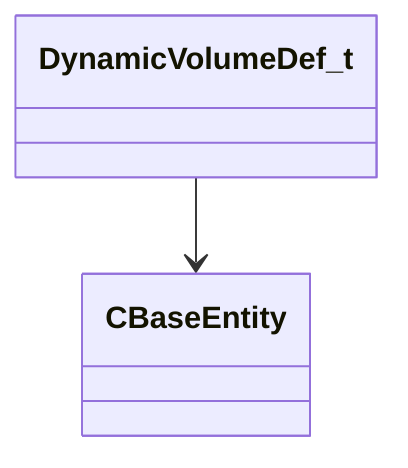

[Schemas](../../schemas.md) / [server](../server.md) / DynamicVolumeDef_t

# DynamicVolumeDef_t

**Kind:** class · **Size:** 48 bytes (`0x30`) · **Align:** 4 · **Module:** server

**Relationships:**

## Memory layout

8 fields (8 declared here, 0 inherited). Offsets are absolute from the object base.

| Offset | Field | Type | From | Annotations |
|--------|-------|------|------|-------------|
| `0x0` | `m_source` | CHandle< [CBaseEntity](../server/CBaseEntity.md) > |  |  |
| `0x4` | `m_target` | CHandle< [CBaseEntity](../server/CBaseEntity.md) > |  |  |
| `0x8` | `m_nHullIdx` | int32 |  |  |
| `0xc` | `m_vSourceAnchorPos` | VectorWS |  |  |
| `0x18` | `m_vTargetAnchorPos` | VectorWS |  |  |
| `0x24` | `m_nAreaSrc` | uint32 |  |  |
| `0x28` | `m_nAreaDst` | uint32 |  |  |
| `0x2c` | `m_bAttached` | bool |  |  |

KV3 class defaults

<pre>{
	&quot;m_source&quot;: null,
	&quot;m_target&quot;: null,
	&quot;m_nHullIdx&quot;: -1,
	&quot;m_vSourceAnchorPos&quot;: null,
	&quot;m_vTargetAnchorPos&quot;: null,
	&quot;m_nAreaSrc&quot;: 4294967295,
	&quot;m_nAreaDst&quot;: 4294967295,
	&quot;m_bAttached&quot;: false
}</pre>

