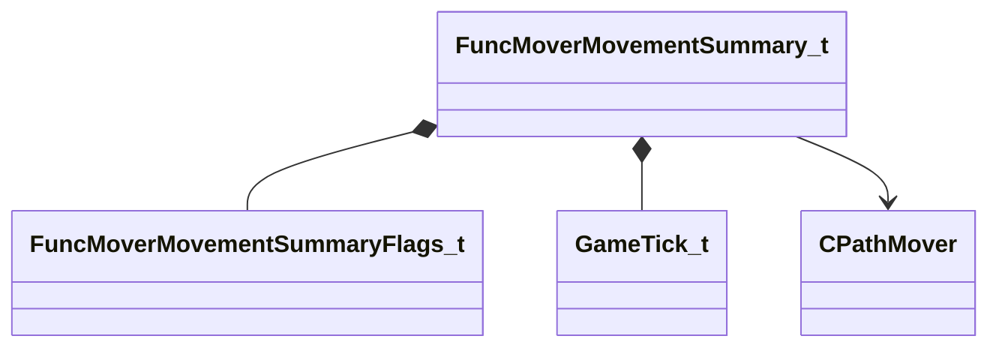

[Schemas](../../schemas.md) / [server](../server.md) / FuncMoverMovementSummary_t

# FuncMoverMovementSummary_t

**Kind:** class · **Size:** 32 bytes (`0x20`) · **Align:** 4 · **Module:** server

**Relationships:**

## Memory layout

8 fields (8 declared here, 0 inherited). Offsets are absolute from the object base.

| Offset | Field | Type | From | Annotations |
|--------|-------|------|------|-------------|
| `0x0` | `flStartT` | float32 |  |  |
| `0x4` | `flEndT` | float32 |  |  |
| `0x8` | `nStartNodeIndex` | int32 |  |  |
| `0xc` | `nStopNodeIndex` | int32 |  |  |
| `0x10` | `nMovementMode` | int32 |  |  |
| `0x14` | `nFlags` | [FuncMoverMovementSummaryFlags_t](../!GlobalTypes/FuncMoverMovementSummaryFlags_t.md) |  |  |
| `0x18` | `nTick` | [GameTick_t](../entity2/GameTick_t.md) |  |  |
| `0x1c` | `hPathMover` | CHandle< [CPathMover](../server/CPathMover.md) > |  |  |

KV3 class defaults

<pre>null</pre>

