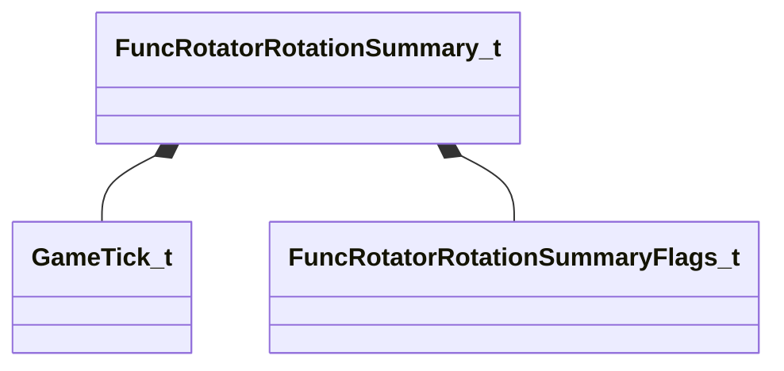

[Schemas](../../schemas.md) / [server](../server.md) / FuncRotatorRotationSummary_t

# FuncRotatorRotationSummary_t

> Source: **Build 25000182** · 2026-08-28 · `windows-x86_64` · schema `0.10.0`

**Kind:** class · **Size:** 8 bytes (`0x8`) · **Align:** 4 · **Module:** server

**Relationships:**

## Memory layout

2 fields (2 declared here, 0 inherited). Offsets are absolute from the object base.

| Offset | Field | Type | From | Annotations |
|--------|-------|------|------|-------------|
| `0x0` | `nTick` | [GameTick_t](../entity2/GameTick_t.md) |  |  |
| `0x4` | `nFlags` | [FuncRotatorRotationSummaryFlags_t](../server/FuncRotatorRotationSummaryFlags_t.md) |  |  |

KV3 class defaults

<pre>null</pre>

