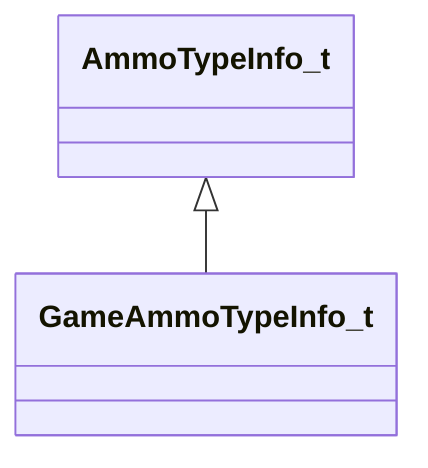

[Schemas](../../schemas.md) / [server](../server.md) / GameAmmoTypeInfo_t

# GameAmmoTypeInfo_t

> Source: **Build 25000182** · 2026-08-28 · `windows-x86_64` · schema `0.10.0`

**Kind:** class · **Size:** 80 bytes (`0x50`) · **Align:** 8 · **Module:** server

**Inherits from:** [AmmoTypeInfo_t](../server/AmmoTypeInfo_t.md)

**Relationships:**

## Memory layout

7 fields (2 declared here, 5 inherited). Offsets are absolute from the object base.

| Offset | Field | Type | From | Annotations |
|--------|-------|------|------|-------------|
| `0x10` | `m_nMaxCarry` | int32 | [AmmoTypeInfo_t](../server/AmmoTypeInfo_t.md) |  |
| `0x1c` | `m_nSplashSize` | [CRangeInt](../tier2/CRangeInt.md) | [AmmoTypeInfo_t](../server/AmmoTypeInfo_t.md) |  |
| `0x24` | `m_nFlags` | [AmmoFlags_t](../server/AmmoFlags_t.md) | [AmmoTypeInfo_t](../server/AmmoTypeInfo_t.md) |  |
| `0x28` | `m_flMass` | float32 | [AmmoTypeInfo_t](../server/AmmoTypeInfo_t.md) |  |
| `0x2c` | `m_flSpeed` | [CRangeFloat](../tier2/CRangeFloat.md) | [AmmoTypeInfo_t](../server/AmmoTypeInfo_t.md) |  |
| `0x38` | `m_nBuySize` | int32 |  |  |
| `0x3c` | `m_nCost` | int32 |  |  |
