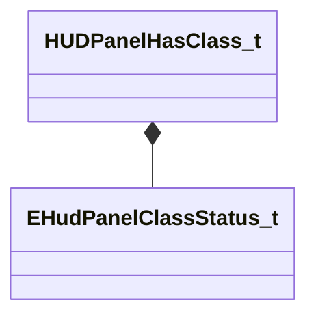

[Schemas](../../schemas.md) / [server](../server.md) / HUDPanelHasClass_t

# HUDPanelHasClass_t

> Source: **Build 25000182** · 2026-08-28 · `windows-x86_64` · schema `0.10.0`

**Kind:** class · **Size:** 8 bytes (`0x8`) · **Align:** 4 · **Module:** server

**Relationships:**

## Memory layout

3 fields (3 declared here, 0 inherited). Offsets are absolute from the object base.

| Offset | Field | Type | From | Annotations |
|--------|-------|------|------|-------------|
| `0x0` | `m_nPanelIdIndex` | uint16 |  |  |
| `0x2` | `m_nClassNameIndex` | uint16 |  |  |
| `0x4` | `m_eClassStatus` | [EHudPanelClassStatus_t](../server/EHudPanelClassStatus_t.md) |  |  |

KV3 class defaults

<pre>{
	&quot;m_nPanelIdIndex&quot;: 0,
	&quot;m_nClassNameIndex&quot;: 0,
	&quot;m_eClassStatus&quot;: &quot;k_eHudPanelClassStatus_DoesNotHaveClass&quot;
}</pre>

