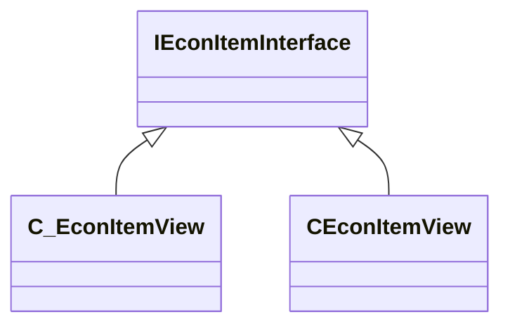

[Schemas](../../schemas.md) / [server](../server.md) / IEconItemInterface

# IEconItemInterface

**Kind:** class · **Size:** 8 bytes (`0x8`) · **Align:** 255 · **Module:** server

**Derived by:** [CEconItemView](../server/CEconItemView.md), [C_EconItemView](../client/C_EconItemView.md)

**Relationships:**

