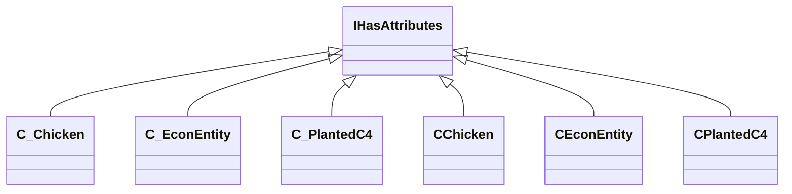

[Schemas](../../schemas.md) / [server](../server.md) / IHasAttributes

# IHasAttributes

**Kind:** class · **Size:** 8 bytes (`0x8`) · **Align:** 255 · **Module:** server

**Derived by:** [CChicken](../server/CChicken.md), [CEconEntity](../server/CEconEntity.md), [CPlantedC4](../server/CPlantedC4.md), [C_Chicken](../client/C_Chicken.md), [C_EconEntity](../client/C_EconEntity.md), [C_PlantedC4](../client/C_PlantedC4.md)

**Relationships:**

