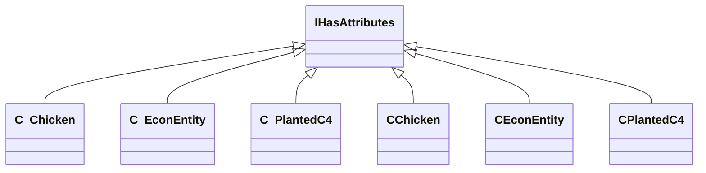

[Schemas](../../schemas.md) / [server](../server.md) / IHasAttributes

# IHasAttributes

> Source: **Build 25000182** · 2026-08-28 · `windows-x86_64` · schema `0.10.0`

**Kind:** class · **Size:** 8 bytes (`0x8`) · **Align:** n/a (unspecified) · **Module:** server

**Derived by:** [CChicken](../server/CChicken.md), [CEconEntity](../server/CEconEntity.md), [CPlantedC4](../server/CPlantedC4.md), [C_Chicken](../client/C_Chicken.md), [C_EconEntity](../client/C_EconEntity.md), [C_PlantedC4](../client/C_PlantedC4.md)

**Relationships:**

## Memory layout

No schema-visible fields (8 bytes of opaque storage).
