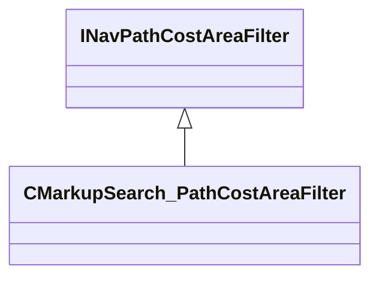

[Schemas](../../schemas.md) / [server](../server.md) / INavPathCostAreaFilter

# INavPathCostAreaFilter

**Kind:** class · **Size:** 8 bytes (`0x8`) · **Align:** 255 · **Module:** server

**Derived by:** [CMarkupSearch_PathCostAreaFilter](../server/CMarkupSearch_PathCostAreaFilter.md)

**Relationships:**

