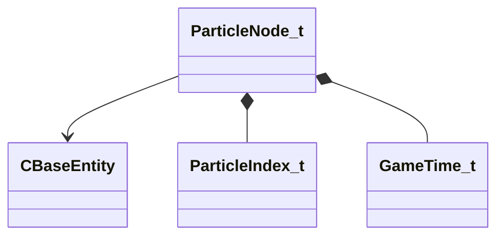

[Schemas](../../schemas.md) / [server](../server.md) / ParticleNode_t

# ParticleNode_t

**Kind:** class · **Size:** 36 bytes (`0x24`) · **Align:** 255 · **Module:** server

**Relationships:**

## Memory layout

7 fields (7 declared here, 0 inherited). Offsets are absolute from the object base.

| Offset | Field | Type | From | Annotations |
|--------|-------|------|------|-------------|
| `0x0` | `m_hEntity` | CHandle< [CBaseEntity](../server/CBaseEntity.md) > |  |  |
| `0x4` | `m_iIndex` | [ParticleIndex_t](../server/ParticleIndex_t.md) |  |  |
| `0x8` | `m_flStartTime` | [GameTime_t](../entity2/GameTime_t.md) |  |  |
| `0xc` | `m_flGrowthDuration` | float32 |  |  |
| `0x10` | `m_vecGrowthOrigin` | VectorWS |  |  |
| `0x1c` | `m_flEndcapTime` | float32 |  |  |
| `0x20` | `m_bMarkedForDelete` | bool |  |  |
