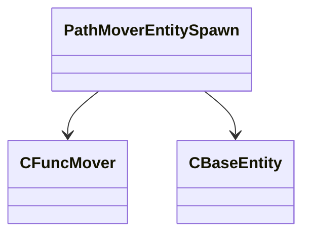

[Schemas](../../schemas.md) / [server](../server.md) / PathMoverEntitySpawn

# PathMoverEntitySpawn

> Source: **Build 25000182** · 2026-08-28 · `windows-x86_64` · schema `0.10.0`

**Kind:** class · **Size:** 32 bytes (`0x20`) · **Align:** 8 · **Module:** server

**Relationships:**

## Memory layout

2 fields (2 declared here, 0 inherited). Offsets are absolute from the object base.

| Offset | Field | Type | From | Annotations |
|--------|-------|------|------|-------------|
| `0x0` | `hMover` | CHandle< [CFuncMover](../server/CFuncMover.md) > |  |  |
| `0x8` | `vecOtherEntities` | CUtlVector< CHandle< [CBaseEntity](../server/CBaseEntity.md) > > |  |  |

KV3 class defaults

<pre>{
	&quot;hMover&quot;: null,
	&quot;vecOtherEntities&quot;:
	[
	]
}</pre>

