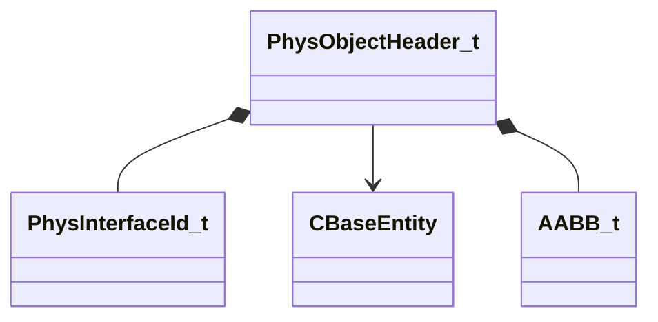

[Schemas](../../schemas.md) / [server](../server.md) / PhysObjectHeader_t

# PhysObjectHeader_t

> Source: **Build 25000182** · 2026-08-28 · `windows-x86_64` · schema `0.10.0`

**Kind:** class · **Size:** 64 bytes (`0x40`) · **Align:** 8 · **Module:** server

**Relationships:**

## Memory layout

8 fields (8 declared here, 0 inherited). Offsets are absolute from the object base.

| Offset | Field | Type | From | Annotations |
|--------|-------|------|------|-------------|
| `0x0` | `type` | [PhysInterfaceId_t](../vphysics2/PhysInterfaceId_t.md) |  |  |
| `0x4` | `hEntity` | CHandle< [CBaseEntity](../server/CBaseEntity.md) > |  |  |
| `0x8` | `fieldName` | CUtlSymbolLarge |  |  |
| `0x10` | `bSaveObject` | bool |  |  |
| `0x18` | `modelName` | CUtlSymbolLarge |  |  |
| `0x20` | `bbox` | [AABB_t](../mathlib_extended/AABB_t.md) |  |  |
| `0x38` | `sphere` | physics_save_sphere_t |  |  |
| `0x3c` | `iCollide` | int32 |  |  |

KV3 class defaults

<pre>null</pre>

