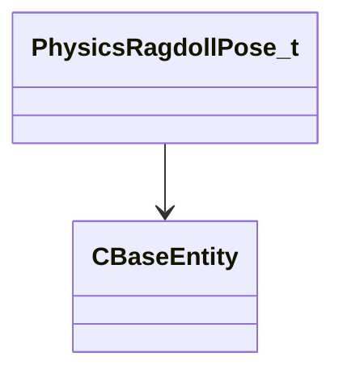

[Schemas](../../schemas.md) / [server](../server.md) / PhysicsRagdollPose_t

# PhysicsRagdollPose_t

**Kind:** class · **Size:** 40 bytes (`0x28`) · **Align:** 8 · **Module:** server

**Relationships:**

## Memory layout

3 fields (3 declared here, 0 inherited). Offsets are absolute from the object base.

| Offset | Field | Type | From | Annotations |
|--------|-------|------|------|-------------|
| `0x8` | `m_Transforms` | CNetworkUtlVectorBase< CTransform > |  |  |
| `0x20` | `m_hOwner` | CHandle< [CBaseEntity](../server/CBaseEntity.md) > |  |  |
| `0x24` | `m_bSetFromDebugHistory` | bool |  | `MNotSaved` |

KV3 class defaults

<pre>{
	&quot;_class&quot;: &quot;PhysicsRagdollPose_t&quot;,
	&quot;m_Transforms&quot;:
	[
	],
	&quot;m_hOwner&quot;: null
}</pre>

