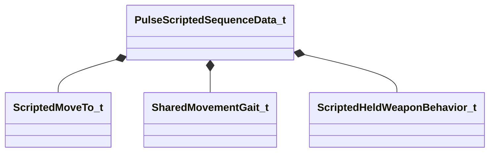

[Schemas](../../schemas.md) / [server](../server.md) / PulseScriptedSequenceData_t

# PulseScriptedSequenceData_t

> Source: **Build 25000182** · 2026-08-28 · `windows-x86_64` · schema `0.10.0`

**Kind:** class · **Size:** 56 bytes (`0x38`) · **Align:** 8 · **Module:** server

**Relationships:**

## Memory layout

12 fields (12 declared here, 0 inherited). Offsets are absolute from the object base.

| Offset | Field | Type | From | Annotations |
|--------|-------|------|------|-------------|
| `0x0` | `m_nActorID` | int32 |  |  |
| `0x8` | `m_szPreIdleSequence` | CUtlString |  |  |
| `0x10` | `m_szEntrySequence` | CUtlString |  |  |
| `0x18` | `m_szSequence` | CUtlString |  |  |
| `0x20` | `m_szExitSequence` | CUtlString |  |  |
| `0x28` | `m_nMoveTo` | [ScriptedMoveTo_t](../modellib/ScriptedMoveTo_t.md) |  |  |
| `0x2c` | `m_nMoveToGait` | [SharedMovementGait_t](../modellib/SharedMovementGait_t.md) |  |  |
| `0x30` | `m_nHeldWeaponBehavior` | [ScriptedHeldWeaponBehavior_t](../modellib/ScriptedHeldWeaponBehavior_t.md) |  |  |
| `0x34` | `m_bLoopPreIdleSequence` | bool |  |  |
| `0x35` | `m_bLoopActionSequence` | bool |  |  |
| `0x36` | `m_bLoopPostIdleSequence` | bool |  |  |
| `0x37` | `m_bIgnoreLookAt` | bool |  |  |

KV3 class defaults

<pre>{
	&quot;m_nActorID&quot;: 0,
	&quot;m_szPreIdleSequence&quot;: &quot;&quot;,
	&quot;m_szEntrySequence&quot;: &quot;&quot;,
	&quot;m_szSequence&quot;: &quot;&quot;,
	&quot;m_szExitSequence&quot;: &quot;&quot;,
	&quot;m_nMoveTo&quot;: &quot;eWaitFacing&quot;,
	&quot;m_nMoveToGait&quot;: &quot;eInvalid&quot;,
	&quot;m_nHeldWeaponBehavior&quot;: &quot;eInvalid&quot;,
	&quot;m_bLoopPreIdleSequence&quot;: false,
	&quot;m_bLoopActionSequence&quot;: false,
	&quot;m_bLoopPostIdleSequence&quot;: false,
	&quot;m_bIgnoreLookAt&quot;: false
}</pre>

