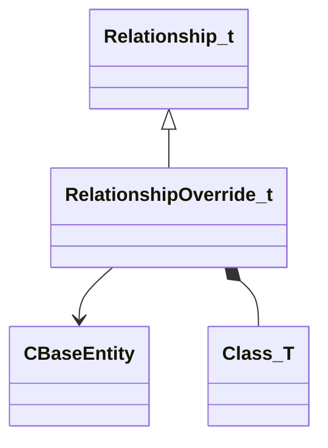

[Schemas](../../schemas.md) / [server](../server.md) / RelationshipOverride_t

# RelationshipOverride_t

> Source: **Build 25000182** · 2026-08-28 · `windows-x86_64` · schema `0.10.0`

**Kind:** class · **Size:** 16 bytes (`0x10`) · **Align:** 4 · **Module:** server

**Inherits from:** [Relationship_t](../server/Relationship_t.md)

**Relationships:**

## Memory layout

4 fields (2 declared here, 2 inherited). Offsets are absolute from the object base.

| Offset | Field | Type | From | Annotations |
|--------|-------|------|------|-------------|
| `0x0` | `disposition` | [Disposition_t](../server/Disposition_t.md) | [Relationship_t](../server/Relationship_t.md) |  |
| `0x4` | `priority` | int32 | [Relationship_t](../server/Relationship_t.md) |  |
| `0x8` | `entity` | CHandle< [CBaseEntity](../server/CBaseEntity.md) > |  |  |
| `0xc` | `classType` | [Class_T](../server/Class_T.md) |  |  |

KV3 class defaults

<pre>{
	&quot;disposition&quot;: &quot;D_NU&quot;,
	&quot;priority&quot;: 0,
	&quot;entity&quot;: null,
	&quot;classType&quot;: &quot;CLASS_NONE&quot;
}</pre>

