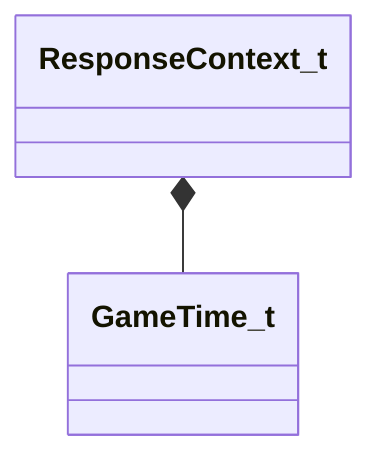

[Schemas](../../schemas.md) / [server](../server.md) / ResponseContext_t

# ResponseContext_t

> Source: **Build 25000182** · 2026-08-28 · `windows-x86_64` · schema `0.10.0`

**Kind:** class · **Size:** 24 bytes (`0x18`) · **Align:** 8 · **Module:** server

**Relationships:**

## Memory layout

3 fields (3 declared here, 0 inherited). Offsets are absolute from the object base.

| Offset | Field | Type | From | Annotations |
|--------|-------|------|------|-------------|
| `0x0` | `m_iszName` | CUtlSymbolLarge |  |  |
| `0x8` | `m_iszValue` | CUtlSymbolLarge |  |  |
| `0x10` | `m_fExpirationTime` | [GameTime_t](../entity2/GameTime_t.md) |  |  |

KV3 class defaults

<pre>{
	&quot;m_iszName&quot;: &quot;&quot;,
	&quot;m_iszValue&quot;: &quot;&quot;,
	&quot;m_fExpirationTime&quot;: null
}</pre>

