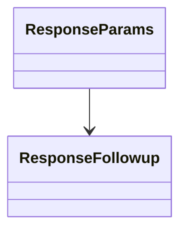

[Schemas](../../schemas.md) / [server](../server.md) / ResponseParams

# ResponseParams

> Source: **Build 25000182** · 2026-08-28 · `windows-x86_64` · schema `0.10.0`

**Kind:** class · **Size:** 32 bytes (`0x20`) · **Align:** 8 · **Module:** server

**Relationships:**

## Memory layout

3 fields (3 declared here, 0 inherited). Offsets are absolute from the object base.

| Offset | Field | Type | From | Annotations |
|--------|-------|------|------|-------------|
| `0x10` | `odds` | int16 |  |  |
| `0x12` | `flags` | int16 |  |  |
| `0x18` | `m_pFollowup` | [ResponseFollowup](../server/ResponseFollowup.md)* |  | `MNotSaved` |

KV3 class defaults

<pre>{
	&quot;odds&quot;: 100,
	&quot;flags&quot;: 0
}</pre>

