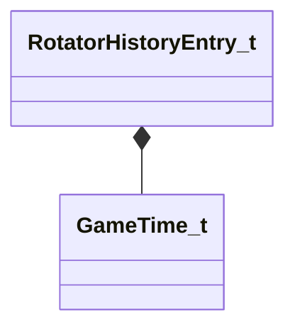

[Schemas](../../schemas.md) / [server](../server.md) / RotatorHistoryEntry_t

# RotatorHistoryEntry_t

> Source: **Build 25000182** · 2026-08-28 · `windows-x86_64` · schema `0.10.0`

**Kind:** class · **Size:** 32 bytes (`0x20`) · **Align:** 16 · **Module:** server

**Relationships:**

## Memory layout

2 fields (2 declared here, 0 inherited). Offsets are absolute from the object base.

| Offset | Field | Type | From | Annotations |
|--------|-------|------|------|-------------|
| `0x0` | `qInvChange` | Quaternion |  |  |
| `0x10` | `flTimeRotationStart` | [GameTime_t](../entity2/GameTime_t.md) |  |  |

KV3 class defaults

<pre>{
	&quot;qInvChange&quot;:
	[
		0.000000,
		0.000000,
		0.000000,
		0.000000
	],
	&quot;flTimeRotationStart&quot;: null
}</pre>

