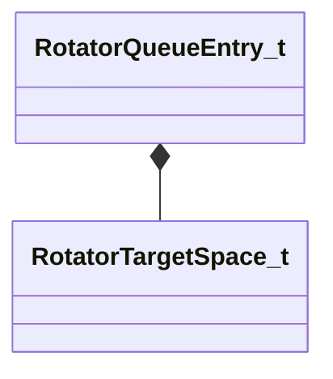

[Schemas](../../schemas.md) / [server](../server.md) / RotatorQueueEntry_t

# RotatorQueueEntry_t

**Kind:** class · **Size:** 32 bytes (`0x20`) · **Align:** 16 · **Module:** server

**Relationships:**

## Memory layout

2 fields (2 declared here, 0 inherited). Offsets are absolute from the object base.

| Offset | Field | Type | From | Annotations |
|--------|-------|------|------|-------------|
| `0x0` | `qTarget` | Quaternion |  |  |
| `0x10` | `eSpace` | [RotatorTargetSpace_t](../server/RotatorTargetSpace_t.md) |  |  |

KV3 class defaults

<pre>{
	&quot;qTarget&quot;:
	[
		0.000000,
		0.000000,
		0.000000,
		0.000000
	],
	&quot;eSpace&quot;: &quot;ROTATOR_TARGET_WORLDSPACE&quot;
}</pre>

