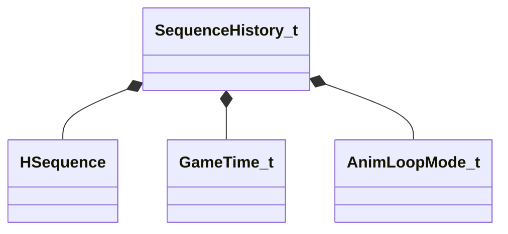

[Schemas](../../schemas.md) / [server](../server.md) / SequenceHistory_t

# SequenceHistory_t

> Source: **Build 25000182** · 2026-08-28 · `windows-x86_64` · schema `0.10.0`

**Kind:** class · **Size:** 24 bytes (`0x18`) · **Align:** n/a (unspecified) · **Module:** server

**Twin:** [SequenceHistory_t (client)](../client/SequenceHistory_t.md)

**Relationships:**

## Memory layout

6 fields (6 declared here, 0 inherited). Offsets are absolute from the object base.

| Offset | Field | Type | From | Annotations |
|--------|-------|------|------|-------------|
| `0x0` | `m_hSequence` | [HSequence](../animationsystem/HSequence.md) |  |  |
| `0x4` | `m_flSeqStartTime` | [GameTime_t](../entity2/GameTime_t.md) |  |  |
| `0x8` | `m_flSeqFixedCycle` | float32 |  |  |
| `0xc` | `m_nSeqLoopMode` | [AnimLoopMode_t](../server/AnimLoopMode_t.md) |  |  |
| `0x10` | `m_flPlaybackRate` | float32 |  |  |
| `0x14` | `m_flCyclesPerSecond` | float32 |  |  |
