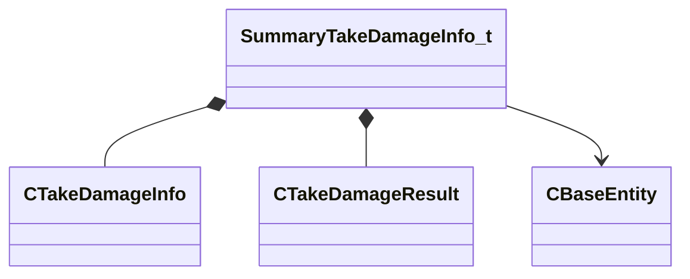

[Schemas](../../schemas.md) / [server](../server.md) / SummaryTakeDamageInfo_t

# SummaryTakeDamageInfo_t

> Source: **Build 25000182** · 2026-08-28 · `windows-x86_64` · schema `0.10.0`

**Kind:** class · **Size:** 392 bytes (`0x188`) · **Align:** 8 · **Module:** server

**Relationships:**

## Memory layout

4 fields (4 declared here, 0 inherited). Offsets are absolute from the object base.

| Offset | Field | Type | From | Annotations |
|--------|-------|------|------|-------------|
| `0x0` | `nSummarisedCount` | int32 |  |  |
| `0x8` | `info` | [CTakeDamageInfo](../server/CTakeDamageInfo.md) |  |  |
| `0x120` | `result` | [CTakeDamageResult](../server/CTakeDamageResult.md) |  |  |
| `0x180` | `hTarget` | CHandle< [CBaseEntity](../server/CBaseEntity.md) > |  |  |

KV3 class defaults

<pre>{
	&quot;nSummarisedCount&quot;: 0,
	&quot;info&quot;:
	{
		&quot;_class&quot;: &quot;CTakeDamageInfo&quot;,
		&quot;m_vecDamageForce&quot;:
		[
			0.000000,
			0.000000,
			0.000000
		],
		&quot;m_vecDamagePosition&quot;: null,
		&quot;m_vecReportedPosition&quot;: null,
		&quot;m_vecDamageDirection&quot;:
		[
			0.000000,
			0.000000,
			0.000000
		],
		&quot;m_hInflictor&quot;: null,
		&quot;m_hAttacker&quot;: null,
		&quot;m_hAbility&quot;: null,
		&quot;m_flDamage&quot;: 0.000000,
		&quot;m_flTotalledDamage&quot;: 0.000000,
		&quot;m_bitsDamageType&quot;: &quot;&quot;,
		&quot;m_iDamageCustom&quot;: 0,
		&quot;m_iAmmoType&quot;: &quot;&quot;,
		&quot;m_flOriginalDamage&quot;: 0.000000,
		&quot;m_bShouldBleed&quot;: false,
		&quot;m_bShouldSpark&quot;: false,
		&quot;m_nDamageFlags&quot;: &quot;&quot;,
		&quot;m_iHitGroupId&quot;: &quot;HITGROUP_INVALID&quot;,
		&quot;m_nNumObjectsPenetrated&quot;: 0,
		&quot;m_flFriendlyFireDamageReductionRatio&quot;: 1.000000,
		&quot;m_bStoppedBullet&quot;: false,
		&quot;m_DestructibleHitGroupRequests&quot;:
		[
		]
	},
	&quot;result&quot;:
	{
		&quot;m_pOriginatingInfo&quot;:
		{
			&quot;_class&quot;: &quot;CTakeDamageInfo&quot;,
			&quot;m_vecDamageForce&quot;:
			[
				0.000000,
				0.000000,
				0.000000
			],
			&quot;m_vecDamagePosition&quot;: null,
			&quot;m_vecReportedPosition&quot;: null,
			&quot;m_vecDamageDirection&quot;:
			[
				0.000000,
				0.000000,
				0.000000
			],
			&quot;m_hInflictor&quot;: null,
			&quot;m_hAttacker&quot;: null,
			&quot;m_hAbility&quot;: null,
			&quot;m_flDamage&quot;: 0.000000,
			&quot;m_flTotalledDamage&quot;: 0.000000,
			&quot;m_bitsDamageType&quot;: &quot;&quot;,
			&quot;m_iDamageCustom&quot;: 0,
			&quot;m_iAmmoType&quot;: &quot;&quot;,
			&quot;m_flOriginalDamage&quot;: 0.000000,
			&quot;m_bShouldBleed&quot;: false,
			&quot;m_bShouldSpark&quot;: false,
			&quot;m_nDamageFlags&quot;: &quot;&quot;,
			&quot;m_iHitGroupId&quot;: &quot;HITGROUP_INVALID&quot;,
			&quot;m_nNumObjectsPenetrated&quot;: 0,
			&quot;m_flFriendlyFireDamageReductionRatio&quot;: 1.000000,
			&quot;m_bStoppedBullet&quot;: false,
			&quot;m_DestructibleHitGroupRequests&quot;:
			[
			]
		},
		&quot;m_DestructibleHitGroupRequests&quot;:
		[
		],
		&quot;m_nHealthLost&quot;: 0,
		&quot;m_nHealthBefore&quot;: 0,
		&quot;m_flDamageDealt&quot;: 0.000000,
		&quot;m_flPreModifiedDamage&quot;: 0.000000,
		&quot;m_vDamagePosition&quot;: null,
		&quot;m_nTotalledHealthLost&quot;: 0,
		&quot;m_flTotalledDamageDealt&quot;: 0.000000,
		&quot;m_flTotalledPreModifiedDamage&quot;: 0.000000,
		&quot;m_flNewDamageAccumulatorValue&quot;: 0.000000,
		&quot;m_nDamageFlags&quot;: &quot;&quot;,
		&quot;m_bWasDamageSuppressed&quot;: false,
		&quot;m_bSuppressFlinch&quot;: false,
		&quot;m_nOverrideFlinchHitGroup&quot;: &quot;HITGROUP_INVALID&quot;
	},
	&quot;hTarget&quot;: null
}</pre>

