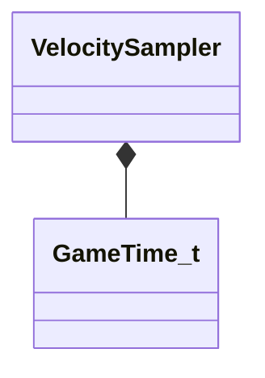

[Schemas](../../schemas.md) / [server](../server.md) / VelocitySampler

# VelocitySampler

> Source: **Build 25000182** · 2026-08-28 · `windows-x86_64` · schema `0.10.0`

**Kind:** class · **Size:** 20 bytes (`0x14`) · **Align:** n/a (unspecified) · **Module:** server

**Relationships:**

## Memory layout

3 fields (3 declared here, 0 inherited). Offsets are absolute from the object base.

| Offset | Field | Type | From | Annotations |
|--------|-------|------|------|-------------|
| `0x0` | `m_prevSample` | Vector |  |  |
| `0xc` | `m_fPrevSampleTime` | [GameTime_t](../entity2/GameTime_t.md) |  |  |
| `0x10` | `m_fIdealSampleRate` | float32 |  |  |
