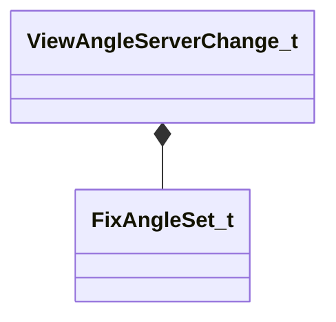

[Schemas](../../schemas.md) / [server](../server.md) / ViewAngleServerChange_t

# ViewAngleServerChange_t

**Kind:** class · **Size:** 72 bytes (`0x48`) · **Align:** 255 · **Module:** server

**Relationships:**

## Memory layout

3 fields (3 declared here, 0 inherited). Offsets are absolute from the object base.

| Offset | Field | Type | From | Annotations |
|--------|-------|------|------|-------------|
| `0x30` | `nType` | [FixAngleSet_t](../server/FixAngleSet_t.md) |  |  |
| `0x34` | `qAngle` | QAngle |  |  |
| `0x40` | `nIndex` | uint32 |  |  |
