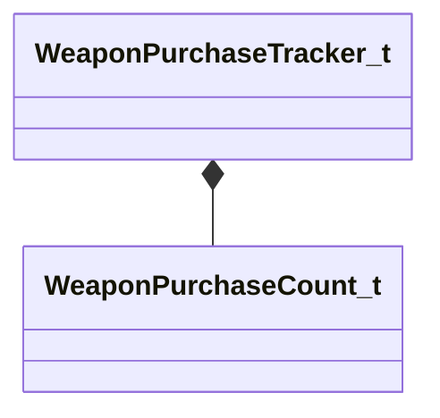

[Schemas](../../schemas.md) / [server](../server.md) / WeaponPurchaseTracker_t

# WeaponPurchaseTracker_t

> Source: **Build 25000182** · 2026-08-28 · `windows-x86_64` · schema `0.10.0`

**Kind:** class · **Size:** 112 bytes (`0x70`) · **Align:** n/a (unspecified) · **Module:** server

**Twin:** [WeaponPurchaseTracker_t (client)](../client/WeaponPurchaseTracker_t.md)

**Relationships:**

## Memory layout

1 field (1 declared here, 0 inherited). Offsets are absolute from the object base.

| Offset | Field | Type | From | Annotations |
|--------|-------|------|------|-------------|
| `0x8` | `m_weaponPurchases` | CUtlVectorEmbeddedNetworkVar< [WeaponPurchaseCount_t](../server/WeaponPurchaseCount_t.md) > |  |  |
