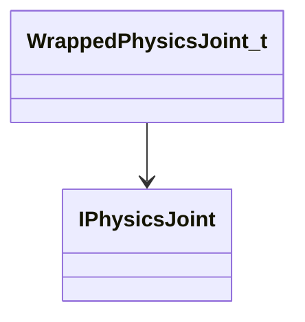

[Schemas](../../schemas.md) / [server](../server.md) / WrappedPhysicsJoint_t

# WrappedPhysicsJoint_t

**Kind:** class · **Size:** 8 bytes (`0x8`) · **Align:** 8 · **Module:** server

**Relationships:**

## Memory layout

1 fields (1 declared here, 0 inherited). Offsets are absolute from the object base.

| Offset | Field | Type | From | Annotations |
|--------|-------|------|------|-------------|
| `0x0` | `m_pJoint` | [IPhysicsJoint](../vphysics2/IPhysicsJoint.md)* |  | `MPhysPtr` |

KV3 class defaults

<pre>{
}</pre>

