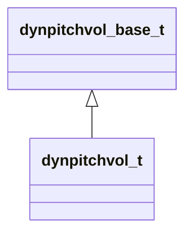

[Schemas](../../schemas.md) / [server](../server.md) / dynpitchvol_base_t

# dynpitchvol_base_t

**Kind:** class · **Size:** 100 bytes (`0x64`) · **Align:** 4 · **Module:** server

**Derived by:** [dynpitchvol_t](../server/dynpitchvol_t.md)

**Relationships:**

## Memory layout

25 fields (25 declared here, 0 inherited). Offsets are absolute from the object base.

| Offset | Field | Type | From | Annotations |
|--------|-------|------|------|-------------|
| `0x0` | `preset` | int32 |  |  |
| `0x4` | `pitchrun` | int32 |  |  |
| `0x8` | `pitchstart` | int32 |  |  |
| `0xc` | `spinup` | int32 |  |  |
| `0x10` | `spindown` | int32 |  |  |
| `0x14` | `volrun` | int32 |  |  |
| `0x18` | `volstart` | int32 |  |  |
| `0x1c` | `fadein` | int32 |  |  |
| `0x20` | `fadeout` | int32 |  |  |
| `0x24` | `lfotype` | int32 |  |  |
| `0x28` | `lforate` | int32 |  |  |
| `0x2c` | `lfomodpitch` | int32 |  |  |
| `0x30` | `lfomodvol` | int32 |  |  |
| `0x34` | `cspinup` | int32 |  |  |
| `0x38` | `cspincount` | int32 |  |  |
| `0x3c` | `pitch` | int32 |  |  |
| `0x40` | `spinupsav` | int32 |  |  |
| `0x44` | `spindownsav` | int32 |  |  |
| `0x48` | `pitchfrac` | int32 |  |  |
| `0x4c` | `vol` | int32 |  |  |
| `0x50` | `fadeinsav` | int32 |  |  |
| `0x54` | `fadeoutsav` | int32 |  |  |
| `0x58` | `volfrac` | int32 |  |  |
| `0x5c` | `lfofrac` | int32 |  |  |
| `0x60` | `lfomult` | int32 |  |  |

KV3 class defaults

<pre>{
	&quot;preset&quot;: 0,
	&quot;pitchrun&quot;: 0,
	&quot;pitchstart&quot;: 0,
	&quot;spinup&quot;: 0,
	&quot;spindown&quot;: 0,
	&quot;volrun&quot;: 0,
	&quot;volstart&quot;: 0,
	&quot;fadein&quot;: 0,
	&quot;fadeout&quot;: 0,
	&quot;lfotype&quot;: 0,
	&quot;lforate&quot;: 0,
	&quot;lfomodpitch&quot;: 0,
	&quot;lfomodvol&quot;: 0,
	&quot;cspinup&quot;: 0,
	&quot;cspincount&quot;: 0,
	&quot;pitch&quot;: 0,
	&quot;spinupsav&quot;: 0,
	&quot;spindownsav&quot;: 0,
	&quot;pitchfrac&quot;: &lt;HIDDEN FOR DIFF&gt;,
	&quot;vol&quot;: 32760,
	&quot;fadeinsav&quot;: 0,
	&quot;fadeoutsav&quot;: 0,
	&quot;volfrac&quot;: 0,
	&quot;lfofrac&quot;: 0,
	&quot;lfomult&quot;: 0
}</pre>

