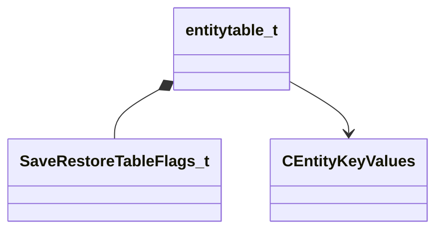

[Schemas](../../schemas.md) / [server](../server.md) / entitytable_t

# entitytable_t

**Kind:** class · **Size:** 80 bytes (`0x50`) · **Align:** 8 · **Module:** server

**Relationships:**

## Memory layout

10 fields (10 declared here, 0 inherited). Offsets are absolute from the object base.

| Offset | Field | Type | From | Annotations |
|--------|-------|------|------|-------------|
| `0x0` | `id` | int32 |  |  |
| `0x4` | `edictindex` | CEntityIndex |  |  |
| `0x8` | `saveentityindex` | CEntityIndex |  |  |
| `0x14` | `bWasSaved` | bool |  |  |
| `0x18` | `flags` | [SaveRestoreTableFlags_t](../!GlobalTypes/SaveRestoreTableFlags_t.md) |  |  |
| `0x20` | `classname` | CUtlSymbolLarge |  |  |
| `0x28` | `globalname` | CUtlSymbolLarge |  |  |
| `0x30` | `entityname` | CUtlSymbolLarge |  |  |
| `0x38` | `landmarkModelSpace` | Vector |  |  |
| `0x48` | `m_pPrecacheEntityKeys` | [CEntityKeyValues](../entity2/CEntityKeyValues.md)* |  |  |

KV3 class defaults

<pre>{
	&quot;id&quot;: 0,
	&quot;edictindex&quot;: -1,
	&quot;saveentityindex&quot;: -1,
	&quot;bWasSaved&quot;: false,
	&quot;flags&quot;: &quot;&quot;,
	&quot;classname&quot;: &quot;&quot;,
	&quot;globalname&quot;: &quot;&quot;,
	&quot;entityname&quot;: &quot;&quot;,
	&quot;landmarkModelSpace&quot;:
	[
		0.000000,
		0.000000,
		0.000000
	],
	&quot;m_pPrecacheEntityKeys&quot;: null
}</pre>

