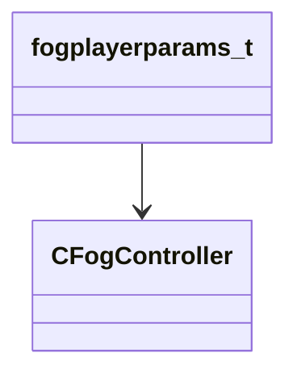

[Schemas](../../schemas.md) / [server](../server.md) / fogplayerparams_t

# fogplayerparams_t

> Source: **Build 25000182** · 2026-08-28 · `windows-x86_64` · schema `0.10.0`

**Kind:** class · **Size:** 64 bytes (`0x40`) · **Align:** 8 · **Module:** server

**Relationships:**

## Memory layout

14 fields (14 declared here, 0 inherited). Offsets are absolute from the object base.

| Offset | Field | Type | From | Annotations |
|--------|-------|------|------|-------------|
| `0x8` | `m_hCtrl` | CHandle< [CFogController](../server/CFogController.md) > |  |  |
| `0xc` | `m_flTransitionTime` | float32 |  |  |
| `0x10` | `m_OldColor` | Color |  |  |
| `0x14` | `m_flOldStart` | float32 |  |  |
| `0x18` | `m_flOldEnd` | float32 |  |  |
| `0x1c` | `m_flOldMaxDensity` | float32 |  | `MNotSaved` |
| `0x20` | `m_flOldHDRColorScale` | float32 |  | `MNotSaved` |
| `0x24` | `m_flOldFarZ` | float32 |  | `MNotSaved` |
| `0x28` | `m_NewColor` | Color |  |  |
| `0x2c` | `m_flNewStart` | float32 |  |  |
| `0x30` | `m_flNewEnd` | float32 |  |  |
| `0x34` | `m_flNewMaxDensity` | float32 |  | `MNotSaved` |
| `0x38` | `m_flNewHDRColorScale` | float32 |  | `MNotSaved` |
| `0x3c` | `m_flNewFarZ` | float32 |  | `MNotSaved` |
