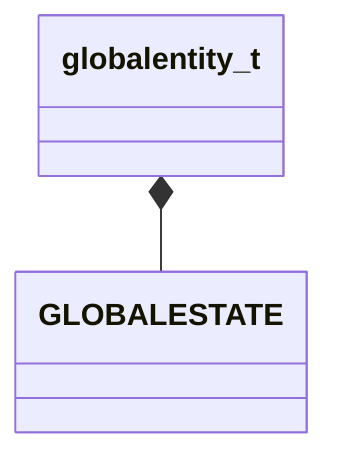

[Schemas](../../schemas.md) / [server](../server.md) / globalentity_t

# globalentity_t

**Kind:** class · **Size:** 12 bytes (`0xc`) · **Align:** 4 · **Module:** server

**Relationships:**

## Memory layout

4 fields (4 declared here, 0 inherited). Offsets are absolute from the object base.

| Offset | Field | Type | From | Annotations |
|--------|-------|------|------|-------------|
| `0x0` | `name` | CUtlSymbol |  | `MKV3TransferSaveOpsForField GetGlobalSymbolDataOps` |
| `0x2` | `levelName` | CUtlSymbol |  | `MKV3TransferSaveOpsForField GetGlobalSymbolDataOps` |
| `0x4` | `state` | [GLOBALESTATE](../!GlobalTypes/GLOBALESTATE.md) |  |  |
| `0x8` | `counter` | int32 |  |  |

KV3 class defaults

<pre>{
	&quot;state&quot;: &quot;GLOBAL_OFF&quot;,
	&quot;counter&quot;: 0
}</pre>

