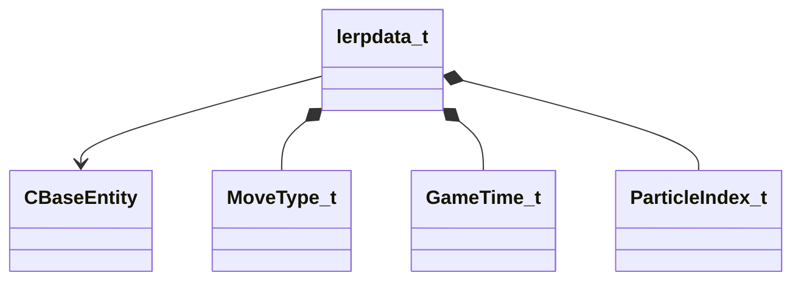

[Schemas](../../schemas.md) / [server](../server.md) / lerpdata_t

# lerpdata_t

**Kind:** class · **Size:** 80 bytes (`0x50`) · **Align:** 16 · **Module:** server

**Relationships:**

## Memory layout

6 fields (6 declared here, 0 inherited). Offsets are absolute from the object base.

| Offset | Field | Type | From | Annotations |
|--------|-------|------|------|-------------|
| `0x0` | `m_hEnt` | CHandle< [CBaseEntity](../server/CBaseEntity.md) > |  |  |
| `0x4` | `m_MoveType` | [MoveType_t](../server/MoveType_t.md) |  |  |
| `0x8` | `m_flStartTime` | [GameTime_t](../entity2/GameTime_t.md) |  |  |
| `0xc` | `m_vecStartOrigin` | VectorWS |  |  |
| `0x20` | `m_qStartRot` | Quaternion |  |  |
| `0x30` | `m_nFXIndex` | [ParticleIndex_t](../server/ParticleIndex_t.md) |  |  |

KV3 class defaults

<pre>{
	&quot;m_hEnt&quot;: null,
	&quot;m_MoveType&quot;: &quot;MOVETYPE_NONE&quot;,
	&quot;m_flStartTime&quot;: null,
	&quot;m_vecStartOrigin&quot;: null,
	&quot;m_qStartRot&quot;:
	[
		0.000000,
		0.000000,
		0.000000,
		1.000000
	],
	&quot;m_nFXIndex&quot;: -1
}</pre>

