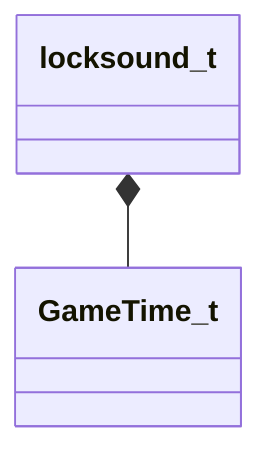

[Schemas](../../schemas.md) / [server](../server.md) / locksound_t

# locksound_t

> Source: **Build 25000182** · 2026-08-28 · `windows-x86_64` · schema `0.10.0`

**Kind:** class · **Size:** 32 bytes (`0x20`) · **Align:** 8 · **Module:** server

**Relationships:**

## Memory layout

3 fields (3 declared here, 0 inherited). Offsets are absolute from the object base.

| Offset | Field | Type | From | Annotations |
|--------|-------|------|------|-------------|
| `0x8` | `sLockedSound` | CGameSoundEventName |  |  |
| `0x10` | `sUnlockedSound` | CGameSoundEventName |  |  |
| `0x18` | `flwaitSound` | [GameTime_t](../entity2/GameTime_t.md) |  |  |

KV3 class defaults

<pre>{
	&quot;_class&quot;: &quot;locksound_t&quot;,
	&quot;sLockedSound&quot;: &quot;&quot;,
	&quot;sUnlockedSound&quot;: &quot;&quot;,
	&quot;flwaitSound&quot;: null
}</pre>

