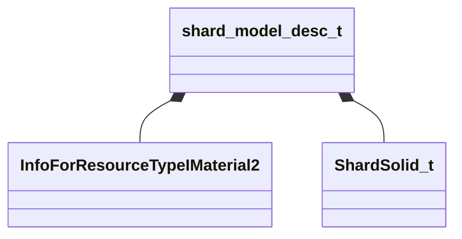

[Schemas](../../schemas.md) / [server](../server.md) / shard_model_desc_t

# shard_model_desc_t

**Kind:** class · **Size:** 128 bytes (`0x80`) · **Align:** 255 · **Module:** server

**Relationships:**

## Memory layout

13 fields (13 declared here, 0 inherited). Offsets are absolute from the object base.

| Offset | Field | Type | From | Annotations |
|--------|-------|------|------|-------------|
| `0x8` | `m_nModelID` | int32 |  |  |
| `0x10` | `m_hMaterialBase` | CStrongHandle< [InfoForResourceTypeIMaterial2](../resourcesystem/InfoForResourceTypeIMaterial2.md) > |  |  |
| `0x18` | `m_hMaterialDamageOverlay` | CStrongHandle< [InfoForResourceTypeIMaterial2](../resourcesystem/InfoForResourceTypeIMaterial2.md) > |  |  |
| `0x20` | `m_solid` | [ShardSolid_t](../!GlobalTypes/ShardSolid_t.md) |  |  |
| `0x24` | `m_vecPanelSize` | Vector2D |  |  |
| `0x2c` | `m_vecStressPositionA` | Vector2D |  |  |
| `0x34` | `m_vecStressPositionB` | Vector2D |  |  |
| `0x40` | `m_vecPanelVertices` | CNetworkUtlVectorBase< Vector2D > |  |  |
| `0x58` | `m_vInitialPanelVertices` | CNetworkUtlVectorBase< Vector4D > |  |  |
| `0x70` | `m_flGlassHalfThickness` | float32 |  |  |
| `0x74` | `m_bHasParent` | bool |  |  |
| `0x75` | `m_bParentFrozen` | bool |  |  |
| `0x78` | `m_SurfacePropStringToken` | CUtlStringToken |  |  |
