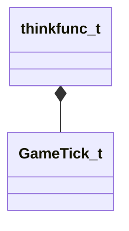

[Schemas](../../schemas.md) / [server](../server.md) / thinkfunc_t

# thinkfunc_t

> Source: **Build 25000182** · 2026-08-28 · `windows-x86_64` · schema `0.10.0`

**Kind:** class · **Size:** 32 bytes (`0x20`) · **Align:** 8 · **Module:** server

**Relationships:**

## Memory layout

5 fields (5 declared here, 0 inherited). Offsets are absolute from the object base.

| Offset | Field | Type | From | Annotations |
|--------|-------|------|------|-------------|
| `0x0` | `m_think` | BASEPTR |  |  |
| `0x8` | `m_hFn` | HSCRIPT |  | `MNotSaved` |
| `0x10` | `m_nContext` | CUtlStringToken |  |  |
| `0x14` | `m_nNextThinkTick` | [GameTick_t](../entity2/GameTick_t.md) |  |  |
| `0x18` | `m_nLastThinkTick` | [GameTick_t](../entity2/GameTick_t.md) |  |  |

KV3 class defaults

<pre>{
	&quot;m_think&quot;: &quot;&quot;,
	&quot;m_nContext&quot;: &quot;&quot;,
	&quot;m_nNextThinkTick&quot;: null,
	&quot;m_nLastThinkTick&quot;: null
}</pre>

