# Module: smartprops

[📊 View UML Diagram](../diagrams/smartprops.md)

| Name | Kind | Bases | Fields |
|------|------|-------|--------|
| [ApplyColorMode_t](#applycolormode_t) | enum |  | 3 |
| [CPulseGraphInstance_SmartPropEval](#cpulsegraphinstance_smartpropeval) | class | CBasePulseGraphInstance | 0 |
| [CSmartPropAPI](#csmartpropapi) | class |  | 0 |
| [CSmartPropAttributeApplyColorMode](#csmartpropattributeapplycolormode) | class |  | 0 |
| [CSmartPropAttributeChoiceSelectionMode](#csmartpropattributechoiceselectionmode) | class |  | 0 |
| [CSmartPropAttributeColorSelectionMode](#csmartpropattributecolorselectionmode) | class |  | 0 |
| [CSmartPropAttributeCoordinateSpace](#csmartpropattributecoordinatespace) | class |  | 0 |
| [CSmartPropAttributeDirection](#csmartpropattributedirection) | class |  | 0 |
| [CSmartPropAttributeDistributionMode](#csmartpropattributedistributionmode) | class |  | 0 |
| [CSmartPropAttributeGridOriginMode](#csmartpropattributegridoriginmode) | class |  | 0 |
| [CSmartPropAttributeGridPlacementMode](#csmartpropattributegridplacementmode) | class |  | 0 |
| [CSmartPropAttributeOrientationMode](#csmartpropattributeorientationmode) | class |  | 0 |
| [CSmartPropAttributePathPositions](#csmartpropattributepathpositions) | class |  | 0 |
| [CSmartPropAttributePickMode](#csmartpropattributepickmode) | class |  | 0 |
| [CSmartPropAttributeRadiusPlacementMode](#csmartpropattributeradiusplacementmode) | class |  | 0 |
| [CSmartPropAttributeScaleMode](#csmartpropattributescalemode) | class |  | 0 |
| [CSmartPropAttributeTraceNoHit](#csmartpropattributetracenohit) | class |  | 0 |
| [CSmartPropChoice](#csmartpropchoice) | class | CSmartPropParameter | 3 |
| [CSmartPropChoiceOption](#csmartpropchoiceoption) | class |  | 3 |
| [CSmartPropElement](#csmartpropelement) | class |  | 5 |
| [CSmartPropElement_BendDeformer](#csmartpropelement_benddeformer) | class | CSmartPropElement_Deformer | 7 |
| [CSmartPropElement_Deformer](#csmartpropelement_deformer) | class | CSmartPropElement_Group | 0 |
| [CSmartPropElement_FitOnLine](#csmartpropelement_fitonline) | class | CSmartPropElement_Group | 9 |
| [CSmartPropElement_Group](#csmartpropelement_group) | class | CSmartPropElement | 1 |
| [CSmartPropElement_Layout2DGrid](#csmartpropelement_layout2dgrid) | class | CSmartPropElement_Group | 12 |
| [CSmartPropElement_MidpointDeformer](#csmartpropelement_midpointdeformer) | class | CSmartPropElement_Deformer | 10 |
| [CSmartPropElement_Model](#csmartpropelement_model) | class | CSmartPropElement | 11 |
| [CSmartPropElement_ModelEntity](#csmartpropelement_modelentity) | class | CSmartPropElement | 6 |
| [CSmartPropElement_ModifyState](#csmartpropelement_modifystate) | class | CSmartPropElement | 0 |
| [CSmartPropElement_PickOne](#csmartpropelement_pickone) | class | CSmartPropElement_Group | 8 |
| [CSmartPropElement_PlaceInSphere](#csmartpropelement_placeinsphere) | class | CSmartPropElement_Group | 10 |
| [CSmartPropElement_PlaceMultiple](#csmartpropelement_placemultiple) | class | CSmartPropElement_Group | 2 |
| [CSmartPropElement_PlaceOnMesh](#csmartpropelement_placeonmesh) | class | CSmartPropElement_Deformer | 2 |
| [CSmartPropElement_PlaceOnPath](#csmartpropelement_placeonpath) | class | CSmartPropElement_Group | 11 |
| [CSmartPropElement_PropDynamic](#csmartpropelement_propdynamic) | class | CSmartPropElement_ModelEntity | 0 |
| [CSmartPropElement_PropPhysics](#csmartpropelement_propphysics) | class | CSmartPropElement_ModelEntity | 1 |
| [CSmartPropElement_SmartProp](#csmartpropelement_smartprop) | class | CSmartPropElement | 2 |
| [CSmartPropExprAPI](#csmartpropexprapi) | class |  | 0 |
| [CSmartPropFilter](#csmartpropfilter) | class | CSmartPropModifier | 0 |
| [CSmartPropFilterAPI](#csmartpropfilterapi) | class |  | 0 |
| [CSmartPropFilter_Expression](#csmartpropfilter_expression) | class | CSmartPropFilter | 1 |
| [CSmartPropFilter_MaterialAttributes](#csmartpropfilter_materialattributes) | class | CSmartPropFilter | 2 |
| [CSmartPropFilter_Probability](#csmartpropfilter_probability) | class | CSmartPropFilter | 1 |
| [CSmartPropFilter_SurfaceAngle](#csmartpropfilter_surfaceangle) | class | CSmartPropFilter | 2 |
| [CSmartPropFilter_SurfaceProperties](#csmartpropfilter_surfaceproperties) | class | CSmartPropFilter | 2 |
| [CSmartPropFilter_VariableValue](#csmartpropfilter_variablevalue) | class | CSmartPropFilter | 1 |
| [CSmartPropMaterialReplacement](#csmartpropmaterialreplacement) | class |  | 2 |
| [CSmartPropModifier](#csmartpropmodifier) | class |  | 1 |
| [CSmartPropOperation](#csmartpropoperation) | class | CSmartPropModifier | 0 |
| [CSmartPropOperationAPI](#csmartpropoperationapi) | class |  | 0 |
| [CSmartPropOperation_ComputeCrossProduct3D](#csmartpropoperation_computecrossproduct3d) | class | CSmartPropOperation | 3 |
| [CSmartPropOperation_ComputeDistance3D](#csmartpropoperation_computedistance3d) | class | CSmartPropOperation | 6 |
| [CSmartPropOperation_ComputeDotProduct3D](#csmartpropoperation_computedotproduct3d) | class | CSmartPropOperation | 3 |
| [CSmartPropOperation_ComputeNormalizedVector3D](#csmartpropoperation_computenormalizedvector3d) | class | CSmartPropOperation | 2 |
| [CSmartPropOperation_ComputeProjectVector3D](#csmartpropoperation_computeprojectvector3d) | class | CSmartPropOperation | 7 |
| [CSmartPropOperation_ComputeVectorBetweenPoints3D](#csmartpropoperation_computevectorbetweenpoints3d) | class | CSmartPropOperation | 7 |
| [CSmartPropOperation_CreateLocator](#csmartpropoperation_createlocator) | class | CSmartPropTransformOperation | 7 |
| [CSmartPropOperation_CreateRotator](#csmartpropoperation_createrotator) | class | CSmartPropTransformOperation | 13 |
| [CSmartPropOperation_CreateSizer](#csmartpropoperation_createsizer) | class | CSmartPropTransformOperation | 20 |
| [CSmartPropOperation_MaterialOverride](#csmartpropoperation_materialoverride) | class | CSmartPropOperation | 2 |
| [CSmartPropOperation_MaterialReplacementAPI](#csmartpropoperation_materialreplacementapi) | class |  | 0 |
| [CSmartPropOperation_MaterialTint](#csmartpropoperation_materialtint) | class | CSmartPropOperation | 5 |
| [CSmartPropOperation_RandomColorTintColor](#csmartpropoperation_randomcolortintcolor) | class | CSmartPropOperation | 4 |
| [CSmartPropOperation_RandomOffset](#csmartpropoperation_randomoffset) | class | CSmartPropTransformOperation | 3 |
| [CSmartPropOperation_RandomRotation](#csmartpropoperation_randomrotation) | class | CSmartPropTransformOperation | 3 |
| [CSmartPropOperation_RandomScale](#csmartpropoperation_randomscale) | class | CSmartPropTransformOperation | 3 |
| [CSmartPropOperation_ResetRotation](#csmartpropoperation_resetrotation) | class | CSmartPropTransformOperation | 4 |
| [CSmartPropOperation_ResetScale](#csmartpropoperation_resetscale) | class | CSmartPropTransformOperation | 1 |
| [CSmartPropOperation_RestoreState](#csmartpropoperation_restorestate) | class | CSmartPropOperation | 2 |
| [CSmartPropOperation_RigidDeformation](#csmartpropoperation_rigiddeformation) | class | CSmartPropTransformOperation | 0 |
| [CSmartPropOperation_Rotate](#csmartpropoperation_rotate) | class | CSmartPropTransformOperation | 1 |
| [CSmartPropOperation_RotateTowards](#csmartpropoperation_rotatetowards) | class | CSmartPropTransformOperation | 7 |
| [CSmartPropOperation_SaveColor](#csmartpropoperation_savecolor) | class | CSmartPropOperation | 1 |
| [CSmartPropOperation_SaveDirection](#csmartpropoperation_savedirection) | class | CSmartPropOperation | 3 |
| [CSmartPropOperation_SavePosition](#csmartpropoperation_saveposition) | class | CSmartPropOperation | 2 |
| [CSmartPropOperation_SaveScale](#csmartpropoperation_savescale) | class | CSmartPropOperation | 1 |
| [CSmartPropOperation_SaveState](#csmartpropoperation_savestate) | class | CSmartPropOperation | 1 |
| [CSmartPropOperation_SaveSurfaceNormal](#csmartpropoperation_savesurfacenormal) | class | CSmartPropOperation | 2 |
| [CSmartPropOperation_Scale](#csmartpropoperation_scale) | class | CSmartPropTransformOperation | 1 |
| [CSmartPropOperation_SetMateraialGroupChoice](#csmartpropoperation_setmateraialgroupchoice) | class | CSmartPropOperation | 4 |
| [CSmartPropOperation_SetOrientation](#csmartpropoperation_setorientation) | class | CSmartPropTransformOperation | 5 |
| [CSmartPropOperation_SetPosition](#csmartpropoperation_setposition) | class | CSmartPropTransformOperation | 2 |
| [CSmartPropOperation_SetTintColor](#csmartpropoperation_settintcolor) | class | CSmartPropOperation | 4 |
| [CSmartPropOperation_SetVariable](#csmartpropoperation_setvariable) | class | CSmartPropOperation | 1 |
| [CSmartPropOperation_Trace](#csmartpropoperation_trace) | class | CSmartPropTransformOperation | 12 |
| [CSmartPropOperation_TraceInDirection](#csmartpropoperation_traceindirection) | class | CSmartPropOperation_Trace | 3 |
| [CSmartPropOperation_TraceToLine](#csmartpropoperation_tracetoline) | class | CSmartPropOperation_Trace | 6 |
| [CSmartPropOperation_TraceToPoint](#csmartpropoperation_tracetopoint) | class | CSmartPropOperation_Trace | 4 |
| [CSmartPropOperation_Translate](#csmartpropoperation_translate) | class | CSmartPropTransformOperation | 2 |
| [CSmartPropParameter](#csmartpropparameter) | class |  | 1 |
| [CSmartPropPulse_BaseQueryableFlow](#csmartproppulse_basequeryableflow) | class | CPulseCell_BaseFlow | 0 |
| [CSmartPropPulse_CreateLocator](#csmartproppulse_createlocator) | class | CSmartPropPulse_BaseQueryableFlow | 1 |
| [CSmartPropPulse_CreateRotator](#csmartproppulse_createrotator) | class | CPulseCell_BaseFlow | 1 |
| [CSmartPropPulse_CreateSizer](#csmartproppulse_createsizer) | class | CPulseCell_BaseFlow | 7 |
| [CSmartPropPulse_CriteriaPathPosition](#csmartproppulse_criteriapathposition) | class | CPulseCell_BaseRequirement | 0 |
| [CSmartPropPulse_CriteriaPathPosition::Criteria_t](#csmartproppulse_criteriapathpositioncriteria_t) | class |  | 5 |
| [CSmartPropPulse_FitOnLine](#csmartproppulse_fitonline) | class | CPulseCell_BaseFlow | 1 |
| [CSmartPropPulse_Group](#csmartproppulse_group) | class | CPulseCell_BaseFlow | 1 |
| [CSmartPropPulse_PickOneSelector](#csmartproppulse_pickoneselector) | class | CPulseCell_BaseFlow | 2 |
| [CSmartPropPulse_PlaceInSphere](#csmartproppulse_placeinsphere) | class | CPulseCell_BaseFlow | 1 |
| [CSmartPropPulse_PlaceOnPath](#csmartproppulse_placeonpath) | class | CSmartPropPulse_BaseQueryableFlow | 2 |
| [CSmartPropPulse_SelectionChoiceWeight](#csmartproppulse_selectionchoiceweight) | class | CPulseCell_BaseRequirement | 0 |
| [CSmartPropPulse_SelectionChoiceWeight::Criteria_t](#csmartproppulse_selectionchoiceweightcriteria_t) | class |  | 1 |
| [CSmartPropPulse_SelectionEndCap](#csmartproppulse_selectionendcap) | class | CPulseCell_BaseRequirement | 0 |
| [CSmartPropPulse_SelectionEndCap::Criteria_t](#csmartproppulse_selectionendcapcriteria_t) | class |  | 2 |
| [CSmartPropPulse_SelectionLinearLength](#csmartproppulse_selectionlinearlength) | class | CPulseCell_BaseRequirement | 0 |
| [CSmartPropPulse_SelectionLinearLength::Criteria_t](#csmartproppulse_selectionlinearlengthcriteria_t) | class |  | 4 |
| [CSmartPropPulse_SmartProp](#csmartproppulse_smartprop) | class | CPulseCell_BaseFlow | 1 |
| [CSmartPropRoot](#csmartproproot) | class |  | 7 |
| [CSmartPropSelectionCriteria](#csmartpropselectioncriteria) | class |  | 1 |
| [CSmartPropSelectionCriteria_ChoiceWeight](#csmartpropselectioncriteria_choiceweight) | class | CSmartPropSelectionCriteria | 1 |
| [CSmartPropSelectionCriteria_EdgeAngleCriteria](#csmartpropselectioncriteria_edgeanglecriteria) | class | CSmartPropSelectionCriteria | 3 |
| [CSmartPropSelectionCriteria_EndCap](#csmartpropselectioncriteria_endcap) | class | CSmartPropSelectionCriteria | 2 |
| [CSmartPropSelectionCriteria_IsValid](#csmartpropselectioncriteria_isvalid) | class | CSmartPropSelectionCriteria | 1 |
| [CSmartPropSelectionCriteria_LinearLength](#csmartpropselectioncriteria_linearlength) | class | CSmartPropSelectionCriteria | 4 |
| [CSmartPropSelectionCriteria_MaterialCriteria](#csmartpropselectioncriteria_materialcriteria) | class | CSmartPropSelectionCriteria | 2 |
| [CSmartPropSelectionCriteria_PathPosition](#csmartpropselectioncriteria_pathposition) | class | CSmartPropSelectionCriteria | 5 |
| [CSmartPropSelectionCriteria_TopoEdgeCountCriteria](#csmartpropselectioncriteria_topoedgecountcriteria) | class | CSmartPropSelectionCriteria | 3 |
| [CSmartPropSelectionCriteria_VertexCountCriteria](#csmartpropselectioncriteria_vertexcountcriteria) | class | CSmartPropSelectionCriteria | 1 |
| [CSmartPropTransformOperation](#csmartproptransformoperation) | class | CSmartPropOperation | 0 |
| [CSmartPropVariable](#csmartpropvariable) | class | CSmartPropParameter | 5 |
| [CSmartPropVariable_Angles](#csmartpropvariable_angles) | class | CSmartPropVariable | 1 |
| [CSmartPropVariable_ApplyColorMode](#csmartpropvariable_applycolormode) | class | CSmartPropVariable | 1 |
| [CSmartPropVariable_Bool](#csmartpropvariable_bool) | class | CSmartPropVariable | 1 |
| [CSmartPropVariable_ChoiceSelectionMode](#csmartpropvariable_choiceselectionmode) | class | CSmartPropVariable | 1 |
| [CSmartPropVariable_Color](#csmartpropvariable_color) | class | CSmartPropVariable | 1 |
| [CSmartPropVariable_ColorSelectionMode](#csmartpropvariable_colorselectionmode) | class | CSmartPropVariable | 1 |
| [CSmartPropVariable_CoordinateSpace](#csmartpropvariable_coordinatespace) | class | CSmartPropVariable | 1 |
| [CSmartPropVariable_DirectionVector](#csmartpropvariable_directionvector) | class | CSmartPropVariable | 1 |
| [CSmartPropVariable_DistributionMode](#csmartpropvariable_distributionmode) | class | CSmartPropVariable | 1 |
| [CSmartPropVariable_Float](#csmartpropvariable_float) | class | CSmartPropVariable | 3 |
| [CSmartPropVariable_GridOriginMode](#csmartpropvariable_gridoriginmode) | class | CSmartPropVariable | 1 |
| [CSmartPropVariable_GridPlacementMode](#csmartpropvariable_gridplacementmode) | class | CSmartPropVariable | 1 |
| [CSmartPropVariable_Int](#csmartpropvariable_int) | class | CSmartPropVariable | 3 |
| [CSmartPropVariable_Material](#csmartpropvariable_material) | class | CSmartPropVariable | 1 |
| [CSmartPropVariable_MaterialGroup](#csmartpropvariable_materialgroup) | class | CSmartPropVariable | 2 |
| [CSmartPropVariable_Model](#csmartpropvariable_model) | class | CSmartPropVariable | 1 |
| [CSmartPropVariable_OrientationMode](#csmartpropvariable_orientationmode) | class | CSmartPropVariable | 1 |
| [CSmartPropVariable_PathPositions](#csmartpropvariable_pathpositions) | class | CSmartPropVariable | 1 |
| [CSmartPropVariable_PickMode](#csmartpropvariable_pickmode) | class | CSmartPropVariable | 1 |
| [CSmartPropVariable_RadiusPlacementMode](#csmartpropvariable_radiusplacementmode) | class | CSmartPropVariable | 1 |
| [CSmartPropVariable_ScaleMode](#csmartpropvariable_scalemode) | class | CSmartPropVariable | 1 |
| [CSmartPropVariable_String](#csmartpropvariable_string) | class | CSmartPropVariable | 1 |
| [CSmartPropVariable_SurfaceProperty](#csmartpropvariable_surfaceproperty) | class | CSmartPropVariable | 1 |
| [CSmartPropVariable_TraceNoHit](#csmartpropvariable_tracenohit) | class | CSmartPropVariable | 1 |
| [CSmartPropVariable_Vector2D](#csmartpropvariable_vector2d) | class | CSmartPropVariable | 1 |
| [CSmartPropVariable_Vector3D](#csmartpropvariable_vector3d) | class | CSmartPropVariable | 1 |
| [CSmartPropVariable_Vector4D](#csmartpropvariable_vector4d) | class | CSmartPropVariable | 1 |
| [ColorChoice_t](#colorchoice_t) | class |  | 2 |
| [ConfigurationHandleShape_t](#configurationhandleshape_t) | enum |  | 4 |
| [MaterialGroupChoice_t](#materialgroupchoice_t) | class |  | 2 |
| [PickMode_t](#pickmode_t) | enum |  | 3 |
| [ScaleMode_t](#scalemode_t) | enum |  | 4 |
| [SmartPropChoiceSelectionMode_t](#smartpropchoiceselectionmode_t) | enum |  | 3 |
| [SmartPropColorSelectionMode_t](#smartpropcolorselectionmode_t) | enum |  | 4 |
| [SmartPropDeformableAttachMode_t](#smartpropdeformableattachmode_t) | enum |  | 3 |
| [SmartPropDeformableOrientMode_t](#smartpropdeformableorientmode_t) | enum |  | 5 |
| [SmartPropDetailFadeLevel_t](#smartpropdetailfadelevel_t) | enum |  | 6 |
| [SmartPropDirection_t](#smartpropdirection_t) | enum |  | 3 |
| [SmartPropDistributionMode_t](#smartpropdistributionmode_t) | enum |  | 2 |
| [SmartPropGridOriginBasis_t](#smartpropgridoriginbasis_t) | enum |  | 2 |
| [SmartPropGridPlacementMode_t](#smartpropgridplacementmode_t) | enum |  | 2 |
| [SmartPropPathPositions_t](#smartproppathpositions_t) | enum |  | 4 |
| [SmartPropPlaceMeshOrientationMode_t](#smartpropplacemeshorientationmode_t) | enum |  | 4 |
| [SmartPropRadiusPlacementMode_t](#smartpropradiusplacementmode_t) | enum |  | 2 |
| [SmartPropSpace_t](#smartpropspace_t) | enum |  | 3 |
| [TraceNoHitResult_t](#tracenohitresult_t) | enum |  | 4 |

---

### ApplyColorMode_t

**Values:**

| Name | Value | Description |
|------|-------|-------------|
| `MULTIPLY_OBJECT` | 0 | Multiply object tint — Multiply with the object level color tint and replace the current color value. |
| `MULTIPLY_CURRENT` | 1 | Multiply current tint — Multiply with the current color tint value. |
| `REPLACE` | 2 | Replace tint — Replace the current color tint value completely, overwriting any object level tint. |

### CPulseGraphInstance_SmartPropEval

**Inherits from:** [CBasePulseGraphInstance](pulse_runtime_lib.md#cbasepulsegraphinstance)

**Relationships:**

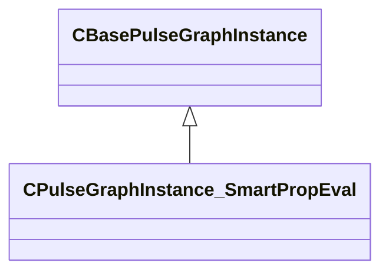

### CSmartPropAPI

### CSmartPropAttributeApplyColorMode

**Metadata:** `MPropertyCustomEditor "SmartPropAttributeEditor(enum:ApplyColorMode_t)"`

### CSmartPropAttributeChoiceSelectionMode

**Metadata:** `MPropertyCustomEditor "SmartPropAttributeEditor(enum:SmartPropChoiceSelectionMode_t)"`

### CSmartPropAttributeColorSelectionMode

**Metadata:** `MPropertyCustomEditor "SmartPropAttributeEditor(enum:SmartPropColorSelectionMode_t)"`

### CSmartPropAttributeCoordinateSpace

**Metadata:** `MPropertyCustomEditor "SmartPropAttributeEditor(enum:SmartPropSpace_t)"`

### CSmartPropAttributeDirection

**Metadata:** `MPropertyCustomEditor "SmartPropAttributeEditor(enum:SmartPropDirection_t)"`

### CSmartPropAttributeDistributionMode

**Metadata:** `MPropertyCustomEditor "SmartPropAttributeEditor(enum:SmartPropDistributionMode_t)"`

### CSmartPropAttributeGridOriginMode

**Metadata:** `MPropertyCustomEditor "SmartPropAttributeEditor(enum:SmartPropGridOriginBasis_t)"`

### CSmartPropAttributeGridPlacementMode

**Metadata:** `MPropertyCustomEditor "SmartPropAttributeEditor(enum:SmartPropGridPlacementMode_t)"`

### CSmartPropAttributeOrientationMode

**Metadata:** `MPropertyCustomEditor "SmartPropAttributeEditor(enum:SmartPropPlaceMeshOrientationMode_t)"`

### CSmartPropAttributePathPositions

**Metadata:** `MPropertyCustomEditor "SmartPropAttributeEditor(enum:SmartPropPathPositions_t)"`

### CSmartPropAttributePickMode

**Metadata:** `MPropertyCustomEditor "SmartPropAttributeEditor(enum:PickMode_t)"`

### CSmartPropAttributeRadiusPlacementMode

**Metadata:** `MPropertyCustomEditor "SmartPropAttributeEditor(enum:SmartPropRadiusPlacementMode_t)"`

### CSmartPropAttributeScaleMode

**Metadata:** `MPropertyCustomEditor "SmartPropAttributeEditor(enum:ScaleMode_t)"`

### CSmartPropAttributeTraceNoHit

**Metadata:** `MPropertyCustomEditor "SmartPropAttributeEditor(enum:TraceNoHitResult_t)"`

### CSmartPropChoice

**Inherits from:** [CSmartPropParameter](smartprops.md#csmartpropparameter)

**Metadata:** `MGetKV3ClassDefaults {
	"_class": "CSmartPropChoice",
	"m_nElementID": -1,
	"m_Name": "",
	"m_DefaultOption": "",
	"m_Options":
	[
	]
}`, `MPropertyFriendlyName "Choice"`, `MVDataAnonymousNode`, `MVDataOutlinerNameExpr "m_Name"`

**Relationships:**

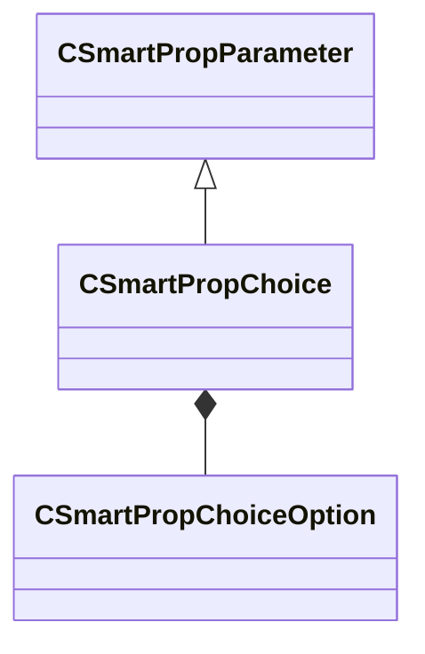

**Fields:**

| Name | Type | Annotations |
|------|------|-------------|
| `m_Name` | CUtlString | `MPropertyFriendlyName "Choice Name"` |
| `m_DefaultOption` | CUtlString | `MPropertyAttributeChoiceName "smartprop_choice_options"` |
| `m_Options` | CUtlVector<[CSmartPropChoiceOption](../schemas/smartprops.md#csmartpropchoiceoption)> | `MPropertyAutoExpandSelf` |

### CSmartPropChoiceOption

**Metadata:** `MGetKV3ClassDefaults {
	"m_Name": "",
	"m_DisplayName": "",
	"m_VariableValues":
	[
	]
}`

**Fields:**

| Name | Type | Annotations |
|------|------|-------------|
| `m_Name` | CUtlString | `MPropertyFriendlyName "Option Value Name"` |
| `m_DisplayName` | CUtlString | `MPropertyFriendlyName "Option Display Name"` |
| `m_VariableValues` | CUtlVector<CSmartPropAttributeVariableValue> | `MPropertyAutoExpandSelf` `MPropertyAttributeEditor "SmartPropAttributeEditor(VariableValue)"` |

### CSmartPropElement

**Derived by:** [CSmartPropElement_Group](smartprops.md#csmartpropelement_group), [CSmartPropElement_Model](smartprops.md#csmartpropelement_model), [CSmartPropElement_ModelEntity](smartprops.md#csmartpropelement_modelentity), [CSmartPropElement_ModifyState](smartprops.md#csmartpropelement_modifystate), [CSmartPropElement_SmartProp](smartprops.md#csmartpropelement_smartprop)

**Metadata:** `MGetKV3ClassDefaults {
	"_class": "CSmartPropElement",
	"m_nElementID": -1,
	"m_bEnabled": true,
	"m_sLabel": "",
	"m_SelectionCriteria":
	[
	],
	"m_Modifiers":
	[
	]
}`, `MVDataBase`, `MVDataNodeType 1`, `MVDataAnonymousNode`, `MPropertyFriendlyName "Smart Prop Element"`, `MVDataOutlinerLabelExpr "m_sLabel"`

**Relationships:**

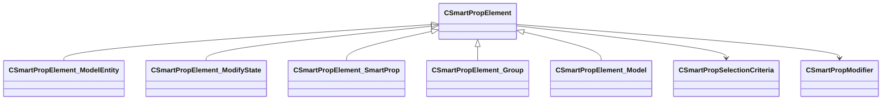

**Fields:**

| Name | Type | Annotations |
|------|------|-------------|
| `m_nElementID` | int32 | `MPropertySuppressField` `MVDataUniqueMonotonicInt "_editor/next_element_id"` |
| `m_bEnabled` | CSmartPropAttributeBool | `MVDataEnableKey` `MPropertyDescription "Is this element enabled? If not enabled, this element will not be evaluted and will have no effect on the result."` `MPropertySortPriority 10` |
| `m_sLabel` | CUtlString | `MPropertyFriendlyName "Label"` `MPropertyDescription "Optional text that will appear in the outliner to help organize Smart Prop elements and communicate their purpose to other users."` |
| `m_SelectionCriteria` | CUtlVector<[CSmartPropSelectionCriteria](../schemas/smartprops.md#csmartpropselectioncriteria)*> | `MPropertyFriendlyName "Selection Criteria"` `MVDataPromoteField 2` |
| `m_Modifiers` | CUtlVector<[CSmartPropModifier](../schemas/smartprops.md#csmartpropmodifier)*> | `MPropertyFriendlyName "Modifiers"` `MVDataPromoteField 2` |

### CSmartPropElement_BendDeformer

**Inherits from:** [CSmartPropElement_Deformer](smartprops.md#csmartpropelement_deformer)

**Metadata:** `MGetKV3ClassDefaults {
	"_class": "CSmartPropElement_BendDeformer",
	"m_nElementID": -1,
	"m_bEnabled": true,
	"m_sLabel": "",
	"m_SelectionCriteria":
	[
	],
	"m_Modifiers":
	[
	],
	"m_Children":
	[
	],
	"m_bDeformationEnabled": true,
	"m_vOrigin":
	[
		0.000000,
		0.000000,
		0.000000
	],
	"m_vAngles":
	[
		0.000000,
		0.000000,
		0.000000
	],
	"m_vSize":
	[
		0.000000,
		0.000000,
		0.000000
	],
	"m_flBendAngle": 0.000000,
	"m_flBendPoint": 0.000000,
	"m_flBendRadius": 0.000000
}`, `MPropertyFriendlyName "Bend Deformer"`, `MPropertyDescription "Creates a bend deformer that is applied to child elements. The deformation bends the local space x-axis around the local space z-axis. The Angles property can be used to rotate the local axis to change the direction of deformation."`

**Relationships:**

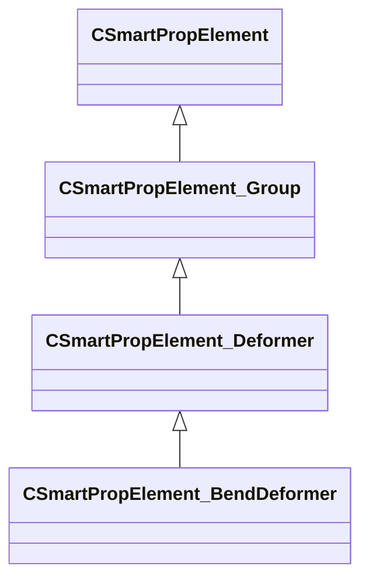

**Fields:**

| Name | Type | Annotations |
|------|------|-------------|
| `m_bDeformationEnabled` | CSmartPropAttributeBool | `MPropertyFriendlyName "Deformation Enabled"` `MPropertyDescription "Should the deformation be applied. If disabled the children will still be placed, but will not be deformed. Esentially making the element behave as a group."` |
| `m_vOrigin` | CSmartPropAttributeVector | `MPropertyFriendlyName "Origin"` `MPropertyDescription "A local offset to apply to the base volume of the deformer that will not apply to its children."` |
| `m_vAngles` | CSmartPropAttributeAngles | `MPropertyFriendlyName "Angles"` `MPropertyDescription "A local rotation to apply to apply the base volume of the deformer that will not apply to its children. This can be used to alter the direction of the deformation."` |
| `m_vSize` | CSmartPropAttributeVector | `MPropertyFriendlyName "Dimensions"` `MPropertyDescription "Size of the base volume to be deformed."` |
| `m_flBendAngle` | CSmartPropAttributeFloat | `MPropertyFriendlyName "Bend Angle"` `MPropertyDescription "Bend amount to apply, specified in degrees. Bend occurs along the local x-axis and bends around the local z-axis"` |
| `m_flBendPoint` | CSmartPropAttributeFloat | `MPropertyFriendlyName "Bend Point"` `MPropertyDescription "[ 0, 1 ] Value specifying the location along the local x-axis the bend will occur around"` |
| `m_flBendRadius` | CSmartPropAttributeFloat | `MPropertyFriendlyName "Bend Radius"` `MPropertyDescription "Radius of the bend. If 0 the radius will be computed automatically to preserve the length of the inner edge of the x-axis. If a non-zero value is specified then the inner edge will maintain this radius, but its length will change."` |

### CSmartPropElement_Deformer

**Inherits from:** [CSmartPropElement_Group](smartprops.md#csmartpropelement_group)

**Derived by:** [CSmartPropElement_BendDeformer](smartprops.md#csmartpropelement_benddeformer), [CSmartPropElement_MidpointDeformer](smartprops.md#csmartpropelement_midpointdeformer), [CSmartPropElement_PlaceOnMesh](smartprops.md#csmartpropelement_placeonmesh)

**Relationships:**

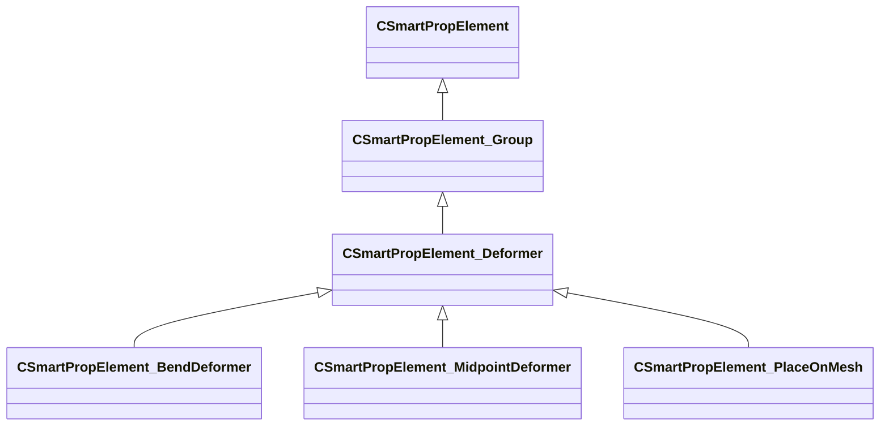

### CSmartPropElement_FitOnLine

**Inherits from:** [CSmartPropElement_Group](smartprops.md#csmartpropelement_group)

**Metadata:** `MGetKV3ClassDefaults {
	"_class": "CSmartPropElement_FitOnLine",
	"m_nElementID": -1,
	"m_bEnabled": true,
	"m_sLabel": "",
	"m_SelectionCriteria":
	[
	],
	"m_Modifiers":
	[
	],
	"m_Children":
	[
	],
	"m_vStart":
	[
		0.000000,
		0.000000,
		0.000000
	],
	"m_vEnd":
	[
		0.000000,
		0.000000,
		0.000000
	],
	"m_PointSpace": "ELEMENT",
	"m_bOrientAlongLine": false,
	"m_vUpDirection":
	[
		0.000000,
		0.000000,
		1.000000
	],
	"m_UpDirectionSpace": "ELEMENT",
	"m_bPrioritizeUp": false,
	"m_nScaleMode": "NONE",
	"m_nPickMode": "LARGEST_FIRST"
}`, `MPropertyFriendlyName "Fit on Line"`, `MPropertyDescription "An element which fits one or more instances of a set of choices on to a line."`

**Relationships:**

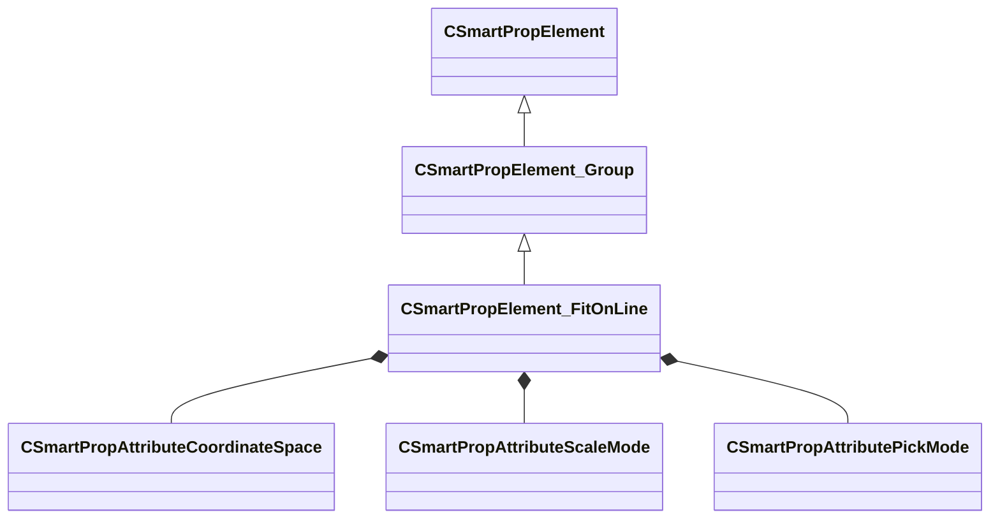

**Fields:**

| Name | Type | Annotations |
|------|------|-------------|
| `m_vStart` | CSmartPropAttributeVector | `MPropertyStartGroup "+End Points"` `MPropertyDescription "Specifies the start point of the line in the specified coordinate space."` |
| `m_vEnd` | CSmartPropAttributeVector | `MPropertyDescription "Specifies the end point of the line in the specified coordinate space."` |
| `m_PointSpace` | [CSmartPropAttributeCoordinateSpace](../schemas/smartprops.md#csmartpropattributecoordinatespace) | `MPropertyFriendlyName "End point space"` `MPropertyDescription "Specifies the coordinate space in which the end point values are specified."` |
| `m_bOrientAlongLine` | CSmartPropAttributeBool | `MPropertyStartGroup "+Orientation"` `MPropertyDescription "Should the child elements be oriented based on the line. If enabled the child elements placed on the line will be oriented such that their +x axis points along the line towards the end point."` |
| `m_vUpDirection` | CSmartPropAttributeVector | `MPropertyDescription "Up vector which is used to determine the rotation of each element around the line."` |
| `m_UpDirectionSpace` | [CSmartPropAttributeCoordinateSpace](../schemas/smartprops.md#csmartpropattributecoordinatespace) | `MPropertyDescription "Space in which the up direction is defined."` |
| `m_bPrioritizeUp` | CSmartPropAttributeBool | `MPropertyDescription "When the up direction is not orthogonal to the line direction normally the up vector will be adjusted to make it orthogonal to the line direction. If prioritize up is true, then the up direction will be maintained and the forward direction will be adjusted."` |
| `m_nScaleMode` | [CSmartPropAttributeScaleMode](../schemas/smartprops.md#csmartpropattributescalemode) | `MPropertyStartGroup ""` `MPropertyFriendlyName "Scale Mode"` `MPropertyDescription "Specifies how scale is applied to each of the selected element in order to fit them to the line."` |
| `m_nPickMode` | [CSmartPropAttributePickMode](../schemas/smartprops.md#csmartpropattributepickmode) | `MPropertyFriendlyName "Child Selection Mode"` `MPropertyDescription "Specifies how scale is applied to each of the selected element in order to fit them to the line."` |

### CSmartPropElement_Group

**Inherits from:** [CSmartPropElement](smartprops.md#csmartpropelement)

**Derived by:** [CSmartPropElement_Deformer](smartprops.md#csmartpropelement_deformer), [CSmartPropElement_FitOnLine](smartprops.md#csmartpropelement_fitonline), [CSmartPropElement_Layout2DGrid](smartprops.md#csmartpropelement_layout2dgrid), [CSmartPropElement_PickOne](smartprops.md#csmartpropelement_pickone), [CSmartPropElement_PlaceInSphere](smartprops.md#csmartpropelement_placeinsphere), [CSmartPropElement_PlaceMultiple](smartprops.md#csmartpropelement_placemultiple), [CSmartPropElement_PlaceOnPath](smartprops.md#csmartpropelement_placeonpath)

**Metadata:** `MGetKV3ClassDefaults {
	"_class": "CSmartPropElement_Group",
	"m_nElementID": -1,
	"m_bEnabled": true,
	"m_sLabel": "",
	"m_SelectionCriteria":
	[
	],
	"m_Modifiers":
	[
	],
	"m_Children":
	[
	]
}`, `MPropertyFriendlyName "Group"`, `MPropertyDescription "A group of elements that will all be evaulated."`

**Relationships:**

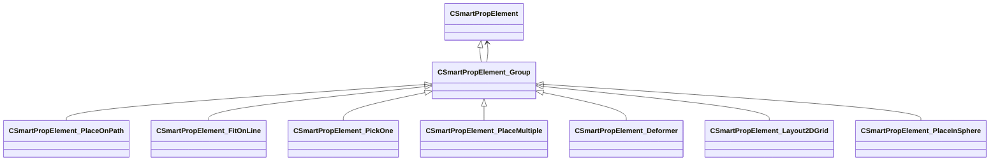

**Fields:**

| Name | Type | Annotations |
|------|------|-------------|
| `m_Children` | CUtlVector<[CSmartPropElement](../schemas/smartprops.md#csmartpropelement)*> | `MPropertyFriendlyName "Children"` `MPropertyDescription "List of child elements which will appear if this element appears"` `MVDataPromoteField 1` |

### CSmartPropElement_Layout2DGrid

**Inherits from:** [CSmartPropElement_Group](smartprops.md#csmartpropelement_group)

**Metadata:** `MGetKV3ClassDefaults {
	"_class": "CSmartPropElement_Layout2DGrid",
	"m_nElementID": -1,
	"m_bEnabled": true,
	"m_sLabel": "",
	"m_SelectionCriteria":
	[
	],
	"m_Modifiers":
	[
	],
	"m_Children":
	[
	],
	"m_flWidth": 100.000000,
	"m_flLength": 100.000000,
	"m_bVerticalLength": false,
	"m_GridArrangement": "SEGMENT",
	"m_GridOriginMode": "CENTER",
	"m_nCountW": 5,
	"m_nCountL": 5,
	"m_flSpacingWidth": 20.000000,
	"m_flSpacingLength": 20.000000,
	"m_bAlternateShift": false,
	"m_flAlternateShiftWidth": 0.500000,
	"m_flAlternateShiftLength": 0.000000
}`, `MPropertyFriendlyName "Layout Grid"`, `MPropertyDescription "Generates set of child instances arranged in a regular grid layout."`

**Relationships:**

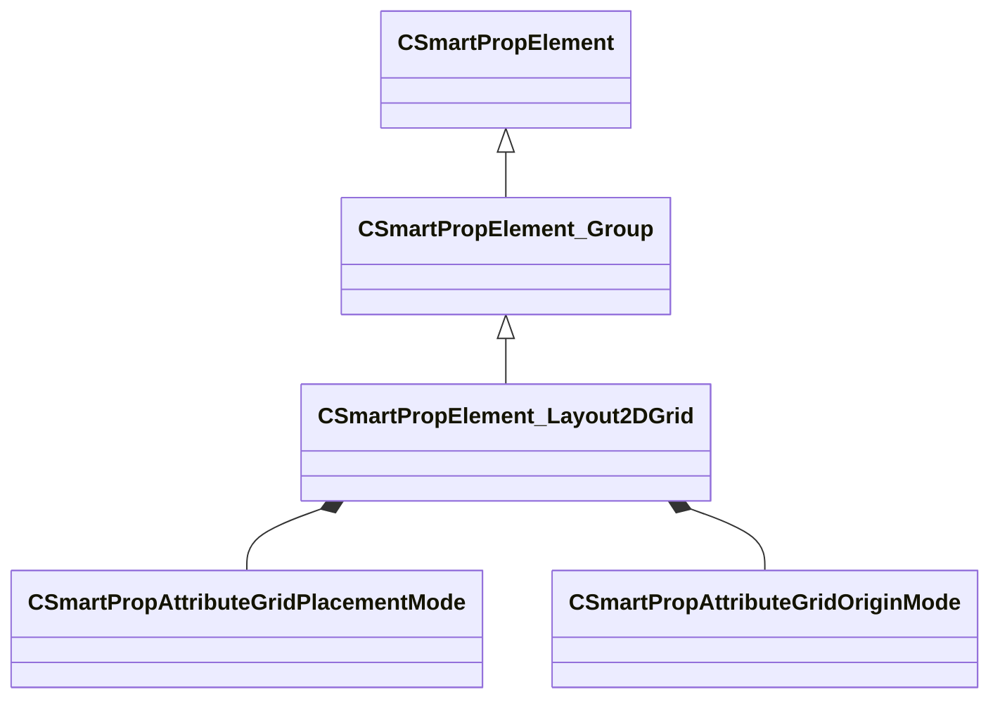

**Fields:**

| Name | Type | Annotations |
|------|------|-------------|
| `m_flWidth` | CSmartPropAttributeFloat | `MPropertyDescription "Overall grid dimension along X axis."` `MPropertyAttributeRange "biased 0 4096"` |
| `m_flLength` | CSmartPropAttributeFloat | `MPropertyDescription "Overall grid dimension along Y axis."` `MPropertyAttributeRange "biased 0 4096"` |
| `m_bVerticalLength` | CSmartPropAttributeBool | `MPropertyDescription "Layout length vertically (Along Z axis instead of Y)."` |
| `m_GridArrangement` | [CSmartPropAttributeGridPlacementMode](../schemas/smartprops.md#csmartpropattributegridplacementmode) | `MPropertyDescription "ARRAY: Grid is a specific number of grid divisions. FILL: The boundary is filled with as many as will fit at the specified cell spacing."` |
| `m_GridOriginMode` | [CSmartPropAttributeGridOriginMode](../schemas/smartprops.md#csmartpropattributegridoriginmode) | `MPropertyDescription "Specifies the overall grid origin location. Corner origin grids default to quadrant I, but may be expressed in others using negative values for Width and/or Length."` |
| `m_nCountW` | CSmartPropAttributeInt | `MPropertyDescription "Grid segments along width axis."` `MPropertyAttributeRange "1 64"` `MPropertySuppressExpr "m_GridArrangement == FILL"` |
| `m_nCountL` | CSmartPropAttributeInt | `MPropertyDescription "Grid segments along Length axis."` `MPropertyAttributeRange "1 64"` `MPropertySuppressExpr "m_GridArrangement == FILL"` |
| `m_flSpacingWidth` | CSmartPropAttributeFloat | `MPropertyDescription "Minimum Width of filled grid cells."` `MPropertyAttributeRange "biased 0 1024"` `MPropertySuppressExpr "m_GridArrangement == SEGMENT"` |
| `m_flSpacingLength` | CSmartPropAttributeFloat | `MPropertyDescription "Minimum Length of filled grid cells."` `MPropertyAttributeRange "biased 0 1024"` `MPropertySuppressExpr "m_GridArrangement == SEGMENT"` |
| `m_bAlternateShift` | CSmartPropAttributeBool | `MPropertyDescription "Shifts every other cell row and/or column."` `MPropertySuppressExpr "m_GridArrangement == FILL"` |
| `m_flAlternateShiftWidth` | CSmartPropAttributeFloat | `MPropertyDescription "Vary cell shift in X."` `MPropertyAttributeRange "biased 0 1024"` `MPropertySuppressExpr "m_GridArrangement == FILL || m_bAlternateShift == false"` |
| `m_flAlternateShiftLength` | CSmartPropAttributeFloat | `MPropertyDescription "Vary cell shift in Y."` `MPropertyAttributeRange "biased 0 1024"` `MPropertySuppressExpr "m_GridArrangement == FILL || m_bAlternateShift == false"` |

### CSmartPropElement_MidpointDeformer

**Inherits from:** [CSmartPropElement_Deformer](smartprops.md#csmartpropelement_deformer)

**Metadata:** `MGetKV3ClassDefaults {
	"_class": "CSmartPropElement_MidpointDeformer",
	"m_nElementID": -1,
	"m_bEnabled": true,
	"m_sLabel": "",
	"m_SelectionCriteria":
	[
	],
	"m_Modifiers":
	[
	],
	"m_Children":
	[
	],
	"m_bDeformationEnabled": true,
	"m_vStart":
	[
		0.000000,
		0.000000,
		0.000000
	],
	"m_vEnd":
	[
		0.000000,
		0.000000,
		0.000000
	],
	"m_fRadius": 64.000000,
	"m_bContinuousSpline": false,
	"m_vOffset":
	[
		0.000000,
		0.000000,
		0.000000
	],
	"m_vAngles":
	[
		0.000000,
		0.000000,
		0.000000
	],
	"m_vScale":
	[
		1.000000,
		1.000000
	],
	"m_fFalloff": 1.000000,
	"m_OutputVariable": ""
}`, `MPropertyFriendlyName "Midpoint Deformer"`, `MPropertyDescription "Soft deform the center of a volume defined by two endpoints."`

**Relationships:**

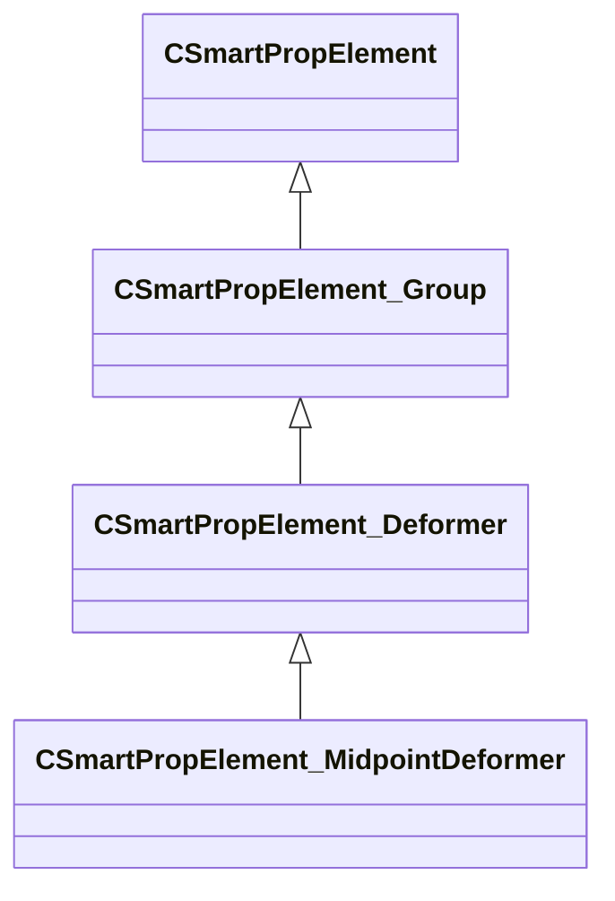

**Fields:**

| Name | Type | Annotations |
|------|------|-------------|
| `m_bDeformationEnabled` | CSmartPropAttributeBool | `MPropertyFriendlyName "Deformation Enabled"` `MPropertyDescription "Should the deformation be applied. If disabled the children will still be placed, but will not be deformed. Esentially making the element behave as a group."` |
| `m_vStart` | CSmartPropAttributeVector | `MPropertyFriendlyName "Start Point"` `MPropertyDescription "Endpoint of deformation region."` |
| `m_vEnd` | CSmartPropAttributeVector | `MPropertyFriendlyName "End Point"` `MPropertyDescription "Endpoint of deformation region."` |
| `m_fRadius` | CSmartPropAttributeFloat | `MPropertyFriendlyName "Effect Size"` `MPropertyDescription "The distance from the line formed by the endpoints that encapsulated the deformation region."` |
| `m_bContinuousSpline` | CSmartPropAttributeBool | `MPropertyFriendlyName "Continuous Interpolation"` `MPropertyDescription "Enables an alternate interpolation method that doesnt deform endpoint tangents."` |
| `m_vOffset` | CSmartPropAttributeVector | `MPropertyFriendlyName "Midpoint Offset"` `MPropertyDescription "Offsets the center of the deformation region."` |
| `m_vAngles` | CSmartPropAttributeAngles | `MPropertyFriendlyName "Midpoint Rotation"` `MPropertyDescription "Rotate the center of the deformation region."` |
| `m_vScale` | CSmartPropAttributeVector2D | `MPropertyFriendlyName "Midpoint Scale"` `MPropertyDescription "Scale the center of the deformation region."` |
| `m_fFalloff` | CSmartPropAttributeFloat | `MPropertyFriendlyName "Falloff"` `MPropertyDescription "Adjust deformation falloff from the center of the region to the endpoints."` |
| `m_OutputVariable` | CUtlString | `MPropertyAttributeEditor "SmartPropItemNameEditor( Variable:Vector )"` `MPropertyDescription "Outputs the absolute position of the midpoint post deformation."` |

### CSmartPropElement_Model

**Inherits from:** [CSmartPropElement](smartprops.md#csmartpropelement)

**Metadata:** `MGetKV3ClassDefaults {
	"_class": "CSmartPropElement_Model",
	"m_nElementID": -1,
	"m_bEnabled": true,
	"m_sLabel": "",
	"m_SelectionCriteria":
	[
	],
	"m_Modifiers":
	[
	],
	"m_sModelName": "",
	"m_MaterialGroupName": "",
	"m_bDetailObject": false,
	"m_vModelScale":
	[
		1.000000,
		1.000000,
		1.000000
	],
	"m_flUniformModelScale": 1.000000,
	"m_nLodLevel": -1,
	"m_SurfacePropertyOverride": "",
	"m_nDetailObjectFadeLevel": "NORMAL",
	"m_bCastShadows": true,
	"m_bRigidDeformation": false,
	"m_bDisableDynamicDeformable": false
}`, `MPropertyFriendlyName "Model"`, `MPropertyDescription "Places a model as the child of an element."`, `MVDataOutlinerAssetNameExpr`

**Relationships:**

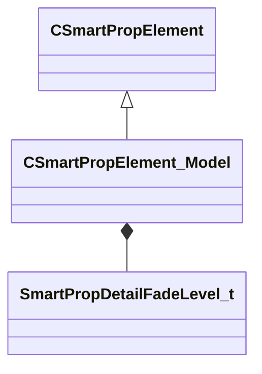

**Fields:**

| Name | Type | Annotations |
|------|------|-------------|
| `m_sModelName` | CSmartPropAttributeModelName | `MPropertyDescription "Name of the model resource (.vmdl) to place."` `MPropertyProvidesEditContextString "ToolEditContext_ID_VMDL"` |
| `m_MaterialGroupName` | CSmartPropAttributeMaterialGroup | `MPropertyFriendlyName "Material Group"` `MPropertyDescription "Specifies the name of the material group (skin) to use when displaying the specified model."` |
| `m_bDetailObject` | CSmartPropAttributeBool | `MPropertyDescription "If enabled the model will be rendered as a detail object, which is faster for placing many small objects and has fade out functionality, but may have different lighting characteristics. Detail object models support only uniform scale and will use the largest component of the scale value."` |
| `m_vModelScale` | CSmartPropAttributeVector | `MPropertySuppressExpr "m_bDetailObject == true"` `MPropertyDescription "Scale factor (may be non-uniform) to be applied directly to the model (in the model's local space)."` |
| `m_flUniformModelScale` | CSmartPropAttributeFloat | `MPropertyFriendlyName "Model Scale"` `MPropertySuppressExpr "m_bDetailObject == false"` `MPropertyDescription "Uniform scale to be applied to the model, certain properties like detail object mean only uniform scale may be applied to the model."` |
| `m_nLodLevel` | CSmartPropAttributeInt | `MPropertyAttributeEditor "SmartPropAttributeEditor( LODLevel )"` `MPropertySuppressExpr "m_bDetailObject == true"` `MPropertyDescription "Select model LOD level. The default Auto LOD means the lod will be picked based on the size of the model on screen. If a specific level is selected, then that lod level will always be used regardless of the size of the model on screen."` |
| `m_SurfacePropertyOverride` | CSmartPropAttributeSurfaceProperty | `MPropertyFriendlyName "Override Surface Property"` `MPropertySuppressExpr "m_bDetailObject == true"` `MPropertyDescription "If non-empty, specifies the name of a surface property to use for all physics shapes of the specified model, overriding any surface properties specified within the model."` |
| `m_nDetailObjectFadeLevel` | [SmartPropDetailFadeLevel_t](../schemas/smartprops.md#smartpropdetailfadelevel_t) | `MPropertyFriendlyName "Fade Level"` `MPropertySuppressExpr "m_bDetailObject == false"` `MPropertyDescription "Controls the size at which a model marked as a detail object will fade out."` |
| `m_bCastShadows` | CSmartPropAttributeBool | `MPropertyFriendlyName "Cast Shadows"` `MPropertyDescription "Should the model cast shadows."` |
| `m_bRigidDeformation` | CSmartPropAttributeBool | `MPropertyFriendlyName "Rigid Deformation Only"` `MPropertySuppressExpr "m_bDetailObject == true"` `MPropertyDescription "If enabled, only the transform of the model will be modified by any active deformer, the vertices of the model will not be changed by the deformer."` |
| `m_bDisableDynamicDeformable` | CSmartPropAttributeBool | `MPropertyFriendlyName "Disable Dynamic Deformable"` `MPropertySuppressExpr "m_bDetailObject == true"` `MPropertyDescription "If checked, this model will not deform in game when the smart prop is placed inside a dynamic deformable entity (such as func_deformable_brush)."` |

### CSmartPropElement_ModelEntity

**Inherits from:** [CSmartPropElement](smartprops.md#csmartpropelement)

**Derived by:** [CSmartPropElement_PropDynamic](smartprops.md#csmartpropelement_propdynamic), [CSmartPropElement_PropPhysics](smartprops.md#csmartpropelement_propphysics)

**Metadata:** `MGetKV3ClassDefaults Could not parse KV3 Defaults`, `MVDataOutlinerAssetNameExpr`

**Relationships:**

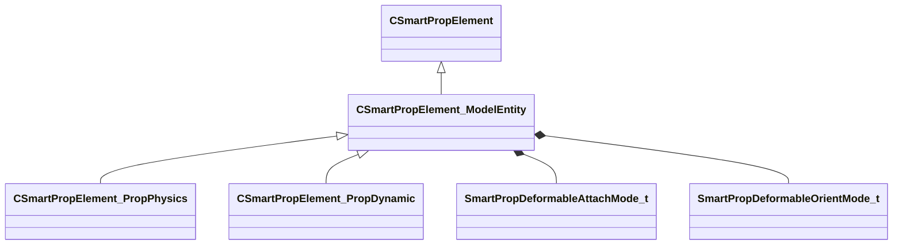

**Fields:**

| Name | Type | Annotations |
|------|------|-------------|
| `m_sModelName` | CSmartPropAttributeModelName | `MPropertyDescription "Name of the model resource (.vmdl) to place."` `MPropertyProvidesEditContextString "ToolEditContext_ID_VMDL"` |
| `m_MaterialGroupName` | CSmartPropAttributeMaterialGroup | `MPropertyFriendlyName "Material Group"` `MPropertyDescription "Specifies the name of the material group (skin) to use when displaying the specified model."` |
| `m_bCastShadows` | CSmartPropAttributeBool | `MPropertyFriendlyName "Cast Shadows"` `MPropertyDescription "Should the entity created by this element cast shadows."` |
| `m_bForceStatic` | CSmartPropAttributeBool | `MPropertyFriendlyName "Force Static"` `MPropertyDescription "Force this model to be placed as a static model rather then generating an entity."` |
| `m_nDeformableAttachmentMode` | [SmartPropDeformableAttachMode_t](../schemas/smartprops.md#smartpropdeformableattachmode_t) | `MPropertySortPriority -1` `MPropertySuppressExpr "m_bForceStatic == true"` `MPropertyFriendlyName "Attachment Mode"` `MPropertyGroupName "Deformable Entity Settings"` `MPropertyDescription "If the smart prop is child of a deformable entity, this setting specifies how the entity generated by this element will be attached to the deformable surface."` |
| `m_nDeformableOrientationMode` | [SmartPropDeformableOrientMode_t](../schemas/smartprops.md#smartpropdeformableorientmode_t) | `MPropertySortPriority -1` `MPropertySuppressExpr "m_bForceStatic == true"` `MPropertyGroupName "Deformable Entity Settings"` `MPropertyDescription "If the smart prop is child of a deformable entity, this setting specifies how the entity generated by this element will be oriented relative to the deformable surface."` |

### CSmartPropElement_ModifyState

**Inherits from:** [CSmartPropElement](smartprops.md#csmartpropelement)

**Metadata:** `MGetKV3ClassDefaults {
	"_class": "CSmartPropElement_ModifyState",
	"m_nElementID": -1,
	"m_bEnabled": true,
	"m_sLabel": "",
	"m_SelectionCriteria":
	[
	],
	"m_Modifiers":
	[
	]
}`, `MPropertyFriendlyName "Apply Modifiers"`, `MPropertyDescription "An element which is used to apply a set of modifiers to the state of its parent."`, `MPropertySuppressBaseClassField "m_bRestoreState"`

**Relationships:**

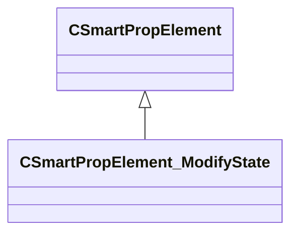

### CSmartPropElement_PickOne

**Inherits from:** [CSmartPropElement_Group](smartprops.md#csmartpropelement_group)

**Metadata:** `MGetKV3ClassDefaults {
	"_class": "CSmartPropElement_PickOne",
	"m_nElementID": -1,
	"m_bEnabled": true,
	"m_sLabel": "",
	"m_SelectionCriteria":
	[
	],
	"m_Modifiers":
	[
	],
	"m_Children":
	[
	],
	"m_SelectionMode": "RANDOM",
	"m_SpecificChildIndex": 0,
	"m_OutputChoiceVariableName": "",
	"m_bConfigurable": true,
	"m_vHandleOffset":
	[
		0.000000,
		0.000000,
		0.000000
	],
	"m_HandleColor":
	[
		144,
		144,
		144
	],
	"m_HandleSize": 9,
	"m_HandleShape": "SQUARE"
}`, `MPropertyFriendlyName "Select Single Child"`, `MPropertyDescription "An element which selects a single choice from its set of child choices."`

**Relationships:**

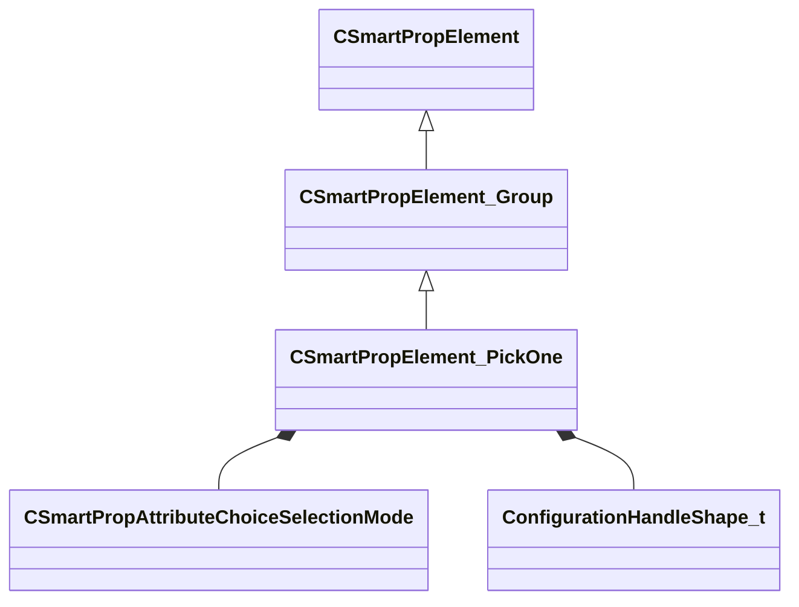

**Fields:**

| Name | Type | Annotations |
|------|------|-------------|
| `m_SelectionMode` | [CSmartPropAttributeChoiceSelectionMode](../schemas/smartprops.md#csmartpropattributechoiceselectionmode) | `MPropertyDescription "Specifies how the initial selection of a choice should be handled."` |
| `m_SpecificChildIndex` | CSmartPropAttributeInt | `MPropertyFriendlyName "Specific Child"` `MPropertyDescription "Specifies the index of the child to pick."` `MPropertySuppressExpr "( m_SelectionMode != SPECIFIC )"` |
| `m_OutputChoiceVariableName` | CUtlString | `MPropertyFriendlyName "Choice Output Variable"` `MPropertyDescription "If a variable name is specified, sets the value of that variable to the index of the selected choice"` `MPropertyAttributeEditor "SmartPropItemNameEditor( Variable:Integer )"` |
| `m_bConfigurable` | CSmartPropAttributeBool | `MPropertyDescription "Should a control to select the specific choice be shown when this prop is placed in Hammer."` |
| `m_vHandleOffset` | CSmartPropAttributeVector | `MPropertyGroupName "Handle Settings"` `MPropertyReadonlyExpr "m_bConfigurable == false"` `MPropertyDescription "Specifies an offset in the local space of the element to apply to the configuration handle."` |
| `m_HandleColor` | CSmartPropAttributeColor | `MPropertyGroupName "Handle Settings"` `MPropertyReadonlyExpr "m_bConfigurable == false"` `MPropertyDescription "Color to use to display the configuration handle."` |
| `m_HandleSize` | CSmartPropAttributeInt | `MPropertyGroupName "Handle Settings"` `MPropertyReadonlyExpr "m_bConfigurable == false"` `MPropertyDescription "Size of the configuration handle."` |
| `m_HandleShape` | [ConfigurationHandleShape_t](../schemas/smartprops.md#configurationhandleshape_t) | `MPropertyGroupName "Handle Settings"` `MPropertyReadonlyExpr "m_bConfigurable == false"` `MPropertyDescription "Shape of the configuration handle to display."` |

### CSmartPropElement_PlaceInSphere

**Inherits from:** [CSmartPropElement_Group](smartprops.md#csmartpropelement_group)

**Metadata:** `MGetKV3ClassDefaults {
	"_class": "CSmartPropElement_PlaceInSphere",
	"m_nElementID": -1,
	"m_bEnabled": true,
	"m_sLabel": "",
	"m_SelectionCriteria":
	[
	],
	"m_Modifiers":
	[
	],
	"m_Children":
	[
	],
	"m_PlacementMode": "SPHERE",
	"m_DistributionMode": "RANDOM",
	"m_flRandomness": 0.000000,
	"m_vPlaneUpDirection":
	[
		0.000000,
		0.000000,
		1.000000
	],
	"m_nCountMin": 1,
	"m_nCountMax": 1,
	"m_flPositionRadiusInner": 0.000000,
	"m_flPositionRadiusOuter": 0.000000,
	"m_bAlignOrientation": false,
	"m_vAlignDirection":
	[
		0.000000,
		0.000000,
		1.000000
	]
}`, `MPropertyFriendlyName "Place In Radius"`, `MPropertyDescription "An element which places multiple instances of its child elements within a radius."`

**Relationships:**

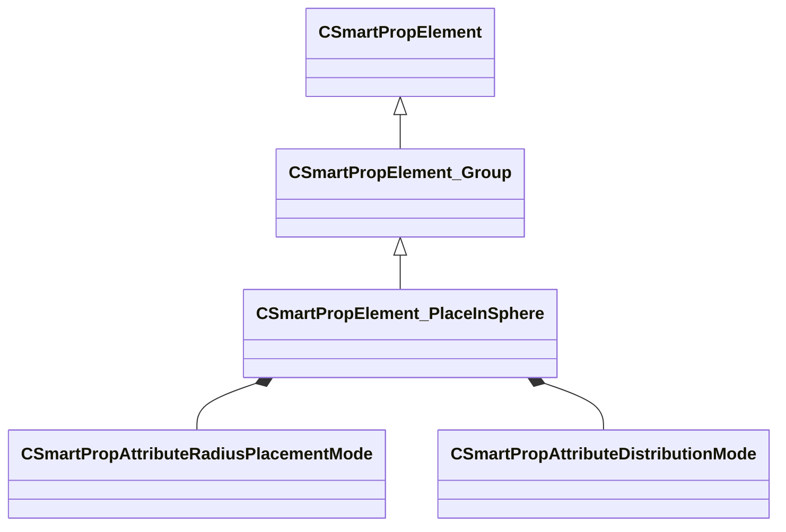

**Fields:**

| Name | Type | Annotations |
|------|------|-------------|
| `m_PlacementMode` | [CSmartPropAttributeRadiusPlacementMode](../schemas/smartprops.md#csmartpropattributeradiusplacementmode) | `MPropertyDescription "Specifies how the positions are computed based on the radius."` |
| `m_DistributionMode` | [CSmartPropAttributeDistributionMode](../schemas/smartprops.md#csmartpropattributedistributionmode) | `MPropertyDescription "Specifies the method to be used to distribute."` |
| `m_flRandomness` | CSmartPropAttributeFloat | `MPropertySuppressExpr "m_DistributionMode == RANDOM"` `MPropertyDescription "0 to 1 value indicating the amout of random offset that should be applied to the reguluarly spaced positions"` |
| `m_vPlaneUpDirection` | CSmartPropAttributeVector | `MPropertySuppressExpr "m_PlacementMode == SPHERE"` `MPropertyDescription "Vector up direction of the plane of the circle. This in the local space of the current element."` |
| `m_nCountMin` | CSmartPropAttributeInt | `MPropertyDescription "Minimum number of instances of this object and its children to be placed."` |
| `m_nCountMax` | CSmartPropAttributeInt | `MPropertyDescription "Maximum number of instances of this object and its children to be placed."` |
| `m_flPositionRadiusInner` | CSmartPropAttributeFloat | `MPropertyDescription "Inner radius from the placement position where the model can appear."` |
| `m_flPositionRadiusOuter` | CSmartPropAttributeFloat | `MPropertyDescription "Outer radius from the placement position where the model can appear."` |
| `m_bAlignOrientation` | CSmartPropAttributeBool | `MPropertyDescription "Align the initial orientation of each placed object based on it position on the sphere or circle."` |
| `m_vAlignDirection` | CSmartPropAttributeVector | `MPropertyReadonlyExpr "m_bAlignOrientation == false"` `MPropertyDescription "Vector in the local space of the child element to be aligned with sphere or circle"` |

### CSmartPropElement_PlaceMultiple

**Inherits from:** [CSmartPropElement_Group](smartprops.md#csmartpropelement_group)

**Metadata:** `MGetKV3ClassDefaults {
	"_class": "CSmartPropElement_PlaceMultiple",
	"m_nElementID": -1,
	"m_bEnabled": true,
	"m_sLabel": "",
	"m_SelectionCriteria":
	[
	],
	"m_Modifiers":
	[
	],
	"m_Children":
	[
	],
	"m_nCount": 1,
	"m_Expression": ""
}`, `MPropertyFriendlyName "Place Multiple"`, `MPropertyDescription "An element which places multiple instances of its child elements."`

**Relationships:**

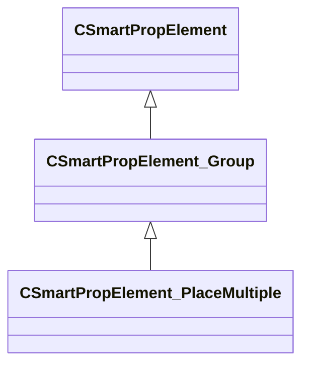

**Fields:**

| Name | Type | Annotations |
|------|------|-------------|
| `m_nCount` | CSmartPropAttributeInt | `MPropertyDescription "Number of instances of this object and its children to be placed."` |
| `m_Expression` | CUtlString | `MPropertyFriendlyName "Stop When"` `MPropertyDescription "Stop placing copies of the children when this expression evaluates to true."` `MPropertyAttributeEditor "SmartPropAttributeEditor(expression)"` |

### CSmartPropElement_PlaceOnMesh

**Inherits from:** [CSmartPropElement_Deformer](smartprops.md#csmartpropelement_deformer)

**Metadata:** `MGetKV3ClassDefaults {
	"_class": "CSmartPropElement_PlaceOnMesh",
	"m_nElementID": -1,
	"m_bEnabled": true,
	"m_sLabel": "",
	"m_SelectionCriteria":
	[
	],
	"m_Modifiers":
	[
	],
	"m_Children":
	[
	],
	"m_nPickMode": "FIRST_CLOSED_EDGE",
	"m_MeshName": ""
}`, `MVDataExperimentalNodeSet`, `MPropertyFriendlyName "Place on Mesh"`, `MPropertyDescription "Place Children on Mesh Components."`

**Relationships:**

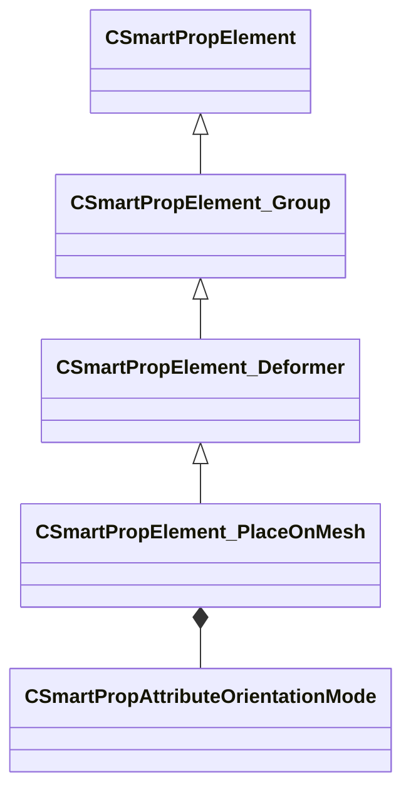

**Fields:**

| Name | Type | Annotations |
|------|------|-------------|
| `m_nPickMode` | [CSmartPropAttributeOrientationMode](../schemas/smartprops.md#csmartpropattributeorientationmode) | `MPropertyStartGroup ""` `MPropertyFriendlyName "Orientation Mode"` `MPropertyDescription "Determine how child elements are oriented when mapped to face."` |
| `m_MeshName` | CUtlString | `MPropertyDescription ""` |

### CSmartPropElement_PlaceOnPath

**Inherits from:** [CSmartPropElement_Group](smartprops.md#csmartpropelement_group)

**Metadata:** `MGetKV3ClassDefaults {
	"_class": "CSmartPropElement_PlaceOnPath",
	"m_nElementID": -1,
	"m_bEnabled": true,
	"m_sLabel": "",
	"m_SelectionCriteria":
	[
	],
	"m_Modifiers":
	[
	],
	"m_Children":
	[
	],
	"m_PathName": "",
	"m_flSpacing": 1.000000,
	"m_flOffsetAlongPath": 0.000000,
	"m_vPathOffset":
	[
		0.000000,
		0.000000
	],
	"m_PathSpace": "WORLD",
	"m_bUseFixedUpDirection": false,
	"m_bUseProjectedDistance": false,
	"m_vUpDirection":
	[
		0.000000,
		0.000000,
		1.000000
	],
	"m_UpDirectionSpace": "WORLD",
	"m_DefaultPathInWorldSpace": false,
	"m_DefaultPath":
	[
	]
}`, `MPropertyFriendlyName "Place on Path"`, `MPropertyDescription "An element which places an instance of its child elements at a specified interval along a path."`

**Relationships:**

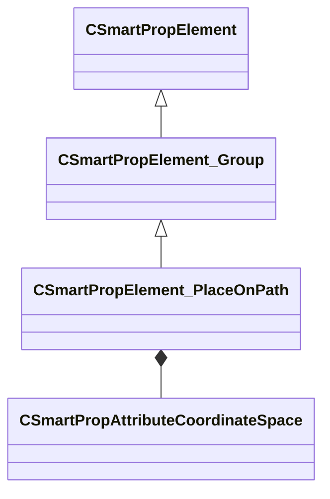

**Fields:**

| Name | Type | Annotations |
|------|------|-------------|
| `m_PathName` | CUtlString | `MPropertyDescription "Name of the path to use. This path name will show up in the property editor when selecting a placement of this smart prop in Hammer, allowing selection of a path object in the map to use."` |
| `m_flSpacing` | CSmartPropAttributeFloat | `MPropertyDescription "Spacing between points on the path"` |
| `m_flOffsetAlongPath` | CSmartPropAttributeFloat | `MPropertyDescription "Offset from the start of the path to place the first point."` |
| `m_vPathOffset` | CSmartPropAttributeVector2D | `MPropertyFriendlyName "Offset from path"` `MPropertyDescription "Offset to apply to the path, specifies a horizontal and vertical offset to apply relative to the up direction."` |
| `m_PathSpace` | [CSmartPropAttributeCoordinateSpace](../schemas/smartprops.md#csmartpropattributecoordinatespace) | `MPropertyFriendlyName "Path Evaluation Space"` `MPropertyDescription "Specifies the space in which the provided input path is to be evalauted.<br><br><b>World Space</b>: The input path will be evaluated in world space, such that child elements will be placed directly on the target path regardless of the transform of the smart prop object. <br><b>Object Space</b>: The world space transform of the input path will be ignored and instead the path will be evaluated relative to the transform of the smart prop object. <br><b>Element Space</b>: The world space transform of the input path will be ignored and instead the path will be evaluated relative to the transform of the current element within the smart prop. "` |
| `m_bUseFixedUpDirection` | CSmartPropAttributeBool | `MPropertyDescription "If true, treat the specified up direction as fixed up direction to apply to all elements placed on the path. If false the up direction is just an initial direction."` |
| `m_bUseProjectedDistance` | CSmartPropAttributeBool | `MPropertyDescription "Compute the spacing distance in the 2d plane defined by the up direction. Most useful when using a fixed up direction, if maintaining a distance in the 2d plane is more important than maintaing distance along the path."` |
| `m_vUpDirection` | CSmartPropAttributeVector | `MPropertyDescription "If not using a fixed up direction, provides an initial up direction which will be used to determine the orientation of first element on the path, after that the elements will incrementally update to follow the path and may not match this direction. If Use Fixed Up direction is specified, then all elements will use this direction to deterime their up direction."` |
| `m_UpDirectionSpace` | [CSmartPropAttributeCoordinateSpace](../schemas/smartprops.md#csmartpropattributecoordinatespace) | `MPropertyDescription "Space in which the up direction is defined."` |
| `m_DefaultPathInWorldSpace` | CSmartPropAttributeBool | `MPropertyFriendlyName "Default Path In World Space"` `MPropertyDescription "If enabled, the default path values will be treated as world space values, if disabled they are treated as object space values. Typically it makes sense for literal values to be treated as being in object space, but if the values are being supplied by locators they will typically be in world space."` |
| `m_DefaultPath` | CUtlVector<CSmartPropAttributeVector> | `MPropertyDescription "A set of points defining a path to use when an external path isn't specified. This will be used in the preview and thumbnail for the smart prop. It will also be used when the smart prop is placed in Hammer before a path is selected."` |

### CSmartPropElement_PropDynamic

**Inherits from:** [CSmartPropElement_ModelEntity](smartprops.md#csmartpropelement_modelentity)

**Metadata:** `MGetKV3ClassDefaults {
	"_class": "CSmartPropElement_PropDynamic",
	"m_nElementID": -1,
	"m_bEnabled": true,
	"m_sLabel": "",
	"m_SelectionCriteria":
	[
	],
	"m_Modifiers":
	[
	],
	"m_sModelName": "",
	"m_MaterialGroupName": "",
	"m_bCastShadows": true,
	"m_bForceStatic": false,
	"m_nDeformableAttachmentMode": "RELATIVE",
	"m_nDeformableOrientationMode": "MAINTAIN_OFFSET"
}`, `MPropertyFriendlyName "Prop Dynamic"`, `MPropertyDescription "Places a prop dynamic entity."`

**Relationships:**

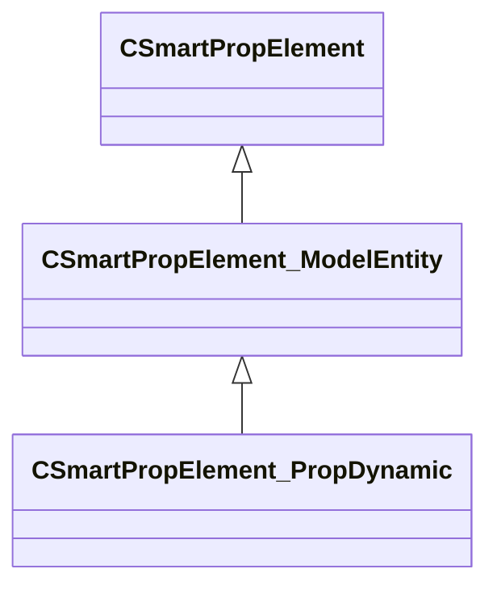

### CSmartPropElement_PropPhysics

**Inherits from:** [CSmartPropElement_ModelEntity](smartprops.md#csmartpropelement_modelentity)

**Metadata:** `MGetKV3ClassDefaults {
	"_class": "CSmartPropElement_PropPhysics",
	"m_nElementID": -1,
	"m_bEnabled": true,
	"m_sLabel": "",
	"m_SelectionCriteria":
	[
	],
	"m_Modifiers":
	[
	],
	"m_sModelName": "",
	"m_MaterialGroupName": "",
	"m_bCastShadows": true,
	"m_bForceStatic": false,
	"m_nDeformableAttachmentMode": "RELATIVE",
	"m_nDeformableOrientationMode": "MAINTAIN_OFFSET",
	"m_bStartAsleep": false
}`, `MPropertyFriendlyName "Prop Physics"`, `MPropertyDescription "Places a prop physics entity."`

**Relationships:**

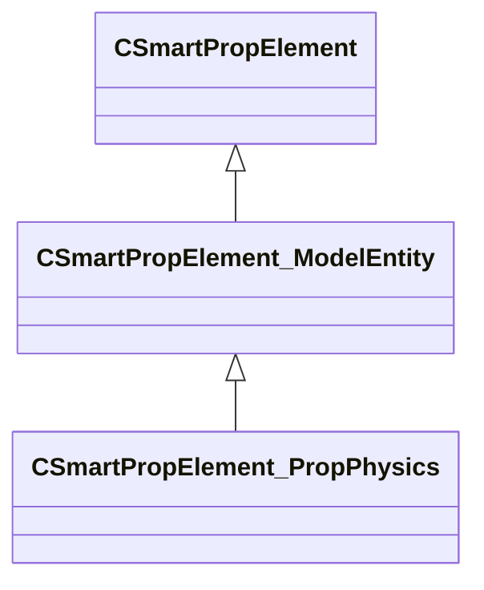

**Fields:**

| Name | Type | Annotations |
|------|------|-------------|
| `m_bStartAsleep` | CSmartPropAttributeBool | `MPropertyDescription "Should this physics prop start in a sleeping (non-simulating) state such that it won't update until it is woken up by an external event."` |

### CSmartPropElement_SmartProp

**Inherits from:** [CSmartPropElement](smartprops.md#csmartpropelement)

**Metadata:** `MGetKV3ClassDefaults {
	"_class": "CSmartPropElement_SmartProp",
	"m_nElementID": -1,
	"m_bEnabled": true,
	"m_sLabel": "",
	"m_SelectionCriteria":
	[
	],
	"m_Modifiers":
	[
	],
	"m_sSmartProp": "",
	"m_bLocalEvaluationState": true
}`, `MPropertyFriendlyName "Smart Prop Reference"`, `MPropertyDescription "Evaluates a specified smart prop as a child of the current element."`, `MVDataOutlinerAssetNameExpr`

**Relationships:**

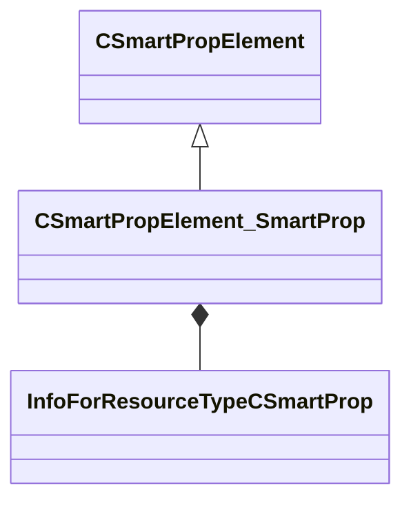

**Fields:**

| Name | Type | Annotations |
|------|------|-------------|
| `m_sSmartProp` | CResourceNameTyped<CWeakHandle<[InfoForResourceTypeCSmartProp](../schemas/resourcesystem.md#infoforresourcetypecsmartprop)>> | `MPropertyDescription "Name of the target smart prop resource (.vsmart) to evaluate."` |
| `m_bLocalEvaluationState` | bool | `MPropertyDescription "If enabled, any changes made to the evaluation state by the target smart prop (as well as modifiers) will only apply locally and will not affect the evaluation state of the parent. Disabling this will allow modifications to the evaluation state by the referenced smart prop to apply the current state of the of the parent. For example if the referenced smart prop applies a transform and you want the transform to affect the elements in the parent after this element, then you should disable local evaluation state."` |

### CSmartPropExprAPI

### CSmartPropFilter

**Inherits from:** [CSmartPropModifier](smartprops.md#csmartpropmodifier)

**Derived by:** [CSmartPropFilter_Expression](smartprops.md#csmartpropfilter_expression), [CSmartPropFilter_MaterialAttributes](smartprops.md#csmartpropfilter_materialattributes), [CSmartPropFilter_Probability](smartprops.md#csmartpropfilter_probability), [CSmartPropFilter_SurfaceAngle](smartprops.md#csmartpropfilter_surfaceangle), [CSmartPropFilter_SurfaceProperties](smartprops.md#csmartpropfilter_surfaceproperties), [CSmartPropFilter_VariableValue](smartprops.md#csmartpropfilter_variablevalue)

**Metadata:** `MGetKV3ClassDefaults Could not parse KV3 Defaults`, `MVDataNodeTintColor`

**Relationships:**

```mermaid
classDiagram
    CSmartPropModifier <|-- CSmartPropFilter
    CSmartPropFilter <|-- CSmartPropFilter_SurfaceProperties
    CSmartPropFilter <|-- CSmartPropFilter_SurfaceAngle
    CSmartPropFilter <|-- CSmartPropFilter_MaterialAttributes
    CSmartPropFilter <|-- CSmartPropFilter_Probability
    CSmartPropFilter <|-- CSmartPropFilter_Expression
    CSmartPropFilter <|-- CSmartPropFilter_VariableValue
```

### CSmartPropFilterAPI

### CSmartPropFilter_Expression

**Inherits from:** [CSmartPropFilter](smartprops.md#csmartpropfilter)

**Metadata:** `MGetKV3ClassDefaults {
	"_class": "CSmartPropFilter_Expression",
	"m_bEnabled": true,
	"m_Expression": ""
}`, `MPropertyFriendlyName "Filter: Expression"`, `MPropertyDescription "Evaluates the specified expression, if the result of the expression is false evaluation of the element is stopped."`, `MVDataClassGroup "Filter"`

**Relationships:**

```mermaid
classDiagram
    CSmartPropFilter <|-- CSmartPropFilter_Expression
    CSmartPropModifier <|-- CSmartPropFilter
```

**Fields:**

| Name | Type | Annotations |
|------|------|-------------|
| `m_Expression` | CUtlString | `MPropertyAttributeEditor "SmartPropAttributeEditor(expression)"` |

### CSmartPropFilter_MaterialAttributes

**Inherits from:** [CSmartPropFilter](smartprops.md#csmartpropfilter)

**Metadata:** `MGetKV3ClassDefaults {
	"_class": "CSmartPropFilter_MaterialAttributes",
	"m_bEnabled": true,
	"m_AllowedMaterialAttributes":
	[
	],
	"m_DisallowedMaterialAttributes":
	[
	]
}`, `MPropertyFriendlyName "Filter: Material Attributes"`, `MPropertyDescription "Allows the parent element to be conditionally evaluated based on attributes assigned to the surface material."`, `MVDataClassGroup "Filter"`

**Relationships:**

```mermaid
classDiagram
    CSmartPropFilter <|-- CSmartPropFilter_MaterialAttributes
    CSmartPropModifier <|-- CSmartPropFilter
```

**Fields:**

| Name | Type | Annotations |
|------|------|-------------|
| `m_AllowedMaterialAttributes` | CUtlVector<CUtlString> | `MPropertyDescription "List of material attributes on which this element is valid. If empty, the element is not restricted to any specific surfaces."` |
| `m_DisallowedMaterialAttributes` | CUtlVector<CUtlString> | `MPropertyDescription "List of material attributes on which this element is not valid. If empty, the element is not restricted to any specific surfaces."` |

### CSmartPropFilter_Probability

**Inherits from:** [CSmartPropFilter](smartprops.md#csmartpropfilter)

**Metadata:** `MGetKV3ClassDefaults {
	"_class": "CSmartPropFilter_Probability",
	"m_bEnabled": true,
	"m_flProbability": 0.500000
}`, `MPropertyFriendlyName "Filter: Probability"`, `MPropertyDescription "Causes the parent element to only be evaluated with a specified random probability."`, `MVDataClassGroup "Filter"`

**Relationships:**

```mermaid
classDiagram
    CSmartPropFilter <|-- CSmartPropFilter_Probability
    CSmartPropModifier <|-- CSmartPropFilter
```

**Fields:**

| Name | Type | Annotations |
|------|------|-------------|
| `m_flProbability` | CSmartPropAttributeFloat | `MPropertyDescription "0.0 to 1.0 value indicating the probability of this element being evaluated. Where a value of 0 means the element will never be evaluated and 1.0 means it will always be evaluated"` |

### CSmartPropFilter_SurfaceAngle

**Inherits from:** [CSmartPropFilter](smartprops.md#csmartpropfilter)

**Metadata:** `MGetKV3ClassDefaults {
	"_class": "CSmartPropFilter_SurfaceAngle",
	"m_bEnabled": true,
	"m_flSurfaceSlopeMin": 0.000000,
	"m_flSurfaceSlopeMax": 180.000000
}`, `MPropertyFriendlyName "Filter: Surface Angles"`, `MPropertyDescription "Allows the parent element to be conditionally evaluated base on the current surface angle. The surface angle is set based on the initial placement of the smart prop object, but can also be updated by the Trace to Surface modifier."`, `MVDataClassGroup "Filter"`

**Relationships:**

```mermaid
classDiagram
    CSmartPropFilter <|-- CSmartPropFilter_SurfaceAngle
    CSmartPropModifier <|-- CSmartPropFilter
```

**Fields:**

| Name | Type | Annotations |
|------|------|-------------|
| `m_flSurfaceSlopeMin` | CSmartPropAttributeFloat | `MPropertyDescription "Minimum slope on which the target will be placed. Slope is a [ 0, 180 ] value of the surface normal rotation from up such that 0 is a horizontal surface (floor), 90 is a vertical surface (wall), 180 is horizontal upside down surface (ceiling)."` |
| `m_flSurfaceSlopeMax` | CSmartPropAttributeFloat | `MPropertyDescription "Maximum slope on which the target will be placed."` |

### CSmartPropFilter_SurfaceProperties

**Inherits from:** [CSmartPropFilter](smartprops.md#csmartpropfilter)

**Metadata:** `MGetKV3ClassDefaults {
	"_class": "CSmartPropFilter_SurfaceProperties",
	"m_bEnabled": true,
	"m_AllowedSurfaceProperties":
	[
	],
	"m_DisallowedSurfaceProperties":
	[
	]
}`, `MPropertyFriendlyName "Filter: Surface Properties"`, `MPropertyDescription "Allows the parent element to be conditionally evaluated based on surface properties."`, `MVDataClassGroup "Filter"`

**Relationships:**

```mermaid
classDiagram
    CSmartPropFilter <|-- CSmartPropFilter_SurfaceProperties
    CSmartPropModifier <|-- CSmartPropFilter
```

**Fields:**

| Name | Type | Annotations |
|------|------|-------------|
| `m_AllowedSurfaceProperties` | CUtlVector<CUtlString> | `MPropertyDescription "List of surface properties on which this element is valid. If empty element is not restricted to any specific surfaces."` |
| `m_DisallowedSurfaceProperties` | CUtlVector<CUtlString> | `MPropertyDescription "List of surface properties on which this element is not valid. If empty element is not restricted to any specific surfaces."` |

### CSmartPropFilter_VariableValue

**Inherits from:** [CSmartPropFilter](smartprops.md#csmartpropfilter)

**Metadata:** `MGetKV3ClassDefaults {
	"_class": "CSmartPropFilter_VariableValue",
	"m_bEnabled": true,
	"m_VariableComparison":
	{
		"m_Name": "",
		"m_Value": null,
		"m_Comparison": "EQUAL"
	}
}`, `MPropertyFriendlyName "Filter: Variable Value"`, `MPropertyDescription "Compares the current value of a variable to the specified value. If the comparison is false the element evaluation is stopped."`, `MVDataClassGroup "Filter"`

**Relationships:**

```mermaid
classDiagram
    CSmartPropFilter <|-- CSmartPropFilter_VariableValue
    CSmartPropModifier <|-- CSmartPropFilter
```

**Fields:**

| Name | Type | Annotations |
|------|------|-------------|
| `m_VariableComparison` | CSmartPropVariableComparison |  |

### CSmartPropMaterialReplacement

**Metadata:** `MGetKV3ClassDefaults {
	"m_OriginalMaterial": "",
	"m_ReplacementMaterial": ""
}`

**Fields:**

| Name | Type | Annotations |
|------|------|-------------|
| `m_OriginalMaterial` | CSmartPropAttributeMaterialName | `MPropertyAttributeEditor "SmartPropAttributeEditor(MaterialInSmartProp)"` `MPropertyFriendlyName "Original Material"` `MPropertyDescription "Original material to replace. This is the material specified in the model, including any material group asignment within the model. Does not consider any existing material overrides specified within the smart prop."` |
| `m_ReplacementMaterial` | CSmartPropAttributeMaterialName | `MPropertyFriendlyName "New Material"` `MPropertyDescription "New material to replace the original material with."` |

### CSmartPropModifier

**Derived by:** [CSmartPropFilter](smartprops.md#csmartpropfilter), [CSmartPropOperation](smartprops.md#csmartpropoperation)

**Metadata:** `MGetKV3ClassDefaults Could not parse KV3 Defaults`, `MVDataBase`, `MVDataNodeType 1`, `MVDataAnonymousNode`

**Relationships:**

```mermaid
classDiagram
    CSmartPropModifier <|-- CSmartPropFilter
    CSmartPropModifier <|-- CSmartPropOperation
```

**Fields:**

| Name | Type | Annotations |
|------|------|-------------|
| `m_bEnabled` | CSmartPropAttributeBool | `MVDataEnableKey` |

### CSmartPropOperation

**Inherits from:** [CSmartPropModifier](smartprops.md#csmartpropmodifier)

**Derived by:** [CSmartPropOperation_ComputeCrossProduct3D](smartprops.md#csmartpropoperation_computecrossproduct3d), [CSmartPropOperation_ComputeDistance3D](smartprops.md#csmartpropoperation_computedistance3d), [CSmartPropOperation_ComputeDotProduct3D](smartprops.md#csmartpropoperation_computedotproduct3d), [CSmartPropOperation_ComputeNormalizedVector3D](smartprops.md#csmartpropoperation_computenormalizedvector3d), [CSmartPropOperation_ComputeProjectVector3D](smartprops.md#csmartpropoperation_computeprojectvector3d), [CSmartPropOperation_ComputeVectorBetweenPoints3D](smartprops.md#csmartpropoperation_computevectorbetweenpoints3d), [CSmartPropOperation_MaterialOverride](smartprops.md#csmartpropoperation_materialoverride), [CSmartPropOperation_MaterialTint](smartprops.md#csmartpropoperation_materialtint), [CSmartPropOperation_RandomColorTintColor](smartprops.md#csmartpropoperation_randomcolortintcolor), [CSmartPropOperation_RestoreState](smartprops.md#csmartpropoperation_restorestate), [CSmartPropOperation_SaveColor](smartprops.md#csmartpropoperation_savecolor), [CSmartPropOperation_SaveDirection](smartprops.md#csmartpropoperation_savedirection), [CSmartPropOperation_SavePosition](smartprops.md#csmartpropoperation_saveposition), [CSmartPropOperation_SaveScale](smartprops.md#csmartpropoperation_savescale), [CSmartPropOperation_SaveState](smartprops.md#csmartpropoperation_savestate), [CSmartPropOperation_SaveSurfaceNormal](smartprops.md#csmartpropoperation_savesurfacenormal), [CSmartPropOperation_SetMateraialGroupChoice](smartprops.md#csmartpropoperation_setmateraialgroupchoice), [CSmartPropOperation_SetTintColor](smartprops.md#csmartpropoperation_settintcolor), [CSmartPropOperation_SetVariable](smartprops.md#csmartpropoperation_setvariable), [CSmartPropTransformOperation](smartprops.md#csmartproptransformoperation)

**Metadata:** `MGetKV3ClassDefaults Could not parse KV3 Defaults`

**Relationships:**

```mermaid
classDiagram
    CSmartPropModifier <|-- CSmartPropOperation
    CSmartPropOperation <|-- CSmartPropOperation_MaterialTint
    CSmartPropOperation <|-- CSmartPropOperation_SaveState
    CSmartPropOperation <|-- CSmartPropOperation_ComputeNormalizedVector3D
    CSmartPropOperation <|-- CSmartPropOperation_SavePosition
    CSmartPropOperation <|-- CSmartPropOperation_ComputeVectorBetweenPoints3D
    CSmartPropOperation <|-- CSmartPropOperation_ComputeCrossProduct3D
    CSmartPropOperation <|-- CSmartPropOperation_ComputeDistance3D
    CSmartPropOperation <|-- CSmartPropOperation_ComputeDotProduct3D
    CSmartPropOperation <|-- CSmartPropOperation_ComputeProjectVector3D
    CSmartPropOperation <|-- CSmartPropOperation_SaveDirection
    CSmartPropOperation <|-- CSmartPropOperation_SetMateraialGroupChoice
    CSmartPropOperation <|-- CSmartPropOperation_SaveColor
    CSmartPropOperation <|-- CSmartPropOperation_SetTintColor
    CSmartPropOperation <|-- CSmartPropOperation_SetVariable
    CSmartPropOperation <|-- CSmartPropOperation_SaveSurfaceNormal
    CSmartPropOperation <|-- CSmartPropOperation_MaterialOverride
    CSmartPropOperation <|-- CSmartPropOperation_RestoreState
    CSmartPropOperation <|-- CSmartPropOperation_RandomColorTintColor
    CSmartPropOperation <|-- CSmartPropOperation_SaveScale
    CSmartPropOperation <|-- CSmartPropTransformOperation
```

### CSmartPropOperationAPI

### CSmartPropOperation_ComputeCrossProduct3D

**Inherits from:** [CSmartPropOperation](smartprops.md#csmartpropoperation)

**Metadata:** `MGetKV3ClassDefaults {
	"_class": "CSmartPropOperation_ComputeCrossProduct3D",
	"m_bEnabled": true,
	"m_OutputVariableName": "",
	"m_InputVectorA":
	[
		0.000000,
		0.000000,
		0.000000
	],
	"m_InputVectorB":
	[
		0.000000,
		0.000000,
		0.000000
	]
}`, `MPropertyFriendlyName "Cross Product"`, `MPropertyDescription "Compute a dot or cross product between two 3D vectors"`, `MVDataClassGroup "Compute"`

**Relationships:**

```mermaid
classDiagram
    CSmartPropOperation <|-- CSmartPropOperation_ComputeCrossProduct3D
    CSmartPropModifier <|-- CSmartPropOperation
```

**Fields:**

| Name | Type | Annotations |
|------|------|-------------|
| `m_OutputVariableName` | CUtlString | `MPropertyFriendlyName "Output Variable"` `MPropertyAttributeEditor "SmartPropItemNameEditor( Variable:Vector3 )"` |
| `m_InputVectorA` | CSmartPropAttributeVector | `MPropertyFriendlyName "Vector A"` |
| `m_InputVectorB` | CSmartPropAttributeVector | `MPropertyFriendlyName "Vector B"` |

### CSmartPropOperation_ComputeDistance3D

**Inherits from:** [CSmartPropOperation](smartprops.md#csmartpropoperation)

**Metadata:** `MGetKV3ClassDefaults {
	"_class": "CSmartPropOperation_ComputeDistance3D",
	"m_bEnabled": true,
	"m_OutputVariableName": "",
	"m_OutputCoordinateSpace": "WORLD",
	"m_InputPositionA":
	[
		0.000000,
		0.000000,
		0.000000
	],
	"m_CoordinateSpaceA": "WORLD",
	"m_InputPositionB":
	[
		0.000000,
		0.000000,
		0.000000
	],
	"m_CoordinateSpaceB": "WORLD"
}`, `MPropertyFriendlyName "Distance"`, `MPropertyDescription "Compute the distance between two 3D points"`, `MVDataClassGroup "Compute"`

**Relationships:**

```mermaid
classDiagram
    CSmartPropOperation <|-- CSmartPropOperation_ComputeDistance3D
    CSmartPropModifier <|-- CSmartPropOperation
    CSmartPropOperation_ComputeDistance3D *-- CSmartPropAttributeCoordinateSpace
```

**Fields:**

| Name | Type | Annotations |
|------|------|-------------|
| `m_OutputVariableName` | CUtlString | `MPropertyFriendlyName "Output Variable"` `MPropertyAttributeEditor "SmartPropItemNameEditor( Variable:Float )"` |
| `m_OutputCoordinateSpace` | [CSmartPropAttributeCoordinateSpace](../schemas/smartprops.md#csmartpropattributecoordinatespace) | `MPropertyDescription "Specifies the coordinate space the distance should be computed in. The scale of the coordinate space may affect the distance value."` |
| `m_InputPositionA` | CSmartPropAttributeVector | `MPropertyGroupName "+Position A"` `MPropertyFriendlyName "Position A"` |
| `m_CoordinateSpaceA` | [CSmartPropAttributeCoordinateSpace](../schemas/smartprops.md#csmartpropattributecoordinatespace) | `MPropertyGroupName "+Position A"` `MPropertyDescription "Specifies the coordinate space of position A."` |
| `m_InputPositionB` | CSmartPropAttributeVector | `MPropertyGroupName "+Position B"` `MPropertyFriendlyName "Position B"` |
| `m_CoordinateSpaceB` | [CSmartPropAttributeCoordinateSpace](../schemas/smartprops.md#csmartpropattributecoordinatespace) | `MPropertyGroupName "+Position B"` `MPropertyDescription "Specifies the coordinate space of position B."` |

### CSmartPropOperation_ComputeDotProduct3D

**Inherits from:** [CSmartPropOperation](smartprops.md#csmartpropoperation)

**Metadata:** `MGetKV3ClassDefaults {
	"_class": "CSmartPropOperation_ComputeDotProduct3D",
	"m_bEnabled": true,
	"m_OutputVariableName": "",
	"m_InputVectorA":
	[
		0.000000,
		0.000000,
		0.000000
	],
	"m_InputVectorB":
	[
		0.000000,
		0.000000,
		0.000000
	]
}`, `MPropertyFriendlyName "Dot Product"`, `MPropertyDescription "Compute a dot or cross product between two 3D vectors"`, `MVDataClassGroup "Compute"`

**Relationships:**

```mermaid
classDiagram
    CSmartPropOperation <|-- CSmartPropOperation_ComputeDotProduct3D
    CSmartPropModifier <|-- CSmartPropOperation
```

**Fields:**

| Name | Type | Annotations |
|------|------|-------------|
| `m_OutputVariableName` | CUtlString | `MPropertyFriendlyName "Output Variable"` `MPropertyAttributeEditor "SmartPropItemNameEditor( Variable:Float )"` |
| `m_InputVectorA` | CSmartPropAttributeVector | `MPropertyFriendlyName "Vector A"` |
| `m_InputVectorB` | CSmartPropAttributeVector | `MPropertyFriendlyName "Vector B"` |

### CSmartPropOperation_ComputeNormalizedVector3D

**Inherits from:** [CSmartPropOperation](smartprops.md#csmartpropoperation)

**Metadata:** `MGetKV3ClassDefaults {
	"_class": "CSmartPropOperation_ComputeNormalizedVector3D",
	"m_bEnabled": true,
	"m_OutputVariableName": "",
	"m_InputVector":
	[
		0.000000,
		0.000000,
		0.000000
	]
}`, `MPropertyFriendlyName "Normalize Vector"`, `MPropertyDescription "Normalize the value of a 3d vector."`, `MVDataClassGroup "Compute"`

**Relationships:**

```mermaid
classDiagram
    CSmartPropOperation <|-- CSmartPropOperation_ComputeNormalizedVector3D
    CSmartPropModifier <|-- CSmartPropOperation
```

**Fields:**

| Name | Type | Annotations |
|------|------|-------------|
| `m_OutputVariableName` | CUtlString | `MPropertyFriendlyName "Output Variable"` `MPropertyAttributeEditor "SmartPropItemNameEditor( Variable:Vector3 )"` |
| `m_InputVector` | CSmartPropAttributeVector |  |

### CSmartPropOperation_ComputeProjectVector3D

**Inherits from:** [CSmartPropOperation](smartprops.md#csmartpropoperation)

**Metadata:** `MGetKV3ClassDefaults {
	"_class": "CSmartPropOperation_ComputeProjectVector3D",
	"m_bEnabled": true,
	"m_OutputVariableName": "",
	"m_OutputCoordinateSpace": "WORLD",
	"m_InputVectorA":
	[
		0.000000,
		0.000000,
		0.000000
	],
	"m_CoordinateSpaceA": "WORLD",
	"m_InputVectorB":
	[
		0.000000,
		0.000000,
		0.000000
	],
	"m_CoordinateSpaceB": "WORLD",
	"m_bPlane": false
}`, `MPropertyFriendlyName "Project Vector"`, `MPropertyDescription "Project Vector A onto Vector B"`, `MVDataClassGroup "Compute"`

**Relationships:**

```mermaid
classDiagram
    CSmartPropOperation <|-- CSmartPropOperation_ComputeProjectVector3D
    CSmartPropModifier <|-- CSmartPropOperation
    CSmartPropOperation_ComputeProjectVector3D *-- CSmartPropAttributeCoordinateSpace
```

**Fields:**

| Name | Type | Annotations |
|------|------|-------------|
| `m_OutputVariableName` | CUtlString | `MPropertyFriendlyName "Output Variable"` `MPropertyAttributeEditor "SmartPropItemNameEditor( Variable:Vector3 )"` |
| `m_OutputCoordinateSpace` | [CSmartPropAttributeCoordinateSpace](../schemas/smartprops.md#csmartpropattributecoordinatespace) | `MPropertyDescription "Specifies the coordinate space that vector should be returned in."` |
| `m_InputVectorA` | CSmartPropAttributeVector | `MPropertyGroupName "+Vector A"` `MPropertyFriendlyName "Vector A"` |
| `m_CoordinateSpaceA` | [CSmartPropAttributeCoordinateSpace](../schemas/smartprops.md#csmartpropattributecoordinatespace) | `MPropertyGroupName "+Vector A"` `MPropertyDescription "Specifies the coordinate space of vector A."` |
| `m_InputVectorB` | CSmartPropAttributeVector | `MPropertyGroupName "+Vector B"` `MPropertyFriendlyName "Vector B"` |
| `m_CoordinateSpaceB` | [CSmartPropAttributeCoordinateSpace](../schemas/smartprops.md#csmartpropattributecoordinatespace) | `MPropertyGroupName "+Vector B"` `MPropertyDescription "Specifies the coordinate space of posivectortion B."` |
| `m_bPlane` | CSmartPropAttributeBool | `MPropertyFriendlyName "Projection to plane"` `MPropertyDescription "Interpret Vector B as plane normal."` |

### CSmartPropOperation_ComputeVectorBetweenPoints3D

**Inherits from:** [CSmartPropOperation](smartprops.md#csmartpropoperation)

**Metadata:** `MGetKV3ClassDefaults {
	"_class": "CSmartPropOperation_ComputeVectorBetweenPoints3D",
	"m_bEnabled": true,
	"m_OutputVariableName": "",
	"m_OutputCoordinateSpace": "WORLD",
	"m_bNormalized": false,
	"m_InputPositionA":
	[
		0.000000,
		0.000000,
		0.000000
	],
	"m_CoordinateSpaceA": "WORLD",
	"m_InputPositionB":
	[
		0.000000,
		0.000000,
		0.000000
	],
	"m_CoordinateSpaceB": "WORLD"
}`, `MPropertyFriendlyName "Vector Between Points"`, `MPropertyDescription "Compute the vector between two 3D points"`, `MVDataClassGroup "Compute"`

**Relationships:**

```mermaid
classDiagram
    CSmartPropOperation <|-- CSmartPropOperation_ComputeVectorBetweenPoints3D
    CSmartPropModifier <|-- CSmartPropOperation
    CSmartPropOperation_ComputeVectorBetweenPoints3D *-- CSmartPropAttributeCoordinateSpace
```

**Fields:**

| Name | Type | Annotations |
|------|------|-------------|
| `m_OutputVariableName` | CUtlString | `MPropertyFriendlyName "Output Variable"` `MPropertyAttributeEditor "SmartPropItemNameEditor( Variable:Vector3 )"` |
| `m_OutputCoordinateSpace` | [CSmartPropAttributeCoordinateSpace](../schemas/smartprops.md#csmartpropattributecoordinatespace) | `MPropertyDescription "Specifies the coordinate space that vector should be returned in."` |
| `m_bNormalized` | CSmartPropAttributeBool | `MPropertyFriendlyName "Normalized (Direction Vector)"` `MPropertyDescription "Should the return value be normalized to unit length (direction vector)."` |
| `m_InputPositionA` | CSmartPropAttributeVector | `MPropertyGroupName "+Position A"` `MPropertyFriendlyName "Position A"` |
| `m_CoordinateSpaceA` | [CSmartPropAttributeCoordinateSpace](../schemas/smartprops.md#csmartpropattributecoordinatespace) | `MPropertyGroupName "+Position A"` `MPropertyDescription "Specifies the coordinate space of position A."` |
| `m_InputPositionB` | CSmartPropAttributeVector | `MPropertyGroupName "+Position B"` `MPropertyFriendlyName "Position B"` |
| `m_CoordinateSpaceB` | [CSmartPropAttributeCoordinateSpace](../schemas/smartprops.md#csmartpropattributecoordinatespace) | `MPropertyGroupName "+Position B"` `MPropertyDescription "Specifies the coordinate space of position B."` |

### CSmartPropOperation_CreateLocator

**Inherits from:** [CSmartPropTransformOperation](smartprops.md#csmartproptransformoperation)

**Metadata:** `MGetKV3ClassDefaults {
	"_class": "CSmartPropOperation_CreateLocator",
	"m_bEnabled": true,
	"m_LocatorName": "",
	"m_vOffset":
	[
		0.000000,
		0.000000,
		0.000000
	],
	"m_flDisplayScale": 1.000000,
	"m_bConfigurable": true,
	"m_bAllowTranslation": true,
	"m_bAllowRotation": true,
	"m_bAllowScale": false
}`, `MPropertyFriendlyName "Create Locator"`, `MPropertyDescription "Create a locator with the current transform. The locator may optionally be configurable, so that its transform can be modified in Hammer."`, `MVDataClassGroup "Manipulators"`

**Relationships:**

```mermaid
classDiagram
    CSmartPropTransformOperation <|-- CSmartPropOperation_CreateLocator
    CSmartPropOperation <|-- CSmartPropTransformOperation
    CSmartPropModifier <|-- CSmartPropOperation
```

**Fields:**

| Name | Type | Annotations |
|------|------|-------------|
| `m_LocatorName` | CUtlString | `MPropertyFriendlyName "Name"` `MPropertyAttributeEditor "SmartPropItemNameEditor( Locator )"` `MPropertyDescription "Name of the locator. This can be used to reference the locator in this element or its children. If the locator is configurable, the locator will be identified by this name in Hammer."` |
| `m_vOffset` | CSmartPropAttributeVector | `MPropertyDescription "Offset of the locator relative to the current transform. This allows the locator to be created at an offset location without applying that offset to the current transform."` |
| `m_flDisplayScale` | CSmartPropAttributeFloat | `MPropertyDescription "Scale to apply only to the locator model"` |
| `m_bConfigurable` | CSmartPropAttributeBool | `MPropertyDescription "Controls whether or not the locator can be edited in a smart prop configuration. If enabled an editable locator will appear when the smart prop is placed in Hammer. Any changes to that locator will modify the current transform."` |
| `m_bAllowTranslation` | CSmartPropAttributeBool | `MPropertyReadonlyExpr "m_bConfigurable == false"` `MPropertyGroupName "Configuration"` |
| `m_bAllowRotation` | CSmartPropAttributeBool | `MPropertyReadonlyExpr "m_bConfigurable == false"` `MPropertyGroupName "Configuration"` |
| `m_bAllowScale` | CSmartPropAttributeBool | `MPropertyReadonlyExpr "m_bConfigurable == false"` `MPropertyGroupName "Configuration"` `MPropertyDescription "Controls whether or not the configuration of the locator can include scale. If enabled scale can be applied to the editable locator in Hammer. If disabled the scale will not be editable and the current scale will be used."` |

### CSmartPropOperation_CreateRotator

**Inherits from:** [CSmartPropTransformOperation](smartprops.md#csmartproptransformoperation)

**Metadata:** `MGetKV3ClassDefaults {
	"_class": "CSmartPropOperation_CreateRotator",
	"m_bEnabled": true,
	"m_Name": "",
	"m_vOffset":
	[
		0.000000,
		0.000000,
		0.000000
	],
	"m_vRotationAxis":
	[
		0.000000,
		0.000000,
		1.000000
	],
	"m_CoordinateSpace": "ELEMENT",
	"m_flDisplayRadius": 16.000000,
	"m_DisplayColor":
	[
		170,
		170,
		110
	],
	"m_bApplyToCurrentTransform": true,
	"m_flSnappingIncrement": 0.000000,
	"m_flInitialAngle": 0.000000,
	"m_bEnforceLimits": false,
	"m_flMinAngle": 0.000000,
	"m_flMaxAngle": 0.000000,
	"m_OutputVariable": ""
}`, `MPropertyFriendlyName "Create Rotator"`, `MPropertyDescription "Create a rotator that will be displayed at the current location, allowing the user to manipulate a rotation around an axis. The rotation value can be applied to the current transform as well as saved to a variable."`, `MVDataClassGroup "Manipulators"`

**Relationships:**

```mermaid
classDiagram
    CSmartPropTransformOperation <|-- CSmartPropOperation_CreateRotator
    CSmartPropOperation <|-- CSmartPropTransformOperation
    CSmartPropModifier <|-- CSmartPropOperation
    CSmartPropOperation_CreateRotator *-- CSmartPropAttributeCoordinateSpace
```

**Fields:**

| Name | Type | Annotations |
|------|------|-------------|
| `m_Name` | CUtlString | `MPropertyFriendlyName "Name"` `MPropertyDescription "Name used to identify the rotator. Must be unique within the parent element."` |
| `m_vOffset` | CSmartPropAttributeVector | `MPropertyDescription "Offset of the rotator relative to the current transform. This allows the rotator to be created at an offset location without applying that offset to the current transform."` |
| `m_vRotationAxis` | CSmartPropAttributeVector | `MPropertyDescription "Axis around which the rotation will occur"` |
| `m_CoordinateSpace` | [CSmartPropAttributeCoordinateSpace](../schemas/smartprops.md#csmartpropattributecoordinatespace) | `MPropertyDescription "Coordinate space the axis of rotation is specified in."` |
| `m_flDisplayRadius` | CSmartPropAttributeFloat | `MPropertyDescription "Radius at which the rotator handle should be displayed."` |
| `m_DisplayColor` | CSmartPropAttributeColor | `MPropertyDescription "Color to display the rotator handle with."` |
| `m_bApplyToCurrentTransform` | CSmartPropAttributeBool | `MPropertyDescription "Should the rotation be applied to the current transform."` |
| `m_flSnappingIncrement` | CSmartPropAttributeFloat | `MPropertyDescription "Specifies the number of degrees the rotation should snap to. If set to 0, then the rotation snapping will be controlled by the rotation snapping in Hammer."` |
| `m_flInitialAngle` | CSmartPropAttributeFloat | `MPropertyDescription "Specifies the angle the rotator should be set to initially."` |
| `m_bEnforceLimits` | CSmartPropAttributeBool | `MPropertyFriendlyName "Enforce Limits"` `MPropertyDescription "If enabled, the minimum and maximum rotation angles will be used to limit the range of the rotation."` |
| `m_flMinAngle` | CSmartPropAttributeFloat | `MPropertyReadonlyExpr "m_bEnforceLimits == false"` `MPropertyFriendlyName "Minimum Angle"` `MPropertyDescription "Specifies the minimum angle limit in degrees"` |
| `m_flMaxAngle` | CSmartPropAttributeFloat | `MPropertyReadonlyExpr "m_bEnforceLimits == false"` `MPropertyFriendlyName "Maximum Angle"` `MPropertyDescription "Specifies the minimum angle limit in degrees"` |
| `m_OutputVariable` | CUtlString | `MPropertyAttributeEditor "SmartPropItemNameEditor( Variable:Float )"` `MPropertyDescription "Specifies a float variable to which the rotation value should be output. The variable only receives the rotation around the axis, the axis of rotation does not affect this output."` |

### CSmartPropOperation_CreateSizer

**Inherits from:** [CSmartPropTransformOperation](smartprops.md#csmartproptransformoperation)

**Metadata:** `MGetKV3ClassDefaults {
	"_class": "CSmartPropOperation_CreateSizer",
	"m_bEnabled": true,
	"m_Name": "",
	"m_bDisplayModel": false,
	"m_flInitialMinX": 0.000000,
	"m_flInitialMaxX": 0.000000,
	"m_flConstraintMinX": 0.000000,
	"m_flConstraintMaxX": 0.000000,
	"m_OutputVariableMinX": "",
	"m_OutputVariableMaxX": "",
	"m_flInitialMinY": 0.000000,
	"m_flInitialMaxY": 0.000000,
	"m_flConstraintMinY": 0.000000,
	"m_flConstraintMaxY": 0.000000,
	"m_OutputVariableMinY": "",
	"m_OutputVariableMaxY": "",
	"m_flInitialMinZ": 0.000000,
	"m_flInitialMaxZ": 0.000000,
	"m_flConstraintMinZ": 0.000000,
	"m_flConstraintMaxZ": 0.000000,
	"m_OutputVariableMinZ": "",
	"m_OutputVariableMaxZ": ""
}`, `MPropertyFriendlyName "Create Sizer"`, `MPropertyDescription "Create a sizer that will be displayed at the current location, allowing the user to manipulate the specified set of size values."`, `MVDataClassGroup "Manipulators"`

**Relationships:**

```mermaid
classDiagram
    CSmartPropTransformOperation <|-- CSmartPropOperation_CreateSizer
    CSmartPropOperation <|-- CSmartPropTransformOperation
    CSmartPropModifier <|-- CSmartPropOperation
```

**Fields:**

| Name | Type | Annotations |
|------|------|-------------|
| `m_Name` | CUtlString | `MPropertyFriendlyName "Name"` `MPropertyDescription "Name used to identify the sizer. Must be unique within the paraent element."` |
| `m_bDisplayModel` | CSmartPropAttributeBool | `MPropertyFriendlyName "Display Model"` `MPropertyDescription "If enabled a model will be displayed at the position of the sizer that can be used to select the sizer in Hammer."` |
| `m_flInitialMinX` | CSmartPropAttributeFloat | `MPropertyGroupName "X-Axis Size"` |
| `m_flInitialMaxX` | CSmartPropAttributeFloat | `MPropertyGroupName "X-Axis Size"` |
| `m_flConstraintMinX` | CSmartPropAttributeFloat | `MPropertyGroupName "X-Axis Size"` |
| `m_flConstraintMaxX` | CSmartPropAttributeFloat | `MPropertyGroupName "X-Axis Size"` |
| `m_OutputVariableMinX` | CUtlString | `MPropertyGroupName "X-Axis Size"` `MPropertyAttributeEditor "SmartPropItemNameEditor( Variable:Float )"` |
| `m_OutputVariableMaxX` | CUtlString | `MPropertyGroupName "X-Axis Size"` `MPropertyAttributeEditor "SmartPropItemNameEditor( Variable:Float )"` |
| `m_flInitialMinY` | CSmartPropAttributeFloat | `MPropertyGroupName "Y-Axis Size"` |
| `m_flInitialMaxY` | CSmartPropAttributeFloat | `MPropertyGroupName "Y-Axis Size"` |
| `m_flConstraintMinY` | CSmartPropAttributeFloat | `MPropertyGroupName "Y-Axis Size"` |
| `m_flConstraintMaxY` | CSmartPropAttributeFloat | `MPropertyGroupName "Y-Axis Size"` |
| `m_OutputVariableMinY` | CUtlString | `MPropertyGroupName "Y-Axis Size"` `MPropertyAttributeEditor "SmartPropItemNameEditor( Variable:Float )"` |
| `m_OutputVariableMaxY` | CUtlString | `MPropertyGroupName "Y-Axis Size"` `MPropertyAttributeEditor "SmartPropItemNameEditor( Variable:Float )"` |
| `m_flInitialMinZ` | CSmartPropAttributeFloat | `MPropertyGroupName "Z-Axis Size"` |
| `m_flInitialMaxZ` | CSmartPropAttributeFloat | `MPropertyGroupName "Z-Axis Size"` |
| `m_flConstraintMinZ` | CSmartPropAttributeFloat | `MPropertyGroupName "Z-Axis Size"` |
| `m_flConstraintMaxZ` | CSmartPropAttributeFloat | `MPropertyGroupName "Z-Axis Size"` |
| `m_OutputVariableMinZ` | CUtlString | `MPropertyGroupName "Z-Axis Size"` `MPropertyAttributeEditor "SmartPropItemNameEditor( Variable:Float )"` |
| `m_OutputVariableMaxZ` | CUtlString | `MPropertyGroupName "Z-Axis Size"` `MPropertyAttributeEditor "SmartPropItemNameEditor( Variable:Float )"` |

### CSmartPropOperation_MaterialOverride

**Inherits from:** [CSmartPropOperation](smartprops.md#csmartpropoperation)

**Metadata:** `MGetKV3ClassDefaults {
	"_class": "CSmartPropOperation_MaterialOverride",
	"m_bEnabled": true,
	"m_bClearCurrentOverrides": false,
	"m_MaterialReplacements":
	[
	]
}`, `MPropertyFriendlyName "Material Override"`, `MPropertyDescription "Specifies a table of material replacements to apply to all following models. Mapping goes from the material specified by the model (including material group selection) to the replacement material. Previous material overrides are not considered when determining the base material."`, `MVDataClassGroup "Material"`

**Relationships:**

```mermaid
classDiagram
    CSmartPropOperation <|-- CSmartPropOperation_MaterialOverride
    CSmartPropModifier <|-- CSmartPropOperation
    CSmartPropOperation_MaterialOverride *-- CSmartPropMaterialReplacement
```

**Fields:**

| Name | Type | Annotations |
|------|------|-------------|
| `m_bClearCurrentOverrides` | CSmartPropAttributeBool | `MPropertyFriendlyName "Clear Active Overrides"` `MPropertyDescription "If enabled, clear any previous material overrides, so that only the material replacements specified in this table will be active."` |
| `m_MaterialReplacements` | CUtlVector<[CSmartPropMaterialReplacement](../schemas/smartprops.md#csmartpropmaterialreplacement)> | `MPropertyAutoExpandSelf` `MPropertyFriendlyName "Material Replacements"` `MPropertyDescription "Table specifying pairs of existing materials and the material to replace them with."` |

### CSmartPropOperation_MaterialReplacementAPI

### CSmartPropOperation_MaterialTint

**Inherits from:** [CSmartPropOperation](smartprops.md#csmartpropoperation)

**Metadata:** `MGetKV3ClassDefaults {
	"_class": "CSmartPropOperation_MaterialTint",
	"m_bEnabled": true,
	"m_Material": "",
	"m_SelectionMode": "SPECIFIC_COLOR",
	"m_Color":
	[
		255,
		255,
		255
	],
	"m_Gradient":
	{
		"m_Stops":
		[
		]
	},
	"m_ColorPosition": 0.000000
}`, `MPropertyFriendlyName "Material Color Tint"`, `MPropertyDescription "Set a color tint to apply to a specific material."`, `MVDataClassGroup "Color"`

**Relationships:**

```mermaid
classDiagram
    CSmartPropOperation <|-- CSmartPropOperation_MaterialTint
    CSmartPropModifier <|-- CSmartPropOperation
    CSmartPropOperation_MaterialTint *-- CSmartPropAttributeColorSelectionMode
```

**Fields:**

| Name | Type | Annotations |
|------|------|-------------|
| `m_Material` | CSmartPropAttributeMaterialName | `MPropertyAttributeEditor "SmartPropAttributeEditor(MaterialInSmartProp)"` `MPropertyFriendlyName "Material"` `MPropertyDescription "Material to which color tint is to be applied."` |
| `m_SelectionMode` | [CSmartPropAttributeColorSelectionMode](../schemas/smartprops.md#csmartpropattributecolorselectionmode) | `MPropertyFriendlyName "Selection Mode"` `MPropertyDescription "Specifies how the color is to be specified."` |
| `m_Color` | CSmartPropAttributeColor | `MPropertyDescription "Color to be applied if this choice is selected."` `MPropertySuppressExpr "m_SelectionMode != SPECIFIC_COLOR"` |
| `m_Gradient` | CColorGradient | `MPropertyFriendlyName "Color Gradient"` `MPropertyDescription "Defines a color gradient from which a color can be selected based on the selection mode."` `MPropertySuppressExpr "m_SelectionMode == SPECIFIC_COLOR"` |
| `m_ColorPosition` | CSmartPropAttributeFloat | `MPropertyFriendlyName "Color Position"` `MPropertyDescription "[ 0, 1 ] Value specifying the location on the gradient to pick the color from."` `MPropertySuppressExpr "m_SelectionMode != GRADIENT_LOCATION"` |

### CSmartPropOperation_RandomColorTintColor

**Inherits from:** [CSmartPropOperation](smartprops.md#csmartpropoperation)

**Metadata:** `MGetKV3ClassDefaults {
	"_class": "CSmartPropOperation_RandomColorTintColor",
	"m_bEnabled": true,
	"m_SelectionMode": "RANDOM",
	"m_ColorPosition": 0.000000,
	"m_Mode": "MULTIPLY_OBJECT",
	"m_Gradient":
	{
		"m_Stops":
		[
		]
	}
}`, `MPropertyFriendlyName "Tint Color Gradient"`, `MPropertyDescription "Set the color tint to a selection from within the defined gradient."`, `MVDataClassGroup "Color"`

**Relationships:**

```mermaid
classDiagram
    CSmartPropOperation <|-- CSmartPropOperation_RandomColorTintColor
    CSmartPropModifier <|-- CSmartPropOperation
    CSmartPropOperation_RandomColorTintColor *-- CSmartPropAttributeChoiceSelectionMode
    CSmartPropOperation_RandomColorTintColor *-- ApplyColorMode_t
```

**Fields:**

| Name | Type | Annotations |
|------|------|-------------|
| `m_SelectionMode` | [CSmartPropAttributeChoiceSelectionMode](../schemas/smartprops.md#csmartpropattributechoiceselectionmode) | `MPropertyFriendlyName "Selection Mode"` `MPropertyDescription "Specifies how the color is to be selected from the authored set of choices"` |
| `m_ColorPosition` | CSmartPropAttributeFloat | `MPropertyFriendlyName "Color Position"` `MPropertyDescription "[ 0, 1 ] Value specifying the location on the gradient to pick the color from."` `MPropertySuppressExpr "( m_SelectionMode != SPECIFIC )"` |
| `m_Mode` | [ApplyColorMode_t](../schemas/smartprops.md#applycolormode_t) | `MPropertyFriendlyName "Application Mode"` `MPropertyDescription "Specifies how the selected color should be applied to the current color."` |
| `m_Gradient` | CColorGradient | `MPropertyDescription "Defines a color gradient from which a random color will be piked."` |

### CSmartPropOperation_RandomOffset

**Inherits from:** [CSmartPropTransformOperation](smartprops.md#csmartproptransformoperation)

**Metadata:** `MGetKV3ClassDefaults {
	"_class": "CSmartPropOperation_RandomOffset",
	"m_bEnabled": true,
	"m_vRandomPositionMin":
	[
		0.000000,
		0.000000,
		0.000000
	],
	"m_vRandomPositionMax":
	[
		0.000000,
		0.000000,
		0.000000
	],
	"m_vSnapIncrement":
	[
		0.000000,
		0.000000,
		0.000000
	]
}`, `MPropertyFriendlyName "Transform: Random Offset"`, `MPropertyDescription "Apply a random position offset to the current transform."`, `MVDataClassGroup "Transform"`

**Relationships:**

```mermaid
classDiagram
    CSmartPropTransformOperation <|-- CSmartPropOperation_RandomOffset
    CSmartPropOperation <|-- CSmartPropTransformOperation
    CSmartPropModifier <|-- CSmartPropOperation
```

**Fields:**

| Name | Type | Annotations |
|------|------|-------------|
| `m_vRandomPositionMin` | CSmartPropAttributeVector | `MPropertyDescription "Minimum random position offset"` |
| `m_vRandomPositionMax` | CSmartPropAttributeVector | `MPropertyDescription "Maximum random position offset"` |
| `m_vSnapIncrement` | CSmartPropAttributeVector | `MPropertyDescription "If non-zero, specifies the increment to which the randomly selected offset value will be snapped. Note that the snap value is absolute, not relative to the min or max, but if the if the min or max are not multiples of the snap value they can still be selected."` |

### CSmartPropOperation_RandomRotation

**Inherits from:** [CSmartPropTransformOperation](smartprops.md#csmartproptransformoperation)

**Metadata:** `MGetKV3ClassDefaults {
	"_class": "CSmartPropOperation_RandomRotation",
	"m_bEnabled": true,
	"m_vRandomRotationMin":
	[
		0.000000,
		0.000000,
		0.000000
	],
	"m_vRandomRotationMax":
	[
		0.000000,
		0.000000,
		0.000000
	],
	"m_vSnapIncrement":
	[
		0.000000,
		0.000000,
		0.000000
	]
}`, `MPropertyFriendlyName "Transform: Random Rotation"`, `MPropertyDescription "Apply a random rotation to the current transform."`, `MVDataClassGroup "Transform"`

**Relationships:**

```mermaid
classDiagram
    CSmartPropTransformOperation <|-- CSmartPropOperation_RandomRotation
    CSmartPropOperation <|-- CSmartPropTransformOperation
    CSmartPropModifier <|-- CSmartPropOperation
```

**Fields:**

| Name | Type | Annotations |
|------|------|-------------|
| `m_vRandomRotationMin` | CSmartPropAttributeAngles | `MPropertyDescription "Minimum rotation range"` |
| `m_vRandomRotationMax` | CSmartPropAttributeAngles | `MPropertyDescription "Maximum rotation range"` |
| `m_vSnapIncrement` | CSmartPropAttributeAngles | `MPropertyDescription "If non-zero, specifies the angle increment to which the randomly selected value will be snapped. Note that the snap value is absolute, not relative to the min or max, but if the if the min or max are not multiples of the snap value they can still be selected."` |

### CSmartPropOperation_RandomScale

**Inherits from:** [CSmartPropTransformOperation](smartprops.md#csmartproptransformoperation)

**Metadata:** `MGetKV3ClassDefaults {
	"_class": "CSmartPropOperation_RandomScale",
	"m_bEnabled": true,
	"m_flRandomScaleMin": 1.000000,
	"m_flRandomScaleMax": 1.000000,
	"m_flSnapIncrement": 0.000000
}`, `MPropertyFriendlyName "Transform: Random Scale"`, `MPropertyDescription "Apply a random scale to the current transform."`, `MVDataClassGroup "Transform"`

**Relationships:**

```mermaid
classDiagram
    CSmartPropTransformOperation <|-- CSmartPropOperation_RandomScale
    CSmartPropOperation <|-- CSmartPropTransformOperation
    CSmartPropModifier <|-- CSmartPropOperation
```

**Fields:**

| Name | Type | Annotations |
|------|------|-------------|
| `m_flRandomScaleMin` | CSmartPropAttributeFloat | `MPropertyDescription "Minimum scale range"` |
| `m_flRandomScaleMax` | CSmartPropAttributeFloat | `MPropertyDescription "Maximum scale range"` |
| `m_flSnapIncrement` | CSmartPropAttributeFloat | `MPropertyDescription "If non-zero, specifies the increment to which the randomly selected scale value will be snapped. Note that the snap value is absolute, not relative to the min or max, but if the min or max are not multiples of the snap value they can still be selected."` |

### CSmartPropOperation_ResetRotation

**Inherits from:** [CSmartPropTransformOperation](smartprops.md#csmartproptransformoperation)

**Metadata:** `MGetKV3ClassDefaults {
	"_class": "CSmartPropOperation_ResetRotation",
	"m_bEnabled": true,
	"m_bIgnoreObjectRotation": false,
	"m_bResetPitch": true,
	"m_bResetYaw": true,
	"m_bResetRoll": true
}`, `MPropertyFriendlyName "Transform: Reset Rotation"`, `MPropertyDescription "Reset the current rotation such the element only inherits the object level rotation, but does not inherit the rotation applied to its parent."`, `MVDataClassGroup "Transform"`

**Relationships:**

```mermaid
classDiagram
    CSmartPropTransformOperation <|-- CSmartPropOperation_ResetRotation
    CSmartPropOperation <|-- CSmartPropTransformOperation
    CSmartPropModifier <|-- CSmartPropOperation
```

**Fields:**

| Name | Type | Annotations |
|------|------|-------------|
| `m_bIgnoreObjectRotation` | CSmartPropAttributeBool | `MPropertyDescription "If enabled, the rotation will be reset to a world space instead of object space, meaning any rotation applied to the object in Hammer will be ignored."` |
| `m_bResetPitch` | CSmartPropAttributeBool | `MPropertyDescription "Should the pitch (rotation around left vector) value be reset."` |
| `m_bResetYaw` | CSmartPropAttributeBool | `MPropertyDescription "Should the yaw (roation around the up vector) value be reset."` |
| `m_bResetRoll` | CSmartPropAttributeBool | `MPropertyDescription "Should the roll (rotation around forward vector) value be reset."` |

### CSmartPropOperation_ResetScale

**Inherits from:** [CSmartPropTransformOperation](smartprops.md#csmartproptransformoperation)

**Metadata:** `MGetKV3ClassDefaults {
	"_class": "CSmartPropOperation_ResetScale",
	"m_bEnabled": true,
	"m_bIgnoreObjectScale": false
}`, `MPropertyFriendlyName "Transform: Reset Scale"`, `MPropertyDescription "Reset the current scale such the element only inherits the object level scale, but does not inherit the scale applied to its parent."`, `MVDataClassGroup "Transform"`

**Relationships:**

```mermaid
classDiagram
    CSmartPropTransformOperation <|-- CSmartPropOperation_ResetScale
    CSmartPropOperation <|-- CSmartPropTransformOperation
    CSmartPropModifier <|-- CSmartPropOperation
```

**Fields:**

| Name | Type | Annotations |
|------|------|-------------|
| `m_bIgnoreObjectScale` | CSmartPropAttributeBool | `MPropertyDescription "If enabled, the object level scale will be ignored, meaning any scale applied in Hammer will have no effect on the element or its children."` |

### CSmartPropOperation_RestoreState

**Inherits from:** [CSmartPropOperation](smartprops.md#csmartpropoperation)

**Metadata:** `MGetKV3ClassDefaults {
	"_class": "CSmartPropOperation_RestoreState",
	"m_bEnabled": true,
	"m_StateName": "",
	"m_bDiscardIfUknown": false
}`, `MPropertyFriendlyName "Restore State"`, `MPropertyDescription "Replace the current state with a previously saved state."`, `MVDataNodeTintColor`, `MVDataClassGroup "State"`

**Relationships:**

```mermaid
classDiagram
    CSmartPropOperation <|-- CSmartPropOperation_RestoreState
    CSmartPropModifier <|-- CSmartPropOperation
```

**Fields:**

| Name | Type | Annotations |
|------|------|-------------|
| `m_StateName` | CSmartPropAttributeStateName | `MPropertyAttributeEditor "SmartPropItemNameEditor( SavedState )"` `MPropertyDescription "Name of the previously saved state to restore"` |
| `m_bDiscardIfUknown` | CSmartPropAttributeBool | `MPropertyDescription "If true, the parent element will be discarded there is no state with the specified name. If false, and there is no state with the specified name then no changes are made."` |

### CSmartPropOperation_RigidDeformation

**Inherits from:** [CSmartPropTransformOperation](smartprops.md#csmartproptransformoperation)

**Metadata:** `MGetKV3ClassDefaults {
	"_class": "CSmartPropOperation_RigidDeformation",
	"m_bEnabled": true
}`, `MPropertyFriendlyName "Transform: Rigid Deformation"`, `MPropertyDescription "Apply the active deformer to the current transform as a rigid deformation and disable the deformer."`, `MVDataClassGroup "Transform"`, `MVDataComponentRequiresAncestor`

**Relationships:**

```mermaid
classDiagram
    CSmartPropTransformOperation <|-- CSmartPropOperation_RigidDeformation
    CSmartPropOperation <|-- CSmartPropTransformOperation
    CSmartPropModifier <|-- CSmartPropOperation
```

### CSmartPropOperation_Rotate

**Inherits from:** [CSmartPropTransformOperation](smartprops.md#csmartproptransformoperation)

**Metadata:** `MGetKV3ClassDefaults {
	"_class": "CSmartPropOperation_Rotate",
	"m_bEnabled": true,
	"m_vRotation":
	[
		0.000000,
		0.000000,
		0.000000
	]
}`, `MPropertyFriendlyName "Transform: Rotate"`, `MPropertyDescription "Apply a rotation to the current transform."`, `MVDataClassGroup "Transform"`

**Relationships:**

```mermaid
classDiagram
    CSmartPropTransformOperation <|-- CSmartPropOperation_Rotate
    CSmartPropOperation <|-- CSmartPropTransformOperation
    CSmartPropModifier <|-- CSmartPropOperation
```

**Fields:**

| Name | Type | Annotations |
|------|------|-------------|
| `m_vRotation` | CSmartPropAttributeAngles | `MPropertyDescription "Local space rotation (in degrees) to apply to the current transform"` |

### CSmartPropOperation_RotateTowards

**Inherits from:** [CSmartPropTransformOperation](smartprops.md#csmartproptransformoperation)

**Metadata:** `MGetKV3ClassDefaults {
	"_class": "CSmartPropOperation_RotateTowards",
	"m_bEnabled": true,
	"m_vOriginPos":
	[
		0.000000,
		0.000000,
		0.000000
	],
	"m_vTargetPos":
	[
		1.000000,
		0.000000,
		0.000000
	],
	"m_vUpPos":
	[
		0.000000,
		0.000000,
		1.000000
	],
	"m_flWeight": 1.000000,
	"m_OriginSpace": "WORLD",
	"m_TargetSpace": "WORLD",
	"m_UpSpace": "WORLD"
}`, `MPropertyFriendlyName "Transform: Rotate Towards"`, `MPropertyDescription "Apply a rotation to the current transform according to the alignment of two points."`, `MVDataClassGroup "Transform"`, `MVDataExperimentalNodeSet`

**Relationships:**

```mermaid
classDiagram
    CSmartPropTransformOperation <|-- CSmartPropOperation_RotateTowards
    CSmartPropOperation <|-- CSmartPropTransformOperation
    CSmartPropModifier <|-- CSmartPropOperation
    CSmartPropOperation_RotateTowards *-- CSmartPropAttributeCoordinateSpace
```

**Fields:**

| Name | Type | Annotations |
|------|------|-------------|
| `m_vOriginPos` | CSmartPropAttributeVector | `MPropertyDescription "Position of origin point."` |
| `m_vTargetPos` | CSmartPropAttributeVector | `MPropertyDescription "position of target point."` |
| `m_vUpPos` | CSmartPropAttributeVector | `MPropertyDescription "position of up point."` |
| `m_flWeight` | CSmartPropAttributeFloat | `MPropertyDescription "Coefficient to modulate the rotation"` |
| `m_OriginSpace` | [CSmartPropAttributeCoordinateSpace](../schemas/smartprops.md#csmartpropattributecoordinatespace) | `MPropertyGroupName "Input Coordinate Space"` `MPropertyDescription "Space in which the origin position is defined."` |
| `m_TargetSpace` | [CSmartPropAttributeCoordinateSpace](../schemas/smartprops.md#csmartpropattributecoordinatespace) | `MPropertyGroupName "Input Coordinate Space"` `MPropertyDescription "Space in which the target position is defined."` |
| `m_UpSpace` | [CSmartPropAttributeCoordinateSpace](../schemas/smartprops.md#csmartpropattributecoordinatespace) | `MPropertyGroupName "Input Coordinate Space"` `MPropertyDescription "Space in which the up target is defined."` |

### CSmartPropOperation_SaveColor

**Inherits from:** [CSmartPropOperation](smartprops.md#csmartpropoperation)

**Metadata:** `MGetKV3ClassDefaults {
	"_class": "CSmartPropOperation_SaveColor",
	"m_bEnabled": true,
	"m_VariableName": ""
}`, `MPropertyFriendlyName "Save Current Color"`, `MPropertyDescription "Save the current color tint value to a specified variable"`, `MVDataClassGroup "State"`

**Relationships:**

```mermaid
classDiagram
    CSmartPropOperation <|-- CSmartPropOperation_SaveColor
    CSmartPropModifier <|-- CSmartPropOperation
```

**Fields:**

| Name | Type | Annotations |
|------|------|-------------|
| `m_VariableName` | CUtlString | `MPropertyAttributeEditor "SmartPropItemNameEditor( Variable:Color )"` |

### CSmartPropOperation_SaveDirection

**Inherits from:** [CSmartPropOperation](smartprops.md#csmartpropoperation)

**Metadata:** `MGetKV3ClassDefaults {
	"_class": "CSmartPropOperation_SaveDirection",
	"m_bEnabled": true,
	"m_DirectionVector": "FORWARD",
	"m_CoordinateSpace": "WORLD",
	"m_VariableName": ""
}`, `MPropertyFriendlyName "Save Direction Vector"`, `MPropertyDescription "Save the specified direction vector to a specified variable, in the requested coordinate space"`, `MVDataClassGroup "State"`

**Relationships:**

```mermaid
classDiagram
    CSmartPropOperation <|-- CSmartPropOperation_SaveDirection
    CSmartPropModifier <|-- CSmartPropOperation
    CSmartPropOperation_SaveDirection *-- CSmartPropAttributeDirection
    CSmartPropOperation_SaveDirection *-- CSmartPropAttributeCoordinateSpace
```

**Fields:**

| Name | Type | Annotations |
|------|------|-------------|
| `m_DirectionVector` | [CSmartPropAttributeDirection](../schemas/smartprops.md#csmartpropattributedirection) | `MPropertyDescription "Specifies which direction vector to save."` |
| `m_CoordinateSpace` | [CSmartPropAttributeCoordinateSpace](../schemas/smartprops.md#csmartpropattributecoordinatespace) | `MPropertyDescription "Specifies the coordinate space of the saved position value."` |
| `m_VariableName` | CUtlString | `MPropertyAttributeEditor "SmartPropItemNameEditor( Variable:Vector3 )"` |

### CSmartPropOperation_SavePosition

**Inherits from:** [CSmartPropOperation](smartprops.md#csmartpropoperation)

**Metadata:** `MGetKV3ClassDefaults {
	"_class": "CSmartPropOperation_SavePosition",
	"m_bEnabled": true,
	"m_CoordinateSpace": "WORLD",
	"m_VariableName": ""
}`, `MPropertyFriendlyName "Save Current Position"`, `MPropertyDescription "Save the current position to a specified variable in the requested coordinate space"`, `MVDataClassGroup "State"`

**Relationships:**

```mermaid
classDiagram
    CSmartPropOperation <|-- CSmartPropOperation_SavePosition
    CSmartPropModifier <|-- CSmartPropOperation
    CSmartPropOperation_SavePosition *-- CSmartPropAttributeCoordinateSpace
```

**Fields:**

| Name | Type | Annotations |
|------|------|-------------|
| `m_CoordinateSpace` | [CSmartPropAttributeCoordinateSpace](../schemas/smartprops.md#csmartpropattributecoordinatespace) | `MPropertyDescription "Specifies the coordinate space of the saved position value."` |
| `m_VariableName` | CUtlString | `MPropertyAttributeEditor "SmartPropItemNameEditor( Variable:Vector3 )"` |

### CSmartPropOperation_SaveScale

**Inherits from:** [CSmartPropOperation](smartprops.md#csmartpropoperation)

**Metadata:** `MGetKV3ClassDefaults {
	"_class": "CSmartPropOperation_SaveScale",
	"m_bEnabled": true,
	"m_VariableName": ""
}`, `MPropertyFriendlyName "Save Current Scale"`, `MPropertyDescription "Save the current scale factor to a specified variable."`, `MVDataClassGroup "State"`

**Relationships:**

```mermaid
classDiagram
    CSmartPropOperation <|-- CSmartPropOperation_SaveScale
    CSmartPropModifier <|-- CSmartPropOperation
```

**Fields:**

| Name | Type | Annotations |
|------|------|-------------|
| `m_VariableName` | CUtlString | `MPropertyAttributeEditor "SmartPropItemNameEditor( Variable:Float )"` |

### CSmartPropOperation_SaveState

**Inherits from:** [CSmartPropOperation](smartprops.md#csmartpropoperation)

**Metadata:** `MGetKV3ClassDefaults {
	"_class": "CSmartPropOperation_SaveState",
	"m_bEnabled": true,
	"m_StateName": ""
}`, `MPropertyFriendlyName "Save State"`, `MPropertyDescription "Save the current state, allowing it to be restored at a later state."`, `MVDataNodeTintColor`, `MVDataClassGroup "State"`

**Relationships:**

```mermaid
classDiagram
    CSmartPropOperation <|-- CSmartPropOperation_SaveState
    CSmartPropModifier <|-- CSmartPropOperation
```

**Fields:**

| Name | Type | Annotations |
|------|------|-------------|
| `m_StateName` | CUtlString | `MPropertyAttributeEditor "SmartPropItemNameEditor( SavedState )"` `MPropertyDescription "Name to assign to the saved state, the save state can be restored later using this name."` |

### CSmartPropOperation_SaveSurfaceNormal

**Inherits from:** [CSmartPropOperation](smartprops.md#csmartpropoperation)

**Metadata:** `MGetKV3ClassDefaults {
	"_class": "CSmartPropOperation_SaveSurfaceNormal",
	"m_bEnabled": true,
	"m_CoordinateSpace": "WORLD",
	"m_VariableName": ""
}`, `MPropertyFriendlyName "Save Current Surface Normal"`, `MPropertyDescription "Save the current surface normal to a specified variable in the requested coordinate space"`, `MVDataClassGroup "State"`

**Relationships:**

```mermaid
classDiagram
    CSmartPropOperation <|-- CSmartPropOperation_SaveSurfaceNormal
    CSmartPropModifier <|-- CSmartPropOperation
    CSmartPropOperation_SaveSurfaceNormal *-- CSmartPropAttributeCoordinateSpace
```

**Fields:**

| Name | Type | Annotations |
|------|------|-------------|
| `m_CoordinateSpace` | [CSmartPropAttributeCoordinateSpace](../schemas/smartprops.md#csmartpropattributecoordinatespace) | `MPropertyDescription "Specifies the coordinate space of the saved position value."` |
| `m_VariableName` | CUtlString | `MPropertyAttributeEditor "SmartPropItemNameEditor( Variable:Vector3 )"` |

### CSmartPropOperation_Scale

**Inherits from:** [CSmartPropTransformOperation](smartprops.md#csmartproptransformoperation)

**Metadata:** `MGetKV3ClassDefaults {
	"_class": "CSmartPropOperation_Scale",
	"m_bEnabled": true,
	"m_flScale": 1.000000
}`, `MPropertyFriendlyName "Transform: Scale"`, `MPropertyDescription "Apply a scale to the current transform."`, `MVDataClassGroup "Transform"`

**Relationships:**

```mermaid
classDiagram
    CSmartPropTransformOperation <|-- CSmartPropOperation_Scale
    CSmartPropOperation <|-- CSmartPropTransformOperation
    CSmartPropModifier <|-- CSmartPropOperation
```

**Fields:**

| Name | Type | Annotations |
|------|------|-------------|
| `m_flScale` | CSmartPropAttributeFloat | `MPropertyDescription "Scale to apply to the current transform"` |

### CSmartPropOperation_SetMateraialGroupChoice

**Inherits from:** [CSmartPropOperation](smartprops.md#csmartpropoperation)

**Metadata:** `MGetKV3ClassDefaults {
	"_class": "CSmartPropOperation_SetMateraialGroupChoice",
	"m_bEnabled": true,
	"m_VariableName": "",
	"m_SelectionMode": "RANDOM",
	"m_ChoiceSelection": 0,
	"m_MaterialGroupChoices":
	[
	]
}`, `MPropertyFriendlyName "Set Material Group Choice"`, `MPropertyDescription "Picks a material group from a set of choices and assigns that material group to a specified variable."`, `MVDataClassGroup "Material"`

**Relationships:**

```mermaid
classDiagram
    CSmartPropOperation <|-- CSmartPropOperation_SetMateraialGroupChoice
    CSmartPropModifier <|-- CSmartPropOperation
    CSmartPropOperation_SetMateraialGroupChoice *-- CSmartPropAttributeChoiceSelectionMode
    CSmartPropOperation_SetMateraialGroupChoice *-- MaterialGroupChoice_t
```

**Fields:**

| Name | Type | Annotations |
|------|------|-------------|
| `m_VariableName` | CUtlString | `MPropertyDescription "Material group variable to set to the selected choice."` `MPropertyAttributeEditor "SmartPropItemNameEditor( Variable:MaterialGroup )"` `MPropertyProvidesEditContextString "ToolEditContext_ID_SmartProp_Variable"` |
| `m_SelectionMode` | [CSmartPropAttributeChoiceSelectionMode](../schemas/smartprops.md#csmartpropattributechoiceselectionmode) | `MPropertyFriendlyName "Selection Mode"` `MPropertyDescription "Specifies how the material group is to be selected from the authored set of choices"` |
| `m_ChoiceSelection` | CSmartPropAttributeInt | `MPropertyFriendlyName "Choice Index"` `MPropertyDescription "Specifies the index of the material group choice to pick"` `MPropertySuppressExpr "( m_SelectionMode != SPECIFIC )"` |
| `m_MaterialGroupChoices` | CUtlVector<[MaterialGroupChoice_t](../schemas/smartprops.md#materialgroupchoice_t)> | `MPropertyAutoExpandSelf` |

### CSmartPropOperation_SetOrientation

**Inherits from:** [CSmartPropTransformOperation](smartprops.md#csmartproptransformoperation)

**Metadata:** `MGetKV3ClassDefaults {
	"_class": "CSmartPropOperation_SetOrientation",
	"m_bEnabled": true,
	"m_vForwardVector":
	[
		1.000000,
		0.000000,
		0.000000
	],
	"m_ForwardDirectionSpace": "WORLD",
	"m_vUpVector":
	[
		0.000000,
		0.000000,
		1.000000
	],
	"m_UpDirectionSpace": "WORLD",
	"m_bPrioritizeUp": false
}`, `MPropertyFriendlyName "Transform: Set Orientation"`, `MPropertyDescription "Set the current orientation from a specified forward and up vector."`, `MVDataClassGroup "Transform"`

**Relationships:**

```mermaid
classDiagram
    CSmartPropTransformOperation <|-- CSmartPropOperation_SetOrientation
    CSmartPropOperation <|-- CSmartPropTransformOperation
    CSmartPropModifier <|-- CSmartPropOperation
    CSmartPropOperation_SetOrientation *-- CSmartPropAttributeCoordinateSpace
```

**Fields:**

| Name | Type | Annotations |
|------|------|-------------|
| `m_vForwardVector` | CSmartPropAttributeVector | `MPropertyGroupName "+Forward"` |
| `m_ForwardDirectionSpace` | [CSmartPropAttributeCoordinateSpace](../schemas/smartprops.md#csmartpropattributecoordinatespace) | `MPropertyGroupName "+Forward"` `MPropertyDescription "Specifies the coordinate space the forward direction is being specified in"` |
| `m_vUpVector` | CSmartPropAttributeVector | `MPropertyGroupName "+Up"` |
| `m_UpDirectionSpace` | [CSmartPropAttributeCoordinateSpace](../schemas/smartprops.md#csmartpropattributecoordinatespace) | `MPropertyGroupName "+Up"` `MPropertyDescription "Specifies the coordinate space the up direction is being specified in"` |
| `m_bPrioritizeUp` | CSmartPropAttributeBool | `MPropertyDescription "If the specified vectors are not orthogonal, normally the up vector will be adjusted to make it orthogonal to the forward vector. If prioritize up is true, then the forward vector will be adjusted to be orthogonal to the specified up vector instead."` |

### CSmartPropOperation_SetPosition

**Inherits from:** [CSmartPropTransformOperation](smartprops.md#csmartproptransformoperation)

**Metadata:** `MGetKV3ClassDefaults {
	"_class": "CSmartPropOperation_SetPosition",
	"m_bEnabled": true,
	"m_vPosition":
	[
		0.000000,
		0.000000,
		0.000000
	],
	"m_CoordinateSpace": "WORLD"
}`, `MPropertyFriendlyName "Transform: Set Position"`, `MPropertyDescription "Set the position of the current transform."`, `MVDataClassGroup "Transform"`

**Relationships:**

```mermaid
classDiagram
    CSmartPropTransformOperation <|-- CSmartPropOperation_SetPosition
    CSmartPropOperation <|-- CSmartPropTransformOperation
    CSmartPropModifier <|-- CSmartPropOperation
    CSmartPropOperation_SetPosition *-- CSmartPropAttributeCoordinateSpace
```

**Fields:**

| Name | Type | Annotations |
|------|------|-------------|
| `m_vPosition` | CSmartPropAttributeVector | `MPropertyDescription "Local space position translation to apply to the current transform"` |
| `m_CoordinateSpace` | [CSmartPropAttributeCoordinateSpace](../schemas/smartprops.md#csmartpropattributecoordinatespace) | `MPropertyDescription "Specifies the coordinate space of the specified position value."` |

### CSmartPropOperation_SetTintColor

**Inherits from:** [CSmartPropOperation](smartprops.md#csmartpropoperation)

**Metadata:** `MGetKV3ClassDefaults {
	"_class": "CSmartPropOperation_SetTintColor",
	"m_bEnabled": true,
	"m_SelectionMode": "RANDOM",
	"m_ColorSelection": 0,
	"m_Mode": "MULTIPLY_OBJECT",
	"m_ColorChoices":
	[
	]
}`, `MPropertyFriendlyName "Tint Color Choice"`, `MPropertyDescription "Set the color tint to one color out of a pre-selected set of colors."`, `MVDataClassGroup "Color"`

**Relationships:**

```mermaid
classDiagram
    CSmartPropOperation <|-- CSmartPropOperation_SetTintColor
    CSmartPropModifier <|-- CSmartPropOperation
    CSmartPropOperation_SetTintColor *-- CSmartPropAttributeChoiceSelectionMode
    CSmartPropOperation_SetTintColor *-- CSmartPropAttributeApplyColorMode
    CSmartPropOperation_SetTintColor *-- ColorChoice_t
```

**Fields:**

| Name | Type | Annotations |
|------|------|-------------|
| `m_SelectionMode` | [CSmartPropAttributeChoiceSelectionMode](../schemas/smartprops.md#csmartpropattributechoiceselectionmode) | `MPropertyFriendlyName "Selection Mode"` `MPropertyDescription "Specifies how the color is to be selected from the authored set of choices"` |
| `m_ColorSelection` | CSmartPropAttributeInt | `MPropertyFriendlyName "Color Selection"` `MPropertyDescription "Specifies the index of the color to pick"` `MPropertySuppressExpr "( m_SelectionMode != SPECIFIC )"` |
| `m_Mode` | [CSmartPropAttributeApplyColorMode](../schemas/smartprops.md#csmartpropattributeapplycolormode) | `MPropertyFriendlyName "Application Mode"` `MPropertyDescription "Specifies how the selected color should be applied to the current color."` |
| `m_ColorChoices` | CUtlVector<[ColorChoice_t](../schemas/smartprops.md#colorchoice_t)> | `MPropertyDescription "List of possible colors which may be selected"` |

### CSmartPropOperation_SetVariable

**Inherits from:** [CSmartPropOperation](smartprops.md#csmartpropoperation)

**Metadata:** `MGetKV3ClassDefaults {
	"_class": "CSmartPropOperation_SetVariable",
	"m_bEnabled": true,
	"m_VariableValue":
	{
		"m_TargetName": "",
		"m_DataType": "INVALID",
		"m_Value": null
	}
}`, `MPropertyFriendlyName "Set Variable"`, `MPropertyDescription "Set the value of a variable."`, `MVDataClassGroup "State"`, `MVDataOutlinerNameExpr "m_VariableValue.m_TargetName"`

**Relationships:**

```mermaid
classDiagram
    CSmartPropOperation <|-- CSmartPropOperation_SetVariable
    CSmartPropModifier <|-- CSmartPropOperation
```

**Fields:**

| Name | Type | Annotations |
|------|------|-------------|
| `m_VariableValue` | CSmartPropAttributeVariableValue |  |

### CSmartPropOperation_Trace

**Inherits from:** [CSmartPropTransformOperation](smartprops.md#csmartproptransformoperation)

**Derived by:** [CSmartPropOperation_TraceInDirection](smartprops.md#csmartpropoperation_traceindirection), [CSmartPropOperation_TraceToLine](smartprops.md#csmartpropoperation_tracetoline), [CSmartPropOperation_TraceToPoint](smartprops.md#csmartpropoperation_tracetopoint)

**Metadata:** `MGetKV3ClassDefaults Could not parse KV3 Defaults`

**Relationships:**

```mermaid
classDiagram
    CSmartPropTransformOperation <|-- CSmartPropOperation_Trace
    CSmartPropOperation <|-- CSmartPropTransformOperation
    CSmartPropModifier <|-- CSmartPropOperation
    CSmartPropOperation_Trace <|-- CSmartPropOperation_TraceInDirection
    CSmartPropOperation_Trace <|-- CSmartPropOperation_TraceToPoint
    CSmartPropOperation_Trace <|-- CSmartPropOperation_TraceToLine
    CSmartPropOperation_Trace *-- CSmartPropAttributeCoordinateSpace
    CSmartPropOperation_Trace *-- CSmartPropAttributeTraceNoHit
```

**Fields:**

| Name | Type | Annotations |
|------|------|-------------|
| `m_Origin` | CSmartPropAttributeVector | `MPropertyStartGroup "+Origin"` `MPropertyDescription "Specifies the origin point for the start of the trace. To trace from the current position, set to < 0, 0, 0 > and set the coordinate space to Element Space"` |
| `m_OriginSpace` | [CSmartPropAttributeCoordinateSpace](../schemas/smartprops.md#csmartpropattributecoordinatespace) | `MPropertyDescription "Coordinate space the origin is specified in. Using Element space allows specifying a value relative to the current position. However, world space should generally be used when for variable values."` |
| `m_flOriginOffset` | CSmartPropAttributeFloat | `MPropertyDescription "Offset to apply to the specified origin along the trace direction to compute the starting point of the trace."` |
| `m_flSurfaceUpInfluence` | CSmartPropAttributeFloat | `MPropertyStartGroup "+Result"` `MPropertySortPriority -1` `MPropertyDescription "How much should the surface normal up direction influence the final orientation. [ 0, 1 ] where 0 = don't modify the orientation, 1 = completely re-orient to match the surface."` |
| `m_nNoHitResult` | [CSmartPropAttributeTraceNoHit](../schemas/smartprops.md#csmartpropattributetracenohit) | `MPropertySortPriority -1` `MPropertyFriendlyName "If No Surface Hit"` `MPropertyDescription "Specifies the behavior when the trace does not hit a surface."` |
| `m_bIgnoreToolMaterials` | CSmartPropAttributeBool | `MPropertyStartGroup "Trace filtering"` `MPropertySortPriority -2` `MPropertyDescription "Do not trace against tool materials (attribute 'tools.toolsmaterial')."` |
| `m_bIgnoreSky` | CSmartPropAttributeBool | `MPropertySortPriority -2` `MPropertyDescription "Do not trace against sky materials (attribute 'mapbuilder.sky')."` |
| `m_bIgnoreNoDraw` | CSmartPropAttributeBool | `MPropertySortPriority -2` `MPropertyDescription "Do not trace against no draw materials (material attribute 'mapbuilder.nodraw')."` |
| `m_bIgnoreTranslucent` | CSmartPropAttributeBool | `MPropertySortPriority -2` `MPropertyDescription "Do not trace against translucent materials (materials with 'alphatest' or 'translucent' attributes)."` |
| `m_bIgnoreModels` | CSmartPropAttributeBool | `MPropertySortPriority -2` `MPropertyDescription "Do not trace against any models (only hit world geometry)."` |
| `m_bIgnoreEntities` | CSmartPropAttributeBool | `MPropertySortPriority -2` `MPropertyDescription "Do not trace against dynamic entities which may move in game."` |
| `m_bIgnoreCables` | CSmartPropAttributeBool | `MPropertySortPriority -2` `MPropertyDescription "Do not trace against cable geometry."` |

### CSmartPropOperation_TraceInDirection

**Inherits from:** [CSmartPropOperation_Trace](smartprops.md#csmartpropoperation_trace)

**Metadata:** `MGetKV3ClassDefaults {
	"_class": "CSmartPropOperation_TraceInDirection",
	"m_bEnabled": true,
	"m_Origin":
	[
		0.000000,
		0.000000,
		0.000000
	],
	"m_OriginSpace": "ELEMENT",
	"m_flOriginOffset": 0.000000,
	"m_flSurfaceUpInfluence": 0.000000,
	"m_nNoHitResult": "NOTHING",
	"m_bIgnoreToolMaterials": true,
	"m_bIgnoreSky": true,
	"m_bIgnoreNoDraw": true,
	"m_bIgnoreTranslucent": false,
	"m_bIgnoreModels": false,
	"m_bIgnoreEntities": true,
	"m_bIgnoreCables": false,
	"m_vTraceDirection":
	[
		0.000000,
		0.000000,
		-1.000000
	],
	"m_DirectionSpace": "WORLD",
	"m_flTraceLength": 1000.000000
}`, `MPropertyFriendlyName "Transform: Trace In Direction"`, `MPropertyDescription "Perform a trace in a direction from a specified origin and stop when a surface is hit."`, `MVDataClassGroup "Transform"`

**Relationships:**

```mermaid
classDiagram
    CSmartPropOperation_Trace <|-- CSmartPropOperation_TraceInDirection
    CSmartPropTransformOperation <|-- CSmartPropOperation_Trace
    CSmartPropOperation <|-- CSmartPropTransformOperation
    CSmartPropModifier <|-- CSmartPropOperation
    CSmartPropOperation_TraceInDirection *-- CSmartPropAttributeCoordinateSpace
```

**Fields:**

| Name | Type | Annotations |
|------|------|-------------|
| `m_vTraceDirection` | CSmartPropAttributeVector | `MPropertyStartGroup "+Trace Direction"` |
| `m_DirectionSpace` | [CSmartPropAttributeCoordinateSpace](../schemas/smartprops.md#csmartpropattributecoordinatespace) | `MPropertyDescription "Specifies the coordinate space the trace direction vector is specified in."` |
| `m_flTraceLength` | CSmartPropAttributeFloat | `MPropertyDescription "Maximum length of the trace. Surfaces beyond this distance will not be hit."` |

### CSmartPropOperation_TraceToLine

**Inherits from:** [CSmartPropOperation_Trace](smartprops.md#csmartpropoperation_trace)

**Metadata:** `MGetKV3ClassDefaults {
	"_class": "CSmartPropOperation_TraceToLine",
	"m_bEnabled": true,
	"m_Origin":
	[
		0.000000,
		0.000000,
		0.000000
	],
	"m_OriginSpace": "ELEMENT",
	"m_flOriginOffset": 0.000000,
	"m_flSurfaceUpInfluence": 0.000000,
	"m_nNoHitResult": "NOTHING",
	"m_bIgnoreToolMaterials": true,
	"m_bIgnoreSky": true,
	"m_bIgnoreNoDraw": true,
	"m_bIgnoreTranslucent": false,
	"m_bIgnoreModels": false,
	"m_bIgnoreEntities": true,
	"m_bIgnoreCables": false,
	"m_EndPointA":
	[
		0.000000,
		0.000000,
		0.000000
	],
	"m_EndPointSpaceA": "WORLD",
	"m_EndPointB":
	[
		0.000000,
		0.000000,
		0.000000
	],
	"m_EndPointSpaceB": "WORLD",
	"m_bTraceAway": false,
	"m_flTraceLength": 1000.000000
}`, `MPropertyFriendlyName "Transform: Trace To Line"`, `MPropertyDescription "Perform a trace from a specified origin point to a the closest point on a line."`, `MVDataClassGroup "Transform"`, `MVDataExperimentalNodeSet`

**Relationships:**

```mermaid
classDiagram
    CSmartPropOperation_Trace <|-- CSmartPropOperation_TraceToLine
    CSmartPropTransformOperation <|-- CSmartPropOperation_Trace
    CSmartPropOperation <|-- CSmartPropTransformOperation
    CSmartPropModifier <|-- CSmartPropOperation
    CSmartPropOperation_TraceToLine *-- CSmartPropAttributeCoordinateSpace
```

**Fields:**

| Name | Type | Annotations |
|------|------|-------------|
| `m_EndPointA` | CSmartPropAttributeVector | `MPropertyStartGroup "+Line End Point A"` `MPropertyDescription "End point of the line to trace to."` |
| `m_EndPointSpaceA` | [CSmartPropAttributeCoordinateSpace](../schemas/smartprops.md#csmartpropattributecoordinatespace) | `MPropertyDescription "Coordinate space the end point is specified in."` |
| `m_EndPointB` | CSmartPropAttributeVector | `MPropertyStartGroup "+Line End Point B"` `MPropertyDescription "End point of the line to trace to."` |
| `m_EndPointSpaceB` | [CSmartPropAttributeCoordinateSpace](../schemas/smartprops.md#csmartpropattributecoordinatespace) | `MPropertyDescription "Coordinate space the end point is specified in."` |
| `m_bTraceAway` | CSmartPropAttributeBool | `MPropertyStartGroup "+Trace Away"` `MPropertyFriendlyName "Trace away from line"` `MPropertyDescription "If enabled, instead of tracing from the origin to the line, trace away from the line for the specified distance starting at the origin."` |
| `m_flTraceLength` | CSmartPropAttributeFloat | `MPropertyReadonlyExpr "m_bTraceAway == false"` `MPropertyDescription "Maximum length of the trace. Surfaces beyond this distance will not be hit."` |

### CSmartPropOperation_TraceToPoint

**Inherits from:** [CSmartPropOperation_Trace](smartprops.md#csmartpropoperation_trace)

**Metadata:** `MGetKV3ClassDefaults {
	"_class": "CSmartPropOperation_TraceToPoint",
	"m_bEnabled": true,
	"m_Origin":
	[
		0.000000,
		0.000000,
		0.000000
	],
	"m_OriginSpace": "ELEMENT",
	"m_flOriginOffset": 0.000000,
	"m_flSurfaceUpInfluence": 0.000000,
	"m_nNoHitResult": "NOTHING",
	"m_bIgnoreToolMaterials": true,
	"m_bIgnoreSky": true,
	"m_bIgnoreNoDraw": true,
	"m_bIgnoreTranslucent": false,
	"m_bIgnoreModels": false,
	"m_bIgnoreEntities": true,
	"m_bIgnoreCables": false,
	"m_TargetPoint":
	[
		0.000000,
		0.000000,
		0.000000
	],
	"m_TargetPointSpace": "WORLD",
	"m_bTraceAway": false,
	"m_flTraceLength": 1000.000000
}`, `MPropertyFriendlyName "Transform: Trace To Point"`, `MPropertyDescription "Perform a trace between the specified origin and a specified target point."`, `MVDataClassGroup "Transform"`, `MVDataExperimentalNodeSet`

**Relationships:**

```mermaid
classDiagram
    CSmartPropOperation_Trace <|-- CSmartPropOperation_TraceToPoint
    CSmartPropTransformOperation <|-- CSmartPropOperation_Trace
    CSmartPropOperation <|-- CSmartPropTransformOperation
    CSmartPropModifier <|-- CSmartPropOperation
    CSmartPropOperation_TraceToPoint *-- CSmartPropAttributeCoordinateSpace
```

**Fields:**

| Name | Type | Annotations |
|------|------|-------------|
| `m_TargetPoint` | CSmartPropAttributeVector | `MPropertyStartGroup "+Target Point"` `MPropertyDescription "The target point to trace to from the origin."` |
| `m_TargetPointSpace` | [CSmartPropAttributeCoordinateSpace](../schemas/smartprops.md#csmartpropattributecoordinatespace) | `MPropertyDescription "Specifies the coordinate space the target point is specified in."` |
| `m_bTraceAway` | CSmartPropAttributeBool | `MPropertyStartGroup "+Trace Away"` `MPropertyFriendlyName "Trace away from point"` `MPropertyDescription "If enabled, instead of tracing from the origin to the target point, trace away from the target point for the specified distance starting at the origin."` |
| `m_flTraceLength` | CSmartPropAttributeFloat | `MPropertyReadonlyExpr "m_bTraceAway == false"` `MPropertyDescription "Maximum length of the trace. Surfaces beyond this distance will not be hit."` |

### CSmartPropOperation_Translate

**Inherits from:** [CSmartPropTransformOperation](smartprops.md#csmartproptransformoperation)

**Metadata:** `MGetKV3ClassDefaults {
	"_class": "CSmartPropOperation_Translate",
	"m_bEnabled": true,
	"m_vPosition":
	[
		0.000000,
		0.000000,
		0.000000
	],
	"m_CoordinateSpace": "ELEMENT"
}`, `MPropertyFriendlyName "Transform: Translate"`, `MPropertyDescription "Apply a position offset to the current transform."`, `MVDataClassGroup "Transform"`

**Relationships:**

```mermaid
classDiagram
    CSmartPropTransformOperation <|-- CSmartPropOperation_Translate
    CSmartPropOperation <|-- CSmartPropTransformOperation
    CSmartPropModifier <|-- CSmartPropOperation
    CSmartPropOperation_Translate *-- CSmartPropAttributeCoordinateSpace
```

**Fields:**

| Name | Type | Annotations |
|------|------|-------------|
| `m_vPosition` | CSmartPropAttributeVector | `MPropertyDescription "Local space position translation to apply to the current transform"` |
| `m_CoordinateSpace` | [CSmartPropAttributeCoordinateSpace](../schemas/smartprops.md#csmartpropattributecoordinatespace) | `MPropertyDescription "Specifies the coordinate space of the specified position value."` |

### CSmartPropParameter

**Derived by:** [CSmartPropChoice](smartprops.md#csmartpropchoice), [CSmartPropVariable](smartprops.md#csmartpropvariable)

**Metadata:** `MGetKV3ClassDefaults Could not parse KV3 Defaults`, `MVDataRoot`, `MVDataNodeType 1`, `MVDataAnonymousNode`

**Relationships:**

```mermaid
classDiagram
    CSmartPropParameter <|-- CSmartPropChoice
    CSmartPropParameter <|-- CSmartPropVariable
```

**Fields:**

| Name | Type | Annotations |
|------|------|-------------|
| `m_nElementID` | int32 | `MPropertySuppressField` `MVDataUniqueMonotonicInt "_editor/next_element_id"` |

### CSmartPropPulse_BaseQueryableFlow

**Inherits from:** [CPulseCell_BaseFlow](pulse_runtime_lib.md#cpulsecell_baseflow)

**Derived by:** [CSmartPropPulse_CreateLocator](smartprops.md#csmartproppulse_createlocator), [CSmartPropPulse_PlaceOnPath](smartprops.md#csmartproppulse_placeonpath)

**Metadata:** `MGetKV3ClassDefaults {
	"_class": "CSmartPropPulse_BaseQueryableFlow",
	"m_nEditorNodeID": -1
}`, `MPulseFunctionHiddenInTool`

**Relationships:**

```mermaid
classDiagram
    CPulseCell_BaseFlow <|-- CSmartPropPulse_BaseQueryableFlow
    CPulseCell_Base <|-- CPulseCell_BaseFlow
    CSmartPropPulse_BaseQueryableFlow <|-- CSmartPropPulse_PlaceOnPath
    CSmartPropPulse_BaseQueryableFlow <|-- CSmartPropPulse_CreateLocator
```

### CSmartPropPulse_CreateLocator

**Inherits from:** [CSmartPropPulse_BaseQueryableFlow](smartprops.md#csmartproppulse_basequeryableflow)

**Metadata:** `MGetKV3ClassDefaults {
	"_class": "CSmartPropPulse_CreateLocator",
	"m_nEditorNodeID": -1,
	"m_LocatorName": ""
}`, `MPropertyFriendlyName "Create Locator"`, `MPropertyDescription "Create a locator with the current transform. The locator may optionally be configurable, so that its transform can be modified in Hammer."`, `MVDataClassGroup "Manipulators"`

**Relationships:**

```mermaid
classDiagram
    CSmartPropPulse_BaseQueryableFlow <|-- CSmartPropPulse_CreateLocator
    CPulseCell_BaseFlow <|-- CSmartPropPulse_BaseQueryableFlow
    CPulseCell_Base <|-- CPulseCell_BaseFlow
```

**Fields:**

| Name | Type | Annotations |
|------|------|-------------|
| `m_LocatorName` | CUtlString | `MPropertyFriendlyName "Name"` `MPropertyDescription "Name of the locator. This can be used to reference the locator in this element or its children. If the locator is configurable, the locator will be identified by this name in Hammer."` |

### CSmartPropPulse_CreateRotator

**Inherits from:** [CPulseCell_BaseFlow](pulse_runtime_lib.md#cpulsecell_baseflow)

**Metadata:** `MGetKV3ClassDefaults {
	"_class": "CSmartPropPulse_CreateRotator",
	"m_nEditorNodeID": -1,
	"m_Name": ""
}`, `MPropertyFriendlyName "Create Rotator"`, `MPropertyDescription "Create a rotator that will be displayed at the current location, allowing the user to manipulate a rotation around an axis. The rotation value can be applied to the current transform as well as saved to a variable."`, `MVDataClassGroup "Manipulators"`

**Relationships:**

```mermaid
classDiagram
    CPulseCell_BaseFlow <|-- CSmartPropPulse_CreateRotator
    CPulseCell_Base <|-- CPulseCell_BaseFlow
```

**Fields:**

| Name | Type | Annotations |
|------|------|-------------|
| `m_Name` | CUtlString | `MPropertyFriendlyName "Name"` `MPropertyDescription "Name used to identify the rotator. Must be unique within the parent element."` |

### CSmartPropPulse_CreateSizer

**Inherits from:** [CPulseCell_BaseFlow](pulse_runtime_lib.md#cpulsecell_baseflow)

**Metadata:** `MGetKV3ClassDefaults {
	"_class": "CSmartPropPulse_CreateSizer",
	"m_nEditorNodeID": -1,
	"m_Name": "",
	"m_bHACK_ProvideResultMinX": false,
	"m_bHACK_ProvideResultMaxX": false,
	"m_bHACK_ProvideResultMinY": false,
	"m_bHACK_ProvideResultMaxY": false,
	"m_bHACK_ProvideResultMinZ": false,
	"m_bHACK_ProvideResultMaxZ": false
}`, `MPropertyFriendlyName "Create Sizer"`, `MPropertyDescription "Create a sizer that will be displayed at the current location, allowing the user to manipulate the specified set of size values."`, `MVDataClassGroup "Manipulators"`

**Relationships:**

```mermaid
classDiagram
    CPulseCell_BaseFlow <|-- CSmartPropPulse_CreateSizer
    CPulseCell_Base <|-- CPulseCell_BaseFlow
```

**Fields:**

| Name | Type | Annotations |
|------|------|-------------|
| `m_Name` | CUtlString | `MPropertyFriendlyName "Name"` `MPropertyDescription "Name used to identify the sizer. Must be unique within the paraent element."` |
| `m_bHACK_ProvideResultMinX` | bool |  |
| `m_bHACK_ProvideResultMaxX` | bool |  |
| `m_bHACK_ProvideResultMinY` | bool |  |
| `m_bHACK_ProvideResultMaxY` | bool |  |
| `m_bHACK_ProvideResultMinZ` | bool |  |
| `m_bHACK_ProvideResultMaxZ` | bool |  |

### CSmartPropPulse_CriteriaPathPosition

**Inherits from:** [CPulseCell_BaseRequirement](pulse_runtime_lib.md#cpulsecell_baserequirement)

**Metadata:** `MGetKV3ClassDefaults {
	"_class": "CSmartPropPulse_CriteriaPathPosition",
	"m_nEditorNodeID": -1
}`, `MPropertyFriendlyName "Valid Path Positions"`

**Relationships:**

```mermaid
classDiagram
    CPulseCell_BaseRequirement <|-- CSmartPropPulse_CriteriaPathPosition
    CPulseCell_Base <|-- CPulseCell_BaseRequirement
```

### CSmartPropPulse_CriteriaPathPosition::Criteria_t

**Relationships:**

```mermaid
classDiagram
    "CSmartPropPulse_CriteriaPathPosition::Criteria_t" *-- SmartPropPathPositions_t
```

**Fields:**

| Name | Type | Annotations |
|------|------|-------------|
| `m_PlaceAtPositions` | [SmartPropPathPositions_t](../schemas/smartprops.md#smartproppathpositions_t) | `MPropertyDescription "Specifies the method to use to determine which positions this element should be placed at along the path."` |
| `m_nPlaceEveryNthPosition` | int32 | `MPropertySuppressExpr "( m_PlaceAtPositions == ALL ) || ( m_PlaceAtPositions == START_AND_END ) || ( m_PlaceAtPositions == CONTROL_POINTS )"` `MPropertyDescription "Specifies the spacing between positions. For example, a value of 1 will place the element at very position, 2 every other position, 3 every third position"` |
| `m_nNthPositionIndexOffset` | int32 | `MPropertySuppressExpr "( m_PlaceAtPositions == ALL ) || ( m_PlaceAtPositions == START_AND_END ) || ( m_PlaceAtPositions == CONTROL_POINTS )"` `MPropertyDescription "Specifies an offset to use when determining the Nth position to place an element at. For example if placing at every third position with an offset of 0, an element will appear at positions 1, 4, 7, and so on. But if an offset of 2 is set instead of 0, then an element will appear at positions 3, 6, and 9 and so on."` |
| `m_bAllowAtStart` | bool | `MPropertyDescription "Should this element be placed at the first positions on the path"` |
| `m_bAllowAtEnd` | bool | `MPropertyDescription "Should this element be placed at the last positions on the path"` |

### CSmartPropPulse_FitOnLine

**Inherits from:** [CPulseCell_BaseFlow](pulse_runtime_lib.md#cpulsecell_baseflow)

**Metadata:** `MGetKV3ClassDefaults {
	"_class": "CSmartPropPulse_FitOnLine",
	"m_nEditorNodeID": -1,
	"m_OutflowList":
	{
		"m_Outflows":
		[
		]
	}
}`, `MPropertyFriendlyName "Fit on Line"`, `MPropertyDescription "An element which fits one or more instances of a set of choices on to a line."`, `MPulseEditorHeaderIcon "tools/images/pulse_editor/requirements.png"`, `MPulseEditorCanvasItemSpecKV3 "{ className='IsControlFlowNode AllOutflowsInSpecialSection IsSelectorNode' create_special_outflows_section=true }"`

**Relationships:**

```mermaid
classDiagram
    CPulseCell_BaseFlow <|-- CSmartPropPulse_FitOnLine
    CPulseCell_Base <|-- CPulseCell_BaseFlow
    CSmartPropPulse_FitOnLine *-- PulseSelectorOutflowList_t
```

**Fields:**

| Name | Type | Annotations |
|------|------|-------------|
| `m_OutflowList` | [PulseSelectorOutflowList_t](../schemas/pulse_runtime_lib.md#pulseselectoroutflowlist_t) |  |

### CSmartPropPulse_Group

**Inherits from:** [CPulseCell_BaseFlow](pulse_runtime_lib.md#cpulsecell_baseflow)

**Metadata:** `MGetKV3ClassDefaults {
	"_class": "CSmartPropPulse_Group",
	"m_nEditorNodeID": -1,
	"m_OutflowList":
	{
		"m_Outflows":
		[
		]
	}
}`, `MPropertyFriendlyName "Group"`, `MPulseEditorHeaderIcon "tools/images/pulse_editor/requirements.png"`, `MPulseEditorCanvasItemSpecKV3 "{ className='IsControlFlowNode AllOutflowsInSpecialSection IsSelectorNode' create_special_outflows_section=true }"`

**Relationships:**

```mermaid
classDiagram
    CPulseCell_BaseFlow <|-- CSmartPropPulse_Group
    CPulseCell_Base <|-- CPulseCell_BaseFlow
    CSmartPropPulse_Group *-- PulseSelectorOutflowList_t
```

**Fields:**

| Name | Type | Annotations |
|------|------|-------------|
| `m_OutflowList` | [PulseSelectorOutflowList_t](../schemas/pulse_runtime_lib.md#pulseselectoroutflowlist_t) |  |

### CSmartPropPulse_PickOneSelector

**Inherits from:** [CPulseCell_BaseFlow](pulse_runtime_lib.md#cpulsecell_baseflow)

**Metadata:** `MGetKV3ClassDefaults {
	"_class": "CSmartPropPulse_PickOneSelector",
	"m_nEditorNodeID": -1,
	"m_HandleShape": "SQUARE",
	"m_OutflowList":
	{
		"m_Outflows":
		[
		]
	}
}`, `MPropertyFriendlyName "Select Single Child"`, `MPropertyDescription "An element which selects a single choice from its set of child choices."`, `MPulseEditorHeaderIcon "tools/images/pulse_editor/requirements.png"`, `MPulseEditorCanvasItemSpecKV3 "{ className='IsControlFlowNode AllOutflowsInSpecialSection IsSelectorNode' create_special_outflows_section=true }"`

**Relationships:**

```mermaid
classDiagram
    CPulseCell_BaseFlow <|-- CSmartPropPulse_PickOneSelector
    CPulseCell_Base <|-- CPulseCell_BaseFlow
    CSmartPropPulse_PickOneSelector *-- ConfigurationHandleShape_t
    CSmartPropPulse_PickOneSelector *-- PulseSelectorOutflowList_t
```

**Fields:**

| Name | Type | Annotations |
|------|------|-------------|
| `m_HandleShape` | [ConfigurationHandleShape_t](../schemas/smartprops.md#configurationhandleshape_t) | `MPropertyGroupName "Handle Settings"` `MPropertyReadonlyExpr "bConfigurable == false"` `MPropertyDescription "Shape of the configuration handle to display."` |
| `m_OutflowList` | [PulseSelectorOutflowList_t](../schemas/pulse_runtime_lib.md#pulseselectoroutflowlist_t) |  |

### CSmartPropPulse_PlaceInSphere

**Inherits from:** [CPulseCell_BaseFlow](pulse_runtime_lib.md#cpulsecell_baseflow)

**Metadata:** `MGetKV3ClassDefaults {
	"_class": "CSmartPropPulse_PlaceInSphere",
	"m_nEditorNodeID": -1,
	"m_Place":
	{
		"m_SourceOutflowName": "",
		"m_nDestChunk": -1,
		"m_nInstruction": -1
	}
}`, `MPropertyFriendlyName "Place In Radius"`, `MPropertyDescription "An element which places multiple instances of its child elements within a radius."`

**Relationships:**

```mermaid
classDiagram
    CPulseCell_BaseFlow <|-- CSmartPropPulse_PlaceInSphere
    CPulseCell_Base <|-- CPulseCell_BaseFlow
    CSmartPropPulse_PlaceInSphere *-- CPulse_OutflowConnection
```

**Fields:**

| Name | Type | Annotations |
|------|------|-------------|
| `m_Place` | [CPulse_OutflowConnection](../schemas/pulse_runtime_lib.md#cpulse_outflowconnection) |  |

### CSmartPropPulse_PlaceOnPath

**Inherits from:** [CSmartPropPulse_BaseQueryableFlow](smartprops.md#csmartproppulse_basequeryableflow)

**Metadata:** `MGetKV3ClassDefaults {
	"_class": "CSmartPropPulse_PlaceOnPath",
	"m_nEditorNodeID": -1,
	"m_OutflowList":
	{
		"m_Outflows":
		[
		]
	},
	"m_PathName": ""
}`, `MPropertyFriendlyName "Place On Path"`, `MPulseEditorHeaderIcon "tools/images/pulse_editor/requirements.png"`, `MPulseEditorCanvasItemSpecKV3 "{ className='IsControlFlowNode AllOutflowsInSpecialSection IsSelectorNode' create_special_outflows_section=true }"`

**Relationships:**

```mermaid
classDiagram
    CSmartPropPulse_BaseQueryableFlow <|-- CSmartPropPulse_PlaceOnPath
    CPulseCell_BaseFlow <|-- CSmartPropPulse_BaseQueryableFlow
    CPulseCell_Base <|-- CPulseCell_BaseFlow
    CSmartPropPulse_PlaceOnPath *-- PulseSelectorOutflowList_t
```

**Fields:**

| Name | Type | Annotations |
|------|------|-------------|
| `m_OutflowList` | [PulseSelectorOutflowList_t](../schemas/pulse_runtime_lib.md#pulseselectoroutflowlist_t) |  |
| `m_PathName` | CUtlString | `MPropertyDescription "Name of the path to use. This path name will show up in the property editor when selecting a placement of this smart prop in Hammer, allowing selection of a path object in the map to use."` |

### CSmartPropPulse_SelectionChoiceWeight

**Inherits from:** [CPulseCell_BaseRequirement](pulse_runtime_lib.md#cpulsecell_baserequirement)

**Metadata:** `MGetKV3ClassDefaults {
	"_class": "CSmartPropPulse_SelectionChoiceWeight",
	"m_nEditorNodeID": -1
}`, `MPropertyFriendlyName "Choice Weight"`, `MPropertyDescription "Specifies a weighting value which affects that likelyhood of selecting this element which picking a choice."`

**Relationships:**

```mermaid
classDiagram
    CPulseCell_BaseRequirement <|-- CSmartPropPulse_SelectionChoiceWeight
    CPulseCell_Base <|-- CPulseCell_BaseRequirement
```

### CSmartPropPulse_SelectionChoiceWeight::Criteria_t

**Fields:**

| Name | Type | Annotations |
|------|------|-------------|
| `m_flWeight` | float32 | `MPropertyDescription "Relative weight of this choice, higher weighted choices are more likely to be selected."` |

### CSmartPropPulse_SelectionEndCap

**Inherits from:** [CPulseCell_BaseRequirement](pulse_runtime_lib.md#cpulsecell_baserequirement)

**Metadata:** `MGetKV3ClassDefaults {
	"_class": "CSmartPropPulse_SelectionEndCap",
	"m_nEditorNodeID": -1
}`, `MPropertyFriendlyName "End Cap Settings"`, `MPropertyDescription "Specifies that this is a special part that should be used at the start or end of the line."`

**Relationships:**

```mermaid
classDiagram
    CPulseCell_BaseRequirement <|-- CSmartPropPulse_SelectionEndCap
    CPulseCell_Base <|-- CPulseCell_BaseRequirement
```

### CSmartPropPulse_SelectionEndCap::Criteria_t

**Fields:**

| Name | Type | Annotations |
|------|------|-------------|
| `m_bStart` | bool | `MPropertyDescription "Is this an element which should be placed at the start of the line."` |
| `m_bEnd` | bool | `MPropertyDescription "Is this an element which should be placed at the end of the line."` |

### CSmartPropPulse_SelectionLinearLength

**Inherits from:** [CPulseCell_BaseRequirement](pulse_runtime_lib.md#cpulsecell_baserequirement)

**Metadata:** `MGetKV3ClassDefaults {
	"_class": "CSmartPropPulse_SelectionLinearLength",
	"m_nEditorNodeID": -1
}`, `MPropertyFriendlyName "Linear Length"`, `MPropertyDescription "Specifies the length of this element, used when fitting an element on to a line."`

**Relationships:**

```mermaid
classDiagram
    CPulseCell_BaseRequirement <|-- CSmartPropPulse_SelectionLinearLength
    CPulseCell_Base <|-- CPulseCell_BaseRequirement
```

### CSmartPropPulse_SelectionLinearLength::Criteria_t

**Fields:**

| Name | Type | Annotations |
|------|------|-------------|
| `m_flLength` | float32 | `MPropertyDescription "Specifies the length of the line that will be taken up if this element is selected."` |
| `m_bAllowScale` | bool | `MPropertyDescription "Can this object be scaled. If enabled the minimum and maximum lengths must be set to specify the size range of allowable scale."` |
| `m_flMinLength` | float32 | `MPropertyFriendlyName "Minimum length"` `MPropertySuppressExpr "m_bAllowScale == false"` `MPropertyDescription "Minimum allowable length for the object. Must be <= length. If length is 100 and minimum length is 20, then the object may be assigned a scale in the rage [ 0.2, 1.0 ]."` |
| `m_flMaxLength` | float32 | `MPropertyFriendlyName "Maximum length"` `MPropertySuppressExpr "m_bAllowScale == false"` `MPropertyDescription "Maximum allowable length for the object. Must be >= length. If length is 100 and maximum length is 160, then the object may be assigned a scale in the rage [ 1.0, 1.6 ]."` |

### CSmartPropPulse_SmartProp

**Inherits from:** [CPulseCell_BaseFlow](pulse_runtime_lib.md#cpulsecell_baseflow)

**Metadata:** `MGetKV3ClassDefaults {
	"_class": "CSmartPropPulse_SmartProp",
	"m_nEditorNodeID": -1,
	"m_hSmartProp": ""
}`, `MPropertyFriendlyName "Smart Prop Reference"`

**Relationships:**

```mermaid
classDiagram
    CPulseCell_BaseFlow <|-- CSmartPropPulse_SmartProp
    CPulseCell_Base <|-- CPulseCell_BaseFlow
    CSmartPropPulse_SmartProp *-- InfoForResourceTypeCSmartProp
```

**Fields:**

| Name | Type | Annotations |
|------|------|-------------|
| `m_hSmartProp` | CStrongHandle<[InfoForResourceTypeCSmartProp](../schemas/resourcesystem.md#infoforresourcetypecsmartprop)> | `MPropertyDescription "Name of the target smart prop resource (.vsmart) to evaluate."` |

### CSmartPropRoot

**Metadata:** `MGetKV3ClassDefaults {
	"m_nContentVersion": 0,
	"m_nMaxDepth": 32,
	"m_Variables":
	[
	],
	"m_Choices":
	[
	],
	"m_Children":
	[
	],
	"m_Modifiers":
	[
	],
	"m_hPulseGraph": ""
}`, `MSmartPropClassVersion 0`, `MVDataRoot`, `MVDataSingleton`, `MVDataFileExtension "vsmart"`, `MVDataPreviewWidget "smart_prop"`, `MVDataGroupNodeClass`, `MVDataUsesComponentEditor`, `MPropertyFriendlyName "Smart Prop Root"`, `MPropertyDescription "Root of a smart prop, contains a list of elements to evaluate."`

**Relationships:**

```mermaid
classDiagram
    CSmartPropRoot --> CSmartPropVariable
    CSmartPropRoot --> CSmartPropChoice
    CSmartPropRoot --> CSmartPropElement
    CSmartPropRoot --> CSmartPropModifier
    CSmartPropRoot *-- InfoForResourceTypeIPulseGraphDef
```

**Fields:**

| Name | Type | Annotations |
|------|------|-------------|
| `m_nContentVersion` | int32 | `MPropertyDescription "Specifies the current version of this smart prop. Any existing references to this smart prop with an older version number will not automatically update."` |
| `m_nMaxDepth` | CSmartPropAttributeInt | `MPropertyDescription "Maximum depth of smart prop evaluation stack during evaluation."` |
| `m_Variables` | CUtlVector<[CSmartPropVariable](../schemas/smartprops.md#csmartpropvariable)*> | `MPropertyFriendlyName "Variables"` `MVDataPromoteField 2` |
| `m_Choices` | CUtlVector<[CSmartPropChoice](../schemas/smartprops.md#csmartpropchoice)*> | `MPropertyFriendlyName "Choices"` `MVDataPromoteField 2` |
| `m_Children` | CUtlVector<[CSmartPropElement](../schemas/smartprops.md#csmartpropelement)*> | `MPropertyDescription "List of the root level elements making up the smart prop definition, each element may be an entire tree."` `MVDataPromoteField 1` |
| `m_Modifiers` | CUtlVector<[CSmartPropModifier](../schemas/smartprops.md#csmartpropmodifier)*> | `MPropertyFriendlyName "Modifiers"` `MVDataPromoteField 2` |
| `m_hPulseGraph` | CStrongHandle<[InfoForResourceTypeIPulseGraphDef](../schemas/resourcesystem.md#infoforresourcetypeipulsegraphdef)> | `MPropertySuppressExpr "!__IsSmartPropPulseActive"` |

### CSmartPropSelectionCriteria

**Derived by:** [CSmartPropSelectionCriteria_ChoiceWeight](smartprops.md#csmartpropselectioncriteria_choiceweight), [CSmartPropSelectionCriteria_EdgeAngleCriteria](smartprops.md#csmartpropselectioncriteria_edgeanglecriteria), [CSmartPropSelectionCriteria_EndCap](smartprops.md#csmartpropselectioncriteria_endcap), [CSmartPropSelectionCriteria_IsValid](smartprops.md#csmartpropselectioncriteria_isvalid), [CSmartPropSelectionCriteria_LinearLength](smartprops.md#csmartpropselectioncriteria_linearlength), [CSmartPropSelectionCriteria_MaterialCriteria](smartprops.md#csmartpropselectioncriteria_materialcriteria), [CSmartPropSelectionCriteria_PathPosition](smartprops.md#csmartpropselectioncriteria_pathposition), [CSmartPropSelectionCriteria_TopoEdgeCountCriteria](smartprops.md#csmartpropselectioncriteria_topoedgecountcriteria), [CSmartPropSelectionCriteria_VertexCountCriteria](smartprops.md#csmartpropselectioncriteria_vertexcountcriteria)

**Metadata:** `MGetKV3ClassDefaults Could not parse KV3 Defaults`, `MVDataBase`, `MVDataNodeType 1`, `MVDataAnonymousNode`

**Relationships:**

```mermaid
classDiagram
    CSmartPropSelectionCriteria <|-- CSmartPropSelectionCriteria_TopoEdgeCountCriteria
    CSmartPropSelectionCriteria <|-- CSmartPropSelectionCriteria_PathPosition
    CSmartPropSelectionCriteria <|-- CSmartPropSelectionCriteria_LinearLength
    CSmartPropSelectionCriteria <|-- CSmartPropSelectionCriteria_EndCap
    CSmartPropSelectionCriteria <|-- CSmartPropSelectionCriteria_MaterialCriteria
    CSmartPropSelectionCriteria <|-- CSmartPropSelectionCriteria_VertexCountCriteria
    CSmartPropSelectionCriteria <|-- CSmartPropSelectionCriteria_IsValid
    CSmartPropSelectionCriteria <|-- CSmartPropSelectionCriteria_EdgeAngleCriteria
    CSmartPropSelectionCriteria <|-- CSmartPropSelectionCriteria_ChoiceWeight
```

**Fields:**

| Name | Type | Annotations |
|------|------|-------------|
| `m_bEnabled` | CSmartPropAttributeBool | `MVDataEnableKey` |

### CSmartPropSelectionCriteria_ChoiceWeight

**Inherits from:** [CSmartPropSelectionCriteria](smartprops.md#csmartpropselectioncriteria)

**Metadata:** `MGetKV3ClassDefaults {
	"_class": "CSmartPropSelectionCriteria_ChoiceWeight",
	"m_bEnabled": true,
	"m_flWeight": 1.000000
}`, `MVDataComponentValidGrandParents`, `MPropertyFriendlyName "Choice Weight"`, `MPropertyDescription "Specifies a weighting value which affects that likelyhood of selecting this element which picking a choice."`

**Relationships:**

```mermaid
classDiagram
    CSmartPropSelectionCriteria <|-- CSmartPropSelectionCriteria_ChoiceWeight
```

**Fields:**

| Name | Type | Annotations |
|------|------|-------------|
| `m_flWeight` | CSmartPropAttributeFloat | `MPropertyDescription "Relative weight of this choice, higher weighted choices are more likely to be selected."` |

### CSmartPropSelectionCriteria_EdgeAngleCriteria

**Inherits from:** [CSmartPropSelectionCriteria](smartprops.md#csmartpropselectioncriteria)

**Metadata:** `MGetKV3ClassDefaults {
	"_class": "CSmartPropSelectionCriteria_EdgeAngleCriteria",
	"m_bEnabled": true,
	"m_flMinAngle": 0.000000,
	"m_flMaxAngle": 0.000000,
	"m_bInvert": false
}`, `MVDataComponentValidGrandParents`, `MPropertyFriendlyName "Filter Edges by Angle"`, `MPropertyDescription ""`

**Relationships:**

```mermaid
classDiagram
    CSmartPropSelectionCriteria <|-- CSmartPropSelectionCriteria_EdgeAngleCriteria
```

**Fields:**

| Name | Type | Annotations |
|------|------|-------------|
| `m_flMinAngle` | CSmartPropAttributeFloat | `MPropertyFriendlyName "Min Angle"` `MPropertyDescription "Angle at closed edge of face."` |
| `m_flMaxAngle` | CSmartPropAttributeFloat | `MPropertyFriendlyName "Max Angle"` `MPropertyDescription "Angle at closed edge of face."` |
| `m_bInvert` | CSmartPropAttributeBool | `MPropertyFriendlyName "Invert"` `MPropertyDescription "When true, discard edges within the angle threshold."` |

### CSmartPropSelectionCriteria_EndCap

**Inherits from:** [CSmartPropSelectionCriteria](smartprops.md#csmartpropselectioncriteria)

**Metadata:** `MGetKV3ClassDefaults {
	"_class": "CSmartPropSelectionCriteria_EndCap",
	"m_bEnabled": true,
	"m_bStart": true,
	"m_bEnd": true
}`, `MVDataComponentValidGrandParents`, `MPropertyFriendlyName "End Cap Settings"`, `MPropertyDescription "Specifies that this is a special part that should be used at the start or end of the line."`

**Relationships:**

```mermaid
classDiagram
    CSmartPropSelectionCriteria <|-- CSmartPropSelectionCriteria_EndCap
```

**Fields:**

| Name | Type | Annotations |
|------|------|-------------|
| `m_bStart` | CSmartPropAttributeBool | `MPropertyDescription "Is this an element which should be placed at the start of the line."` |
| `m_bEnd` | CSmartPropAttributeBool | `MPropertyDescription "Is this an element which should be placed at the end of the line."` |

### CSmartPropSelectionCriteria_IsValid

**Inherits from:** [CSmartPropSelectionCriteria](smartprops.md#csmartpropselectioncriteria)

**Metadata:** `MGetKV3ClassDefaults {
	"_class": "CSmartPropSelectionCriteria_IsValid",
	"m_bEnabled": true,
	"m_Expression": ""
}`, `MVDataComponentValidGrandParents`, `MPropertyFriendlyName "Is Valid"`, `MPropertyDescription "Specifies if this element is currently valid choice."`

**Relationships:**

```mermaid
classDiagram
    CSmartPropSelectionCriteria <|-- CSmartPropSelectionCriteria_IsValid
```

**Fields:**

| Name | Type | Annotations |
|------|------|-------------|
| `m_Expression` | CUtlString | `MPropertyFriendlyName "Valid When"` `MPropertyDescription "Expression to evaluate to determine if this choice is currently valid."` `MPropertyAttributeEditor "SmartPropAttributeEditor(expression)"` |

### CSmartPropSelectionCriteria_LinearLength

**Inherits from:** [CSmartPropSelectionCriteria](smartprops.md#csmartpropselectioncriteria)

**Metadata:** `MGetKV3ClassDefaults {
	"_class": "CSmartPropSelectionCriteria_LinearLength",
	"m_bEnabled": true,
	"m_flLength": 1.000000,
	"m_bAllowScale": false,
	"m_flMinLength": 1.000000,
	"m_flMaxLength": 1.000000
}`, `MVDataComponentValidGrandParents`, `MPropertyFriendlyName "Linear Length"`, `MPropertyDescription "Specifies the length of this element, used when fitting an element on to a line."`

**Relationships:**

```mermaid
classDiagram
    CSmartPropSelectionCriteria <|-- CSmartPropSelectionCriteria_LinearLength
```

**Fields:**

| Name | Type | Annotations |
|------|------|-------------|
| `m_flLength` | CSmartPropAttributeFloat | `MPropertyDescription "Specifies the length of the line that will be taken up if this element is selected."` |
| `m_bAllowScale` | CSmartPropAttributeBool | `MPropertyDescription "Can this object be scaled. If enabled the minimum and maximum lengths must be set to specify the size range of allowable scale."` |
| `m_flMinLength` | CSmartPropAttributeFloat | `MPropertyFriendlyName "Minimum length"` `MPropertySuppressExpr "m_bAllowScale == false"` `MPropertyDescription "Minimum allowable length for the object. Must be <= length. If length is 100 and minimum length is 20, then the object may be assigned a scale in the rage [ 0.2, 1.0 ]."` |
| `m_flMaxLength` | CSmartPropAttributeFloat | `MPropertyFriendlyName "Maximum length"` `MPropertySuppressExpr "m_bAllowScale == false"` `MPropertyDescription "Maximum allowable length for the object. Must be >= length. If length is 100 and maximum length is 160, then the object may be assigned a scale in the rage [ 1.0, 1.6 ]."` |

### CSmartPropSelectionCriteria_MaterialCriteria

**Inherits from:** [CSmartPropSelectionCriteria](smartprops.md#csmartpropselectioncriteria)

**Metadata:** `MGetKV3ClassDefaults {
	"_class": "CSmartPropSelectionCriteria_MaterialCriteria",
	"m_bEnabled": true,
	"m_material": "",
	"m_bInvert": false
}`, `MVDataComponentValidGrandParents`, `MPropertyFriendlyName "Filter Faces By Material"`, `MPropertyDescription ""`

**Relationships:**

```mermaid
classDiagram
    CSmartPropSelectionCriteria <|-- CSmartPropSelectionCriteria_MaterialCriteria
```

**Fields:**

| Name | Type | Annotations |
|------|------|-------------|
| `m_material` | CSmartPropAttributeMaterialName | `MPropertyFriendlyName "Material"` `MPropertyDescription "Target material name."` |
| `m_bInvert` | CSmartPropAttributeBool | `MPropertyFriendlyName "Invert"` `MPropertyDescription "When true, discard faces with matching material."` |

### CSmartPropSelectionCriteria_PathPosition

**Inherits from:** [CSmartPropSelectionCriteria](smartprops.md#csmartpropselectioncriteria)

**Metadata:** `MGetKV3ClassDefaults {
	"_class": "CSmartPropSelectionCriteria_PathPosition",
	"m_bEnabled": true,
	"m_PlaceAtPositions": "ALL",
	"m_nPlaceEveryNthPosition": 2,
	"m_nNthPositionIndexOffset": 0,
	"m_bAllowAtStart": true,
	"m_bAllowAtEnd": true
}`, `MVDataComponentValidGrandParents`, `MPropertyFriendlyName "Valid Path Positions"`, `MPropertyDescription "Specifies the path positions at which this element may appear."`

**Relationships:**

```mermaid
classDiagram
    CSmartPropSelectionCriteria <|-- CSmartPropSelectionCriteria_PathPosition
    CSmartPropSelectionCriteria_PathPosition *-- CSmartPropAttributePathPositions
```

**Fields:**

| Name | Type | Annotations |
|------|------|-------------|
| `m_PlaceAtPositions` | [CSmartPropAttributePathPositions](../schemas/smartprops.md#csmartpropattributepathpositions) | `MPropertyDescription "Specifies the method to use to determine which positions this element should be placed at along the path."` |
| `m_nPlaceEveryNthPosition` | CSmartPropAttributeInt | `MPropertySuppressExpr "( m_PlaceAtPositions == ALL ) || ( m_PlaceAtPositions == START_AND_END ) || ( m_PlaceAtPositions == CONTROL_POINTS )"` `MPropertyDescription "Specifies the spacing between positions. For example, a value of 1 will place the element at very position, 2 every other position, 3 every third position"` |
| `m_nNthPositionIndexOffset` | CSmartPropAttributeInt | `MPropertySuppressExpr "( m_PlaceAtPositions == ALL ) || ( m_PlaceAtPositions == START_AND_END ) || ( m_PlaceAtPositions == CONTROL_POINTS )"` `MPropertyDescription "Specifies an offset to use when determining the Nth position to place an element at. For example if placing at every third position with an offset of 0, an element will appear at positions 1, 4, 7, and so on. But if an offset of 2 is set instead of 0, then an element will appear at positions 3, 6, and 9 and so on."` |
| `m_bAllowAtStart` | CSmartPropAttributeBool | `MPropertyDescription "Should this element be placed at the first positions on the path"` |
| `m_bAllowAtEnd` | CSmartPropAttributeBool | `MPropertyDescription "Should this element be placed at the last positions on the path"` |

### CSmartPropSelectionCriteria_TopoEdgeCountCriteria

**Inherits from:** [CSmartPropSelectionCriteria](smartprops.md#csmartpropselectioncriteria)

**Metadata:** `MGetKV3ClassDefaults {
	"_class": "CSmartPropSelectionCriteria_TopoEdgeCountCriteria",
	"m_bEnabled": true,
	"m_nTargetOpenEdgeCount": 0,
	"m_bInvert": false,
	"m_bSharedVert": false
}`, `MVDataComponentValidGrandParents`, `MPropertyFriendlyName "Filter Faces By Open Edges"`, `MPropertyDescription ""`

**Relationships:**

```mermaid
classDiagram
    CSmartPropSelectionCriteria <|-- CSmartPropSelectionCriteria_TopoEdgeCountCriteria
```

**Fields:**

| Name | Type | Annotations |
|------|------|-------------|
| `m_nTargetOpenEdgeCount` | CSmartPropAttributeInt | `MPropertyFriendlyName "Edge Count"` `MPropertyDescription "Iterate through faces with 'n' open edges (edges with only one neighboring face)."` |
| `m_bInvert` | CSmartPropAttributeBool | `MPropertyFriendlyName "Use Closed Edges"` `MPropertyDescription "When true, we only consider closed edges (edges with exactly two neighboring faces)."` |
| `m_bSharedVert` | CSmartPropAttributeBool | `MPropertyFriendlyName "Enforce Shared Vert"` `MPropertyDescription "When true, only consider open/closed edges that share a vert with another open/closed edge."` |

### CSmartPropSelectionCriteria_VertexCountCriteria

**Inherits from:** [CSmartPropSelectionCriteria](smartprops.md#csmartpropselectioncriteria)

**Metadata:** `MGetKV3ClassDefaults {
	"_class": "CSmartPropSelectionCriteria_VertexCountCriteria",
	"m_bEnabled": true,
	"m_nTargetVertexCount": 0
}`, `MVDataComponentValidGrandParents`, `MPropertyFriendlyName "Filter Faces By Vertex Count"`, `MPropertyDescription ""`

**Relationships:**

```mermaid
classDiagram
    CSmartPropSelectionCriteria <|-- CSmartPropSelectionCriteria_VertexCountCriteria
```

**Fields:**

| Name | Type | Annotations |
|------|------|-------------|
| `m_nTargetVertexCount` | CSmartPropAttributeInt | `MPropertyFriendlyName "Target Vertex Count"` `MPropertyDescription "Iterate through faces with target vertex count."` |

### CSmartPropTransformOperation

**Inherits from:** [CSmartPropOperation](smartprops.md#csmartpropoperation)

**Derived by:** [CSmartPropOperation_CreateLocator](smartprops.md#csmartpropoperation_createlocator), [CSmartPropOperation_CreateRotator](smartprops.md#csmartpropoperation_createrotator), [CSmartPropOperation_CreateSizer](smartprops.md#csmartpropoperation_createsizer), [CSmartPropOperation_RandomOffset](smartprops.md#csmartpropoperation_randomoffset), [CSmartPropOperation_RandomRotation](smartprops.md#csmartpropoperation_randomrotation), [CSmartPropOperation_RandomScale](smartprops.md#csmartpropoperation_randomscale), [CSmartPropOperation_ResetRotation](smartprops.md#csmartpropoperation_resetrotation), [CSmartPropOperation_ResetScale](smartprops.md#csmartpropoperation_resetscale), [CSmartPropOperation_RigidDeformation](smartprops.md#csmartpropoperation_rigiddeformation), [CSmartPropOperation_Rotate](smartprops.md#csmartpropoperation_rotate), [CSmartPropOperation_RotateTowards](smartprops.md#csmartpropoperation_rotatetowards), [CSmartPropOperation_Scale](smartprops.md#csmartpropoperation_scale), [CSmartPropOperation_SetOrientation](smartprops.md#csmartpropoperation_setorientation), [CSmartPropOperation_SetPosition](smartprops.md#csmartpropoperation_setposition), [CSmartPropOperation_Trace](smartprops.md#csmartpropoperation_trace), [CSmartPropOperation_Translate](smartprops.md#csmartpropoperation_translate)

**Metadata:** `MGetKV3ClassDefaults Could not parse KV3 Defaults`, `MVDataNodeTintColor`

**Relationships:**

```mermaid
classDiagram
    CSmartPropOperation <|-- CSmartPropTransformOperation
    CSmartPropModifier <|-- CSmartPropOperation
    CSmartPropTransformOperation <|-- CSmartPropOperation_RandomOffset
    CSmartPropTransformOperation <|-- CSmartPropOperation_Rotate
    CSmartPropTransformOperation <|-- CSmartPropOperation_ResetRotation
    CSmartPropTransformOperation <|-- CSmartPropOperation_RandomScale
    CSmartPropTransformOperation <|-- CSmartPropOperation_CreateRotator
    CSmartPropTransformOperation <|-- CSmartPropOperation_SetOrientation
    CSmartPropTransformOperation <|-- CSmartPropOperation_CreateSizer
    CSmartPropTransformOperation <|-- CSmartPropOperation_Translate
    CSmartPropTransformOperation <|-- CSmartPropOperation_RigidDeformation
    CSmartPropTransformOperation <|-- CSmartPropOperation_Scale
    CSmartPropTransformOperation <|-- CSmartPropOperation_ResetScale
    CSmartPropTransformOperation <|-- CSmartPropOperation_RotateTowards
    CSmartPropTransformOperation <|-- CSmartPropOperation_SetPosition
    CSmartPropTransformOperation <|-- CSmartPropOperation_RandomRotation
    CSmartPropTransformOperation <|-- CSmartPropOperation_CreateLocator
    CSmartPropTransformOperation <|-- CSmartPropOperation_Trace
```

### CSmartPropVariable

**Inherits from:** [CSmartPropParameter](smartprops.md#csmartpropparameter)

**Derived by:** [CSmartPropVariable_Angles](smartprops.md#csmartpropvariable_angles), [CSmartPropVariable_ApplyColorMode](smartprops.md#csmartpropvariable_applycolormode), [CSmartPropVariable_Bool](smartprops.md#csmartpropvariable_bool), [CSmartPropVariable_ChoiceSelectionMode](smartprops.md#csmartpropvariable_choiceselectionmode), [CSmartPropVariable_Color](smartprops.md#csmartpropvariable_color), [CSmartPropVariable_ColorSelectionMode](smartprops.md#csmartpropvariable_colorselectionmode), [CSmartPropVariable_CoordinateSpace](smartprops.md#csmartpropvariable_coordinatespace), [CSmartPropVariable_DirectionVector](smartprops.md#csmartpropvariable_directionvector), [CSmartPropVariable_DistributionMode](smartprops.md#csmartpropvariable_distributionmode), [CSmartPropVariable_Float](smartprops.md#csmartpropvariable_float), [CSmartPropVariable_GridOriginMode](smartprops.md#csmartpropvariable_gridoriginmode), [CSmartPropVariable_GridPlacementMode](smartprops.md#csmartpropvariable_gridplacementmode), [CSmartPropVariable_Int](smartprops.md#csmartpropvariable_int), [CSmartPropVariable_Material](smartprops.md#csmartpropvariable_material), [CSmartPropVariable_MaterialGroup](smartprops.md#csmartpropvariable_materialgroup), [CSmartPropVariable_Model](smartprops.md#csmartpropvariable_model), [CSmartPropVariable_OrientationMode](smartprops.md#csmartpropvariable_orientationmode), [CSmartPropVariable_PathPositions](smartprops.md#csmartpropvariable_pathpositions), [CSmartPropVariable_PickMode](smartprops.md#csmartpropvariable_pickmode), [CSmartPropVariable_RadiusPlacementMode](smartprops.md#csmartpropvariable_radiusplacementmode), [CSmartPropVariable_ScaleMode](smartprops.md#csmartpropvariable_scalemode), [CSmartPropVariable_String](smartprops.md#csmartpropvariable_string), [CSmartPropVariable_SurfaceProperty](smartprops.md#csmartpropvariable_surfaceproperty), [CSmartPropVariable_TraceNoHit](smartprops.md#csmartpropvariable_tracenohit), [CSmartPropVariable_Vector2D](smartprops.md#csmartpropvariable_vector2d), [CSmartPropVariable_Vector3D](smartprops.md#csmartpropvariable_vector3d), [CSmartPropVariable_Vector4D](smartprops.md#csmartpropvariable_vector4d)

**Metadata:** `MGetKV3ClassDefaults Could not parse KV3 Defaults`, `MVDataRoot`, `MVDataNodeType 1`, `MVDataAnonymousNode`, `MVDataOutlinerNameExpr "m_VariableName"`

**Relationships:**

```mermaid
classDiagram
    CSmartPropParameter <|-- CSmartPropVariable
    CSmartPropVariable <|-- CSmartPropVariable_SurfaceProperty
    CSmartPropVariable <|-- CSmartPropVariable_PickMode
    CSmartPropVariable <|-- CSmartPropVariable_ColorSelectionMode
    CSmartPropVariable <|-- CSmartPropVariable_CoordinateSpace
    CSmartPropVariable <|-- CSmartPropVariable_PathPositions
    CSmartPropVariable <|-- CSmartPropVariable_RadiusPlacementMode
    CSmartPropVariable <|-- CSmartPropVariable_Material
    CSmartPropVariable <|-- CSmartPropVariable_Vector3D
    CSmartPropVariable <|-- CSmartPropVariable_Float
    CSmartPropVariable <|-- CSmartPropVariable_Int
    CSmartPropVariable <|-- CSmartPropVariable_Color
    CSmartPropVariable <|-- CSmartPropVariable_DirectionVector
    CSmartPropVariable <|-- CSmartPropVariable_OrientationMode
    CSmartPropVariable <|-- CSmartPropVariable_TraceNoHit
    CSmartPropVariable <|-- CSmartPropVariable_Vector4D
    CSmartPropVariable <|-- CSmartPropVariable_Vector2D
    CSmartPropVariable <|-- CSmartPropVariable_Bool
    CSmartPropVariable <|-- CSmartPropVariable_Model
    CSmartPropVariable <|-- CSmartPropVariable_Angles
    CSmartPropVariable <|-- CSmartPropVariable_GridOriginMode
    CSmartPropVariable <|-- CSmartPropVariable_ApplyColorMode
    CSmartPropVariable <|-- CSmartPropVariable_DistributionMode
    CSmartPropVariable <|-- CSmartPropVariable_GridPlacementMode
    CSmartPropVariable <|-- CSmartPropVariable_ChoiceSelectionMode
    CSmartPropVariable <|-- CSmartPropVariable_MaterialGroup
    CSmartPropVariable <|-- CSmartPropVariable_ScaleMode
    CSmartPropVariable <|-- CSmartPropVariable_String
```

**Fields:**

| Name | Type | Annotations |
|------|------|-------------|
| `m_VariableName` | CUtlString |  |
| `m_bExposeAsParameter` | bool | `MPropertySortPriority -1` `MPropertyDescription "If enabled, this value will be exposed as a parameter that can be set on the smart prop object in hammer."` |
| `m_DisplayName` | CUtlString | `MPropertySortPriority -1` `MPropertyReadonlyExpr "m_bExposeAsParameter == false"` `MPropertyFriendlyName "Parameter Display Name"` `MPropertyDescription "Name of the parameter which will appear as a property in the Hammer object properties ui when selecting an object using this smart prop."` |
| `m_HideExpression` | CUtlString | `MPropertySortPriority -1` `MPropertyReadonlyExpr "m_bExposeAsParameter == false"` `MPropertyDescription "Expression to evaluate to determine if this parameter should be hidden. Can be used to hide this parameter based on the state of other parameters."` |
| `m_ReadOnlyExpression` | CUtlString | `MPropertySortPriority -1` `MPropertyReadonlyExpr "m_bExposeAsParameter == false"` `MPropertyDescription "Expression to evaluate to detemrine if this parameter should be read-only. Can be used to make this parameter read-only based on the state of other parameters."` |

### CSmartPropVariable_Angles

**Inherits from:** [CSmartPropVariable](smartprops.md#csmartpropvariable)

**Metadata:** `MGetKV3ClassDefaults {
	"_class": "CSmartPropVariable_Angles",
	"m_nElementID": -1,
	"m_VariableName": "",
	"m_bExposeAsParameter": false,
	"m_DisplayName": "",
	"m_HideExpression": "",
	"m_ReadOnlyExpression": "",
	"m_DefaultValue":
	[
		0.000000,
		0.000000,
		0.000000
	]
}`, `MPropertyFriendlyName "Angles"`

**Relationships:**

```mermaid
classDiagram
    CSmartPropVariable <|-- CSmartPropVariable_Angles
    CSmartPropParameter <|-- CSmartPropVariable
```

**Fields:**

| Name | Type | Annotations |
|------|------|-------------|
| `m_DefaultValue` | QAngle |  |

### CSmartPropVariable_ApplyColorMode

**Inherits from:** [CSmartPropVariable](smartprops.md#csmartpropvariable)

**Metadata:** `MGetKV3ClassDefaults {
	"_class": "CSmartPropVariable_ApplyColorMode",
	"m_nElementID": -1,
	"m_VariableName": "",
	"m_bExposeAsParameter": false,
	"m_DisplayName": "",
	"m_HideExpression": "",
	"m_ReadOnlyExpression": "",
	"m_DefaultValue": "MULTIPLY_OBJECT"
}`, `MPropertyFriendlyName "Tint Mode"`, `MPropertyDescription "Specifies how a color tint value is to be applied with respect to the existing color tint"`, `MVDataClassGroup "Enumerator Types"`

**Relationships:**

```mermaid
classDiagram
    CSmartPropVariable <|-- CSmartPropVariable_ApplyColorMode
    CSmartPropParameter <|-- CSmartPropVariable
    CSmartPropVariable_ApplyColorMode *-- ApplyColorMode_t
```

**Fields:**

| Name | Type | Annotations |
|------|------|-------------|
| `m_DefaultValue` | [ApplyColorMode_t](../schemas/smartprops.md#applycolormode_t) |  |

### CSmartPropVariable_Bool

**Inherits from:** [CSmartPropVariable](smartprops.md#csmartpropvariable)

**Metadata:** `MGetKV3ClassDefaults {
	"_class": "CSmartPropVariable_Bool",
	"m_nElementID": -1,
	"m_VariableName": "",
	"m_bExposeAsParameter": false,
	"m_DisplayName": "",
	"m_HideExpression": "",
	"m_ReadOnlyExpression": "",
	"m_DefaultValue": false
}`, `MPropertyFriendlyName "Boolean"`

**Relationships:**

```mermaid
classDiagram
    CSmartPropVariable <|-- CSmartPropVariable_Bool
    CSmartPropParameter <|-- CSmartPropVariable
```

**Fields:**

| Name | Type | Annotations |
|------|------|-------------|
| `m_DefaultValue` | bool |  |

### CSmartPropVariable_ChoiceSelectionMode

**Inherits from:** [CSmartPropVariable](smartprops.md#csmartpropvariable)

**Metadata:** `MGetKV3ClassDefaults {
	"_class": "CSmartPropVariable_ChoiceSelectionMode",
	"m_nElementID": -1,
	"m_VariableName": "",
	"m_bExposeAsParameter": false,
	"m_DisplayName": "",
	"m_HideExpression": "",
	"m_ReadOnlyExpression": "",
	"m_DefaultValue": "RANDOM"
}`, `MPropertyFriendlyName "Selection Mode"`, `MPropertyDescription "Specifies the method by which a child element is selected from a list."`, `MVDataClassGroup "Enumerator Types"`

**Relationships:**

```mermaid
classDiagram
    CSmartPropVariable <|-- CSmartPropVariable_ChoiceSelectionMode
    CSmartPropParameter <|-- CSmartPropVariable
    CSmartPropVariable_ChoiceSelectionMode *-- SmartPropChoiceSelectionMode_t
```

**Fields:**

| Name | Type | Annotations |
|------|------|-------------|
| `m_DefaultValue` | [SmartPropChoiceSelectionMode_t](../schemas/smartprops.md#smartpropchoiceselectionmode_t) |  |

### CSmartPropVariable_Color

**Inherits from:** [CSmartPropVariable](smartprops.md#csmartpropvariable)

**Metadata:** `MGetKV3ClassDefaults {
	"_class": "CSmartPropVariable_Color",
	"m_nElementID": -1,
	"m_VariableName": "",
	"m_bExposeAsParameter": false,
	"m_DisplayName": "",
	"m_HideExpression": "",
	"m_ReadOnlyExpression": "",
	"m_DefaultValue":
	[
		0,
		0,
		0,
		0
	]
}`, `MPropertyFriendlyName "Color"`

**Relationships:**

```mermaid
classDiagram
    CSmartPropVariable <|-- CSmartPropVariable_Color
    CSmartPropParameter <|-- CSmartPropVariable
```

**Fields:**

| Name | Type | Annotations |
|------|------|-------------|
| `m_DefaultValue` | Color |  |

### CSmartPropVariable_ColorSelectionMode

**Inherits from:** [CSmartPropVariable](smartprops.md#csmartpropvariable)

**Metadata:** `MGetKV3ClassDefaults {
	"_class": "CSmartPropVariable_ColorSelectionMode",
	"m_nElementID": -1,
	"m_VariableName": "",
	"m_bExposeAsParameter": false,
	"m_DisplayName": "",
	"m_HideExpression": "",
	"m_ReadOnlyExpression": "",
	"m_DefaultValue": "SPECIFIC_COLOR"
}`, `MPropertyFriendlyName "Color Selection mode"`, `MPropertyDescription "Specifies the method by which a color selection is to be made."`, `MVDataClassGroup "Enumerator Types"`

**Relationships:**

```mermaid
classDiagram
    CSmartPropVariable <|-- CSmartPropVariable_ColorSelectionMode
    CSmartPropParameter <|-- CSmartPropVariable
    CSmartPropVariable_ColorSelectionMode *-- SmartPropColorSelectionMode_t
```

**Fields:**

| Name | Type | Annotations |
|------|------|-------------|
| `m_DefaultValue` | [SmartPropColorSelectionMode_t](../schemas/smartprops.md#smartpropcolorselectionmode_t) |  |

### CSmartPropVariable_CoordinateSpace

**Inherits from:** [CSmartPropVariable](smartprops.md#csmartpropvariable)

**Metadata:** `MGetKV3ClassDefaults {
	"_class": "CSmartPropVariable_CoordinateSpace",
	"m_nElementID": -1,
	"m_VariableName": "",
	"m_bExposeAsParameter": false,
	"m_DisplayName": "",
	"m_HideExpression": "",
	"m_ReadOnlyExpression": "",
	"m_DefaultValue": "WORLD"
}`, `MPropertyFriendlyName "Coordinate Space"`, `MPropertyDescription "Specifies a coordinate space in which a point or vector value is defined."`, `MVDataClassGroup "Enumerator Types"`

**Relationships:**

```mermaid
classDiagram
    CSmartPropVariable <|-- CSmartPropVariable_CoordinateSpace
    CSmartPropParameter <|-- CSmartPropVariable
    CSmartPropVariable_CoordinateSpace *-- SmartPropSpace_t
```

**Fields:**

| Name | Type | Annotations |
|------|------|-------------|
| `m_DefaultValue` | [SmartPropSpace_t](../schemas/smartprops.md#smartpropspace_t) |  |

### CSmartPropVariable_DirectionVector

**Inherits from:** [CSmartPropVariable](smartprops.md#csmartpropvariable)

**Metadata:** `MGetKV3ClassDefaults {
	"_class": "CSmartPropVariable_DirectionVector",
	"m_nElementID": -1,
	"m_VariableName": "",
	"m_bExposeAsParameter": false,
	"m_DisplayName": "",
	"m_HideExpression": "",
	"m_ReadOnlyExpression": "",
	"m_DefaultValue": "FORWARD"
}`, `MPropertyFriendlyName "Direction Vector"`, `MPropertyDescription "Specifies a basis direction vector ( Forward, Left, or UP)."`, `MVDataClassGroup "Enumerator Types"`

**Relationships:**

```mermaid
classDiagram
    CSmartPropVariable <|-- CSmartPropVariable_DirectionVector
    CSmartPropParameter <|-- CSmartPropVariable
    CSmartPropVariable_DirectionVector *-- SmartPropDirection_t
```

**Fields:**

| Name | Type | Annotations |
|------|------|-------------|
| `m_DefaultValue` | [SmartPropDirection_t](../schemas/smartprops.md#smartpropdirection_t) |  |

### CSmartPropVariable_DistributionMode

**Inherits from:** [CSmartPropVariable](smartprops.md#csmartpropvariable)

**Metadata:** `MGetKV3ClassDefaults {
	"_class": "CSmartPropVariable_DistributionMode",
	"m_nElementID": -1,
	"m_VariableName": "",
	"m_bExposeAsParameter": false,
	"m_DisplayName": "",
	"m_HideExpression": "",
	"m_ReadOnlyExpression": "",
	"m_DefaultValue": "RANDOM"
}`, `MPropertyFriendlyName "Distribution Mode"`, `MPropertyDescription "Specifies a distribution mode used to determine how certain elements distribute instances of their children within a space."`, `MVDataClassGroup "Enumerator Types"`

**Relationships:**

```mermaid
classDiagram
    CSmartPropVariable <|-- CSmartPropVariable_DistributionMode
    CSmartPropParameter <|-- CSmartPropVariable
    CSmartPropVariable_DistributionMode *-- SmartPropDistributionMode_t
```

**Fields:**

| Name | Type | Annotations |
|------|------|-------------|
| `m_DefaultValue` | [SmartPropDistributionMode_t](../schemas/smartprops.md#smartpropdistributionmode_t) |  |

### CSmartPropVariable_Float

**Inherits from:** [CSmartPropVariable](smartprops.md#csmartpropvariable)

**Metadata:** `MGetKV3ClassDefaults {
	"_class": "CSmartPropVariable_Float",
	"m_nElementID": -1,
	"m_VariableName": "",
	"m_bExposeAsParameter": false,
	"m_DisplayName": "",
	"m_HideExpression": "",
	"m_ReadOnlyExpression": "",
	"m_DefaultValue": 0.000000,
	"m_flParamaterMinValue": 0.000000,
	"m_flParamaterMaxValue": 1.000000
}`, `MPropertyFriendlyName "Float"`

**Relationships:**

```mermaid
classDiagram
    CSmartPropVariable <|-- CSmartPropVariable_Float
    CSmartPropParameter <|-- CSmartPropVariable
```

**Fields:**

| Name | Type | Annotations |
|------|------|-------------|
| `m_DefaultValue` | float32 |  |
| `m_flParamaterMinValue` | float32 | `MPropertySortPriority -1` `MPropertyReadonlyExpr "m_bExposeAsParameter == false"` |
| `m_flParamaterMaxValue` | float32 | `MPropertySortPriority -1` `MPropertyReadonlyExpr "m_bExposeAsParameter == false"` |

### CSmartPropVariable_GridOriginMode

**Inherits from:** [CSmartPropVariable](smartprops.md#csmartpropvariable)

**Metadata:** `MGetKV3ClassDefaults {
	"_class": "CSmartPropVariable_GridOriginMode",
	"m_nElementID": -1,
	"m_VariableName": "",
	"m_bExposeAsParameter": false,
	"m_DisplayName": "",
	"m_HideExpression": "",
	"m_ReadOnlyExpression": "",
	"m_DefaultValue": "CENTER"
}`, `MPropertyFriendlyName "Grid Origin"`, `MPropertyDescription "Specifies where the origin of a child element is placed realative to each grid cell."`, `MVDataClassGroup "Enumerator Types"`

**Relationships:**

```mermaid
classDiagram
    CSmartPropVariable <|-- CSmartPropVariable_GridOriginMode
    CSmartPropParameter <|-- CSmartPropVariable
    CSmartPropVariable_GridOriginMode *-- SmartPropGridOriginBasis_t
```

**Fields:**

| Name | Type | Annotations |
|------|------|-------------|
| `m_DefaultValue` | [SmartPropGridOriginBasis_t](../schemas/smartprops.md#smartpropgridoriginbasis_t) |  |

### CSmartPropVariable_GridPlacementMode

**Inherits from:** [CSmartPropVariable](smartprops.md#csmartpropvariable)

**Metadata:** `MGetKV3ClassDefaults {
	"_class": "CSmartPropVariable_GridPlacementMode",
	"m_nElementID": -1,
	"m_VariableName": "",
	"m_bExposeAsParameter": false,
	"m_DisplayName": "",
	"m_HideExpression": "",
	"m_ReadOnlyExpression": "",
	"m_DefaultValue": "SEGMENT"
}`, `MPropertyFriendlyName "Grid Placement"`, `MPropertyDescription "Specifies how to place elements within a grid."`, `MVDataClassGroup "Enumerator Types"`

**Relationships:**

```mermaid
classDiagram
    CSmartPropVariable <|-- CSmartPropVariable_GridPlacementMode
    CSmartPropParameter <|-- CSmartPropVariable
    CSmartPropVariable_GridPlacementMode *-- SmartPropGridPlacementMode_t
```

**Fields:**

| Name | Type | Annotations |
|------|------|-------------|
| `m_DefaultValue` | [SmartPropGridPlacementMode_t](../schemas/smartprops.md#smartpropgridplacementmode_t) |  |

### CSmartPropVariable_Int

**Inherits from:** [CSmartPropVariable](smartprops.md#csmartpropvariable)

**Metadata:** `MGetKV3ClassDefaults {
	"_class": "CSmartPropVariable_Int",
	"m_nElementID": -1,
	"m_VariableName": "",
	"m_bExposeAsParameter": false,
	"m_DisplayName": "",
	"m_HideExpression": "",
	"m_ReadOnlyExpression": "",
	"m_DefaultValue": 0,
	"m_nParamaterMinValue": 0,
	"m_nParamaterMaxValue": 1
}`, `MPropertyFriendlyName "Integer"`

**Relationships:**

```mermaid
classDiagram
    CSmartPropVariable <|-- CSmartPropVariable_Int
    CSmartPropParameter <|-- CSmartPropVariable
```

**Fields:**

| Name | Type | Annotations |
|------|------|-------------|
| `m_DefaultValue` | int32 |  |
| `m_nParamaterMinValue` | int32 | `MPropertySortPriority -1` `MPropertyReadonlyExpr "m_bExposeAsParameter == false"` |
| `m_nParamaterMaxValue` | int32 | `MPropertySortPriority -1` `MPropertyReadonlyExpr "m_bExposeAsParameter == false"` |

### CSmartPropVariable_Material

**Inherits from:** [CSmartPropVariable](smartprops.md#csmartpropvariable)

**Metadata:** `MGetKV3ClassDefaults {
	"_class": "CSmartPropVariable_Material",
	"m_nElementID": -1,
	"m_VariableName": "",
	"m_bExposeAsParameter": false,
	"m_DisplayName": "",
	"m_HideExpression": "",
	"m_ReadOnlyExpression": "",
	"m_DefaultValue": ""
}`, `MPropertyFriendlyName "Material"`, `MPropertyDescription "Material Asset Variable"`

**Relationships:**

```mermaid
classDiagram
    CSmartPropVariable <|-- CSmartPropVariable_Material
    CSmartPropParameter <|-- CSmartPropVariable
    CSmartPropVariable_Material *-- InfoForResourceTypeIMaterial2
```

**Fields:**

| Name | Type | Annotations |
|------|------|-------------|
| `m_DefaultValue` | CResourceNameTyped<CWeakHandle<[InfoForResourceTypeIMaterial2](../schemas/resourcesystem.md#infoforresourcetypeimaterial2)>> | `MPropertyFriendlyName "Default Material"` |

### CSmartPropVariable_MaterialGroup

**Inherits from:** [CSmartPropVariable](smartprops.md#csmartpropvariable)

**Metadata:** `MGetKV3ClassDefaults {
	"_class": "CSmartPropVariable_MaterialGroup",
	"m_nElementID": -1,
	"m_VariableName": "",
	"m_bExposeAsParameter": false,
	"m_DisplayName": "",
	"m_HideExpression": "",
	"m_ReadOnlyExpression": "",
	"m_sModelName": "",
	"m_DefaultValue": ""
}`, `MPropertyFriendlyName "Material Group"`

**Relationships:**

```mermaid
classDiagram
    CSmartPropVariable <|-- CSmartPropVariable_MaterialGroup
    CSmartPropParameter <|-- CSmartPropVariable
    CSmartPropVariable_MaterialGroup *-- InfoForResourceTypeCModel
```

**Fields:**

| Name | Type | Annotations |
|------|------|-------------|
| `m_sModelName` | CResourceNameTyped<CWeakHandle<[InfoForResourceTypeCModel](../schemas/resourcesystem.md#infoforresourcetypecmodel)>> | `MPropertyDescription "Model containing the set of material groups to select."` `MPropertyProvidesEditContextString "ToolEditContext_ID_VMDL"` |
| `m_DefaultValue` | CModelMaterialGroupName | `MPropertyFriendlyName "Default Material Group"` `MPropertyDescription "Default material group (skin) to assign to the variable value."` |

### CSmartPropVariable_Model

**Inherits from:** [CSmartPropVariable](smartprops.md#csmartpropvariable)

**Metadata:** `MGetKV3ClassDefaults {
	"_class": "CSmartPropVariable_Model",
	"m_nElementID": -1,
	"m_VariableName": "",
	"m_bExposeAsParameter": false,
	"m_DisplayName": "",
	"m_HideExpression": "",
	"m_ReadOnlyExpression": "",
	"m_DefaultValue": ""
}`, `MPropertyFriendlyName "Model"`, `MPropertyDescription "Model Asset Variable"`

**Relationships:**

```mermaid
classDiagram
    CSmartPropVariable <|-- CSmartPropVariable_Model
    CSmartPropParameter <|-- CSmartPropVariable
    CSmartPropVariable_Model *-- InfoForResourceTypeCModel
```

**Fields:**

| Name | Type | Annotations |
|------|------|-------------|
| `m_DefaultValue` | CResourceNameTyped<CWeakHandle<[InfoForResourceTypeCModel](../schemas/resourcesystem.md#infoforresourcetypecmodel)>> | `MPropertyFriendlyName "Default Model"` |

### CSmartPropVariable_OrientationMode

**Inherits from:** [CSmartPropVariable](smartprops.md#csmartpropvariable)

**Metadata:** `MGetKV3ClassDefaults {
	"_class": "CSmartPropVariable_OrientationMode",
	"m_nElementID": -1,
	"m_VariableName": "",
	"m_bExposeAsParameter": false,
	"m_DisplayName": "",
	"m_HideExpression": "",
	"m_ReadOnlyExpression": "",
	"m_DefaultValue": "FIRST_OPEN_EDGE"
}`, `MPropertyFriendlyName "Fit on Line Pick Mode"`, `MPropertyDescription "Specifies how a fit on line element will pick which child elements it will place."`, `MVDataClassGroup "Enumerator Types"`

**Relationships:**

```mermaid
classDiagram
    CSmartPropVariable <|-- CSmartPropVariable_OrientationMode
    CSmartPropParameter <|-- CSmartPropVariable
    CSmartPropVariable_OrientationMode *-- SmartPropPlaceMeshOrientationMode_t
```

**Fields:**

| Name | Type | Annotations |
|------|------|-------------|
| `m_DefaultValue` | [SmartPropPlaceMeshOrientationMode_t](../schemas/smartprops.md#smartpropplacemeshorientationmode_t) |  |

### CSmartPropVariable_PathPositions

**Inherits from:** [CSmartPropVariable](smartprops.md#csmartpropvariable)

**Metadata:** `MGetKV3ClassDefaults {
	"_class": "CSmartPropVariable_PathPositions",
	"m_nElementID": -1,
	"m_VariableName": "",
	"m_bExposeAsParameter": false,
	"m_DisplayName": "",
	"m_HideExpression": "",
	"m_ReadOnlyExpression": "",
	"m_DefaultValue": "ALL"
}`, `MPropertyFriendlyName "Path Positions"`, `MPropertyDescription "Specifies the set of positions that are valid for path placement."`, `MVDataClassGroup "Enumerator Types"`

**Relationships:**

```mermaid
classDiagram
    CSmartPropVariable <|-- CSmartPropVariable_PathPositions
    CSmartPropParameter <|-- CSmartPropVariable
    CSmartPropVariable_PathPositions *-- SmartPropPathPositions_t
```

**Fields:**

| Name | Type | Annotations |
|------|------|-------------|
| `m_DefaultValue` | [SmartPropPathPositions_t](../schemas/smartprops.md#smartproppathpositions_t) |  |

### CSmartPropVariable_PickMode

**Inherits from:** [CSmartPropVariable](smartprops.md#csmartpropvariable)

**Metadata:** `MGetKV3ClassDefaults {
	"_class": "CSmartPropVariable_PickMode",
	"m_nElementID": -1,
	"m_VariableName": "",
	"m_bExposeAsParameter": false,
	"m_DisplayName": "",
	"m_HideExpression": "",
	"m_ReadOnlyExpression": "",
	"m_DefaultValue": "LARGEST_FIRST"
}`, `MPropertyFriendlyName "Fit on Line Pick Mode"`, `MPropertyDescription "Specifies how a fit on line element will pick which child elements it will place."`, `MVDataClassGroup "Enumerator Types"`

**Relationships:**

```mermaid
classDiagram
    CSmartPropVariable <|-- CSmartPropVariable_PickMode
    CSmartPropParameter <|-- CSmartPropVariable
    CSmartPropVariable_PickMode *-- PickMode_t
```

**Fields:**

| Name | Type | Annotations |
|------|------|-------------|
| `m_DefaultValue` | [PickMode_t](../schemas/smartprops.md#pickmode_t) |  |

### CSmartPropVariable_RadiusPlacementMode

**Inherits from:** [CSmartPropVariable](smartprops.md#csmartpropvariable)

**Metadata:** `MGetKV3ClassDefaults {
	"_class": "CSmartPropVariable_RadiusPlacementMode",
	"m_nElementID": -1,
	"m_VariableName": "",
	"m_bExposeAsParameter": false,
	"m_DisplayName": "",
	"m_HideExpression": "",
	"m_ReadOnlyExpression": "",
	"m_DefaultValue": "SPHERE"
}`, `MPropertyFriendlyName "Placement Shape"`, `MPropertyDescription "Specifies the shape (circle, or sphere) to use with elements that place children within a radius."`, `MVDataClassGroup "Enumerator Types"`

**Relationships:**

```mermaid
classDiagram
    CSmartPropVariable <|-- CSmartPropVariable_RadiusPlacementMode
    CSmartPropParameter <|-- CSmartPropVariable
    CSmartPropVariable_RadiusPlacementMode *-- SmartPropRadiusPlacementMode_t
```

**Fields:**

| Name | Type | Annotations |
|------|------|-------------|
| `m_DefaultValue` | [SmartPropRadiusPlacementMode_t](../schemas/smartprops.md#smartpropradiusplacementmode_t) |  |

### CSmartPropVariable_ScaleMode

**Inherits from:** [CSmartPropVariable](smartprops.md#csmartpropvariable)

**Metadata:** `MGetKV3ClassDefaults {
	"_class": "CSmartPropVariable_ScaleMode",
	"m_nElementID": -1,
	"m_VariableName": "",
	"m_bExposeAsParameter": false,
	"m_DisplayName": "",
	"m_HideExpression": "",
	"m_ReadOnlyExpression": "",
	"m_DefaultValue": "NONE"
}`, `MPropertyFriendlyName "Fit on Line Scale Mode"`, `MPropertyDescription "Specifies how a fit on line element will scale generate scale values for the objects it places."`, `MVDataClassGroup "Enumerator Types"`

**Relationships:**

```mermaid
classDiagram
    CSmartPropVariable <|-- CSmartPropVariable_ScaleMode
    CSmartPropParameter <|-- CSmartPropVariable
    CSmartPropVariable_ScaleMode *-- ScaleMode_t
```

**Fields:**

| Name | Type | Annotations |
|------|------|-------------|
| `m_DefaultValue` | [ScaleMode_t](../schemas/smartprops.md#scalemode_t) |  |

### CSmartPropVariable_String

**Inherits from:** [CSmartPropVariable](smartprops.md#csmartpropvariable)

**Metadata:** `MGetKV3ClassDefaults {
	"_class": "CSmartPropVariable_String",
	"m_nElementID": -1,
	"m_VariableName": "",
	"m_bExposeAsParameter": false,
	"m_DisplayName": "",
	"m_HideExpression": "",
	"m_ReadOnlyExpression": "",
	"m_DefaultValue": ""
}`, `MPropertyFriendlyName "String"`

**Relationships:**

```mermaid
classDiagram
    CSmartPropVariable <|-- CSmartPropVariable_String
    CSmartPropParameter <|-- CSmartPropVariable
```

**Fields:**

| Name | Type | Annotations |
|------|------|-------------|
| `m_DefaultValue` | CUtlString |  |

### CSmartPropVariable_SurfaceProperty

**Inherits from:** [CSmartPropVariable](smartprops.md#csmartpropvariable)

**Metadata:** `MGetKV3ClassDefaults {
	"_class": "CSmartPropVariable_SurfaceProperty",
	"m_nElementID": -1,
	"m_VariableName": "",
	"m_bExposeAsParameter": false,
	"m_DisplayName": "",
	"m_HideExpression": "",
	"m_ReadOnlyExpression": "",
	"m_DefaultValue": ""
}`, `MPropertyFriendlyName "Surface Property"`, `MPropertyDescription "Surface Property Variable"`

**Relationships:**

```mermaid
classDiagram
    CSmartPropVariable <|-- CSmartPropVariable_SurfaceProperty
    CSmartPropParameter <|-- CSmartPropVariable
```

**Fields:**

| Name | Type | Annotations |
|------|------|-------------|
| `m_DefaultValue` | CUtlString | `MPropertyFriendlyName "Default Surface Property"` `MPropertyCustomFGDType "surface_properties"` |

### CSmartPropVariable_TraceNoHit

**Inherits from:** [CSmartPropVariable](smartprops.md#csmartpropvariable)

**Metadata:** `MGetKV3ClassDefaults {
	"_class": "CSmartPropVariable_TraceNoHit",
	"m_nElementID": -1,
	"m_VariableName": "",
	"m_bExposeAsParameter": false,
	"m_DisplayName": "",
	"m_HideExpression": "",
	"m_ReadOnlyExpression": "",
	"m_DefaultValue": "NOTHING"
}`, `MPropertyFriendlyName "Trace Miss Behavior"`, `MPropertyDescription "Specified what to do when a trace does not hit a surface."`, `MVDataClassGroup "Enumerator Types"`

**Relationships:**

```mermaid
classDiagram
    CSmartPropVariable <|-- CSmartPropVariable_TraceNoHit
    CSmartPropParameter <|-- CSmartPropVariable
    CSmartPropVariable_TraceNoHit *-- TraceNoHitResult_t
```

**Fields:**

| Name | Type | Annotations |
|------|------|-------------|
| `m_DefaultValue` | [TraceNoHitResult_t](../schemas/smartprops.md#tracenohitresult_t) |  |

### CSmartPropVariable_Vector2D

**Inherits from:** [CSmartPropVariable](smartprops.md#csmartpropvariable)

**Metadata:** `MGetKV3ClassDefaults {
	"_class": "CSmartPropVariable_Vector2D",
	"m_nElementID": -1,
	"m_VariableName": "",
	"m_bExposeAsParameter": false,
	"m_DisplayName": "",
	"m_HideExpression": "",
	"m_ReadOnlyExpression": "",
	"m_DefaultValue":
	[
		0.000000,
		0.000000
	]
}`, `MPropertyFriendlyName "Vector 2D"`

**Relationships:**

```mermaid
classDiagram
    CSmartPropVariable <|-- CSmartPropVariable_Vector2D
    CSmartPropParameter <|-- CSmartPropVariable
```

**Fields:**

| Name | Type | Annotations |
|------|------|-------------|
| `m_DefaultValue` | Vector2D |  |

### CSmartPropVariable_Vector3D

**Inherits from:** [CSmartPropVariable](smartprops.md#csmartpropvariable)

**Metadata:** `MGetKV3ClassDefaults {
	"_class": "CSmartPropVariable_Vector3D",
	"m_nElementID": -1,
	"m_VariableName": "",
	"m_bExposeAsParameter": false,
	"m_DisplayName": "",
	"m_HideExpression": "",
	"m_ReadOnlyExpression": "",
	"m_DefaultValue":
	[
		0.000000,
		0.000000,
		0.000000
	]
}`, `MPropertyFriendlyName "Vector 3D"`

**Relationships:**

```mermaid
classDiagram
    CSmartPropVariable <|-- CSmartPropVariable_Vector3D
    CSmartPropParameter <|-- CSmartPropVariable
```

**Fields:**

| Name | Type | Annotations |
|------|------|-------------|
| `m_DefaultValue` | Vector |  |

### CSmartPropVariable_Vector4D

**Inherits from:** [CSmartPropVariable](smartprops.md#csmartpropvariable)

**Metadata:** `MGetKV3ClassDefaults {
	"_class": "CSmartPropVariable_Vector4D",
	"m_nElementID": -1,
	"m_VariableName": "",
	"m_bExposeAsParameter": false,
	"m_DisplayName": "",
	"m_HideExpression": "",
	"m_ReadOnlyExpression": "",
	"m_DefaultValue":
	[
		0.000000,
		0.000000,
		0.000000,
		0.000000
	]
}`, `MPropertyFriendlyName "Vector 4D"`

**Relationships:**

```mermaid
classDiagram
    CSmartPropVariable <|-- CSmartPropVariable_Vector4D
    CSmartPropParameter <|-- CSmartPropVariable
```

**Fields:**

| Name | Type | Annotations |
|------|------|-------------|
| `m_DefaultValue` | Vector4D |  |

### ColorChoice_t

**Metadata:** `MGetKV3ClassDefaults {
	"m_Color":
	[
		255,
		255,
		255
	],
	"m_flWeight": 1.000000
}`

**Fields:**

| Name | Type | Annotations |
|------|------|-------------|
| `m_Color` | CSmartPropAttributeColor | `MPropertyDescription "Color to be applied if this choice is selected."` |
| `m_flWeight` | CSmartPropAttributeFloat | `MPropertyDescription "Relative weight of this choice, higher weighted choices are more likely to be selected."` |

### ConfigurationHandleShape_t

**Values:**

| Name | Value | Description |
|------|-------|-------------|
| `NONE` | 0 | None |
| `SQUARE` | 1 | Square |
| `CIRCLE` | 2 | Circle |
| `DIAMOND` | 3 | Diamond |

### MaterialGroupChoice_t

**Metadata:** `MGetKV3ClassDefaults {
	"m_MaterialGroupName": "",
	"m_flWeight": 1.000000
}`

**Fields:**

| Name | Type | Annotations |
|------|------|-------------|
| `m_MaterialGroupName` | CSmartPropAttributeMaterialGroup | `MPropertyAttributeEditor "SmartPropAttributeEditor( MaterialGroupFromVariable )"` `MPropertyFriendlyName "Material Group"` `MPropertyDescription "Specifies the name of the material group (skin) to use when displaying the specified model."` |
| `m_flWeight` | CSmartPropAttributeFloat | `MPropertyDescription "Relative weight of this choice, higher weighted choices are more likely to be selected."` |

### PickMode_t

**Values:**

| Name | Value | Description |
|------|-------|-------------|
| `LARGEST_FIRST` | 0 | Largest fitting — Pick the largest child element that will fit in the remaining length of the line, repeat this process until the line is full or no child will fit in the remaining length. |
| `RANDOM` | 1 | Random fitting — Pick a random choice from the child elements that will fit within the remaining length, repeat this process until the line is full or no child will fit in the remaining length. |
| `ALL_IN_ORDER` | 2 | Place all in order — Place all of the child elements in the order they are specified even if they do not fit the line or do not fill the line. NOTE: end cap settings are ignored in this mode. |

### ScaleMode_t

**Values:**

| Name | Value | Description |
|------|-------|-------------|
| `NONE` | 0 | No scaling — Do not allow selected elements to be scaled, the parts may not fit the line exactly |
| `SCALE_END_TO_FIT` | 1 | Scale last — Apply scale to the last element in order to fit the line. Only proceed to scale additional elements if the scale range of the last element is not sufficient. |
| `SCALE_EQUALLY` | 2 | Scale equally — Attempt to apply the same amount of scale to all of the elements placed on the line while still respecting their size constraints. |
| `SCALE_MAXIMIZE` | 3 | Maximize scale — Each element will be scaled to is maximum allowable size that will still fit on the line. |

### SmartPropChoiceSelectionMode_t

**Values:**

| Name | Value | Description |
|------|-------|-------------|
| `RANDOM` | 0 | Random — Randomly pick a choice. If the choices have weights, the weights will be used to determine the probability of picking a given choice |
| `FIRST` | 1 | First — Pick the first valid choice. Selection criteria may be added to a choice to determine if it is valid. |
| `SPECIFIC` | 2 | Specific — Pick a choice specified by an additional authored value. |

### SmartPropColorSelectionMode_t

**Values:**

| Name | Value | Description |
|------|-------|-------------|
| `SPECIFIC_COLOR` | 0 | Specific Color — Specify a specific color value (may be linked to a variable |
| `GRADIENT_RANDOM` | 1 | Gradient Random — Pick a random color from anywhere on the authored color gradient |
| `GRADIENT_RANDOM_STOP` | 2 | Gradient Random Stop — Randomly select one of the color stops specified on the gradient. Never picks a value between stops. |
| `GRADIENT_LOCATION` | 3 | Gradient Specific Value — Use a color value from a specified location on the gradient |

### SmartPropDeformableAttachMode_t

**Values:**

| Name | Value | Description |
|------|-------|-------------|
| `RELATIVE` | 0 | Relative to Surface |
| `SNAP` | 1 | Snap to Surface |
| `STIFFEN` | 2 | Stiffen Overlapping Joints |

### SmartPropDeformableOrientMode_t

**Values:**

| Name | Value | Description |
|------|-------|-------------|
| `NONE` | 0 | None |
| `FORWARD_NORMAL` | 1 | Align Forward with Normal |
| `UP_NORMAL` | 2 | Align Up With Normal |
| `BACKWARD_NORMAL` | 3 | Align Backward with Normal |
| `MAINTAIN_OFFSET` | 4 | Maintain Closest Triangle Offset |

### SmartPropDetailFadeLevel_t

**Values:**

| Name | Value | Description |
|------|-------|-------------|
| `NONE` | 0 | None — No fade out. The object will not fade out, but will still be culled when below the minimum size and will pop at that that point. |
| `MOST_AGGRESSIVE` | 1 | Most Aggressive — Most aggressive fade out. The object will fade out while still quite large on screen. |
| `MORE_AGGRESSIVE` | 2 | More Aggressive — More aggressive fade out. The object will fade out while larger on screen than normal. |
| `NORMAL` | 3 | Normal — Normal fade out. The object will fade at when at the standard size on screen. |
| `LESS_AGGRESSIVE` | 4 | Less Aggressive — Less aggressive fade out. The object will not fade out until it is smaller on screen than normal. |
| `LEAST_AGGRESSIVE` | 5 | Least Aggressive — Least aggressive fade out. The object will be quite small before fading out. Fade out will only complete at the size cull limit. |

### SmartPropDirection_t

**Values:**

| Name | Value | Description |
|------|-------|-------------|
| `FORWARD` | 0 | Forward direction (+x) |
| `LEFT` | 1 | Left direction (+y) |
| `UP` | 2 | Up direction (+z) |

### SmartPropDistributionMode_t

**Values:**

| Name | Value | Description |
|------|-------|-------------|
| `RANDOM` | 0 | Random — Distribute the child elements randomly within the specified area or volume |
| `REGULAR` | 1 | Regular — Distribute the child element evenly within the specified area of volume |

### SmartPropGridOriginBasis_t

**Values:**

| Name | Value | Description |
|------|-------|-------------|
| `CENTER` | 0 | Center — Lay out child elements with their origin at the center of each grid cell. |
| `CORNER` | 1 | Corner — Lay out child elements with their origin at the corner of each grid cell. |

### SmartPropGridPlacementMode_t

**Values:**

| Name | Value | Description |
|------|-------|-------------|
| `SEGMENT` | 0 | Array — Generate the grid by placing N x N children. |
| `FILL` | 1 | Fill — Fill the area based on the largest bounds of child elements as specified in their selection criteria. |

### SmartPropPathPositions_t

**Values:**

| Name | Value | Description |
|------|-------|-------------|
| `ALL` | 0 | All positions — Place at all positions along the path |
| `NTH` | 1 | Every N positions — Place at every Nth position along the path, skipping over the other positions |
| `START_AND_END` | 2 | Only at start and end — Only place at the start or end of the path |
| `CONTROL_POINTS` | 3 | Path control points — Place at path control points instead of every point along the path, when this is selected the path spacing no longer applies |

### SmartPropPlaceMeshOrientationMode_t

**Values:**

| Name | Value | Description |
|------|-------|-------------|
| `FIRST_OPEN_EDGE` | 0 | First Open Edge — Orientation of child elements placed on faces will be driven by position of center of first open edge relative to face center. |
| `FIRST_CLOSED_EDGE` | 1 | First Closed Edge — Orientation of child elements placed on faces will be driven by position of center of first closed edge relative to face center. |
| `UVMAP1` | 2 | UV Channel 1 — Orientation of child elements placed on faces will be driven by orthonormalized UV basis at face center. U axis is prioritized during orthonormalization. |
| `UVMAP2` | 3 | UV Channel 2 — Orientation of child elements placed on faces will be driven by orthonormalized UV basis at face center. U axis is prioritized during orthonormalization. |

### SmartPropRadiusPlacementMode_t

**Values:**

| Name | Value | Description |
|------|-------|-------------|
| `SPHERE` | 0 | Place in sphere — Child elements will be placed within a sphere of the specified radius. |
| `CIRCLE` | 1 | Place in circle — Child elements will be placed within a circle of the specified radius. |

### SmartPropSpace_t

**Values:**

| Name | Value | Description |
|------|-------|-------------|
| `WORLD` | 0 | World space — World space transform, not relative to the specific smart prop object placement. |
| `OBJECT` | 1 | Object space — Object space transform, relative to the object placement, but does not include the current element transform. |
| `ELEMENT` | 2 | Element space — Element space transform, includes the transform of the current element, which is also relative to the object. |

### TraceNoHitResult_t

**Values:**

| Name | Value | Description |
|------|-------|-------------|
| `NOTHING` | 0 | Do nothing — If no surface it hit, don't update the transform at all, act as if the trace was not performed. |
| `DISCARD` | 1 | Stop evaluation — If no surface is hit stop evaluation of the current element, no following modifiers will be evaluated and the current transform will not be modified. |
| `MOVE_TO_START` | 2 | Move to start — If no surface is hit move the current transform to the start of the trace. |
| `MOVE_TO_END` | 3 | Move to end — If no surface is hit move the current transform to the end of the trace. |
