# Module: smartprops

[📊 View UML Diagram](../diagrams/smartprops.md)

| Name | Kind | Bases | Fields |
|------|------|-------|--------|
| [CPulseGraphInstance_SmartPropEval](#cpulsegraphinstance_smartpropeval) | class | CBasePulseGraphInstance | 0 |
| [CSmartPropAPI](#csmartpropapi) | class |  | 0 |
| [CSmartPropAttributeApplyColorMode](#csmartpropattributeapplycolormode) | class |  | 0 |
| [CSmartPropAttributeChoiceSelectionMode](#csmartpropattributechoiceselectionmode) | class |  | 0 |
| [CSmartPropAttributeColorSelectionMode](#csmartpropattributecolorselectionmode) | class |  | 0 |
| [CSmartPropAttributeCoordinateSpace](#csmartpropattributecoordinatespace) | class |  | 0 |
| [CSmartPropAttributeDirection](#csmartpropattributedirection) | class |  | 0 |
| [CSmartPropAttributeDistributionMode](#csmartpropattributedistributionmode) | class |  | 0 |
| [CSmartPropAttributeGridOriginMode](#csmartpropattributegridoriginmode) | class |  | 0 |
| [CSmartPropAttributeGridPlacementMode](#csmartpropattributegridplacementmode) | class |  | 0 |
| [CSmartPropAttributeOrientationMode](#csmartpropattributeorientationmode) | class |  | 0 |
| [CSmartPropAttributePathPositions](#csmartpropattributepathpositions) | class |  | 0 |
| [CSmartPropAttributePickMode](#csmartpropattributepickmode) | class |  | 0 |
| [CSmartPropAttributeRadiusPlacementMode](#csmartpropattributeradiusplacementmode) | class |  | 0 |
| [CSmartPropAttributeScaleMode](#csmartpropattributescalemode) | class |  | 0 |
| [CSmartPropAttributeTraceNoHit](#csmartpropattributetracenohit) | class |  | 0 |
| [CSmartPropChoice](#csmartpropchoice) | class | CSmartPropParameter | 3 |
| [CSmartPropChoiceOption](#csmartpropchoiceoption) | class |  | 3 |
| [CSmartPropElement](#csmartpropelement) | class |  | 5 |
| [CSmartPropElement_BendDeformer](#csmartpropelement_benddeformer) | class | CSmartPropElement_Deformer | 7 |
| [CSmartPropElement_Deformer](#csmartpropelement_deformer) | class | CSmartPropElement_Group | 0 |
| [CSmartPropElement_FitOnLine](#csmartpropelement_fitonline) | class | CSmartPropElement_Group | 9 |
| [CSmartPropElement_Group](#csmartpropelement_group) | class | CSmartPropElement | 1 |
| [CSmartPropElement_Layout2DGrid](#csmartpropelement_layout2dgrid) | class | CSmartPropElement_Group | 12 |
| [CSmartPropElement_MidpointDeformer](#csmartpropelement_midpointdeformer) | class | CSmartPropElement_Deformer | 10 |
| [CSmartPropElement_Model](#csmartpropelement_model) | class | CSmartPropElement | 11 |
| [CSmartPropElement_ModelEntity](#csmartpropelement_modelentity) | class | CSmartPropElement | 6 |
| [CSmartPropElement_ModifyState](#csmartpropelement_modifystate) | class | CSmartPropElement | 0 |
| [CSmartPropElement_PickOne](#csmartpropelement_pickone) | class | CSmartPropElement_Group | 8 |
| [CSmartPropElement_PlaceInSphere](#csmartpropelement_placeinsphere) | class | CSmartPropElement_Group | 10 |
| [CSmartPropElement_PlaceMultiple](#csmartpropelement_placemultiple) | class | CSmartPropElement_Group | 2 |
| [CSmartPropElement_PlaceOnMesh](#csmartpropelement_placeonmesh) | class | CSmartPropElement_Deformer | 2 |
| [CSmartPropElement_PlaceOnPath](#csmartpropelement_placeonpath) | class | CSmartPropElement_Group | 11 |
| [CSmartPropElement_PropDynamic](#csmartpropelement_propdynamic) | class | CSmartPropElement_ModelEntity | 0 |
| [CSmartPropElement_PropPhysics](#csmartpropelement_propphysics) | class | CSmartPropElement_ModelEntity | 1 |
| [CSmartPropElement_SmartProp](#csmartpropelement_smartprop) | class | CSmartPropElement | 2 |
| [CSmartPropExprAPI](#csmartpropexprapi) | class |  | 0 |
| [CSmartPropFilter](#csmartpropfilter) | class | CSmartPropModifier | 0 |
| [CSmartPropFilterAPI](#csmartpropfilterapi) | class |  | 0 |
| [CSmartPropFilter_Expression](#csmartpropfilter_expression) | class | CSmartPropFilter | 1 |
| [CSmartPropFilter_MaterialAttributes](#csmartpropfilter_materialattributes) | class | CSmartPropFilter | 2 |
| [CSmartPropFilter_Probability](#csmartpropfilter_probability) | class | CSmartPropFilter | 1 |
| [CSmartPropFilter_SurfaceAngle](#csmartpropfilter_surfaceangle) | class | CSmartPropFilter | 2 |
| [CSmartPropFilter_SurfaceProperties](#csmartpropfilter_surfaceproperties) | class | CSmartPropFilter | 2 |
| [CSmartPropFilter_VariableValue](#csmartpropfilter_variablevalue) | class | CSmartPropFilter | 1 |
| [CSmartPropMaterialReplacement](#csmartpropmaterialreplacement) | class |  | 2 |
| [CSmartPropModifier](#csmartpropmodifier) | class |  | 1 |
| [CSmartPropOperation](#csmartpropoperation) | class | CSmartPropModifier | 0 |
| [CSmartPropOperationAPI](#csmartpropoperationapi) | class |  | 0 |
| [CSmartPropOperation_ComputeCrossProduct3D](#csmartpropoperation_computecrossproduct3d) | class | CSmartPropOperation | 3 |
| [CSmartPropOperation_ComputeDistance3D](#csmartpropoperation_computedistance3d) | class | CSmartPropOperation | 6 |
| [CSmartPropOperation_ComputeDotProduct3D](#csmartpropoperation_computedotproduct3d) | class | CSmartPropOperation | 3 |
| [CSmartPropOperation_ComputeNormalizedVector3D](#csmartpropoperation_computenormalizedvector3d) | class | CSmartPropOperation | 2 |
| [CSmartPropOperation_ComputeProjectVector3D](#csmartpropoperation_computeprojectvector3d) | class | CSmartPropOperation | 7 |
| [CSmartPropOperation_ComputeVectorBetweenPoints3D](#csmartpropoperation_computevectorbetweenpoints3d) | class | CSmartPropOperation | 7 |
| [CSmartPropOperation_CreateLocator](#csmartpropoperation_createlocator) | class | CSmartPropTransformOperation | 7 |
| [CSmartPropOperation_CreateRotator](#csmartpropoperation_createrotator) | class | CSmartPropTransformOperation | 13 |
| [CSmartPropOperation_CreateSizer](#csmartpropoperation_createsizer) | class | CSmartPropTransformOperation | 20 |
| [CSmartPropOperation_MaterialOverride](#csmartpropoperation_materialoverride) | class | CSmartPropOperation | 2 |
| [CSmartPropOperation_MaterialReplacementAPI](#csmartpropoperation_materialreplacementapi) | class |  | 0 |
| [CSmartPropOperation_MaterialTint](#csmartpropoperation_materialtint) | class | CSmartPropOperation | 5 |
| [CSmartPropOperation_RandomColorTintColor](#csmartpropoperation_randomcolortintcolor) | class | CSmartPropOperation | 4 |
| [CSmartPropOperation_RandomOffset](#csmartpropoperation_randomoffset) | class | CSmartPropTransformOperation | 3 |
| [CSmartPropOperation_RandomRotation](#csmartpropoperation_randomrotation) | class | CSmartPropTransformOperation | 3 |
| [CSmartPropOperation_RandomScale](#csmartpropoperation_randomscale) | class | CSmartPropTransformOperation | 3 |
| [CSmartPropOperation_ResetRotation](#csmartpropoperation_resetrotation) | class | CSmartPropTransformOperation | 4 |
| [CSmartPropOperation_ResetScale](#csmartpropoperation_resetscale) | class | CSmartPropTransformOperation | 1 |
| [CSmartPropOperation_RestoreState](#csmartpropoperation_restorestate) | class | CSmartPropOperation | 2 |
| [CSmartPropOperation_RigidDeformation](#csmartpropoperation_rigiddeformation) | class | CSmartPropTransformOperation | 0 |
| [CSmartPropOperation_Rotate](#csmartpropoperation_rotate) | class | CSmartPropTransformOperation | 1 |
| [CSmartPropOperation_RotateTowards](#csmartpropoperation_rotatetowards) | class | CSmartPropTransformOperation | 7 |
| [CSmartPropOperation_SaveColor](#csmartpropoperation_savecolor) | class | CSmartPropOperation | 1 |
| [CSmartPropOperation_SaveDirection](#csmartpropoperation_savedirection) | class | CSmartPropOperation | 3 |
| [CSmartPropOperation_SavePosition](#csmartpropoperation_saveposition) | class | CSmartPropOperation | 2 |
| [CSmartPropOperation_SaveScale](#csmartpropoperation_savescale) | class | CSmartPropOperation | 1 |
| [CSmartPropOperation_SaveState](#csmartpropoperation_savestate) | class | CSmartPropOperation | 1 |
| [CSmartPropOperation_SaveSurfaceNormal](#csmartpropoperation_savesurfacenormal) | class | CSmartPropOperation | 2 |
| [CSmartPropOperation_Scale](#csmartpropoperation_scale) | class | CSmartPropTransformOperation | 1 |
| [CSmartPropOperation_SetMateraialGroupChoice](#csmartpropoperation_setmateraialgroupchoice) | class | CSmartPropOperation | 4 |
| [CSmartPropOperation_SetOrientation](#csmartpropoperation_setorientation) | class | CSmartPropTransformOperation | 5 |
| [CSmartPropOperation_SetPosition](#csmartpropoperation_setposition) | class | CSmartPropTransformOperation | 2 |
| [CSmartPropOperation_SetTintColor](#csmartpropoperation_settintcolor) | class | CSmartPropOperation | 4 |
| [CSmartPropOperation_SetVariable](#csmartpropoperation_setvariable) | class | CSmartPropOperation | 1 |
| [CSmartPropOperation_Trace](#csmartpropoperation_trace) | class | CSmartPropTransformOperation | 12 |
| [CSmartPropOperation_TraceInDirection](#csmartpropoperation_traceindirection) | class | CSmartPropOperation_Trace | 3 |
| [CSmartPropOperation_TraceToLine](#csmartpropoperation_tracetoline) | class | CSmartPropOperation_Trace | 6 |
| [CSmartPropOperation_TraceToPoint](#csmartpropoperation_tracetopoint) | class | CSmartPropOperation_Trace | 4 |
| [CSmartPropOperation_Translate](#csmartpropoperation_translate) | class | CSmartPropTransformOperation | 2 |
| [CSmartPropParameter](#csmartpropparameter) | class |  | 1 |
| [CSmartPropPulse_BaseQueryableFlow](#csmartproppulse_basequeryableflow) | class | CPulseCell_BaseFlow | 0 |
| [CSmartPropPulse_CreateLocator](#csmartproppulse_createlocator) | class | CSmartPropPulse_BaseQueryableFlow | 1 |
| [CSmartPropPulse_CreateRotator](#csmartproppulse_createrotator) | class | CPulseCell_BaseFlow | 1 |
| [CSmartPropPulse_CreateSizer](#csmartproppulse_createsizer) | class | CPulseCell_BaseFlow | 7 |
| [CSmartPropPulse_CriteriaPathPosition](#csmartproppulse_criteriapathposition) | class | CPulseCell_BaseRequirement | 0 |
| [CSmartPropPulse_CriteriaPathPosition::Criteria_t](#csmartproppulse_criteriapathpositioncriteria_t) | class |  | 5 |
| [CSmartPropPulse_FitOnLine](#csmartproppulse_fitonline) | class | CPulseCell_BaseFlow | 1 |
| [CSmartPropPulse_Group](#csmartproppulse_group) | class | CPulseCell_BaseFlow | 1 |
| [CSmartPropPulse_PickOneSelector](#csmartproppulse_pickoneselector) | class | CPulseCell_BaseFlow | 2 |
| [CSmartPropPulse_PlaceInSphere](#csmartproppulse_placeinsphere) | class | CPulseCell_BaseFlow | 1 |
| [CSmartPropPulse_PlaceOnPath](#csmartproppulse_placeonpath) | class | CSmartPropPulse_BaseQueryableFlow | 2 |
| [CSmartPropPulse_SelectionChoiceWeight](#csmartproppulse_selectionchoiceweight) | class | CPulseCell_BaseRequirement | 0 |
| [CSmartPropPulse_SelectionChoiceWeight::Criteria_t](#csmartproppulse_selectionchoiceweightcriteria_t) | class |  | 1 |
| [CSmartPropPulse_SelectionEndCap](#csmartproppulse_selectionendcap) | class | CPulseCell_BaseRequirement | 0 |
| [CSmartPropPulse_SelectionEndCap::Criteria_t](#csmartproppulse_selectionendcapcriteria_t) | class |  | 2 |
| [CSmartPropPulse_SelectionLinearLength](#csmartproppulse_selectionlinearlength) | class | CPulseCell_BaseRequirement | 0 |
| [CSmartPropPulse_SelectionLinearLength::Criteria_t](#csmartproppulse_selectionlinearlengthcriteria_t) | class |  | 4 |
| [CSmartPropPulse_SmartProp](#csmartproppulse_smartprop) | class | CPulseCell_BaseFlow | 1 |
| [CSmartPropRoot](#csmartproproot) | class |  | 7 |
| [CSmartPropSelectionCriteria](#csmartpropselectioncriteria) | class |  | 1 |
| [CSmartPropSelectionCriteria_ChoiceWeight](#csmartpropselectioncriteria_choiceweight) | class | CSmartPropSelectionCriteria | 1 |
| [CSmartPropSelectionCriteria_EdgeAngleCriteria](#csmartpropselectioncriteria_edgeanglecriteria) | class | CSmartPropSelectionCriteria | 3 |
| [CSmartPropSelectionCriteria_EndCap](#csmartpropselectioncriteria_endcap) | class | CSmartPropSelectionCriteria | 2 |
| [CSmartPropSelectionCriteria_IsValid](#csmartpropselectioncriteria_isvalid) | class | CSmartPropSelectionCriteria | 1 |
| [CSmartPropSelectionCriteria_LinearLength](#csmartpropselectioncriteria_linearlength) | class | CSmartPropSelectionCriteria | 4 |
| [CSmartPropSelectionCriteria_MaterialCriteria](#csmartpropselectioncriteria_materialcriteria) | class | CSmartPropSelectionCriteria | 2 |
| [CSmartPropSelectionCriteria_PathPosition](#csmartpropselectioncriteria_pathposition) | class | CSmartPropSelectionCriteria | 5 |
| [CSmartPropSelectionCriteria_TopoEdgeCountCriteria](#csmartpropselectioncriteria_topoedgecountcriteria) | class | CSmartPropSelectionCriteria | 3 |
| [CSmartPropSelectionCriteria_VertexCountCriteria](#csmartpropselectioncriteria_vertexcountcriteria) | class | CSmartPropSelectionCriteria | 1 |
| [CSmartPropTransformOperation](#csmartproptransformoperation) | class | CSmartPropOperation | 0 |
| [CSmartPropVariable](#csmartpropvariable) | class | CSmartPropParameter | 5 |
| [CSmartPropVariable_Angles](#csmartpropvariable_angles) | class | CSmartPropVariable | 1 |
| [CSmartPropVariable_ApplyColorMode](#csmartpropvariable_applycolormode) | class | CSmartPropVariable | 1 |
| [CSmartPropVariable_Bool](#csmartpropvariable_bool) | class | CSmartPropVariable | 1 |
| [CSmartPropVariable_ChoiceSelectionMode](#csmartpropvariable_choiceselectionmode) | class | CSmartPropVariable | 1 |
| [CSmartPropVariable_Color](#csmartpropvariable_color) | class | CSmartPropVariable | 1 |
| [CSmartPropVariable_ColorSelectionMode](#csmartpropvariable_colorselectionmode) | class | CSmartPropVariable | 1 |
| [CSmartPropVariable_CoordinateSpace](#csmartpropvariable_coordinatespace) | class | CSmartPropVariable | 1 |
| [CSmartPropVariable_DirectionVector](#csmartpropvariable_directionvector) | class | CSmartPropVariable | 1 |
| [CSmartPropVariable_DistributionMode](#csmartpropvariable_distributionmode) | class | CSmartPropVariable | 1 |
| [CSmartPropVariable_Float](#csmartpropvariable_float) | class | CSmartPropVariable | 3 |
| [CSmartPropVariable_GridOriginMode](#csmartpropvariable_gridoriginmode) | class | CSmartPropVariable | 1 |
| [CSmartPropVariable_GridPlacementMode](#csmartpropvariable_gridplacementmode) | class | CSmartPropVariable | 1 |
| [CSmartPropVariable_Int](#csmartpropvariable_int) | class | CSmartPropVariable | 3 |
| [CSmartPropVariable_Material](#csmartpropvariable_material) | class | CSmartPropVariable | 1 |
| [CSmartPropVariable_MaterialGroup](#csmartpropvariable_materialgroup) | class | CSmartPropVariable | 2 |
| [CSmartPropVariable_Model](#csmartpropvariable_model) | class | CSmartPropVariable | 1 |
| [CSmartPropVariable_OrientationMode](#csmartpropvariable_orientationmode) | class | CSmartPropVariable | 1 |
| [CSmartPropVariable_PathPositions](#csmartpropvariable_pathpositions) | class | CSmartPropVariable | 1 |
| [CSmartPropVariable_PickMode](#csmartpropvariable_pickmode) | class | CSmartPropVariable | 1 |
| [CSmartPropVariable_RadiusPlacementMode](#csmartpropvariable_radiusplacementmode) | class | CSmartPropVariable | 1 |
| [CSmartPropVariable_ScaleMode](#csmartpropvariable_scalemode) | class | CSmartPropVariable | 1 |
| [CSmartPropVariable_String](#csmartpropvariable_string) | class | CSmartPropVariable | 1 |
| [CSmartPropVariable_SurfaceProperty](#csmartpropvariable_surfaceproperty) | class | CSmartPropVariable | 1 |
| [CSmartPropVariable_TraceNoHit](#csmartpropvariable_tracenohit) | class | CSmartPropVariable | 1 |
| [CSmartPropVariable_Vector2D](#csmartpropvariable_vector2d) | class | CSmartPropVariable | 1 |
| [CSmartPropVariable_Vector3D](#csmartpropvariable_vector3d) | class | CSmartPropVariable | 1 |
| [CSmartPropVariable_Vector4D](#csmartpropvariable_vector4d) | class | CSmartPropVariable | 1 |
| [ColorChoice_t](#colorchoice_t) | class |  | 2 |
| [MaterialGroupChoice_t](#materialgroupchoice_t) | class |  | 2 |

---

### CPulseGraphInstance_SmartPropEval

**Inherits from:** [CBasePulseGraphInstance](pulse_runtime_lib.md#cbasepulsegraphinstance)

**Relationships:**

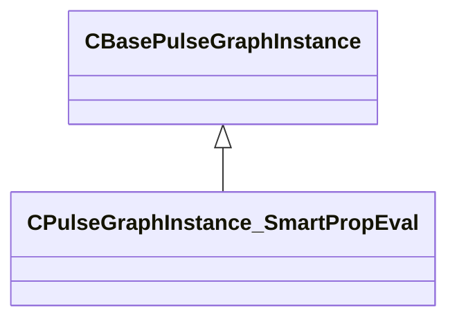
```mermaid
classDiagram
    CBasePulseGraphInstance <|-- CPulseGraphInstance_SmartPropEval
```

### CSmartPropAPI

### CSmartPropAttributeApplyColorMode

**Metadata:** `MPropertyCustomEditor SmartPropAttributeEditor(enum:ApplyColorMode_t)`

### CSmartPropAttributeChoiceSelectionMode

**Metadata:** `MPropertyCustomEditor SmartPropAttributeEditor(enum:SmartPropChoiceSelectionMode_t)`

### CSmartPropAttributeColorSelectionMode

**Metadata:** `MPropertyCustomEditor SmartPropAttributeEditor(enum:SmartPropColorSelectionMode_t)`

### CSmartPropAttributeCoordinateSpace

**Metadata:** `MPropertyCustomEditor SmartPropAttributeEditor(enum:SmartPropSpace_t)`

### CSmartPropAttributeDirection

**Metadata:** `MPropertyCustomEditor SmartPropAttributeEditor(enum:SmartPropDirection_t)`

### CSmartPropAttributeDistributionMode

**Metadata:** `MPropertyCustomEditor SmartPropAttributeEditor(enum:SmartPropDistributionMode_t)`

### CSmartPropAttributeGridOriginMode

**Metadata:** `MPropertyCustomEditor SmartPropAttributeEditor(enum:SmartPropGridOriginBasis_t)`

### CSmartPropAttributeGridPlacementMode

**Metadata:** `MPropertyCustomEditor SmartPropAttributeEditor(enum:SmartPropGridPlacementMode_t)`

### CSmartPropAttributeOrientationMode

**Metadata:** `MPropertyCustomEditor SmartPropAttributeEditor(enum:SmartPropPlaceMeshOrientationMode_t)`

### CSmartPropAttributePathPositions

**Metadata:** `MPropertyCustomEditor SmartPropAttributeEditor(enum:SmartPropPathPositions_t)`

### CSmartPropAttributePickMode

**Metadata:** `MPropertyCustomEditor SmartPropAttributeEditor(enum:PickMode_t)`

### CSmartPropAttributeRadiusPlacementMode

**Metadata:** `MPropertyCustomEditor SmartPropAttributeEditor(enum:SmartPropRadiusPlacementMode_t)`

### CSmartPropAttributeScaleMode

**Metadata:** `MPropertyCustomEditor SmartPropAttributeEditor(enum:ScaleMode_t)`

### CSmartPropAttributeTraceNoHit

**Metadata:** `MPropertyCustomEditor SmartPropAttributeEditor(enum:TraceNoHitResult_t)`

### CSmartPropChoice

**Inherits from:** [CSmartPropParameter](smartprops.md#csmartpropparameter)

**Metadata:** `MGetKV3ClassDefaults`, `MPropertyFriendlyName Choice`, `MVDataAnonymousNode`, `MVDataOutlinerNameExpr`

**Relationships:**

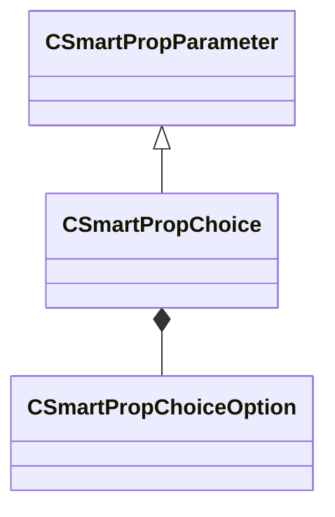
```mermaid
classDiagram
    CSmartPropParameter <|-- CSmartPropChoice
    CSmartPropChoice *-- CSmartPropChoiceOption
```

**Fields:**

| Name | Type | Annotations |
|------|------|-------------|
| `m_Name` | CUtlString | `MPropertyFriendlyName Choice Name` |
| `m_DefaultOption` | CUtlString | `MPropertyAttributeChoiceName smartprop_choice_options` |
| `m_Options` | CUtlVector< [CSmartPropChoiceOption](../schemas/smartprops.md#csmartpropchoiceoption) > | `MPropertyAutoExpandSelf` |

### CSmartPropChoiceOption

**Metadata:** `MGetKV3ClassDefaults`

**Fields:**

| Name | Type | Annotations |
|------|------|-------------|
| `m_Name` | CUtlString | `MPropertyFriendlyName Option Value Name` |
| `m_DisplayName` | CUtlString | `MPropertyFriendlyName Option Display Name` |
| `m_VariableValues` | CUtlVector< CSmartPropAttributeVariableValue > | `MPropertyAttributeEditor SmartPropAttributeEditor(VariableValue)` `MPropertyAutoExpandSelf` |

### CSmartPropElement

**Derived by:** [CSmartPropElement_Group](smartprops.md#csmartpropelement_group), [CSmartPropElement_Model](smartprops.md#csmartpropelement_model), [CSmartPropElement_ModelEntity](smartprops.md#csmartpropelement_modelentity), [CSmartPropElement_ModifyState](smartprops.md#csmartpropelement_modifystate), [CSmartPropElement_SmartProp](smartprops.md#csmartpropelement_smartprop)

**Metadata:** `MGetKV3ClassDefaults`, `MPropertyFriendlyName Smart Prop Element`, `MVDataAnonymousNode`, `MVDataBase`, `MVDataNodeType 1`, `MVDataOutlinerLabelExpr`

**Relationships:**

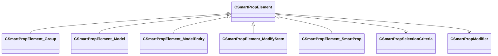
```mermaid
classDiagram
    CSmartPropElement <|-- CSmartPropElement_Group
    CSmartPropElement <|-- CSmartPropElement_Model
    CSmartPropElement <|-- CSmartPropElement_ModelEntity
    CSmartPropElement <|-- CSmartPropElement_ModifyState
    CSmartPropElement <|-- CSmartPropElement_SmartProp
    CSmartPropElement --> CSmartPropSelectionCriteria
    CSmartPropElement --> CSmartPropModifier
```

**Fields:**

| Name | Type | Annotations |
|------|------|-------------|
| `m_nElementID` | int32 | `MPropertySuppressField` `MVDataUniqueMonotonicInt` |
| `m_bEnabled` | CSmartPropAttributeBool | `MPropertyDescription Is this element enabled? If not enabled, this element will not be evaluted and will have no effect on the result.` `MPropertySortPriority` `MVDataEnableKey` |
| `m_sLabel` | CUtlString | `MPropertyDescription Optional text that will appear in the outliner to help organize Smart Prop elements and communicate their purpose to other users.` `MPropertyFriendlyName Label` |
| `m_SelectionCriteria` | CUtlVector< [CSmartPropSelectionCriteria](../schemas/smartprops.md#csmartpropselectioncriteria)* > | `MPropertyFriendlyName Selection Criteria` `MVDataPromoteField` |
| `m_Modifiers` | CUtlVector< [CSmartPropModifier](../schemas/smartprops.md#csmartpropmodifier)* > | `MPropertyFriendlyName Modifiers` `MVDataPromoteField` |

### CSmartPropElement_BendDeformer

**Inherits from:** [CSmartPropElement_Deformer](smartprops.md#csmartpropelement_deformer)

**Metadata:** `MGetKV3ClassDefaults`, `MPropertyDescription Creates a bend deformer that is applied to child elements. The deformation bends the local space x-axis around the local space z-axis. The Angles property can be used to rotate the local axis to change the direction of deformation.`, `MPropertyFriendlyName Bend Deformer`

**Relationships:**

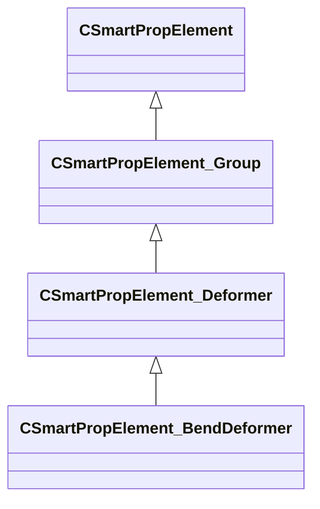
```mermaid
classDiagram
    CSmartPropElement_Deformer <|-- CSmartPropElement_BendDeformer
    CSmartPropElement_Group <|-- CSmartPropElement_Deformer
    CSmartPropElement <|-- CSmartPropElement_Group
```

**Fields:**

| Name | Type | Annotations |
|------|------|-------------|
| `m_bDeformationEnabled` | CSmartPropAttributeBool | `MPropertyDescription Should the deformation be applied. If disabled the children will still be placed, but will not be deformed. Esentially making the element behave as a group.` `MPropertyFriendlyName Deformation Enabled` |
| `m_vOrigin` | CSmartPropAttributeVector | `MPropertyDescription A local offset to apply to the base volume of the deformer that will not apply to its children.` `MPropertyFriendlyName Origin` |
| `m_vAngles` | CSmartPropAttributeAngles | `MPropertyDescription A local rotation to apply to apply the base volume of the deformer that will not apply to its children. This can be used to alter the direction of the deformation.` `MPropertyFriendlyName Angles` |
| `m_vSize` | CSmartPropAttributeVector | `MPropertyDescription Size of the base volume to be deformed.` `MPropertyFriendlyName Dimensions` |
| `m_flBendAngle` | CSmartPropAttributeFloat | `MPropertyDescription Bend amount to apply, specified in degrees. Bend occurs along the local x-axis and bends around the local z-axis` `MPropertyFriendlyName Bend Angle` |
| `m_flBendPoint` | CSmartPropAttributeFloat | `MPropertyDescription [ 0, 1 ] Value specifying the location along the local x-axis the bend will occur around` `MPropertyFriendlyName Bend Point` |
| `m_flBendRadius` | CSmartPropAttributeFloat | `MPropertyDescription Radius of the bend. If 0 the radius will be computed automatically to preserve the length of the inner edge of the x-axis. If a non-zero value is specified then the inner edge will maintain this radius, but its length will change.` `MPropertyFriendlyName Bend Radius` |

### CSmartPropElement_Deformer

**Inherits from:** [CSmartPropElement_Group](smartprops.md#csmartpropelement_group)

**Derived by:** [CSmartPropElement_BendDeformer](smartprops.md#csmartpropelement_benddeformer), [CSmartPropElement_MidpointDeformer](smartprops.md#csmartpropelement_midpointdeformer), [CSmartPropElement_PlaceOnMesh](smartprops.md#csmartpropelement_placeonmesh)

**Relationships:**

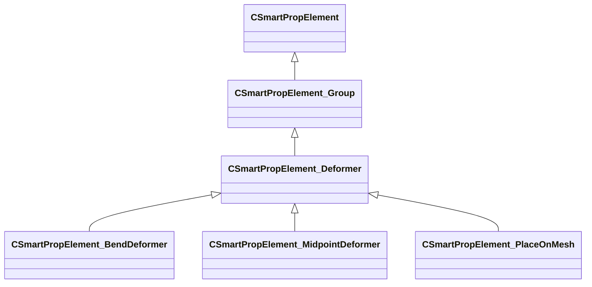
```mermaid
classDiagram
    CSmartPropElement_Group <|-- CSmartPropElement_Deformer
    CSmartPropElement <|-- CSmartPropElement_Group
    CSmartPropElement_Deformer <|-- CSmartPropElement_BendDeformer
    CSmartPropElement_Deformer <|-- CSmartPropElement_MidpointDeformer
    CSmartPropElement_Deformer <|-- CSmartPropElement_PlaceOnMesh
```

### CSmartPropElement_FitOnLine

**Inherits from:** [CSmartPropElement_Group](smartprops.md#csmartpropelement_group)

**Metadata:** `MGetKV3ClassDefaults`, `MPropertyDescription An element which fits one or more instances of a set of choices on to a line.`, `MPropertyFriendlyName Fit on Line`

**Relationships:**

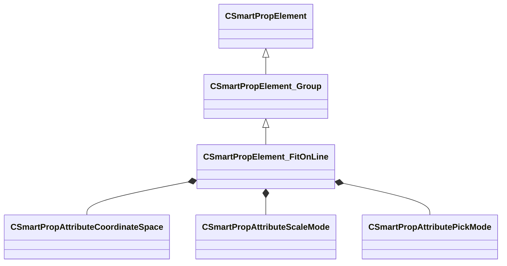
```mermaid
classDiagram
    CSmartPropElement_Group <|-- CSmartPropElement_FitOnLine
    CSmartPropElement <|-- CSmartPropElement_Group
    CSmartPropElement_FitOnLine *-- CSmartPropAttributeCoordinateSpace
    CSmartPropElement_FitOnLine *-- CSmartPropAttributeScaleMode
    CSmartPropElement_FitOnLine *-- CSmartPropAttributePickMode
```

**Fields:**

| Name | Type | Annotations |
|------|------|-------------|
| `m_vStart` | CSmartPropAttributeVector | `MPropertyDescription Specifies the start point of the line in the specified coordinate space.` `MPropertyStartGroup +End Points` |
| `m_vEnd` | CSmartPropAttributeVector | `MPropertyDescription Specifies the end point of the line in the specified coordinate space.` |
| `m_PointSpace` | [CSmartPropAttributeCoordinateSpace](../schemas/smartprops.md#csmartpropattributecoordinatespace) | `MPropertyDescription Specifies the coordinate space in which the end point values are specified.` `MPropertyFriendlyName End point space` |
| `m_bOrientAlongLine` | CSmartPropAttributeBool | `MPropertyDescription Should the child elements be oriented based on the line. If enabled the child elements placed on the line will be oriented such that their +x axis points along the line towards the end point.` `MPropertyStartGroup +Orientation` |
| `m_vUpDirection` | CSmartPropAttributeVector | `MPropertyDescription Up vector which is used to determine the rotation of each element around the line.` |
| `m_UpDirectionSpace` | [CSmartPropAttributeCoordinateSpace](../schemas/smartprops.md#csmartpropattributecoordinatespace) | `MPropertyDescription Space in which the up direction is defined.` |
| `m_bPrioritizeUp` | CSmartPropAttributeBool | `MPropertyDescription When the up direction is not orthogonal to the line direction normally the up vector will be adjusted to make it orthogonal to the line direction. If prioritize up is true, then the up direction will be maintained and the forward direction will be adjusted.` |
| `m_nScaleMode` | [CSmartPropAttributeScaleMode](../schemas/smartprops.md#csmartpropattributescalemode) | `MPropertyDescription Specifies how scale is applied to each of the selected element in order to fit them to the line.` `MPropertyFriendlyName Scale Mode` `MPropertyStartGroup` |
| `m_nPickMode` | [CSmartPropAttributePickMode](../schemas/smartprops.md#csmartpropattributepickmode) | `MPropertyDescription Specifies how scale is applied to each of the selected element in order to fit them to the line.` `MPropertyFriendlyName Child Selection Mode` |

### CSmartPropElement_Group

**Inherits from:** [CSmartPropElement](smartprops.md#csmartpropelement)

**Derived by:** [CSmartPropElement_Deformer](smartprops.md#csmartpropelement_deformer), [CSmartPropElement_FitOnLine](smartprops.md#csmartpropelement_fitonline), [CSmartPropElement_Layout2DGrid](smartprops.md#csmartpropelement_layout2dgrid), [CSmartPropElement_PickOne](smartprops.md#csmartpropelement_pickone), [CSmartPropElement_PlaceInSphere](smartprops.md#csmartpropelement_placeinsphere), [CSmartPropElement_PlaceMultiple](smartprops.md#csmartpropelement_placemultiple), [CSmartPropElement_PlaceOnPath](smartprops.md#csmartpropelement_placeonpath)

**Metadata:** `MGetKV3ClassDefaults`, `MPropertyDescription A group of elements that will all be evaulated.`, `MPropertyFriendlyName Group`

**Relationships:**

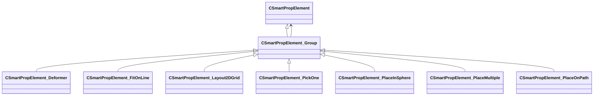
```mermaid
classDiagram
    CSmartPropElement <|-- CSmartPropElement_Group
    CSmartPropElement_Group <|-- CSmartPropElement_Deformer
    CSmartPropElement_Group <|-- CSmartPropElement_FitOnLine
    CSmartPropElement_Group <|-- CSmartPropElement_Layout2DGrid
    CSmartPropElement_Group <|-- CSmartPropElement_PickOne
    CSmartPropElement_Group <|-- CSmartPropElement_PlaceInSphere
    CSmartPropElement_Group <|-- CSmartPropElement_PlaceMultiple
    CSmartPropElement_Group <|-- CSmartPropElement_PlaceOnPath
    CSmartPropElement_Group --> CSmartPropElement
```

**Fields:**

| Name | Type | Annotations |
|------|------|-------------|
| `m_Children` | CUtlVector< [CSmartPropElement](../schemas/smartprops.md#csmartpropelement)* > | `MPropertyDescription List of child elements which will appear if this element appears` `MPropertyFriendlyName Children` `MVDataPromoteField` |

### CSmartPropElement_Layout2DGrid

**Inherits from:** [CSmartPropElement_Group](smartprops.md#csmartpropelement_group)

**Metadata:** `MGetKV3ClassDefaults`, `MPropertyDescription Generates set of child instances arranged in a regular grid layout.`, `MPropertyFriendlyName Layout Grid`

**Relationships:**

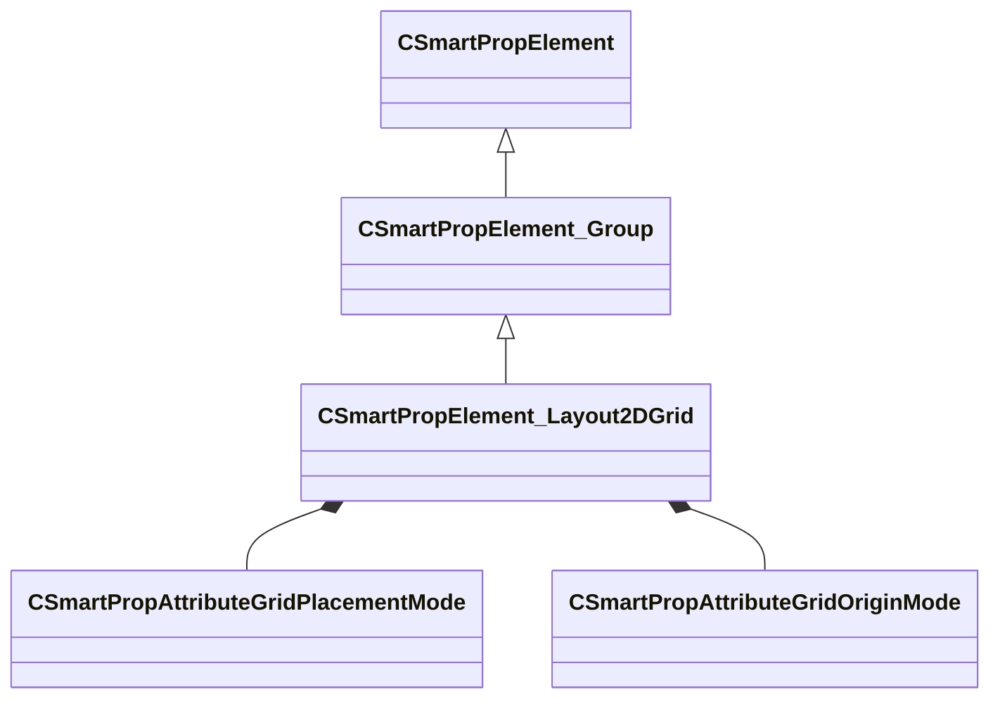
```mermaid
classDiagram
    CSmartPropElement_Group <|-- CSmartPropElement_Layout2DGrid
    CSmartPropElement <|-- CSmartPropElement_Group
    CSmartPropElement_Layout2DGrid *-- CSmartPropAttributeGridPlacementMode
    CSmartPropElement_Layout2DGrid *-- CSmartPropAttributeGridOriginMode
```

**Fields:**

| Name | Type | Annotations |
|------|------|-------------|
| `m_flWidth` | CSmartPropAttributeFloat | `MPropertyAttributeRange biased 0 4096` `MPropertyDescription Overall grid dimension along X axis.` |
| `m_flLength` | CSmartPropAttributeFloat | `MPropertyAttributeRange biased 0 4096` `MPropertyDescription Overall grid dimension along Y axis.` |
| `m_bVerticalLength` | CSmartPropAttributeBool | `MPropertyDescription Layout length vertically (Along Z axis instead of Y).` |
| `m_GridArrangement` | [CSmartPropAttributeGridPlacementMode](../schemas/smartprops.md#csmartpropattributegridplacementmode) | `MPropertyDescription ARRAY: Grid is a specific number of grid divisions. FILL: The boundary is filled with as many as will fit at the specified cell spacing.` |
| `m_GridOriginMode` | [CSmartPropAttributeGridOriginMode](../schemas/smartprops.md#csmartpropattributegridoriginmode) | `MPropertyDescription Specifies the overall grid origin location. Corner origin grids default to quadrant I, but may be expressed in others using negative values for Width and/or Length.` |
| `m_nCountW` | CSmartPropAttributeInt | `MPropertyAttributeRange 1 64` `MPropertyDescription Grid segments along width axis.` `MPropertySuppressExpr` |
| `m_nCountL` | CSmartPropAttributeInt | `MPropertyAttributeRange 1 64` `MPropertyDescription Grid segments along Length axis.` `MPropertySuppressExpr` |
| `m_flSpacingWidth` | CSmartPropAttributeFloat | `MPropertyAttributeRange biased 0 1024` `MPropertyDescription Minimum Width of filled grid cells.` `MPropertySuppressExpr` |
| `m_flSpacingLength` | CSmartPropAttributeFloat | `MPropertyAttributeRange biased 0 1024` `MPropertyDescription Minimum Length of filled grid cells.` `MPropertySuppressExpr` |
| `m_bAlternateShift` | CSmartPropAttributeBool | `MPropertyDescription Shifts every other cell row and/or column.` `MPropertySuppressExpr` |
| `m_flAlternateShiftWidth` | CSmartPropAttributeFloat | `MPropertyAttributeRange biased 0 1024` `MPropertyDescription Vary cell shift in X.` `MPropertySuppressExpr` |
| `m_flAlternateShiftLength` | CSmartPropAttributeFloat | `MPropertyAttributeRange biased 0 1024` `MPropertyDescription Vary cell shift in Y.` `MPropertySuppressExpr` |

### CSmartPropElement_MidpointDeformer

**Inherits from:** [CSmartPropElement_Deformer](smartprops.md#csmartpropelement_deformer)

**Metadata:** `MGetKV3ClassDefaults`, `MPropertyDescription Soft deform the center of a volume defined by two endpoints.`, `MPropertyFriendlyName Midpoint Deformer`

**Relationships:**

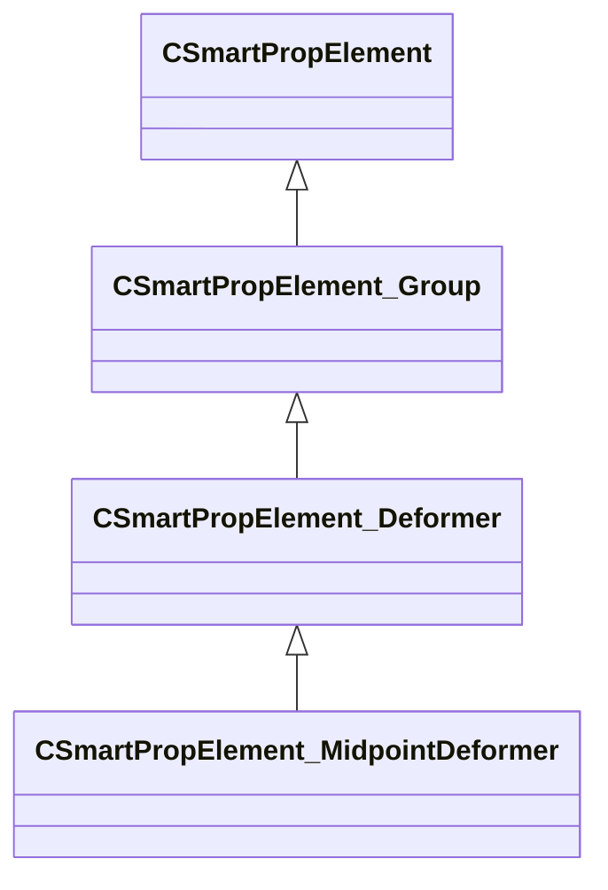
```mermaid
classDiagram
    CSmartPropElement_Deformer <|-- CSmartPropElement_MidpointDeformer
    CSmartPropElement_Group <|-- CSmartPropElement_Deformer
    CSmartPropElement <|-- CSmartPropElement_Group
```

**Fields:**

| Name | Type | Annotations |
|------|------|-------------|
| `m_bDeformationEnabled` | CSmartPropAttributeBool | `MPropertyDescription Should the deformation be applied. If disabled the children will still be placed, but will not be deformed. Esentially making the element behave as a group.` `MPropertyFriendlyName Deformation Enabled` |
| `m_vStart` | CSmartPropAttributeVector | `MPropertyDescription Endpoint of deformation region.` `MPropertyFriendlyName Start Point` |
| `m_vEnd` | CSmartPropAttributeVector | `MPropertyDescription Endpoint of deformation region.` `MPropertyFriendlyName End Point` |
| `m_fRadius` | CSmartPropAttributeFloat | `MPropertyDescription The distance from the line formed by the endpoints that encapsulated the deformation region.` `MPropertyFriendlyName Effect Size` |
| `m_bContinuousSpline` | CSmartPropAttributeBool | `MPropertyDescription Enables an alternate interpolation method that doesnt deform endpoint tangents.` `MPropertyFriendlyName Continuous Interpolation` |
| `m_vOffset` | CSmartPropAttributeVector | `MPropertyDescription Offsets the center of the deformation region.` `MPropertyFriendlyName Midpoint Offset` |
| `m_vAngles` | CSmartPropAttributeAngles | `MPropertyDescription Rotate the center of the deformation region.` `MPropertyFriendlyName Midpoint Rotation` |
| `m_vScale` | CSmartPropAttributeVector2D | `MPropertyDescription Scale the center of the deformation region.` `MPropertyFriendlyName Midpoint Scale` |
| `m_fFalloff` | CSmartPropAttributeFloat | `MPropertyDescription Adjust deformation falloff from the center of the region to the endpoints.` `MPropertyFriendlyName Falloff` |
| `m_OutputVariable` | CUtlString | `MPropertyAttributeEditor SmartPropItemNameEditor( Variable:Vector )` `MPropertyDescription Outputs the absolute position of the midpoint post deformation.` |

### CSmartPropElement_Model

**Inherits from:** [CSmartPropElement](smartprops.md#csmartpropelement)

**Metadata:** `MGetKV3ClassDefaults`, `MPropertyDescription Places a model as the child of an element.`, `MPropertyFriendlyName Model`, `MVDataOutlinerAssetNameExpr`

**Relationships:**

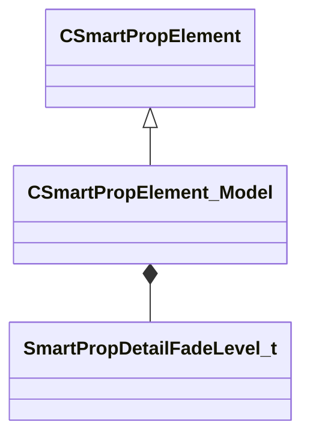
```mermaid
classDiagram
    CSmartPropElement <|-- CSmartPropElement_Model
    CSmartPropElement_Model *-- SmartPropDetailFadeLevel_t
```

**Fields:**

| Name | Type | Annotations |
|------|------|-------------|
| `m_sModelName` | CSmartPropAttributeModelName | `MPropertyDescription Name of the model resource (.vmdl) to place.` `MPropertyProvidesEditContextString` |
| `m_MaterialGroupName` | CSmartPropAttributeMaterialGroup | `MPropertyDescription Specifies the name of the material group (skin) to use when displaying the specified model.` `MPropertyFriendlyName Material Group` |
| `m_bDetailObject` | CSmartPropAttributeBool | `MPropertyDescription If enabled the model will be rendered as a detail object, which is faster for placing many small objects and has fade out functionality, but may have different lighting characteristics. Detail object models support only uniform scale and will use the largest component of the scale value.` |
| `m_vModelScale` | CSmartPropAttributeVector | `MPropertyDescription Scale factor (may be non-uniform) to be applied directly to the model (in the model's local space).` `MPropertySuppressExpr` |
| `m_flUniformModelScale` | CSmartPropAttributeFloat | `MPropertyDescription Uniform scale to be applied to the model, certain properties like detail object mean only uniform scale may be applied to the model.` `MPropertyFriendlyName Model Scale` `MPropertySuppressExpr` |
| `m_nLodLevel` | CSmartPropAttributeInt | `MPropertyAttributeEditor SmartPropAttributeEditor( LODLevel )` `MPropertyDescription Select model LOD level. The default Auto LOD means the lod will be picked based on the size of the model on screen. If a specific level is selected, then that lod level will always be used regardless of the size of the model on screen.` `MPropertySuppressExpr` |
| `m_SurfacePropertyOverride` | CSmartPropAttributeSurfaceProperty | `MPropertyDescription If non-empty, specifies the name of a surface property to use for all physics shapes of the specified model, overriding any surface properties specified within the model.` `MPropertyFriendlyName Override Surface Property` `MPropertySuppressExpr` |
| `m_nDetailObjectFadeLevel` | [SmartPropDetailFadeLevel_t](../schemas/!GlobalTypes.md#smartpropdetailfadelevel_t) | `MPropertyDescription Controls the size at which a model marked as a detail object will fade out.` `MPropertyFriendlyName Fade Level` `MPropertySuppressExpr` |
| `m_bCastShadows` | CSmartPropAttributeBool | `MPropertyDescription Should the model cast shadows.` `MPropertyFriendlyName Cast Shadows` |
| `m_bRigidDeformation` | CSmartPropAttributeBool | `MPropertyDescription If enabled, only the transform of the model will be modified by any active deformer, the vertices of the model will not be changed by the deformer.` `MPropertyFriendlyName Rigid Deformation Only` `MPropertySuppressExpr` |
| `m_bDisableDynamicDeformable` | CSmartPropAttributeBool | `MPropertyDescription If checked, this model will not deform in game when the smart prop is placed inside a dynamic deformable entity (such as func_deformable_brush).` `MPropertyFriendlyName Disable Dynamic Deformable` `MPropertySuppressExpr` |

### CSmartPropElement_ModelEntity

**Inherits from:** [CSmartPropElement](smartprops.md#csmartpropelement)

**Derived by:** [CSmartPropElement_PropDynamic](smartprops.md#csmartpropelement_propdynamic), [CSmartPropElement_PropPhysics](smartprops.md#csmartpropelement_propphysics)

**Metadata:** `MGetKV3ClassDefaults`, `MVDataOutlinerAssetNameExpr`

**Relationships:**

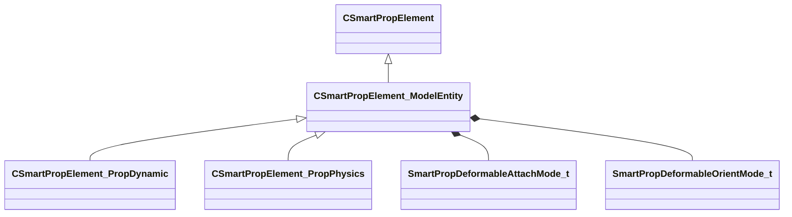
```mermaid
classDiagram
    CSmartPropElement <|-- CSmartPropElement_ModelEntity
    CSmartPropElement_ModelEntity <|-- CSmartPropElement_PropDynamic
    CSmartPropElement_ModelEntity <|-- CSmartPropElement_PropPhysics
    CSmartPropElement_ModelEntity *-- SmartPropDeformableAttachMode_t
    CSmartPropElement_ModelEntity *-- SmartPropDeformableOrientMode_t
```

**Fields:**

| Name | Type | Annotations |
|------|------|-------------|
| `m_sModelName` | CSmartPropAttributeModelName | `MPropertyDescription Name of the model resource (.vmdl) to place.` `MPropertyProvidesEditContextString` |
| `m_MaterialGroupName` | CSmartPropAttributeMaterialGroup | `MPropertyDescription Specifies the name of the material group (skin) to use when displaying the specified model.` `MPropertyFriendlyName Material Group` |
| `m_bCastShadows` | CSmartPropAttributeBool | `MPropertyDescription Should the entity created by this element cast shadows.` `MPropertyFriendlyName Cast Shadows` |
| `m_bForceStatic` | CSmartPropAttributeBool | `MPropertyDescription Force this model to be placed as a static model rather then generating an entity.` `MPropertyFriendlyName Force Static` |
| `m_nDeformableAttachmentMode` | [SmartPropDeformableAttachMode_t](../schemas/!GlobalTypes.md#smartpropdeformableattachmode_t) | `MPropertyDescription If the smart prop is child of a deformable entity, this setting specifies how the entity generated by this element will be attached to the deformable surface.` `MPropertyFriendlyName Attachment Mode` `MPropertyGroupName Deformable Entity Settings` `MPropertySortPriority` `MPropertySuppressExpr` |
| `m_nDeformableOrientationMode` | [SmartPropDeformableOrientMode_t](../schemas/!GlobalTypes.md#smartpropdeformableorientmode_t) | `MPropertyDescription If the smart prop is child of a deformable entity, this setting specifies how the entity generated by this element will be oriented relative to the deformable surface.` `MPropertyGroupName Deformable Entity Settings` `MPropertySortPriority` `MPropertySuppressExpr` |

### CSmartPropElement_ModifyState

**Inherits from:** [CSmartPropElement](smartprops.md#csmartpropelement)

**Metadata:** `MGetKV3ClassDefaults`, `MPropertyDescription An element which is used to apply a set of modifiers to the state of its parent.`, `MPropertyFriendlyName Apply Modifiers`, `MPropertySuppressBaseClassField`

**Relationships:**

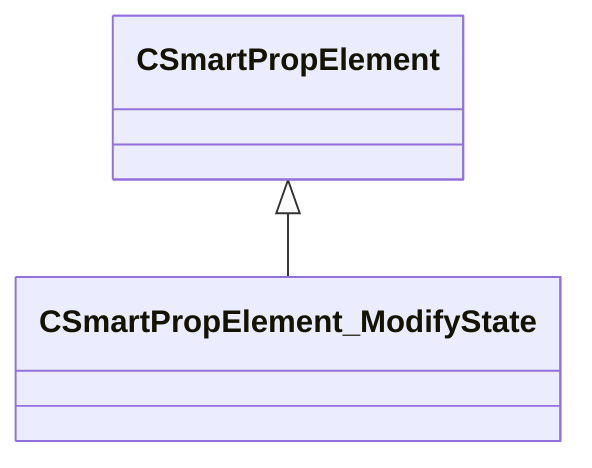
```mermaid
classDiagram
    CSmartPropElement <|-- CSmartPropElement_ModifyState
```

### CSmartPropElement_PickOne

**Inherits from:** [CSmartPropElement_Group](smartprops.md#csmartpropelement_group)

**Metadata:** `MGetKV3ClassDefaults`, `MPropertyDescription An element which selects a single choice from its set of child choices.`, `MPropertyFriendlyName Select Single Child`

**Relationships:**

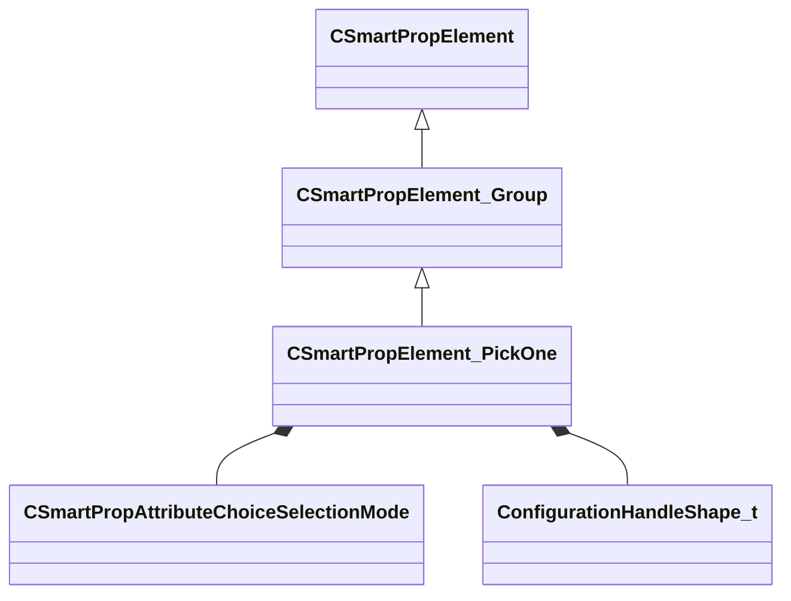
```mermaid
classDiagram
    CSmartPropElement_Group <|-- CSmartPropElement_PickOne
    CSmartPropElement <|-- CSmartPropElement_Group
    CSmartPropElement_PickOne *-- CSmartPropAttributeChoiceSelectionMode
    CSmartPropElement_PickOne *-- ConfigurationHandleShape_t
```

**Fields:**

| Name | Type | Annotations |
|------|------|-------------|
| `m_SelectionMode` | [CSmartPropAttributeChoiceSelectionMode](../schemas/smartprops.md#csmartpropattributechoiceselectionmode) | `MPropertyDescription Specifies how the initial selection of a choice should be handled.` |
| `m_SpecificChildIndex` | CSmartPropAttributeInt | `MPropertyDescription Specifies the index of the child to pick.` `MPropertyFriendlyName Specific Child` `MPropertySuppressExpr` |
| `m_OutputChoiceVariableName` | CUtlString | `MPropertyAttributeEditor SmartPropItemNameEditor( Variable:Integer )` `MPropertyDescription If a variable name is specified, sets the value of that variable to the index of the selected choice` `MPropertyFriendlyName Choice Output Variable` |
| `m_bConfigurable` | CSmartPropAttributeBool | `MPropertyDescription Should a control to select the specific choice be shown when this prop is placed in Hammer.` |
| `m_vHandleOffset` | CSmartPropAttributeVector | `MPropertyDescription Specifies an offset in the local space of the element to apply to the configuration handle.` `MPropertyGroupName Handle Settings` `MPropertyReadonlyExpr` |
| `m_HandleColor` | CSmartPropAttributeColor | `MPropertyDescription Color to use to display the configuration handle.` `MPropertyGroupName Handle Settings` `MPropertyReadonlyExpr` |
| `m_HandleSize` | CSmartPropAttributeInt | `MPropertyDescription Size of the configuration handle.` `MPropertyGroupName Handle Settings` `MPropertyReadonlyExpr` |
| `m_HandleShape` | [ConfigurationHandleShape_t](../schemas/!GlobalTypes.md#configurationhandleshape_t) | `MPropertyDescription Shape of the configuration handle to display.` `MPropertyGroupName Handle Settings` `MPropertyReadonlyExpr` |

### CSmartPropElement_PlaceInSphere

**Inherits from:** [CSmartPropElement_Group](smartprops.md#csmartpropelement_group)

**Metadata:** `MGetKV3ClassDefaults`, `MPropertyDescription An element which places multiple instances of its child elements within a radius.`, `MPropertyFriendlyName Place In Radius`

**Relationships:**

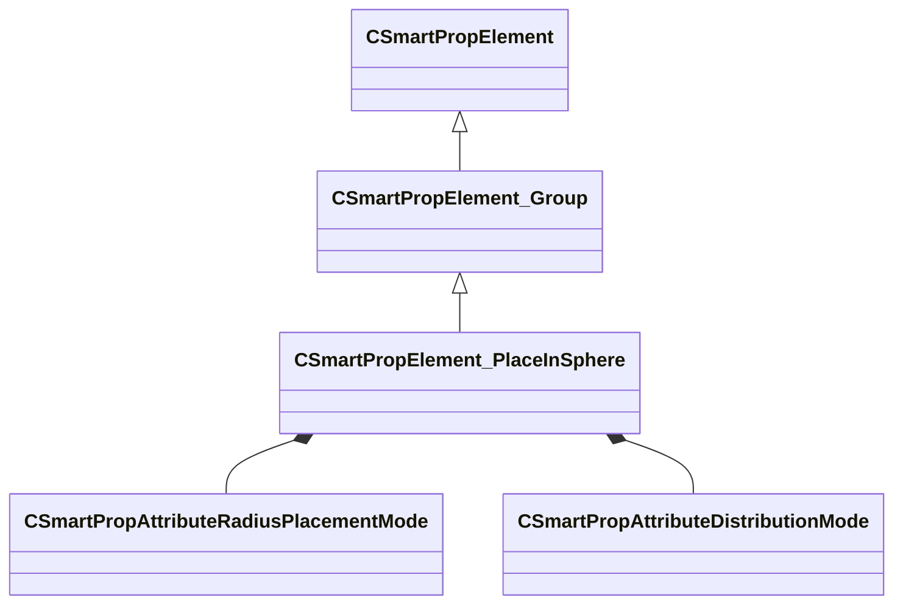
```mermaid
classDiagram
    CSmartPropElement_Group <|-- CSmartPropElement_PlaceInSphere
    CSmartPropElement <|-- CSmartPropElement_Group
    CSmartPropElement_PlaceInSphere *-- CSmartPropAttributeRadiusPlacementMode
    CSmartPropElement_PlaceInSphere *-- CSmartPropAttributeDistributionMode
```

**Fields:**

| Name | Type | Annotations |
|------|------|-------------|
| `m_PlacementMode` | [CSmartPropAttributeRadiusPlacementMode](../schemas/smartprops.md#csmartpropattributeradiusplacementmode) | `MPropertyDescription Specifies how the positions are computed based on the radius.` |
| `m_DistributionMode` | [CSmartPropAttributeDistributionMode](../schemas/smartprops.md#csmartpropattributedistributionmode) | `MPropertyDescription Specifies the method to be used to distribute.` |
| `m_flRandomness` | CSmartPropAttributeFloat | `MPropertyDescription 0 to 1 value indicating the amout of random offset that should be applied to the reguluarly spaced positions` `MPropertySuppressExpr` |
| `m_vPlaneUpDirection` | CSmartPropAttributeVector | `MPropertyDescription Vector up direction of the plane of the circle. This in the local space of the current element.` `MPropertySuppressExpr` |
| `m_nCountMin` | CSmartPropAttributeInt | `MPropertyDescription Minimum number of instances of this object and its children to be placed.` |
| `m_nCountMax` | CSmartPropAttributeInt | `MPropertyDescription Maximum number of instances of this object and its children to be placed.` |
| `m_flPositionRadiusInner` | CSmartPropAttributeFloat | `MPropertyDescription Inner radius from the placement position where the model can appear.` |
| `m_flPositionRadiusOuter` | CSmartPropAttributeFloat | `MPropertyDescription Outer radius from the placement position where the model can appear.` |
| `m_bAlignOrientation` | CSmartPropAttributeBool | `MPropertyDescription Align the initial orientation of each placed object based on it position on the sphere or circle.` |
| `m_vAlignDirection` | CSmartPropAttributeVector | `MPropertyDescription Vector in the local space of the child element to be aligned with sphere or circle` `MPropertyReadonlyExpr` |

### CSmartPropElement_PlaceMultiple

**Inherits from:** [CSmartPropElement_Group](smartprops.md#csmartpropelement_group)

**Metadata:** `MGetKV3ClassDefaults`, `MPropertyDescription An element which places multiple instances of its child elements.`, `MPropertyFriendlyName Place Multiple`

**Relationships:**

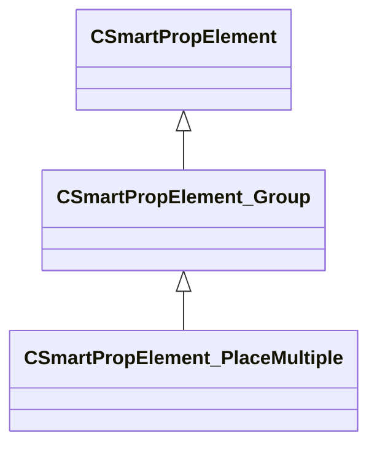
```mermaid
classDiagram
    CSmartPropElement_Group <|-- CSmartPropElement_PlaceMultiple
    CSmartPropElement <|-- CSmartPropElement_Group
```

**Fields:**

| Name | Type | Annotations |
|------|------|-------------|
| `m_nCount` | CSmartPropAttributeInt | `MPropertyDescription Number of instances of this object and its children to be placed.` |
| `m_Expression` | CUtlString | `MPropertyAttributeEditor SmartPropAttributeEditor(expression)` `MPropertyDescription Stop placing copies of the children when this expression evaluates to true.` `MPropertyFriendlyName Stop When` |

### CSmartPropElement_PlaceOnMesh

**Inherits from:** [CSmartPropElement_Deformer](smartprops.md#csmartpropelement_deformer)

**Metadata:** `MGetKV3ClassDefaults`, `MPropertyDescription Place Children on Mesh Components.`, `MPropertyFriendlyName Place on Mesh`, `MVDataExperimentalNodeSet`

**Relationships:**

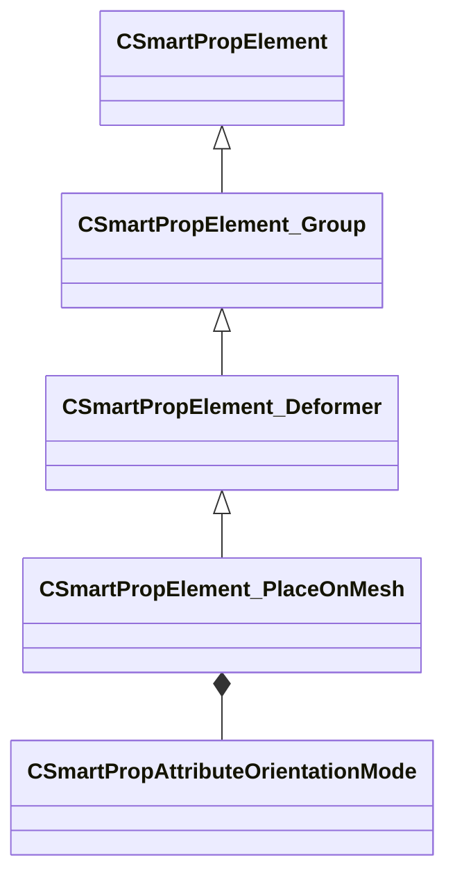
```mermaid
classDiagram
    CSmartPropElement_Deformer <|-- CSmartPropElement_PlaceOnMesh
    CSmartPropElement_Group <|-- CSmartPropElement_Deformer
    CSmartPropElement <|-- CSmartPropElement_Group
    CSmartPropElement_PlaceOnMesh *-- CSmartPropAttributeOrientationMode
```

**Fields:**

| Name | Type | Annotations |
|------|------|-------------|
| `m_nPickMode` | [CSmartPropAttributeOrientationMode](../schemas/smartprops.md#csmartpropattributeorientationmode) | `MPropertyDescription Determine how child elements are oriented when mapped to face.` `MPropertyFriendlyName Orientation Mode` `MPropertyStartGroup` |
| `m_MeshName` | CUtlString | `MPropertyDescription` |

### CSmartPropElement_PlaceOnPath

**Inherits from:** [CSmartPropElement_Group](smartprops.md#csmartpropelement_group)

**Metadata:** `MGetKV3ClassDefaults`, `MPropertyDescription An element which places an instance of its child elements at a specified interval along a path.`, `MPropertyFriendlyName Place on Path`

**Relationships:**

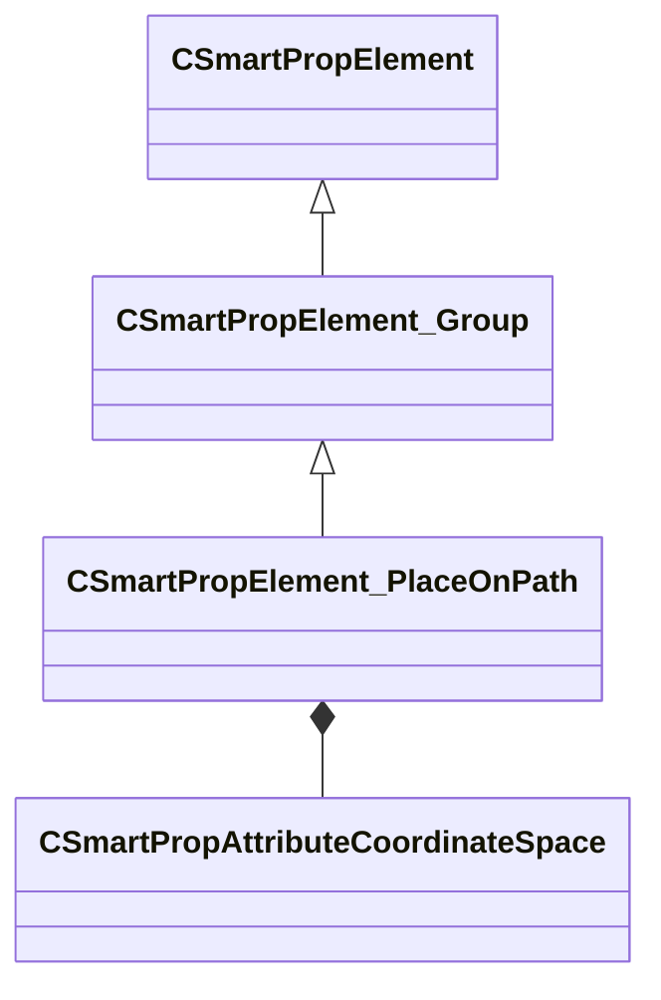
```mermaid
classDiagram
    CSmartPropElement_Group <|-- CSmartPropElement_PlaceOnPath
    CSmartPropElement <|-- CSmartPropElement_Group
    CSmartPropElement_PlaceOnPath *-- CSmartPropAttributeCoordinateSpace
```

**Fields:**

| Name | Type | Annotations |
|------|------|-------------|
| `m_PathName` | CUtlString | `MPropertyDescription Name of the path to use. This path name will show up in the property editor when selecting a placement of this smart prop in Hammer, allowing selection of a path object in the map to use.` |
| `m_flSpacing` | CSmartPropAttributeFloat | `MPropertyDescription Spacing between points on the path` |
| `m_flOffsetAlongPath` | CSmartPropAttributeFloat | `MPropertyDescription Offset from the start of the path to place the first point.` |
| `m_vPathOffset` | CSmartPropAttributeVector2D | `MPropertyDescription Offset to apply to the path, specifies a horizontal and vertical offset to apply relative to the up direction.` `MPropertyFriendlyName Offset from path` |
| `m_PathSpace` | [CSmartPropAttributeCoordinateSpace](../schemas/smartprops.md#csmartpropattributecoordinatespace) | `MPropertyDescription Specifies the space in which the provided input path is to be evalauted.  <b>World Space</b>: The input path will be evaluated in world space, such that child elements will be placed directly on the target path regardless of the transform of the smart prop object.  <b>Object Space</b>: The world space transform of the input path will be ignored and instead the path will be evaluated relative to the transform of the smart prop object.  <b>Element Space</b>: The world space transform of the input path will be ignored and instead the path will be evaluated relative to the transform of the current element within the smart prop. ` `MPropertyFriendlyName Path Evaluation Space` |
| `m_bUseFixedUpDirection` | CSmartPropAttributeBool | `MPropertyDescription If true, treat the specified up direction as fixed up direction to apply to all elements placed on the path. If false the up direction is just an initial direction.` |
| `m_bUseProjectedDistance` | CSmartPropAttributeBool | `MPropertyDescription Compute the spacing distance in the 2d plane defined by the up direction. Most useful when using a fixed up direction, if maintaining a distance in the 2d plane is more important than maintaing distance along the path.` |
| `m_vUpDirection` | CSmartPropAttributeVector | `MPropertyDescription If not using a fixed up direction, provides an initial up direction which will be used to determine the orientation of first element on the path, after that the elements will incrementally update to follow the path and may not match this direction. If Use Fixed Up direction is specified, then all elements will use this direction to deterime their up direction.` |
| `m_UpDirectionSpace` | [CSmartPropAttributeCoordinateSpace](../schemas/smartprops.md#csmartpropattributecoordinatespace) | `MPropertyDescription Space in which the up direction is defined.` |
| `m_DefaultPathInWorldSpace` | CSmartPropAttributeBool | `MPropertyDescription If enabled, the default path values will be treated as world space values, if disabled they are treated as object space values. Typically it makes sense for literal values to be treated as being in object space, but if the values are being supplied by locators they will typically be in world space.` `MPropertyFriendlyName Default Path In World Space` |
| `m_DefaultPath` | CUtlVector< CSmartPropAttributeVector > | `MPropertyDescription A set of points defining a path to use when an external path isn't specified. This will be used in the preview and thumbnail for the smart prop. It will also be used when the smart prop is placed in Hammer before a path is selected.` |

### CSmartPropElement_PropDynamic

**Inherits from:** [CSmartPropElement_ModelEntity](smartprops.md#csmartpropelement_modelentity)

**Metadata:** `MGetKV3ClassDefaults`, `MPropertyDescription Places a prop dynamic entity.`, `MPropertyFriendlyName Prop Dynamic`

**Relationships:**

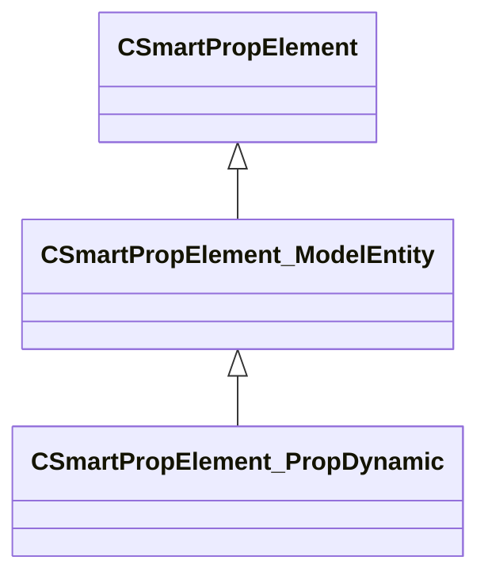
```mermaid
classDiagram
    CSmartPropElement_ModelEntity <|-- CSmartPropElement_PropDynamic
    CSmartPropElement <|-- CSmartPropElement_ModelEntity
```

### CSmartPropElement_PropPhysics

**Inherits from:** [CSmartPropElement_ModelEntity](smartprops.md#csmartpropelement_modelentity)

**Metadata:** `MGetKV3ClassDefaults`, `MPropertyDescription Places a prop physics entity.`, `MPropertyFriendlyName Prop Physics`

**Relationships:**

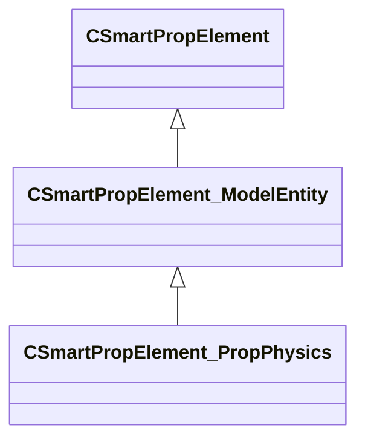
```mermaid
classDiagram
    CSmartPropElement_ModelEntity <|-- CSmartPropElement_PropPhysics
    CSmartPropElement <|-- CSmartPropElement_ModelEntity
```

**Fields:**

| Name | Type | Annotations |
|------|------|-------------|
| `m_bStartAsleep` | CSmartPropAttributeBool | `MPropertyDescription Should this physics prop start in a sleeping (non-simulating) state such that it won't update until it is woken up by an external event.` |

### CSmartPropElement_SmartProp

**Inherits from:** [CSmartPropElement](smartprops.md#csmartpropelement)

**Metadata:** `MGetKV3ClassDefaults`, `MPropertyDescription Evaluates a specified smart prop as a child of the current element.`, `MPropertyFriendlyName Smart Prop Reference`, `MVDataOutlinerAssetNameExpr`

**Relationships:**

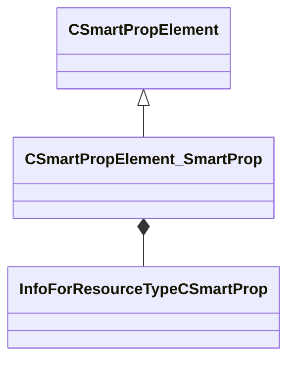
```mermaid
classDiagram
    CSmartPropElement <|-- CSmartPropElement_SmartProp
    CSmartPropElement_SmartProp *-- InfoForResourceTypeCSmartProp
```

**Fields:**

| Name | Type | Annotations |
|------|------|-------------|
| `m_sSmartProp` | CResourceNameTyped< CWeakHandle< [InfoForResourceTypeCSmartProp](../schemas/resourcesystem.md#infoforresourcetypecsmartprop) > > | `MPropertyDescription Name of the target smart prop resource (.vsmart) to evaluate.` |
| `m_bLocalEvaluationState` | bool | `MPropertyDescription If enabled, any changes made to the evaluation state by the target smart prop (as well as modifiers) will only apply locally and will not affect the evaluation state of the parent. Disabling this will allow modifications to the evaluation state by the referenced smart prop to apply the current state of the of the parent. For example if the referenced smart prop applies a transform and you want the transform to affect the elements in the parent after this element, then you should disable local evaluation state.` |

### CSmartPropExprAPI

### CSmartPropFilter

**Inherits from:** [CSmartPropModifier](smartprops.md#csmartpropmodifier)

**Derived by:** [CSmartPropFilter_Expression](smartprops.md#csmartpropfilter_expression), [CSmartPropFilter_MaterialAttributes](smartprops.md#csmartpropfilter_materialattributes), [CSmartPropFilter_Probability](smartprops.md#csmartpropfilter_probability), [CSmartPropFilter_SurfaceAngle](smartprops.md#csmartpropfilter_surfaceangle), [CSmartPropFilter_SurfaceProperties](smartprops.md#csmartpropfilter_surfaceproperties), [CSmartPropFilter_VariableValue](smartprops.md#csmartpropfilter_variablevalue)

**Metadata:** `MGetKV3ClassDefaults`, `MVDataNodeTintColor`

**Relationships:**

```mermaid
classDiagram
    CSmartPropModifier <|-- CSmartPropFilter
    CSmartPropFilter <|-- CSmartPropFilter_Expression
    CSmartPropFilter <|-- CSmartPropFilter_MaterialAttributes
    CSmartPropFilter <|-- CSmartPropFilter_Probability
    CSmartPropFilter <|-- CSmartPropFilter_SurfaceAngle
    CSmartPropFilter <|-- CSmartPropFilter_SurfaceProperties
    CSmartPropFilter <|-- CSmartPropFilter_VariableValue
```

### CSmartPropFilterAPI

### CSmartPropFilter_Expression

**Inherits from:** [CSmartPropFilter](smartprops.md#csmartpropfilter)

**Metadata:** `MGetKV3ClassDefaults`, `MPropertyDescription Evaluates the specified expression, if the result of the expression is false evaluation of the element is stopped.`, `MPropertyFriendlyName Filter: Expression`, `MVDataClassGroup`

**Relationships:**

```mermaid
classDiagram
    CSmartPropFilter <|-- CSmartPropFilter_Expression
    CSmartPropModifier <|-- CSmartPropFilter
```

**Fields:**

| Name | Type | Annotations |
|------|------|-------------|
| `m_Expression` | CUtlString | `MPropertyAttributeEditor SmartPropAttributeEditor(expression)` |

### CSmartPropFilter_MaterialAttributes

**Inherits from:** [CSmartPropFilter](smartprops.md#csmartpropfilter)

**Metadata:** `MGetKV3ClassDefaults`, `MPropertyDescription Allows the parent element to be conditionally evaluated based on attributes assigned to the surface material.`, `MPropertyFriendlyName Filter: Material Attributes`, `MVDataClassGroup`

**Relationships:**

```mermaid
classDiagram
    CSmartPropFilter <|-- CSmartPropFilter_MaterialAttributes
    CSmartPropModifier <|-- CSmartPropFilter
```

**Fields:**

| Name | Type | Annotations |
|------|------|-------------|
| `m_AllowedMaterialAttributes` | CUtlVector< CUtlString > | `MPropertyDescription List of material attributes on which this element is valid. If empty, the element is not restricted to any specific surfaces.` |
| `m_DisallowedMaterialAttributes` | CUtlVector< CUtlString > | `MPropertyDescription List of material attributes on which this element is not valid. If empty, the element is not restricted to any specific surfaces.` |

### CSmartPropFilter_Probability

**Inherits from:** [CSmartPropFilter](smartprops.md#csmartpropfilter)

**Metadata:** `MGetKV3ClassDefaults`, `MPropertyDescription Causes the parent element to only be evaluated with a specified random probability.`, `MPropertyFriendlyName Filter: Probability`, `MVDataClassGroup`

**Relationships:**

```mermaid
classDiagram
    CSmartPropFilter <|-- CSmartPropFilter_Probability
    CSmartPropModifier <|-- CSmartPropFilter
```

**Fields:**

| Name | Type | Annotations |
|------|------|-------------|
| `m_flProbability` | CSmartPropAttributeFloat | `MPropertyDescription 0.0 to 1.0 value indicating the probability of this element being evaluated. Where a value of 0 means the element will never be evaluated and 1.0 means it will always be evaluated` |

### CSmartPropFilter_SurfaceAngle

**Inherits from:** [CSmartPropFilter](smartprops.md#csmartpropfilter)

**Metadata:** `MGetKV3ClassDefaults`, `MPropertyDescription Allows the parent element to be conditionally evaluated base on the current surface angle. The surface angle is set based on the initial placement of the smart prop object, but can also be updated by the Trace to Surface modifier.`, `MPropertyFriendlyName Filter: Surface Angles`, `MVDataClassGroup`

**Relationships:**

```mermaid
classDiagram
    CSmartPropFilter <|-- CSmartPropFilter_SurfaceAngle
    CSmartPropModifier <|-- CSmartPropFilter
```

**Fields:**

| Name | Type | Annotations |
|------|------|-------------|
| `m_flSurfaceSlopeMin` | CSmartPropAttributeFloat | `MPropertyDescription Minimum slope on which the target will be placed. Slope is a [ 0, 180 ] value of the surface normal rotation from up such that 0 is a horizontal surface (floor), 90 is a vertical surface (wall), 180 is horizontal upside down surface (ceiling).` |
| `m_flSurfaceSlopeMax` | CSmartPropAttributeFloat | `MPropertyDescription Maximum slope on which the target will be placed.` |

### CSmartPropFilter_SurfaceProperties

**Inherits from:** [CSmartPropFilter](smartprops.md#csmartpropfilter)

**Metadata:** `MGetKV3ClassDefaults`, `MPropertyDescription Allows the parent element to be conditionally evaluated based on surface properties.`, `MPropertyFriendlyName Filter: Surface Properties`, `MVDataClassGroup`

**Relationships:**

```mermaid
classDiagram
    CSmartPropFilter <|-- CSmartPropFilter_SurfaceProperties
    CSmartPropModifier <|-- CSmartPropFilter
```

**Fields:**

| Name | Type | Annotations |
|------|------|-------------|
| `m_AllowedSurfaceProperties` | CUtlVector< CUtlString > | `MPropertyDescription List of surface properties on which this element is valid. If empty element is not restricted to any specific surfaces.` |
| `m_DisallowedSurfaceProperties` | CUtlVector< CUtlString > | `MPropertyDescription List of surface properties on which this element is not valid. If empty element is not restricted to any specific surfaces.` |

### CSmartPropFilter_VariableValue

**Inherits from:** [CSmartPropFilter](smartprops.md#csmartpropfilter)

**Metadata:** `MGetKV3ClassDefaults`, `MPropertyDescription Compares the current value of a variable to the specified value. If the comparison is false the element evaluation is stopped.`, `MPropertyFriendlyName Filter: Variable Value`, `MVDataClassGroup`

**Relationships:**

```mermaid
classDiagram
    CSmartPropFilter <|-- CSmartPropFilter_VariableValue
    CSmartPropModifier <|-- CSmartPropFilter
```

**Fields:**

| Name | Type | Annotations |
|------|------|-------------|
| `m_VariableComparison` | CSmartPropVariableComparison |  |

### CSmartPropMaterialReplacement

**Metadata:** `MGetKV3ClassDefaults`

**Fields:**

| Name | Type | Annotations |
|------|------|-------------|
| `m_OriginalMaterial` | CSmartPropAttributeMaterialName | `MPropertyAttributeEditor SmartPropAttributeEditor(MaterialInSmartProp)` `MPropertyDescription Original material to replace. This is the material specified in the model, including any material group asignment within the model. Does not consider any existing material overrides specified within the smart prop.` `MPropertyFriendlyName Original Material` |
| `m_ReplacementMaterial` | CSmartPropAttributeMaterialName | `MPropertyDescription New material to replace the original material with.` `MPropertyFriendlyName New Material` |

### CSmartPropModifier

**Derived by:** [CSmartPropFilter](smartprops.md#csmartpropfilter), [CSmartPropOperation](smartprops.md#csmartpropoperation)

**Metadata:** `MGetKV3ClassDefaults`, `MVDataAnonymousNode`, `MVDataBase`, `MVDataNodeType 1`

**Relationships:**

```mermaid
classDiagram
    CSmartPropModifier <|-- CSmartPropFilter
    CSmartPropModifier <|-- CSmartPropOperation
```

**Fields:**

| Name | Type | Annotations |
|------|------|-------------|
| `m_bEnabled` | CSmartPropAttributeBool | `MVDataEnableKey` |

### CSmartPropOperation

**Inherits from:** [CSmartPropModifier](smartprops.md#csmartpropmodifier)

**Derived by:** [CSmartPropOperation_ComputeCrossProduct3D](smartprops.md#csmartpropoperation_computecrossproduct3d), [CSmartPropOperation_ComputeDistance3D](smartprops.md#csmartpropoperation_computedistance3d), [CSmartPropOperation_ComputeDotProduct3D](smartprops.md#csmartpropoperation_computedotproduct3d), [CSmartPropOperation_ComputeNormalizedVector3D](smartprops.md#csmartpropoperation_computenormalizedvector3d), [CSmartPropOperation_ComputeProjectVector3D](smartprops.md#csmartpropoperation_computeprojectvector3d), [CSmartPropOperation_ComputeVectorBetweenPoints3D](smartprops.md#csmartpropoperation_computevectorbetweenpoints3d), [CSmartPropOperation_MaterialOverride](smartprops.md#csmartpropoperation_materialoverride), [CSmartPropOperation_MaterialTint](smartprops.md#csmartpropoperation_materialtint), [CSmartPropOperation_RandomColorTintColor](smartprops.md#csmartpropoperation_randomcolortintcolor), [CSmartPropOperation_RestoreState](smartprops.md#csmartpropoperation_restorestate), [CSmartPropOperation_SaveColor](smartprops.md#csmartpropoperation_savecolor), [CSmartPropOperation_SaveDirection](smartprops.md#csmartpropoperation_savedirection), [CSmartPropOperation_SavePosition](smartprops.md#csmartpropoperation_saveposition), [CSmartPropOperation_SaveScale](smartprops.md#csmartpropoperation_savescale), [CSmartPropOperation_SaveState](smartprops.md#csmartpropoperation_savestate), [CSmartPropOperation_SaveSurfaceNormal](smartprops.md#csmartpropoperation_savesurfacenormal), [CSmartPropOperation_SetMateraialGroupChoice](smartprops.md#csmartpropoperation_setmateraialgroupchoice), [CSmartPropOperation_SetTintColor](smartprops.md#csmartpropoperation_settintcolor), [CSmartPropOperation_SetVariable](smartprops.md#csmartpropoperation_setvariable), [CSmartPropTransformOperation](smartprops.md#csmartproptransformoperation)

**Metadata:** `MGetKV3ClassDefaults`

**Relationships:**

```mermaid
classDiagram
    CSmartPropModifier <|-- CSmartPropOperation
    CSmartPropOperation <|-- CSmartPropOperation_ComputeCrossProduct3D
    CSmartPropOperation <|-- CSmartPropOperation_ComputeDistance3D
    CSmartPropOperation <|-- CSmartPropOperation_ComputeDotProduct3D
    CSmartPropOperation <|-- CSmartPropOperation_ComputeNormalizedVector3D
    CSmartPropOperation <|-- CSmartPropOperation_ComputeProjectVector3D
    CSmartPropOperation <|-- CSmartPropOperation_ComputeVectorBetweenPoints3D
    CSmartPropOperation <|-- CSmartPropOperation_MaterialOverride
    CSmartPropOperation <|-- CSmartPropOperation_MaterialTint
    CSmartPropOperation <|-- CSmartPropOperation_RandomColorTintColor
    CSmartPropOperation <|-- CSmartPropOperation_RestoreState
    CSmartPropOperation <|-- CSmartPropOperation_SaveColor
    CSmartPropOperation <|-- CSmartPropOperation_SaveDirection
    CSmartPropOperation <|-- CSmartPropOperation_SavePosition
    CSmartPropOperation <|-- CSmartPropOperation_SaveScale
    CSmartPropOperation <|-- CSmartPropOperation_SaveState
    CSmartPropOperation <|-- CSmartPropOperation_SaveSurfaceNormal
    CSmartPropOperation <|-- CSmartPropOperation_SetMateraialGroupChoice
    CSmartPropOperation <|-- CSmartPropOperation_SetTintColor
    CSmartPropOperation <|-- CSmartPropOperation_SetVariable
    CSmartPropOperation <|-- CSmartPropTransformOperation
```

### CSmartPropOperationAPI

### CSmartPropOperation_ComputeCrossProduct3D

**Inherits from:** [CSmartPropOperation](smartprops.md#csmartpropoperation)

**Metadata:** `MGetKV3ClassDefaults`, `MPropertyDescription Compute a dot or cross product between two 3D vectors`, `MPropertyFriendlyName Cross Product`, `MVDataClassGroup`

**Relationships:**

```mermaid
classDiagram
    CSmartPropOperation <|-- CSmartPropOperation_ComputeCrossProduct3D
    CSmartPropModifier <|-- CSmartPropOperation
```

**Fields:**

| Name | Type | Annotations |
|------|------|-------------|
| `m_OutputVariableName` | CUtlString | `MPropertyAttributeEditor SmartPropItemNameEditor( Variable:Vector3 )` `MPropertyFriendlyName Output Variable` |
| `m_InputVectorA` | CSmartPropAttributeVector | `MPropertyFriendlyName Vector A` |
| `m_InputVectorB` | CSmartPropAttributeVector | `MPropertyFriendlyName Vector B` |

### CSmartPropOperation_ComputeDistance3D

**Inherits from:** [CSmartPropOperation](smartprops.md#csmartpropoperation)

**Metadata:** `MGetKV3ClassDefaults`, `MPropertyDescription Compute the distance between two 3D points`, `MPropertyFriendlyName Distance`, `MVDataClassGroup`

**Relationships:**

```mermaid
classDiagram
    CSmartPropOperation <|-- CSmartPropOperation_ComputeDistance3D
    CSmartPropModifier <|-- CSmartPropOperation
    CSmartPropOperation_ComputeDistance3D *-- CSmartPropAttributeCoordinateSpace
```

**Fields:**

| Name | Type | Annotations |
|------|------|-------------|
| `m_OutputVariableName` | CUtlString | `MPropertyAttributeEditor SmartPropItemNameEditor( Variable:Float )` `MPropertyFriendlyName Output Variable` |
| `m_OutputCoordinateSpace` | [CSmartPropAttributeCoordinateSpace](../schemas/smartprops.md#csmartpropattributecoordinatespace) | `MPropertyDescription Specifies the coordinate space the distance should be computed in. The scale of the coordinate space may affect the distance value.` |
| `m_InputPositionA` | CSmartPropAttributeVector | `MPropertyFriendlyName Position A` `MPropertyGroupName +Position A` |
| `m_CoordinateSpaceA` | [CSmartPropAttributeCoordinateSpace](../schemas/smartprops.md#csmartpropattributecoordinatespace) | `MPropertyDescription Specifies the coordinate space of position A.` `MPropertyGroupName +Position A` |
| `m_InputPositionB` | CSmartPropAttributeVector | `MPropertyFriendlyName Position B` `MPropertyGroupName +Position B` |
| `m_CoordinateSpaceB` | [CSmartPropAttributeCoordinateSpace](../schemas/smartprops.md#csmartpropattributecoordinatespace) | `MPropertyDescription Specifies the coordinate space of position B.` `MPropertyGroupName +Position B` |

### CSmartPropOperation_ComputeDotProduct3D

**Inherits from:** [CSmartPropOperation](smartprops.md#csmartpropoperation)

**Metadata:** `MGetKV3ClassDefaults`, `MPropertyDescription Compute a dot or cross product between two 3D vectors`, `MPropertyFriendlyName Dot Product`, `MVDataClassGroup`

**Relationships:**

```mermaid
classDiagram
    CSmartPropOperation <|-- CSmartPropOperation_ComputeDotProduct3D
    CSmartPropModifier <|-- CSmartPropOperation
```

**Fields:**

| Name | Type | Annotations |
|------|------|-------------|
| `m_OutputVariableName` | CUtlString | `MPropertyAttributeEditor SmartPropItemNameEditor( Variable:Float )` `MPropertyFriendlyName Output Variable` |
| `m_InputVectorA` | CSmartPropAttributeVector | `MPropertyFriendlyName Vector A` |
| `m_InputVectorB` | CSmartPropAttributeVector | `MPropertyFriendlyName Vector B` |

### CSmartPropOperation_ComputeNormalizedVector3D

**Inherits from:** [CSmartPropOperation](smartprops.md#csmartpropoperation)

**Metadata:** `MGetKV3ClassDefaults`, `MPropertyDescription Normalize the value of a 3d vector.`, `MPropertyFriendlyName Normalize Vector`, `MVDataClassGroup`

**Relationships:**

```mermaid
classDiagram
    CSmartPropOperation <|-- CSmartPropOperation_ComputeNormalizedVector3D
    CSmartPropModifier <|-- CSmartPropOperation
```

**Fields:**

| Name | Type | Annotations |
|------|------|-------------|
| `m_OutputVariableName` | CUtlString | `MPropertyAttributeEditor SmartPropItemNameEditor( Variable:Vector3 )` `MPropertyFriendlyName Output Variable` |
| `m_InputVector` | CSmartPropAttributeVector |  |

### CSmartPropOperation_ComputeProjectVector3D

**Inherits from:** [CSmartPropOperation](smartprops.md#csmartpropoperation)

**Metadata:** `MGetKV3ClassDefaults`, `MPropertyDescription Project Vector A onto Vector B`, `MPropertyFriendlyName Project Vector`, `MVDataClassGroup`

**Relationships:**

```mermaid
classDiagram
    CSmartPropOperation <|-- CSmartPropOperation_ComputeProjectVector3D
    CSmartPropModifier <|-- CSmartPropOperation
    CSmartPropOperation_ComputeProjectVector3D *-- CSmartPropAttributeCoordinateSpace
```

**Fields:**

| Name | Type | Annotations |
|------|------|-------------|
| `m_OutputVariableName` | CUtlString | `MPropertyAttributeEditor SmartPropItemNameEditor( Variable:Vector3 )` `MPropertyFriendlyName Output Variable` |
| `m_OutputCoordinateSpace` | [CSmartPropAttributeCoordinateSpace](../schemas/smartprops.md#csmartpropattributecoordinatespace) | `MPropertyDescription Specifies the coordinate space that vector should be returned in.` |
| `m_InputVectorA` | CSmartPropAttributeVector | `MPropertyFriendlyName Vector A` `MPropertyGroupName +Vector A` |
| `m_CoordinateSpaceA` | [CSmartPropAttributeCoordinateSpace](../schemas/smartprops.md#csmartpropattributecoordinatespace) | `MPropertyDescription Specifies the coordinate space of vector A.` `MPropertyGroupName +Vector A` |
| `m_InputVectorB` | CSmartPropAttributeVector | `MPropertyFriendlyName Vector B` `MPropertyGroupName +Vector B` |
| `m_CoordinateSpaceB` | [CSmartPropAttributeCoordinateSpace](../schemas/smartprops.md#csmartpropattributecoordinatespace) | `MPropertyDescription Specifies the coordinate space of posivectortion B.` `MPropertyGroupName +Vector B` |
| `m_bPlane` | CSmartPropAttributeBool | `MPropertyDescription Interpret Vector B as plane normal.` `MPropertyFriendlyName Projection to plane` |

### CSmartPropOperation_ComputeVectorBetweenPoints3D

**Inherits from:** [CSmartPropOperation](smartprops.md#csmartpropoperation)

**Metadata:** `MGetKV3ClassDefaults`, `MPropertyDescription Compute the vector between two 3D points`, `MPropertyFriendlyName Vector Between Points`, `MVDataClassGroup`

**Relationships:**

```mermaid
classDiagram
    CSmartPropOperation <|-- CSmartPropOperation_ComputeVectorBetweenPoints3D
    CSmartPropModifier <|-- CSmartPropOperation
    CSmartPropOperation_ComputeVectorBetweenPoints3D *-- CSmartPropAttributeCoordinateSpace
```

**Fields:**

| Name | Type | Annotations |
|------|------|-------------|
| `m_OutputVariableName` | CUtlString | `MPropertyAttributeEditor SmartPropItemNameEditor( Variable:Vector3 )` `MPropertyFriendlyName Output Variable` |
| `m_OutputCoordinateSpace` | [CSmartPropAttributeCoordinateSpace](../schemas/smartprops.md#csmartpropattributecoordinatespace) | `MPropertyDescription Specifies the coordinate space that vector should be returned in.` |
| `m_bNormalized` | CSmartPropAttributeBool | `MPropertyDescription Should the return value be normalized to unit length (direction vector).` `MPropertyFriendlyName Normalized (Direction Vector)` |
| `m_InputPositionA` | CSmartPropAttributeVector | `MPropertyFriendlyName Position A` `MPropertyGroupName +Position A` |
| `m_CoordinateSpaceA` | [CSmartPropAttributeCoordinateSpace](../schemas/smartprops.md#csmartpropattributecoordinatespace) | `MPropertyDescription Specifies the coordinate space of position A.` `MPropertyGroupName +Position A` |
| `m_InputPositionB` | CSmartPropAttributeVector | `MPropertyFriendlyName Position B` `MPropertyGroupName +Position B` |
| `m_CoordinateSpaceB` | [CSmartPropAttributeCoordinateSpace](../schemas/smartprops.md#csmartpropattributecoordinatespace) | `MPropertyDescription Specifies the coordinate space of position B.` `MPropertyGroupName +Position B` |

### CSmartPropOperation_CreateLocator

**Inherits from:** [CSmartPropTransformOperation](smartprops.md#csmartproptransformoperation)

**Metadata:** `MGetKV3ClassDefaults`, `MPropertyDescription Create a locator with the current transform. The locator may optionally be configurable, so that its transform can be modified in Hammer.`, `MPropertyFriendlyName Create Locator`, `MVDataClassGroup`

**Relationships:**

```mermaid
classDiagram
    CSmartPropTransformOperation <|-- CSmartPropOperation_CreateLocator
    CSmartPropOperation <|-- CSmartPropTransformOperation
    CSmartPropModifier <|-- CSmartPropOperation
```

**Fields:**

| Name | Type | Annotations |
|------|------|-------------|
| `m_LocatorName` | CUtlString | `MPropertyAttributeEditor SmartPropItemNameEditor( Locator )` `MPropertyDescription Name of the locator. This can be used to reference the locator in this element or its children. If the locator is configurable, the locator will be identified by this name in Hammer.` `MPropertyFriendlyName Name` |
| `m_vOffset` | CSmartPropAttributeVector | `MPropertyDescription Offset of the locator relative to the current transform. This allows the locator to be created at an offset location without applying that offset to the current transform.` |
| `m_flDisplayScale` | CSmartPropAttributeFloat | `MPropertyDescription Scale to apply only to the locator model` |
| `m_bConfigurable` | CSmartPropAttributeBool | `MPropertyDescription Controls whether or not the locator can be edited in a smart prop configuration. If enabled an editable locator will appear when the smart prop is placed in Hammer. Any changes to that locator will modify the current transform.` |
| `m_bAllowTranslation` | CSmartPropAttributeBool | `MPropertyGroupName Configuration` `MPropertyReadonlyExpr` |
| `m_bAllowRotation` | CSmartPropAttributeBool | `MPropertyGroupName Configuration` `MPropertyReadonlyExpr` |
| `m_bAllowScale` | CSmartPropAttributeBool | `MPropertyDescription Controls whether or not the configuration of the locator can include scale. If enabled scale can be applied to the editable locator in Hammer. If disabled the scale will not be editable and the current scale will be used.` `MPropertyGroupName Configuration` `MPropertyReadonlyExpr` |

### CSmartPropOperation_CreateRotator

**Inherits from:** [CSmartPropTransformOperation](smartprops.md#csmartproptransformoperation)

**Metadata:** `MGetKV3ClassDefaults`, `MPropertyDescription Create a rotator that will be displayed at the current location, allowing the user to manipulate a rotation around an axis. The rotation value can be applied to the current transform as well as saved to a variable.`, `MPropertyFriendlyName Create Rotator`, `MVDataClassGroup`

**Relationships:**

```mermaid
classDiagram
    CSmartPropTransformOperation <|-- CSmartPropOperation_CreateRotator
    CSmartPropOperation <|-- CSmartPropTransformOperation
    CSmartPropModifier <|-- CSmartPropOperation
    CSmartPropOperation_CreateRotator *-- CSmartPropAttributeCoordinateSpace
```

**Fields:**

| Name | Type | Annotations |
|------|------|-------------|
| `m_Name` | CUtlString | `MPropertyDescription Name used to identify the rotator. Must be unique within the parent element.` `MPropertyFriendlyName Name` |
| `m_vOffset` | CSmartPropAttributeVector | `MPropertyDescription Offset of the rotator relative to the current transform. This allows the rotator to be created at an offset location without applying that offset to the current transform.` |
| `m_vRotationAxis` | CSmartPropAttributeVector | `MPropertyDescription Axis around which the rotation will occur` |
| `m_CoordinateSpace` | [CSmartPropAttributeCoordinateSpace](../schemas/smartprops.md#csmartpropattributecoordinatespace) | `MPropertyDescription Coordinate space the axis of rotation is specified in.` |
| `m_flDisplayRadius` | CSmartPropAttributeFloat | `MPropertyDescription Radius at which the rotator handle should be displayed.` |
| `m_DisplayColor` | CSmartPropAttributeColor | `MPropertyDescription Color to display the rotator handle with.` |
| `m_bApplyToCurrentTransform` | CSmartPropAttributeBool | `MPropertyDescription Should the rotation be applied to the current transform.` |
| `m_flSnappingIncrement` | CSmartPropAttributeFloat | `MPropertyDescription Specifies the number of degrees the rotation should snap to. If set to 0, then the rotation snapping will be controlled by the rotation snapping in Hammer.` |
| `m_flInitialAngle` | CSmartPropAttributeFloat | `MPropertyDescription Specifies the angle the rotator should be set to initially.` |
| `m_bEnforceLimits` | CSmartPropAttributeBool | `MPropertyDescription If enabled, the minimum and maximum rotation angles will be used to limit the range of the rotation.` `MPropertyFriendlyName Enforce Limits` |
| `m_flMinAngle` | CSmartPropAttributeFloat | `MPropertyDescription Specifies the minimum angle limit in degrees` `MPropertyFriendlyName Minimum Angle` `MPropertyReadonlyExpr` |
| `m_flMaxAngle` | CSmartPropAttributeFloat | `MPropertyDescription Specifies the minimum angle limit in degrees` `MPropertyFriendlyName Maximum Angle` `MPropertyReadonlyExpr` |
| `m_OutputVariable` | CUtlString | `MPropertyAttributeEditor SmartPropItemNameEditor( Variable:Float )` `MPropertyDescription Specifies a float variable to which the rotation value should be output. The variable only receives the rotation around the axis, the axis of rotation does not affect this output.` |

### CSmartPropOperation_CreateSizer

**Inherits from:** [CSmartPropTransformOperation](smartprops.md#csmartproptransformoperation)

**Metadata:** `MGetKV3ClassDefaults`, `MPropertyDescription Create a sizer that will be displayed at the current location, allowing the user to manipulate the specified set of size values.`, `MPropertyFriendlyName Create Sizer`, `MVDataClassGroup`

**Relationships:**

```mermaid
classDiagram
    CSmartPropTransformOperation <|-- CSmartPropOperation_CreateSizer
    CSmartPropOperation <|-- CSmartPropTransformOperation
    CSmartPropModifier <|-- CSmartPropOperation
```

**Fields:**

| Name | Type | Annotations |
|------|------|-------------|
| `m_Name` | CUtlString | `MPropertyDescription Name used to identify the sizer. Must be unique within the paraent element.` `MPropertyFriendlyName Name` |
| `m_bDisplayModel` | CSmartPropAttributeBool | `MPropertyDescription If enabled a model will be displayed at the position of the sizer that can be used to select the sizer in Hammer.` `MPropertyFriendlyName Display Model` |
| `m_flInitialMinX` | CSmartPropAttributeFloat | `MPropertyGroupName X-Axis Size` |
| `m_flInitialMaxX` | CSmartPropAttributeFloat | `MPropertyGroupName X-Axis Size` |
| `m_flConstraintMinX` | CSmartPropAttributeFloat | `MPropertyGroupName X-Axis Size` |
| `m_flConstraintMaxX` | CSmartPropAttributeFloat | `MPropertyGroupName X-Axis Size` |
| `m_OutputVariableMinX` | CUtlString | `MPropertyAttributeEditor SmartPropItemNameEditor( Variable:Float )` `MPropertyGroupName X-Axis Size` |
| `m_OutputVariableMaxX` | CUtlString | `MPropertyAttributeEditor SmartPropItemNameEditor( Variable:Float )` `MPropertyGroupName X-Axis Size` |
| `m_flInitialMinY` | CSmartPropAttributeFloat | `MPropertyGroupName Y-Axis Size` |
| `m_flInitialMaxY` | CSmartPropAttributeFloat | `MPropertyGroupName Y-Axis Size` |
| `m_flConstraintMinY` | CSmartPropAttributeFloat | `MPropertyGroupName Y-Axis Size` |
| `m_flConstraintMaxY` | CSmartPropAttributeFloat | `MPropertyGroupName Y-Axis Size` |
| `m_OutputVariableMinY` | CUtlString | `MPropertyAttributeEditor SmartPropItemNameEditor( Variable:Float )` `MPropertyGroupName Y-Axis Size` |
| `m_OutputVariableMaxY` | CUtlString | `MPropertyAttributeEditor SmartPropItemNameEditor( Variable:Float )` `MPropertyGroupName Y-Axis Size` |
| `m_flInitialMinZ` | CSmartPropAttributeFloat | `MPropertyGroupName Z-Axis Size` |
| `m_flInitialMaxZ` | CSmartPropAttributeFloat | `MPropertyGroupName Z-Axis Size` |
| `m_flConstraintMinZ` | CSmartPropAttributeFloat | `MPropertyGroupName Z-Axis Size` |
| `m_flConstraintMaxZ` | CSmartPropAttributeFloat | `MPropertyGroupName Z-Axis Size` |
| `m_OutputVariableMinZ` | CUtlString | `MPropertyAttributeEditor SmartPropItemNameEditor( Variable:Float )` `MPropertyGroupName Z-Axis Size` |
| `m_OutputVariableMaxZ` | CUtlString | `MPropertyAttributeEditor SmartPropItemNameEditor( Variable:Float )` `MPropertyGroupName Z-Axis Size` |

### CSmartPropOperation_MaterialOverride

**Inherits from:** [CSmartPropOperation](smartprops.md#csmartpropoperation)

**Metadata:** `MGetKV3ClassDefaults`, `MPropertyDescription Specifies a table of material replacements to apply to all following models. Mapping goes from the material specified by the model (including material group selection) to the replacement material. Previous material overrides are not considered when determining the base material.`, `MPropertyFriendlyName Material Override`, `MVDataClassGroup`

**Relationships:**

```mermaid
classDiagram
    CSmartPropOperation <|-- CSmartPropOperation_MaterialOverride
    CSmartPropModifier <|-- CSmartPropOperation
    CSmartPropOperation_MaterialOverride *-- CSmartPropMaterialReplacement
```

**Fields:**

| Name | Type | Annotations |
|------|------|-------------|
| `m_bClearCurrentOverrides` | CSmartPropAttributeBool | `MPropertyDescription If enabled, clear any previous material overrides, so that only the material replacements specified in this table will be active.` `MPropertyFriendlyName Clear Active Overrides` |
| `m_MaterialReplacements` | CUtlVector< [CSmartPropMaterialReplacement](../schemas/smartprops.md#csmartpropmaterialreplacement) > | `MPropertyAutoExpandSelf` `MPropertyDescription Table specifying pairs of existing materials and the material to replace them with.` `MPropertyFriendlyName Material Replacements` |

### CSmartPropOperation_MaterialReplacementAPI

### CSmartPropOperation_MaterialTint

**Inherits from:** [CSmartPropOperation](smartprops.md#csmartpropoperation)

**Metadata:** `MGetKV3ClassDefaults`, `MPropertyDescription Set a color tint to apply to a specific material.`, `MPropertyFriendlyName Material Color Tint`, `MVDataClassGroup`

**Relationships:**

```mermaid
classDiagram
    CSmartPropOperation <|-- CSmartPropOperation_MaterialTint
    CSmartPropModifier <|-- CSmartPropOperation
    CSmartPropOperation_MaterialTint *-- CSmartPropAttributeColorSelectionMode
```

**Fields:**

| Name | Type | Annotations |
|------|------|-------------|
| `m_Material` | CSmartPropAttributeMaterialName | `MPropertyAttributeEditor SmartPropAttributeEditor(MaterialInSmartProp)` `MPropertyDescription Material to which color tint is to be applied.` `MPropertyFriendlyName Material` |
| `m_SelectionMode` | [CSmartPropAttributeColorSelectionMode](../schemas/smartprops.md#csmartpropattributecolorselectionmode) | `MPropertyDescription Specifies how the color is to be specified.` `MPropertyFriendlyName Selection Mode` |
| `m_Color` | CSmartPropAttributeColor | `MPropertyDescription Color to be applied if this choice is selected.` `MPropertySuppressExpr` |
| `m_Gradient` | CColorGradient | `MPropertyDescription Defines a color gradient from which a color can be selected based on the selection mode.` `MPropertyFriendlyName Color Gradient` `MPropertySuppressExpr` |
| `m_ColorPosition` | CSmartPropAttributeFloat | `MPropertyDescription [ 0, 1 ] Value specifying the location on the gradient to pick the color from.` `MPropertyFriendlyName Color Position` `MPropertySuppressExpr` |

### CSmartPropOperation_RandomColorTintColor

**Inherits from:** [CSmartPropOperation](smartprops.md#csmartpropoperation)

**Metadata:** `MGetKV3ClassDefaults`, `MPropertyDescription Set the color tint to a selection from within the defined gradient.`, `MPropertyFriendlyName Tint Color Gradient`, `MVDataClassGroup`

**Relationships:**

```mermaid
classDiagram
    CSmartPropOperation <|-- CSmartPropOperation_RandomColorTintColor
    CSmartPropModifier <|-- CSmartPropOperation
    CSmartPropOperation_RandomColorTintColor *-- CSmartPropAttributeChoiceSelectionMode
    CSmartPropOperation_RandomColorTintColor *-- ApplyColorMode_t
```

**Fields:**

| Name | Type | Annotations |
|------|------|-------------|
| `m_SelectionMode` | [CSmartPropAttributeChoiceSelectionMode](../schemas/smartprops.md#csmartpropattributechoiceselectionmode) | `MPropertyDescription Specifies how the color is to be selected from the authored set of choices` `MPropertyFriendlyName Selection Mode` |
| `m_ColorPosition` | CSmartPropAttributeFloat | `MPropertyDescription [ 0, 1 ] Value specifying the location on the gradient to pick the color from.` `MPropertyFriendlyName Color Position` `MPropertySuppressExpr` |
| `m_Mode` | [ApplyColorMode_t](../schemas/!GlobalTypes.md#applycolormode_t) | `MPropertyDescription Specifies how the selected color should be applied to the current color.` `MPropertyFriendlyName Application Mode` |
| `m_Gradient` | CColorGradient | `MPropertyDescription Defines a color gradient from which a random color will be piked.` |

### CSmartPropOperation_RandomOffset

**Inherits from:** [CSmartPropTransformOperation](smartprops.md#csmartproptransformoperation)

**Metadata:** `MGetKV3ClassDefaults`, `MPropertyDescription Apply a random position offset to the current transform.`, `MPropertyFriendlyName Transform: Random Offset`, `MVDataClassGroup`

**Relationships:**

```mermaid
classDiagram
    CSmartPropTransformOperation <|-- CSmartPropOperation_RandomOffset
    CSmartPropOperation <|-- CSmartPropTransformOperation
    CSmartPropModifier <|-- CSmartPropOperation
```

**Fields:**

| Name | Type | Annotations |
|------|------|-------------|
| `m_vRandomPositionMin` | CSmartPropAttributeVector | `MPropertyDescription Minimum random position offset` |
| `m_vRandomPositionMax` | CSmartPropAttributeVector | `MPropertyDescription Maximum random position offset` |
| `m_vSnapIncrement` | CSmartPropAttributeVector | `MPropertyDescription If non-zero, specifies the increment to which the randomly selected offset value will be snapped. Note that the snap value is absolute, not relative to the min or max, but if the if the min or max are not multiples of the snap value they can still be selected.` |

### CSmartPropOperation_RandomRotation

**Inherits from:** [CSmartPropTransformOperation](smartprops.md#csmartproptransformoperation)

**Metadata:** `MGetKV3ClassDefaults`, `MPropertyDescription Apply a random rotation to the current transform.`, `MPropertyFriendlyName Transform: Random Rotation`, `MVDataClassGroup`

**Relationships:**

```mermaid
classDiagram
    CSmartPropTransformOperation <|-- CSmartPropOperation_RandomRotation
    CSmartPropOperation <|-- CSmartPropTransformOperation
    CSmartPropModifier <|-- CSmartPropOperation
```

**Fields:**

| Name | Type | Annotations |
|------|------|-------------|
| `m_vRandomRotationMin` | CSmartPropAttributeAngles | `MPropertyDescription Minimum rotation range` |
| `m_vRandomRotationMax` | CSmartPropAttributeAngles | `MPropertyDescription Maximum rotation range` |
| `m_vSnapIncrement` | CSmartPropAttributeAngles | `MPropertyDescription If non-zero, specifies the angle increment to which the randomly selected value will be snapped. Note that the snap value is absolute, not relative to the min or max, but if the if the min or max are not multiples of the snap value they can still be selected.` |

### CSmartPropOperation_RandomScale

**Inherits from:** [CSmartPropTransformOperation](smartprops.md#csmartproptransformoperation)

**Metadata:** `MGetKV3ClassDefaults`, `MPropertyDescription Apply a random scale to the current transform.`, `MPropertyFriendlyName Transform: Random Scale`, `MVDataClassGroup`

**Relationships:**

```mermaid
classDiagram
    CSmartPropTransformOperation <|-- CSmartPropOperation_RandomScale
    CSmartPropOperation <|-- CSmartPropTransformOperation
    CSmartPropModifier <|-- CSmartPropOperation
```

**Fields:**

| Name | Type | Annotations |
|------|------|-------------|
| `m_flRandomScaleMin` | CSmartPropAttributeFloat | `MPropertyDescription Minimum scale range` |
| `m_flRandomScaleMax` | CSmartPropAttributeFloat | `MPropertyDescription Maximum scale range` |
| `m_flSnapIncrement` | CSmartPropAttributeFloat | `MPropertyDescription If non-zero, specifies the increment to which the randomly selected scale value will be snapped. Note that the snap value is absolute, not relative to the min or max, but if the min or max are not multiples of the snap value they can still be selected.` |

### CSmartPropOperation_ResetRotation

**Inherits from:** [CSmartPropTransformOperation](smartprops.md#csmartproptransformoperation)

**Metadata:** `MGetKV3ClassDefaults`, `MPropertyDescription Reset the current rotation such the element only inherits the object level rotation, but does not inherit the rotation applied to its parent.`, `MPropertyFriendlyName Transform: Reset Rotation`, `MVDataClassGroup`

**Relationships:**

```mermaid
classDiagram
    CSmartPropTransformOperation <|-- CSmartPropOperation_ResetRotation
    CSmartPropOperation <|-- CSmartPropTransformOperation
    CSmartPropModifier <|-- CSmartPropOperation
```

**Fields:**

| Name | Type | Annotations |
|------|------|-------------|
| `m_bIgnoreObjectRotation` | CSmartPropAttributeBool | `MPropertyDescription If enabled, the rotation will be reset to a world space instead of object space, meaning any rotation applied to the object in Hammer will be ignored.` |
| `m_bResetPitch` | CSmartPropAttributeBool | `MPropertyDescription Should the pitch (rotation around left vector) value be reset.` |
| `m_bResetYaw` | CSmartPropAttributeBool | `MPropertyDescription Should the yaw (roation around the up vector) value be reset.` |
| `m_bResetRoll` | CSmartPropAttributeBool | `MPropertyDescription Should the roll (rotation around forward vector) value be reset.` |

### CSmartPropOperation_ResetScale

**Inherits from:** [CSmartPropTransformOperation](smartprops.md#csmartproptransformoperation)

**Metadata:** `MGetKV3ClassDefaults`, `MPropertyDescription Reset the current scale such the element only inherits the object level scale, but does not inherit the scale applied to its parent.`, `MPropertyFriendlyName Transform: Reset Scale`, `MVDataClassGroup`

**Relationships:**

```mermaid
classDiagram
    CSmartPropTransformOperation <|-- CSmartPropOperation_ResetScale
    CSmartPropOperation <|-- CSmartPropTransformOperation
    CSmartPropModifier <|-- CSmartPropOperation
```

**Fields:**

| Name | Type | Annotations |
|------|------|-------------|
| `m_bIgnoreObjectScale` | CSmartPropAttributeBool | `MPropertyDescription If enabled, the object level scale will be ignored, meaning any scale applied in Hammer will have no effect on the element or its children.` |

### CSmartPropOperation_RestoreState

**Inherits from:** [CSmartPropOperation](smartprops.md#csmartpropoperation)

**Metadata:** `MGetKV3ClassDefaults`, `MPropertyDescription Replace the current state with a previously saved state.`, `MPropertyFriendlyName Restore State`, `MVDataClassGroup`, `MVDataNodeTintColor`

**Relationships:**

```mermaid
classDiagram
    CSmartPropOperation <|-- CSmartPropOperation_RestoreState
    CSmartPropModifier <|-- CSmartPropOperation
```

**Fields:**

| Name | Type | Annotations |
|------|------|-------------|
| `m_StateName` | CSmartPropAttributeStateName | `MPropertyAttributeEditor SmartPropItemNameEditor( SavedState )` `MPropertyDescription Name of the previously saved state to restore` |
| `m_bDiscardIfUknown` | CSmartPropAttributeBool | `MPropertyDescription If true, the parent element will be discarded there is no state with the specified name. If false, and there is no state with the specified name then no changes are made.` |

### CSmartPropOperation_RigidDeformation

**Inherits from:** [CSmartPropTransformOperation](smartprops.md#csmartproptransformoperation)

**Metadata:** `MGetKV3ClassDefaults`, `MPropertyDescription Apply the active deformer to the current transform as a rigid deformation and disable the deformer.`, `MPropertyFriendlyName Transform: Rigid Deformation`, `MVDataClassGroup`, `MVDataComponentRequiresAncestor`

**Relationships:**

```mermaid
classDiagram
    CSmartPropTransformOperation <|-- CSmartPropOperation_RigidDeformation
    CSmartPropOperation <|-- CSmartPropTransformOperation
    CSmartPropModifier <|-- CSmartPropOperation
```

### CSmartPropOperation_Rotate

**Inherits from:** [CSmartPropTransformOperation](smartprops.md#csmartproptransformoperation)

**Metadata:** `MGetKV3ClassDefaults`, `MPropertyDescription Apply a rotation to the current transform.`, `MPropertyFriendlyName Transform: Rotate`, `MVDataClassGroup`

**Relationships:**

```mermaid
classDiagram
    CSmartPropTransformOperation <|-- CSmartPropOperation_Rotate
    CSmartPropOperation <|-- CSmartPropTransformOperation
    CSmartPropModifier <|-- CSmartPropOperation
```

**Fields:**

| Name | Type | Annotations |
|------|------|-------------|
| `m_vRotation` | CSmartPropAttributeAngles | `MPropertyDescription Local space rotation (in degrees) to apply to the current transform` |

### CSmartPropOperation_RotateTowards

**Inherits from:** [CSmartPropTransformOperation](smartprops.md#csmartproptransformoperation)

**Metadata:** `MGetKV3ClassDefaults`, `MPropertyDescription Apply a rotation to the current transform according to the alignment of two points.`, `MPropertyFriendlyName Transform: Rotate Towards`, `MVDataClassGroup`, `MVDataExperimentalNodeSet`

**Relationships:**

```mermaid
classDiagram
    CSmartPropTransformOperation <|-- CSmartPropOperation_RotateTowards
    CSmartPropOperation <|-- CSmartPropTransformOperation
    CSmartPropModifier <|-- CSmartPropOperation
    CSmartPropOperation_RotateTowards *-- CSmartPropAttributeCoordinateSpace
```

**Fields:**

| Name | Type | Annotations |
|------|------|-------------|
| `m_vOriginPos` | CSmartPropAttributeVector | `MPropertyDescription Position of origin point.` |
| `m_vTargetPos` | CSmartPropAttributeVector | `MPropertyDescription position of target point.` |
| `m_vUpPos` | CSmartPropAttributeVector | `MPropertyDescription position of up point.` |
| `m_flWeight` | CSmartPropAttributeFloat | `MPropertyDescription Coefficient to modulate the rotation` |
| `m_OriginSpace` | [CSmartPropAttributeCoordinateSpace](../schemas/smartprops.md#csmartpropattributecoordinatespace) | `MPropertyDescription Space in which the origin position is defined.` `MPropertyGroupName Input Coordinate Space` |
| `m_TargetSpace` | [CSmartPropAttributeCoordinateSpace](../schemas/smartprops.md#csmartpropattributecoordinatespace) | `MPropertyDescription Space in which the target position is defined.` `MPropertyGroupName Input Coordinate Space` |
| `m_UpSpace` | [CSmartPropAttributeCoordinateSpace](../schemas/smartprops.md#csmartpropattributecoordinatespace) | `MPropertyDescription Space in which the up target is defined.` `MPropertyGroupName Input Coordinate Space` |

### CSmartPropOperation_SaveColor

**Inherits from:** [CSmartPropOperation](smartprops.md#csmartpropoperation)

**Metadata:** `MGetKV3ClassDefaults`, `MPropertyDescription Save the current color tint value to a specified variable`, `MPropertyFriendlyName Save Current Color`, `MVDataClassGroup`

**Relationships:**

```mermaid
classDiagram
    CSmartPropOperation <|-- CSmartPropOperation_SaveColor
    CSmartPropModifier <|-- CSmartPropOperation
```

**Fields:**

| Name | Type | Annotations |
|------|------|-------------|
| `m_VariableName` | CUtlString | `MPropertyAttributeEditor SmartPropItemNameEditor( Variable:Color )` |

### CSmartPropOperation_SaveDirection

**Inherits from:** [CSmartPropOperation](smartprops.md#csmartpropoperation)

**Metadata:** `MGetKV3ClassDefaults`, `MPropertyDescription Save the specified direction vector to a specified variable, in the requested coordinate space`, `MPropertyFriendlyName Save Direction Vector`, `MVDataClassGroup`

**Relationships:**

```mermaid
classDiagram
    CSmartPropOperation <|-- CSmartPropOperation_SaveDirection
    CSmartPropModifier <|-- CSmartPropOperation
    CSmartPropOperation_SaveDirection *-- CSmartPropAttributeDirection
    CSmartPropOperation_SaveDirection *-- CSmartPropAttributeCoordinateSpace
```

**Fields:**

| Name | Type | Annotations |
|------|------|-------------|
| `m_DirectionVector` | [CSmartPropAttributeDirection](../schemas/smartprops.md#csmartpropattributedirection) | `MPropertyDescription Specifies which direction vector to save.` |
| `m_CoordinateSpace` | [CSmartPropAttributeCoordinateSpace](../schemas/smartprops.md#csmartpropattributecoordinatespace) | `MPropertyDescription Specifies the coordinate space of the saved position value.` |
| `m_VariableName` | CUtlString | `MPropertyAttributeEditor SmartPropItemNameEditor( Variable:Vector3 )` |

### CSmartPropOperation_SavePosition

**Inherits from:** [CSmartPropOperation](smartprops.md#csmartpropoperation)

**Metadata:** `MGetKV3ClassDefaults`, `MPropertyDescription Save the current position to a specified variable in the requested coordinate space`, `MPropertyFriendlyName Save Current Position`, `MVDataClassGroup`

**Relationships:**

```mermaid
classDiagram
    CSmartPropOperation <|-- CSmartPropOperation_SavePosition
    CSmartPropModifier <|-- CSmartPropOperation
    CSmartPropOperation_SavePosition *-- CSmartPropAttributeCoordinateSpace
```

**Fields:**

| Name | Type | Annotations |
|------|------|-------------|
| `m_CoordinateSpace` | [CSmartPropAttributeCoordinateSpace](../schemas/smartprops.md#csmartpropattributecoordinatespace) | `MPropertyDescription Specifies the coordinate space of the saved position value.` |
| `m_VariableName` | CUtlString | `MPropertyAttributeEditor SmartPropItemNameEditor( Variable:Vector3 )` |

### CSmartPropOperation_SaveScale

**Inherits from:** [CSmartPropOperation](smartprops.md#csmartpropoperation)

**Metadata:** `MGetKV3ClassDefaults`, `MPropertyDescription Save the current scale factor to a specified variable.`, `MPropertyFriendlyName Save Current Scale`, `MVDataClassGroup`

**Relationships:**

```mermaid
classDiagram
    CSmartPropOperation <|-- CSmartPropOperation_SaveScale
    CSmartPropModifier <|-- CSmartPropOperation
```

**Fields:**

| Name | Type | Annotations |
|------|------|-------------|
| `m_VariableName` | CUtlString | `MPropertyAttributeEditor SmartPropItemNameEditor( Variable:Float )` |

### CSmartPropOperation_SaveState

**Inherits from:** [CSmartPropOperation](smartprops.md#csmartpropoperation)

**Metadata:** `MGetKV3ClassDefaults`, `MPropertyDescription Save the current state, allowing it to be restored at a later state.`, `MPropertyFriendlyName Save State`, `MVDataClassGroup`, `MVDataNodeTintColor`

**Relationships:**

```mermaid
classDiagram
    CSmartPropOperation <|-- CSmartPropOperation_SaveState
    CSmartPropModifier <|-- CSmartPropOperation
```

**Fields:**

| Name | Type | Annotations |
|------|------|-------------|
| `m_StateName` | CUtlString | `MPropertyAttributeEditor SmartPropItemNameEditor( SavedState )` `MPropertyDescription Name to assign to the saved state, the save state can be restored later using this name.` |

### CSmartPropOperation_SaveSurfaceNormal

**Inherits from:** [CSmartPropOperation](smartprops.md#csmartpropoperation)

**Metadata:** `MGetKV3ClassDefaults`, `MPropertyDescription Save the current surface normal to a specified variable in the requested coordinate space`, `MPropertyFriendlyName Save Current Surface Normal`, `MVDataClassGroup`

**Relationships:**

```mermaid
classDiagram
    CSmartPropOperation <|-- CSmartPropOperation_SaveSurfaceNormal
    CSmartPropModifier <|-- CSmartPropOperation
    CSmartPropOperation_SaveSurfaceNormal *-- CSmartPropAttributeCoordinateSpace
```

**Fields:**

| Name | Type | Annotations |
|------|------|-------------|
| `m_CoordinateSpace` | [CSmartPropAttributeCoordinateSpace](../schemas/smartprops.md#csmartpropattributecoordinatespace) | `MPropertyDescription Specifies the coordinate space of the saved position value.` |
| `m_VariableName` | CUtlString | `MPropertyAttributeEditor SmartPropItemNameEditor( Variable:Vector3 )` |

### CSmartPropOperation_Scale

**Inherits from:** [CSmartPropTransformOperation](smartprops.md#csmartproptransformoperation)

**Metadata:** `MGetKV3ClassDefaults`, `MPropertyDescription Apply a scale to the current transform.`, `MPropertyFriendlyName Transform: Scale`, `MVDataClassGroup`

**Relationships:**

```mermaid
classDiagram
    CSmartPropTransformOperation <|-- CSmartPropOperation_Scale
    CSmartPropOperation <|-- CSmartPropTransformOperation
    CSmartPropModifier <|-- CSmartPropOperation
```

**Fields:**

| Name | Type | Annotations |
|------|------|-------------|
| `m_flScale` | CSmartPropAttributeFloat | `MPropertyDescription Scale to apply to the current transform` |

### CSmartPropOperation_SetMateraialGroupChoice

**Inherits from:** [CSmartPropOperation](smartprops.md#csmartpropoperation)

**Metadata:** `MGetKV3ClassDefaults`, `MPropertyDescription Picks a material group from a set of choices and assigns that material group to a specified variable.`, `MPropertyFriendlyName Set Material Group Choice`, `MVDataClassGroup`

**Relationships:**

```mermaid
classDiagram
    CSmartPropOperation <|-- CSmartPropOperation_SetMateraialGroupChoice
    CSmartPropModifier <|-- CSmartPropOperation
    CSmartPropOperation_SetMateraialGroupChoice *-- CSmartPropAttributeChoiceSelectionMode
    CSmartPropOperation_SetMateraialGroupChoice *-- MaterialGroupChoice_t
```

**Fields:**

| Name | Type | Annotations |
|------|------|-------------|
| `m_VariableName` | CUtlString | `MPropertyAttributeEditor SmartPropItemNameEditor( Variable:MaterialGroup )` `MPropertyDescription Material group variable to set to the selected choice.` `MPropertyProvidesEditContextString` |
| `m_SelectionMode` | [CSmartPropAttributeChoiceSelectionMode](../schemas/smartprops.md#csmartpropattributechoiceselectionmode) | `MPropertyDescription Specifies how the material group is to be selected from the authored set of choices` `MPropertyFriendlyName Selection Mode` |
| `m_ChoiceSelection` | CSmartPropAttributeInt | `MPropertyDescription Specifies the index of the material group choice to pick` `MPropertyFriendlyName Choice Index` `MPropertySuppressExpr` |
| `m_MaterialGroupChoices` | CUtlVector< [MaterialGroupChoice_t](../schemas/smartprops.md#materialgroupchoice_t) > | `MPropertyAutoExpandSelf` |

### CSmartPropOperation_SetOrientation

**Inherits from:** [CSmartPropTransformOperation](smartprops.md#csmartproptransformoperation)

**Metadata:** `MGetKV3ClassDefaults`, `MPropertyDescription Set the current orientation from a specified forward and up vector.`, `MPropertyFriendlyName Transform: Set Orientation`, `MVDataClassGroup`

**Relationships:**

```mermaid
classDiagram
    CSmartPropTransformOperation <|-- CSmartPropOperation_SetOrientation
    CSmartPropOperation <|-- CSmartPropTransformOperation
    CSmartPropModifier <|-- CSmartPropOperation
    CSmartPropOperation_SetOrientation *-- CSmartPropAttributeCoordinateSpace
```

**Fields:**

| Name | Type | Annotations |
|------|------|-------------|
| `m_vForwardVector` | CSmartPropAttributeVector | `MPropertyGroupName +Forward` |
| `m_ForwardDirectionSpace` | [CSmartPropAttributeCoordinateSpace](../schemas/smartprops.md#csmartpropattributecoordinatespace) | `MPropertyDescription Specifies the coordinate space the forward direction is being specified in` `MPropertyGroupName +Forward` |
| `m_vUpVector` | CSmartPropAttributeVector | `MPropertyGroupName +Up` |
| `m_UpDirectionSpace` | [CSmartPropAttributeCoordinateSpace](../schemas/smartprops.md#csmartpropattributecoordinatespace) | `MPropertyDescription Specifies the coordinate space the up direction is being specified in` `MPropertyGroupName +Up` |
| `m_bPrioritizeUp` | CSmartPropAttributeBool | `MPropertyDescription If the specified vectors are not orthogonal, normally the up vector will be adjusted to make it orthogonal to the forward vector. If prioritize up is true, then the forward vector will be adjusted to be orthogonal to the specified up vector instead.` |

### CSmartPropOperation_SetPosition

**Inherits from:** [CSmartPropTransformOperation](smartprops.md#csmartproptransformoperation)

**Metadata:** `MGetKV3ClassDefaults`, `MPropertyDescription Set the position of the current transform.`, `MPropertyFriendlyName Transform: Set Position`, `MVDataClassGroup`

**Relationships:**

```mermaid
classDiagram
    CSmartPropTransformOperation <|-- CSmartPropOperation_SetPosition
    CSmartPropOperation <|-- CSmartPropTransformOperation
    CSmartPropModifier <|-- CSmartPropOperation
    CSmartPropOperation_SetPosition *-- CSmartPropAttributeCoordinateSpace
```

**Fields:**

| Name | Type | Annotations |
|------|------|-------------|
| `m_vPosition` | CSmartPropAttributeVector | `MPropertyDescription Local space position translation to apply to the current transform` |
| `m_CoordinateSpace` | [CSmartPropAttributeCoordinateSpace](../schemas/smartprops.md#csmartpropattributecoordinatespace) | `MPropertyDescription Specifies the coordinate space of the specified position value.` |

### CSmartPropOperation_SetTintColor

**Inherits from:** [CSmartPropOperation](smartprops.md#csmartpropoperation)

**Metadata:** `MGetKV3ClassDefaults`, `MPropertyDescription Set the color tint to one color out of a pre-selected set of colors.`, `MPropertyFriendlyName Tint Color Choice`, `MVDataClassGroup`

**Relationships:**

```mermaid
classDiagram
    CSmartPropOperation <|-- CSmartPropOperation_SetTintColor
    CSmartPropModifier <|-- CSmartPropOperation
    CSmartPropOperation_SetTintColor *-- CSmartPropAttributeChoiceSelectionMode
    CSmartPropOperation_SetTintColor *-- CSmartPropAttributeApplyColorMode
    CSmartPropOperation_SetTintColor *-- ColorChoice_t
```

**Fields:**

| Name | Type | Annotations |
|------|------|-------------|
| `m_SelectionMode` | [CSmartPropAttributeChoiceSelectionMode](../schemas/smartprops.md#csmartpropattributechoiceselectionmode) | `MPropertyDescription Specifies how the color is to be selected from the authored set of choices` `MPropertyFriendlyName Selection Mode` |
| `m_ColorSelection` | CSmartPropAttributeInt | `MPropertyDescription Specifies the index of the color to pick` `MPropertyFriendlyName Color Selection` `MPropertySuppressExpr` |
| `m_Mode` | [CSmartPropAttributeApplyColorMode](../schemas/smartprops.md#csmartpropattributeapplycolormode) | `MPropertyDescription Specifies how the selected color should be applied to the current color.` `MPropertyFriendlyName Application Mode` |
| `m_ColorChoices` | CUtlVector< [ColorChoice_t](../schemas/smartprops.md#colorchoice_t) > | `MPropertyDescription List of possible colors which may be selected` |

### CSmartPropOperation_SetVariable

**Inherits from:** [CSmartPropOperation](smartprops.md#csmartpropoperation)

**Metadata:** `MGetKV3ClassDefaults`, `MPropertyDescription Set the value of a variable.`, `MPropertyFriendlyName Set Variable`, `MVDataClassGroup`, `MVDataOutlinerNameExpr`

**Relationships:**

```mermaid
classDiagram
    CSmartPropOperation <|-- CSmartPropOperation_SetVariable
    CSmartPropModifier <|-- CSmartPropOperation
```

**Fields:**

| Name | Type | Annotations |
|------|------|-------------|
| `m_VariableValue` | CSmartPropAttributeVariableValue |  |

### CSmartPropOperation_Trace

**Inherits from:** [CSmartPropTransformOperation](smartprops.md#csmartproptransformoperation)

**Derived by:** [CSmartPropOperation_TraceInDirection](smartprops.md#csmartpropoperation_traceindirection), [CSmartPropOperation_TraceToLine](smartprops.md#csmartpropoperation_tracetoline), [CSmartPropOperation_TraceToPoint](smartprops.md#csmartpropoperation_tracetopoint)

**Metadata:** `MGetKV3ClassDefaults`

**Relationships:**

```mermaid
classDiagram
    CSmartPropTransformOperation <|-- CSmartPropOperation_Trace
    CSmartPropOperation <|-- CSmartPropTransformOperation
    CSmartPropModifier <|-- CSmartPropOperation
    CSmartPropOperation_Trace <|-- CSmartPropOperation_TraceInDirection
    CSmartPropOperation_Trace <|-- CSmartPropOperation_TraceToLine
    CSmartPropOperation_Trace <|-- CSmartPropOperation_TraceToPoint
    CSmartPropOperation_Trace *-- CSmartPropAttributeCoordinateSpace
    CSmartPropOperation_Trace *-- CSmartPropAttributeTraceNoHit
```

**Fields:**

| Name | Type | Annotations |
|------|------|-------------|
| `m_Origin` | CSmartPropAttributeVector | `MPropertyDescription Specifies the origin point for the start of the trace. To trace from the current position, set to < 0, 0, 0 > and set the coordinate space to Element Space` `MPropertyStartGroup +Origin` |
| `m_OriginSpace` | [CSmartPropAttributeCoordinateSpace](../schemas/smartprops.md#csmartpropattributecoordinatespace) | `MPropertyDescription Coordinate space the origin is specified in. Using Element space allows specifying a value relative to the current position. However, world space should generally be used when for variable values.` |
| `m_flOriginOffset` | CSmartPropAttributeFloat | `MPropertyDescription Offset to apply to the specified origin along the trace direction to compute the starting point of the trace.` |
| `m_flSurfaceUpInfluence` | CSmartPropAttributeFloat | `MPropertyDescription How much should the surface normal up direction influence the final orientation. [ 0, 1 ] where 0 = don't modify the orientation, 1 = completely re-orient to match the surface.` `MPropertySortPriority` `MPropertyStartGroup +Result` |
| `m_nNoHitResult` | [CSmartPropAttributeTraceNoHit](../schemas/smartprops.md#csmartpropattributetracenohit) | `MPropertyDescription Specifies the behavior when the trace does not hit a surface.` `MPropertyFriendlyName If No Surface Hit` `MPropertySortPriority` |
| `m_bIgnoreToolMaterials` | CSmartPropAttributeBool | `MPropertyDescription Do not trace against tool materials (attribute 'tools.toolsmaterial').` `MPropertySortPriority` `MPropertyStartGroup Trace filtering` |
| `m_bIgnoreSky` | CSmartPropAttributeBool | `MPropertyDescription Do not trace against sky materials (attribute 'mapbuilder.sky').` `MPropertySortPriority` |
| `m_bIgnoreNoDraw` | CSmartPropAttributeBool | `MPropertyDescription Do not trace against no draw materials (material attribute 'mapbuilder.nodraw').` `MPropertySortPriority` |
| `m_bIgnoreTranslucent` | CSmartPropAttributeBool | `MPropertyDescription Do not trace against translucent materials (materials with 'alphatest' or 'translucent' attributes).` `MPropertySortPriority` |
| `m_bIgnoreModels` | CSmartPropAttributeBool | `MPropertyDescription Do not trace against any models (only hit world geometry).` `MPropertySortPriority` |
| `m_bIgnoreEntities` | CSmartPropAttributeBool | `MPropertyDescription Do not trace against dynamic entities which may move in game.` `MPropertySortPriority` |
| `m_bIgnoreCables` | CSmartPropAttributeBool | `MPropertyDescription Do not trace against cable geometry.` `MPropertySortPriority` |

### CSmartPropOperation_TraceInDirection

**Inherits from:** [CSmartPropOperation_Trace](smartprops.md#csmartpropoperation_trace)

**Metadata:** `MGetKV3ClassDefaults`, `MPropertyDescription Perform a trace in a direction from a specified origin and stop when a surface is hit.`, `MPropertyFriendlyName Transform: Trace In Direction`, `MVDataClassGroup`

**Relationships:**

```mermaid
classDiagram
    CSmartPropOperation_Trace <|-- CSmartPropOperation_TraceInDirection
    CSmartPropTransformOperation <|-- CSmartPropOperation_Trace
    CSmartPropOperation <|-- CSmartPropTransformOperation
    CSmartPropModifier <|-- CSmartPropOperation
    CSmartPropOperation_TraceInDirection *-- CSmartPropAttributeCoordinateSpace
```

**Fields:**

| Name | Type | Annotations |
|------|------|-------------|
| `m_vTraceDirection` | CSmartPropAttributeVector | `MPropertyStartGroup +Trace Direction` |
| `m_DirectionSpace` | [CSmartPropAttributeCoordinateSpace](../schemas/smartprops.md#csmartpropattributecoordinatespace) | `MPropertyDescription Specifies the coordinate space the trace direction vector is specified in.` |
| `m_flTraceLength` | CSmartPropAttributeFloat | `MPropertyDescription Maximum length of the trace. Surfaces beyond this distance will not be hit.` |

### CSmartPropOperation_TraceToLine

**Inherits from:** [CSmartPropOperation_Trace](smartprops.md#csmartpropoperation_trace)

**Metadata:** `MGetKV3ClassDefaults`, `MPropertyDescription Perform a trace from a specified origin point to a the closest point on a line.`, `MPropertyFriendlyName Transform: Trace To Line`, `MVDataClassGroup`, `MVDataExperimentalNodeSet`

**Relationships:**

```mermaid
classDiagram
    CSmartPropOperation_Trace <|-- CSmartPropOperation_TraceToLine
    CSmartPropTransformOperation <|-- CSmartPropOperation_Trace
    CSmartPropOperation <|-- CSmartPropTransformOperation
    CSmartPropModifier <|-- CSmartPropOperation
    CSmartPropOperation_TraceToLine *-- CSmartPropAttributeCoordinateSpace
```

**Fields:**

| Name | Type | Annotations |
|------|------|-------------|
| `m_EndPointA` | CSmartPropAttributeVector | `MPropertyDescription End point of the line to trace to.` `MPropertyStartGroup +Line End Point A` |
| `m_EndPointSpaceA` | [CSmartPropAttributeCoordinateSpace](../schemas/smartprops.md#csmartpropattributecoordinatespace) | `MPropertyDescription Coordinate space the end point is specified in.` |
| `m_EndPointB` | CSmartPropAttributeVector | `MPropertyDescription End point of the line to trace to.` `MPropertyStartGroup +Line End Point B` |
| `m_EndPointSpaceB` | [CSmartPropAttributeCoordinateSpace](../schemas/smartprops.md#csmartpropattributecoordinatespace) | `MPropertyDescription Coordinate space the end point is specified in.` |
| `m_bTraceAway` | CSmartPropAttributeBool | `MPropertyDescription If enabled, instead of tracing from the origin to the line, trace away from the line for the specified distance starting at the origin.` `MPropertyFriendlyName Trace away from line` `MPropertyStartGroup +Trace Away` |
| `m_flTraceLength` | CSmartPropAttributeFloat | `MPropertyDescription Maximum length of the trace. Surfaces beyond this distance will not be hit.` `MPropertyReadonlyExpr` |

### CSmartPropOperation_TraceToPoint

**Inherits from:** [CSmartPropOperation_Trace](smartprops.md#csmartpropoperation_trace)

**Metadata:** `MGetKV3ClassDefaults`, `MPropertyDescription Perform a trace between the specified origin and a specified target point.`, `MPropertyFriendlyName Transform: Trace To Point`, `MVDataClassGroup`, `MVDataExperimentalNodeSet`

**Relationships:**

```mermaid
classDiagram
    CSmartPropOperation_Trace <|-- CSmartPropOperation_TraceToPoint
    CSmartPropTransformOperation <|-- CSmartPropOperation_Trace
    CSmartPropOperation <|-- CSmartPropTransformOperation
    CSmartPropModifier <|-- CSmartPropOperation
    CSmartPropOperation_TraceToPoint *-- CSmartPropAttributeCoordinateSpace
```

**Fields:**

| Name | Type | Annotations |
|------|------|-------------|
| `m_TargetPoint` | CSmartPropAttributeVector | `MPropertyDescription The target point to trace to from the origin.` `MPropertyStartGroup +Target Point` |
| `m_TargetPointSpace` | [CSmartPropAttributeCoordinateSpace](../schemas/smartprops.md#csmartpropattributecoordinatespace) | `MPropertyDescription Specifies the coordinate space the target point is specified in.` |
| `m_bTraceAway` | CSmartPropAttributeBool | `MPropertyDescription If enabled, instead of tracing from the origin to the target point, trace away from the target point for the specified distance starting at the origin.` `MPropertyFriendlyName Trace away from point` `MPropertyStartGroup +Trace Away` |
| `m_flTraceLength` | CSmartPropAttributeFloat | `MPropertyDescription Maximum length of the trace. Surfaces beyond this distance will not be hit.` `MPropertyReadonlyExpr` |

### CSmartPropOperation_Translate

**Inherits from:** [CSmartPropTransformOperation](smartprops.md#csmartproptransformoperation)

**Metadata:** `MGetKV3ClassDefaults`, `MPropertyDescription Apply a position offset to the current transform.`, `MPropertyFriendlyName Transform: Translate`, `MVDataClassGroup`

**Relationships:**

```mermaid
classDiagram
    CSmartPropTransformOperation <|-- CSmartPropOperation_Translate
    CSmartPropOperation <|-- CSmartPropTransformOperation
    CSmartPropModifier <|-- CSmartPropOperation
    CSmartPropOperation_Translate *-- CSmartPropAttributeCoordinateSpace
```

**Fields:**

| Name | Type | Annotations |
|------|------|-------------|
| `m_vPosition` | CSmartPropAttributeVector | `MPropertyDescription Local space position translation to apply to the current transform` |
| `m_CoordinateSpace` | [CSmartPropAttributeCoordinateSpace](../schemas/smartprops.md#csmartpropattributecoordinatespace) | `MPropertyDescription Specifies the coordinate space of the specified position value.` |

### CSmartPropParameter

**Derived by:** [CSmartPropChoice](smartprops.md#csmartpropchoice), [CSmartPropVariable](smartprops.md#csmartpropvariable)

**Metadata:** `MGetKV3ClassDefaults`, `MVDataAnonymousNode`, `MVDataNodeType 1`, `MVDataRoot`

**Relationships:**

```mermaid
classDiagram
    CSmartPropParameter <|-- CSmartPropChoice
    CSmartPropParameter <|-- CSmartPropVariable
```

**Fields:**

| Name | Type | Annotations |
|------|------|-------------|
| `m_nElementID` | int32 | `MPropertySuppressField` `MVDataUniqueMonotonicInt` |

### CSmartPropPulse_BaseQueryableFlow

**Inherits from:** [CPulseCell_BaseFlow](pulse_runtime_lib.md#cpulsecell_baseflow)

**Derived by:** [CSmartPropPulse_CreateLocator](smartprops.md#csmartproppulse_createlocator), [CSmartPropPulse_PlaceOnPath](smartprops.md#csmartproppulse_placeonpath)

**Metadata:** `MGetKV3ClassDefaults`, `MPulseFunctionHiddenInTool`

**Relationships:**

```mermaid
classDiagram
    CPulseCell_BaseFlow <|-- CSmartPropPulse_BaseQueryableFlow
    CPulseCell_Base <|-- CPulseCell_BaseFlow
    CSmartPropPulse_BaseQueryableFlow <|-- CSmartPropPulse_CreateLocator
    CSmartPropPulse_BaseQueryableFlow <|-- CSmartPropPulse_PlaceOnPath
```

### CSmartPropPulse_CreateLocator

**Inherits from:** [CSmartPropPulse_BaseQueryableFlow](smartprops.md#csmartproppulse_basequeryableflow)

**Metadata:** `MGetKV3ClassDefaults`, `MPropertyDescription Create a locator with the current transform. The locator may optionally be configurable, so that its transform can be modified in Hammer.`, `MPropertyFriendlyName Create Locator`, `MVDataClassGroup`

**Relationships:**

```mermaid
classDiagram
    CSmartPropPulse_BaseQueryableFlow <|-- CSmartPropPulse_CreateLocator
    CPulseCell_BaseFlow <|-- CSmartPropPulse_BaseQueryableFlow
    CPulseCell_Base <|-- CPulseCell_BaseFlow
```

**Fields:**

| Name | Type | Annotations |
|------|------|-------------|
| `m_LocatorName` | CUtlString | `MPropertyDescription Name of the locator. This can be used to reference the locator in this element or its children. If the locator is configurable, the locator will be identified by this name in Hammer.` `MPropertyFriendlyName Name` |

### CSmartPropPulse_CreateRotator

**Inherits from:** [CPulseCell_BaseFlow](pulse_runtime_lib.md#cpulsecell_baseflow)

**Metadata:** `MGetKV3ClassDefaults`, `MPropertyDescription Create a rotator that will be displayed at the current location, allowing the user to manipulate a rotation around an axis. The rotation value can be applied to the current transform as well as saved to a variable.`, `MPropertyFriendlyName Create Rotator`, `MVDataClassGroup`

**Relationships:**

```mermaid
classDiagram
    CPulseCell_BaseFlow <|-- CSmartPropPulse_CreateRotator
    CPulseCell_Base <|-- CPulseCell_BaseFlow
```

**Fields:**

| Name | Type | Annotations |
|------|------|-------------|
| `m_Name` | CUtlString | `MPropertyDescription Name used to identify the rotator. Must be unique within the parent element.` `MPropertyFriendlyName Name` |

### CSmartPropPulse_CreateSizer

**Inherits from:** [CPulseCell_BaseFlow](pulse_runtime_lib.md#cpulsecell_baseflow)

**Metadata:** `MGetKV3ClassDefaults`, `MPropertyDescription Create a sizer that will be displayed at the current location, allowing the user to manipulate the specified set of size values.`, `MPropertyFriendlyName Create Sizer`, `MVDataClassGroup`

**Relationships:**

```mermaid
classDiagram
    CPulseCell_BaseFlow <|-- CSmartPropPulse_CreateSizer
    CPulseCell_Base <|-- CPulseCell_BaseFlow
```

**Fields:**

| Name | Type | Annotations |
|------|------|-------------|
| `m_Name` | CUtlString | `MPropertyDescription Name used to identify the sizer. Must be unique within the paraent element.` `MPropertyFriendlyName Name` |
| `m_bHACK_ProvideResultMinX` | bool |  |
| `m_bHACK_ProvideResultMaxX` | bool |  |
| `m_bHACK_ProvideResultMinY` | bool |  |
| `m_bHACK_ProvideResultMaxY` | bool |  |
| `m_bHACK_ProvideResultMinZ` | bool |  |
| `m_bHACK_ProvideResultMaxZ` | bool |  |

### CSmartPropPulse_CriteriaPathPosition

**Inherits from:** [CPulseCell_BaseRequirement](pulse_runtime_lib.md#cpulsecell_baserequirement)

**Metadata:** `MGetKV3ClassDefaults`, `MPropertyFriendlyName Valid Path Positions`

**Relationships:**

```mermaid
classDiagram
    CPulseCell_BaseRequirement <|-- CSmartPropPulse_CriteriaPathPosition
    CPulseCell_Base <|-- CPulseCell_BaseRequirement
```

### CSmartPropPulse_CriteriaPathPosition::Criteria_t

**Relationships:**

```mermaid
classDiagram
    "CSmartPropPulse_CriteriaPathPosition::Criteria_t" *-- SmartPropPathPositions_t
```

**Fields:**

| Name | Type | Annotations |
|------|------|-------------|
| `m_PlaceAtPositions` | [SmartPropPathPositions_t](../schemas/!GlobalTypes.md#smartproppathpositions_t) | `MPropertyDescription Specifies the method to use to determine which positions this element should be placed at along the path.` |
| `m_nPlaceEveryNthPosition` | int32 | `MPropertyDescription Specifies the spacing between positions. For example, a value of 1 will place the element at very position, 2 every other position, 3 every third position` `MPropertySuppressExpr` |
| `m_nNthPositionIndexOffset` | int32 | `MPropertyDescription Specifies an offset to use when determining the Nth position to place an element at. For example if placing at every third position with an offset of 0, an element will appear at positions 1, 4, 7, and so on. But if an offset of 2 is set instead of 0, then an element will appear at positions 3, 6, and 9 and so on.` `MPropertySuppressExpr` |
| `m_bAllowAtStart` | bool | `MPropertyDescription Should this element be placed at the first positions on the path` |
| `m_bAllowAtEnd` | bool | `MPropertyDescription Should this element be placed at the last positions on the path` |

### CSmartPropPulse_FitOnLine

**Inherits from:** [CPulseCell_BaseFlow](pulse_runtime_lib.md#cpulsecell_baseflow)

**Metadata:** `MGetKV3ClassDefaults`, `MPropertyDescription An element which fits one or more instances of a set of choices on to a line.`, `MPropertyFriendlyName Fit on Line`, `MPulseEditorCanvasItemSpecKV3`, `MPulseEditorHeaderIcon`

**Relationships:**

```mermaid
classDiagram
    CPulseCell_BaseFlow <|-- CSmartPropPulse_FitOnLine
    CPulseCell_Base <|-- CPulseCell_BaseFlow
    CSmartPropPulse_FitOnLine *-- PulseSelectorOutflowList_t
```

**Fields:**

| Name | Type | Annotations |
|------|------|-------------|
| `m_OutflowList` | [PulseSelectorOutflowList_t](../schemas/pulse_runtime_lib.md#pulseselectoroutflowlist_t) |  |

### CSmartPropPulse_Group

**Inherits from:** [CPulseCell_BaseFlow](pulse_runtime_lib.md#cpulsecell_baseflow)

**Metadata:** `MGetKV3ClassDefaults`, `MPropertyFriendlyName Group`, `MPulseEditorCanvasItemSpecKV3`, `MPulseEditorHeaderIcon`

**Relationships:**

```mermaid
classDiagram
    CPulseCell_BaseFlow <|-- CSmartPropPulse_Group
    CPulseCell_Base <|-- CPulseCell_BaseFlow
    CSmartPropPulse_Group *-- PulseSelectorOutflowList_t
```

**Fields:**

| Name | Type | Annotations |
|------|------|-------------|
| `m_OutflowList` | [PulseSelectorOutflowList_t](../schemas/pulse_runtime_lib.md#pulseselectoroutflowlist_t) |  |

### CSmartPropPulse_PickOneSelector

**Inherits from:** [CPulseCell_BaseFlow](pulse_runtime_lib.md#cpulsecell_baseflow)

**Metadata:** `MGetKV3ClassDefaults`, `MPropertyDescription An element which selects a single choice from its set of child choices.`, `MPropertyFriendlyName Select Single Child`, `MPulseEditorCanvasItemSpecKV3`, `MPulseEditorHeaderIcon`

**Relationships:**

```mermaid
classDiagram
    CPulseCell_BaseFlow <|-- CSmartPropPulse_PickOneSelector
    CPulseCell_Base <|-- CPulseCell_BaseFlow
    CSmartPropPulse_PickOneSelector *-- ConfigurationHandleShape_t
    CSmartPropPulse_PickOneSelector *-- PulseSelectorOutflowList_t
```

**Fields:**

| Name | Type | Annotations |
|------|------|-------------|
| `m_HandleShape` | [ConfigurationHandleShape_t](../schemas/!GlobalTypes.md#configurationhandleshape_t) | `MPropertyDescription Shape of the configuration handle to display.` `MPropertyGroupName Handle Settings` `MPropertyReadonlyExpr` |
| `m_OutflowList` | [PulseSelectorOutflowList_t](../schemas/pulse_runtime_lib.md#pulseselectoroutflowlist_t) |  |

### CSmartPropPulse_PlaceInSphere

**Inherits from:** [CPulseCell_BaseFlow](pulse_runtime_lib.md#cpulsecell_baseflow)

**Metadata:** `MGetKV3ClassDefaults`, `MPropertyDescription An element which places multiple instances of its child elements within a radius.`, `MPropertyFriendlyName Place In Radius`

**Relationships:**

```mermaid
classDiagram
    CPulseCell_BaseFlow <|-- CSmartPropPulse_PlaceInSphere
    CPulseCell_Base <|-- CPulseCell_BaseFlow
    CSmartPropPulse_PlaceInSphere *-- CPulse_OutflowConnection
```

**Fields:**

| Name | Type | Annotations |
|------|------|-------------|
| `m_Place` | [CPulse_OutflowConnection](../schemas/pulse_runtime_lib.md#cpulse_outflowconnection) |  |

### CSmartPropPulse_PlaceOnPath

**Inherits from:** [CSmartPropPulse_BaseQueryableFlow](smartprops.md#csmartproppulse_basequeryableflow)

**Metadata:** `MGetKV3ClassDefaults`, `MPropertyFriendlyName Place On Path`, `MPulseEditorCanvasItemSpecKV3`, `MPulseEditorHeaderIcon`

**Relationships:**

```mermaid
classDiagram
    CSmartPropPulse_BaseQueryableFlow <|-- CSmartPropPulse_PlaceOnPath
    CPulseCell_BaseFlow <|-- CSmartPropPulse_BaseQueryableFlow
    CPulseCell_Base <|-- CPulseCell_BaseFlow
    CSmartPropPulse_PlaceOnPath *-- PulseSelectorOutflowList_t
```

**Fields:**

| Name | Type | Annotations |
|------|------|-------------|
| `m_OutflowList` | [PulseSelectorOutflowList_t](../schemas/pulse_runtime_lib.md#pulseselectoroutflowlist_t) |  |
| `m_PathName` | CUtlString | `MPropertyDescription Name of the path to use. This path name will show up in the property editor when selecting a placement of this smart prop in Hammer, allowing selection of a path object in the map to use.` |

### CSmartPropPulse_SelectionChoiceWeight

**Inherits from:** [CPulseCell_BaseRequirement](pulse_runtime_lib.md#cpulsecell_baserequirement)

**Metadata:** `MGetKV3ClassDefaults`, `MPropertyDescription Specifies a weighting value which affects that likelyhood of selecting this element which picking a choice.`, `MPropertyFriendlyName Choice Weight`

**Relationships:**

```mermaid
classDiagram
    CPulseCell_BaseRequirement <|-- CSmartPropPulse_SelectionChoiceWeight
    CPulseCell_Base <|-- CPulseCell_BaseRequirement
```

### CSmartPropPulse_SelectionChoiceWeight::Criteria_t

**Fields:**

| Name | Type | Annotations |
|------|------|-------------|
| `m_flWeight` | float32 | `MPropertyDescription Relative weight of this choice, higher weighted choices are more likely to be selected.` |

### CSmartPropPulse_SelectionEndCap

**Inherits from:** [CPulseCell_BaseRequirement](pulse_runtime_lib.md#cpulsecell_baserequirement)

**Metadata:** `MGetKV3ClassDefaults`, `MPropertyDescription Specifies that this is a special part that should be used at the start or end of the line.`, `MPropertyFriendlyName End Cap Settings`

**Relationships:**

```mermaid
classDiagram
    CPulseCell_BaseRequirement <|-- CSmartPropPulse_SelectionEndCap
    CPulseCell_Base <|-- CPulseCell_BaseRequirement
```

### CSmartPropPulse_SelectionEndCap::Criteria_t

**Fields:**

| Name | Type | Annotations |
|------|------|-------------|
| `m_bStart` | bool | `MPropertyDescription Is this an element which should be placed at the start of the line.` |
| `m_bEnd` | bool | `MPropertyDescription Is this an element which should be placed at the end of the line.` |

### CSmartPropPulse_SelectionLinearLength

**Inherits from:** [CPulseCell_BaseRequirement](pulse_runtime_lib.md#cpulsecell_baserequirement)

**Metadata:** `MGetKV3ClassDefaults`, `MPropertyDescription Specifies the length of this element, used when fitting an element on to a line.`, `MPropertyFriendlyName Linear Length`

**Relationships:**

```mermaid
classDiagram
    CPulseCell_BaseRequirement <|-- CSmartPropPulse_SelectionLinearLength
    CPulseCell_Base <|-- CPulseCell_BaseRequirement
```

### CSmartPropPulse_SelectionLinearLength::Criteria_t

**Fields:**

| Name | Type | Annotations |
|------|------|-------------|
| `m_flLength` | float32 | `MPropertyDescription Specifies the length of the line that will be taken up if this element is selected.` |
| `m_bAllowScale` | bool | `MPropertyDescription Can this object be scaled. If enabled the minimum and maximum lengths must be set to specify the size range of allowable scale.` |
| `m_flMinLength` | float32 | `MPropertyDescription Minimum allowable length for the object. Must be <= length. If length is 100 and minimum length is 20, then the object may be assigned a scale in the rage [ 0.2, 1.0 ].` `MPropertyFriendlyName Minimum length` `MPropertySuppressExpr` |
| `m_flMaxLength` | float32 | `MPropertyDescription Maximum allowable length for the object. Must be >= length. If length is 100 and maximum length is 160, then the object may be assigned a scale in the rage [ 1.0, 1.6 ].` `MPropertyFriendlyName Maximum length` `MPropertySuppressExpr` |

### CSmartPropPulse_SmartProp

**Inherits from:** [CPulseCell_BaseFlow](pulse_runtime_lib.md#cpulsecell_baseflow)

**Metadata:** `MGetKV3ClassDefaults`, `MPropertyFriendlyName Smart Prop Reference`

**Relationships:**

```mermaid
classDiagram
    CPulseCell_BaseFlow <|-- CSmartPropPulse_SmartProp
    CPulseCell_Base <|-- CPulseCell_BaseFlow
    CSmartPropPulse_SmartProp *-- InfoForResourceTypeCSmartProp
```

**Fields:**

| Name | Type | Annotations |
|------|------|-------------|
| `m_hSmartProp` | CStrongHandle< [InfoForResourceTypeCSmartProp](../schemas/resourcesystem.md#infoforresourcetypecsmartprop) > | `MPropertyDescription Name of the target smart prop resource (.vsmart) to evaluate.` |

### CSmartPropRoot

**Metadata:** `MGetKV3ClassDefaults`, `MPropertyDescription Root of a smart prop, contains a list of elements to evaluate.`, `MPropertyFriendlyName Smart Prop Root`, `MSmartPropClassVersion`, `MVDataFileExtension`, `MVDataGroupNodeClass`, `MVDataPreviewWidget`, `MVDataRoot`, `MVDataSingleton`, `MVDataUsesComponentEditor`

**Relationships:**

```mermaid
classDiagram
    CSmartPropRoot --> CSmartPropVariable
    CSmartPropRoot --> CSmartPropChoice
    CSmartPropRoot --> CSmartPropElement
    CSmartPropRoot --> CSmartPropModifier
    CSmartPropRoot *-- InfoForResourceTypeIPulseGraphDef
```

**Fields:**

| Name | Type | Annotations |
|------|------|-------------|
| `m_nContentVersion` | int32 | `MPropertyDescription Specifies the current version of this smart prop. Any existing references to this smart prop with an older version number will not automatically update.` |
| `m_nMaxDepth` | CSmartPropAttributeInt | `MPropertyDescription Maximum depth of smart prop evaluation stack during evaluation.` |
| `m_Variables` | CUtlVector< [CSmartPropVariable](../schemas/smartprops.md#csmartpropvariable)* > | `MPropertyFriendlyName Variables` `MVDataPromoteField` |
| `m_Choices` | CUtlVector< [CSmartPropChoice](../schemas/smartprops.md#csmartpropchoice)* > | `MPropertyFriendlyName Choices` `MVDataPromoteField` |
| `m_Children` | CUtlVector< [CSmartPropElement](../schemas/smartprops.md#csmartpropelement)* > | `MPropertyDescription List of the root level elements making up the smart prop definition, each element may be an entire tree.` `MVDataPromoteField` |
| `m_Modifiers` | CUtlVector< [CSmartPropModifier](../schemas/smartprops.md#csmartpropmodifier)* > | `MPropertyFriendlyName Modifiers` `MVDataPromoteField` |
| `m_hPulseGraph` | CStrongHandle< [InfoForResourceTypeIPulseGraphDef](../schemas/resourcesystem.md#infoforresourcetypeipulsegraphdef) > | `MPropertySuppressExpr` |

### CSmartPropSelectionCriteria

**Derived by:** [CSmartPropSelectionCriteria_ChoiceWeight](smartprops.md#csmartpropselectioncriteria_choiceweight), [CSmartPropSelectionCriteria_EdgeAngleCriteria](smartprops.md#csmartpropselectioncriteria_edgeanglecriteria), [CSmartPropSelectionCriteria_EndCap](smartprops.md#csmartpropselectioncriteria_endcap), [CSmartPropSelectionCriteria_IsValid](smartprops.md#csmartpropselectioncriteria_isvalid), [CSmartPropSelectionCriteria_LinearLength](smartprops.md#csmartpropselectioncriteria_linearlength), [CSmartPropSelectionCriteria_MaterialCriteria](smartprops.md#csmartpropselectioncriteria_materialcriteria), [CSmartPropSelectionCriteria_PathPosition](smartprops.md#csmartpropselectioncriteria_pathposition), [CSmartPropSelectionCriteria_TopoEdgeCountCriteria](smartprops.md#csmartpropselectioncriteria_topoedgecountcriteria), [CSmartPropSelectionCriteria_VertexCountCriteria](smartprops.md#csmartpropselectioncriteria_vertexcountcriteria)

**Metadata:** `MGetKV3ClassDefaults`, `MVDataAnonymousNode`, `MVDataBase`, `MVDataNodeType 1`

**Relationships:**

```mermaid
classDiagram
    CSmartPropSelectionCriteria <|-- CSmartPropSelectionCriteria_ChoiceWeight
    CSmartPropSelectionCriteria <|-- CSmartPropSelectionCriteria_EdgeAngleCriteria
    CSmartPropSelectionCriteria <|-- CSmartPropSelectionCriteria_EndCap
    CSmartPropSelectionCriteria <|-- CSmartPropSelectionCriteria_IsValid
    CSmartPropSelectionCriteria <|-- CSmartPropSelectionCriteria_LinearLength
    CSmartPropSelectionCriteria <|-- CSmartPropSelectionCriteria_MaterialCriteria
    CSmartPropSelectionCriteria <|-- CSmartPropSelectionCriteria_PathPosition
    CSmartPropSelectionCriteria <|-- CSmartPropSelectionCriteria_TopoEdgeCountCriteria
    CSmartPropSelectionCriteria <|-- CSmartPropSelectionCriteria_VertexCountCriteria
```

**Fields:**

| Name | Type | Annotations |
|------|------|-------------|
| `m_bEnabled` | CSmartPropAttributeBool | `MVDataEnableKey` |

### CSmartPropSelectionCriteria_ChoiceWeight

**Inherits from:** [CSmartPropSelectionCriteria](smartprops.md#csmartpropselectioncriteria)

**Metadata:** `MGetKV3ClassDefaults`, `MPropertyDescription Specifies a weighting value which affects that likelyhood of selecting this element which picking a choice.`, `MPropertyFriendlyName Choice Weight`, `MVDataComponentValidGrandParents`

**Relationships:**

```mermaid
classDiagram
    CSmartPropSelectionCriteria <|-- CSmartPropSelectionCriteria_ChoiceWeight
```

**Fields:**

| Name | Type | Annotations |
|------|------|-------------|
| `m_flWeight` | CSmartPropAttributeFloat | `MPropertyDescription Relative weight of this choice, higher weighted choices are more likely to be selected.` |

### CSmartPropSelectionCriteria_EdgeAngleCriteria

**Inherits from:** [CSmartPropSelectionCriteria](smartprops.md#csmartpropselectioncriteria)

**Metadata:** `MGetKV3ClassDefaults`, `MPropertyDescription`, `MPropertyFriendlyName Filter Edges by Angle`, `MVDataComponentValidGrandParents`

**Relationships:**

```mermaid
classDiagram
    CSmartPropSelectionCriteria <|-- CSmartPropSelectionCriteria_EdgeAngleCriteria
```

**Fields:**

| Name | Type | Annotations |
|------|------|-------------|
| `m_flMinAngle` | CSmartPropAttributeFloat | `MPropertyDescription Angle at closed edge of face.` `MPropertyFriendlyName Min Angle` |
| `m_flMaxAngle` | CSmartPropAttributeFloat | `MPropertyDescription Angle at closed edge of face.` `MPropertyFriendlyName Max Angle` |
| `m_bInvert` | CSmartPropAttributeBool | `MPropertyDescription When true, discard edges within the angle threshold.` `MPropertyFriendlyName Invert` |

### CSmartPropSelectionCriteria_EndCap

**Inherits from:** [CSmartPropSelectionCriteria](smartprops.md#csmartpropselectioncriteria)

**Metadata:** `MGetKV3ClassDefaults`, `MPropertyDescription Specifies that this is a special part that should be used at the start or end of the line.`, `MPropertyFriendlyName End Cap Settings`, `MVDataComponentValidGrandParents`

**Relationships:**

```mermaid
classDiagram
    CSmartPropSelectionCriteria <|-- CSmartPropSelectionCriteria_EndCap
```

**Fields:**

| Name | Type | Annotations |
|------|------|-------------|
| `m_bStart` | CSmartPropAttributeBool | `MPropertyDescription Is this an element which should be placed at the start of the line.` |
| `m_bEnd` | CSmartPropAttributeBool | `MPropertyDescription Is this an element which should be placed at the end of the line.` |

### CSmartPropSelectionCriteria_IsValid

**Inherits from:** [CSmartPropSelectionCriteria](smartprops.md#csmartpropselectioncriteria)

**Metadata:** `MGetKV3ClassDefaults`, `MPropertyDescription Specifies if this element is currently valid choice.`, `MPropertyFriendlyName Is Valid`, `MVDataComponentValidGrandParents`

**Relationships:**

```mermaid
classDiagram
    CSmartPropSelectionCriteria <|-- CSmartPropSelectionCriteria_IsValid
```

**Fields:**

| Name | Type | Annotations |
|------|------|-------------|
| `m_Expression` | CUtlString | `MPropertyAttributeEditor SmartPropAttributeEditor(expression)` `MPropertyDescription Expression to evaluate to determine if this choice is currently valid.` `MPropertyFriendlyName Valid When` |

### CSmartPropSelectionCriteria_LinearLength

**Inherits from:** [CSmartPropSelectionCriteria](smartprops.md#csmartpropselectioncriteria)

**Metadata:** `MGetKV3ClassDefaults`, `MPropertyDescription Specifies the length of this element, used when fitting an element on to a line.`, `MPropertyFriendlyName Linear Length`, `MVDataComponentValidGrandParents`

**Relationships:**

```mermaid
classDiagram
    CSmartPropSelectionCriteria <|-- CSmartPropSelectionCriteria_LinearLength
```

**Fields:**

| Name | Type | Annotations |
|------|------|-------------|
| `m_flLength` | CSmartPropAttributeFloat | `MPropertyDescription Specifies the length of the line that will be taken up if this element is selected.` |
| `m_bAllowScale` | CSmartPropAttributeBool | `MPropertyDescription Can this object be scaled. If enabled the minimum and maximum lengths must be set to specify the size range of allowable scale.` |
| `m_flMinLength` | CSmartPropAttributeFloat | `MPropertyDescription Minimum allowable length for the object. Must be <= length. If length is 100 and minimum length is 20, then the object may be assigned a scale in the rage [ 0.2, 1.0 ].` `MPropertyFriendlyName Minimum length` `MPropertySuppressExpr` |
| `m_flMaxLength` | CSmartPropAttributeFloat | `MPropertyDescription Maximum allowable length for the object. Must be >= length. If length is 100 and maximum length is 160, then the object may be assigned a scale in the rage [ 1.0, 1.6 ].` `MPropertyFriendlyName Maximum length` `MPropertySuppressExpr` |

### CSmartPropSelectionCriteria_MaterialCriteria

**Inherits from:** [CSmartPropSelectionCriteria](smartprops.md#csmartpropselectioncriteria)

**Metadata:** `MGetKV3ClassDefaults`, `MPropertyDescription`, `MPropertyFriendlyName Filter Faces By Material`, `MVDataComponentValidGrandParents`

**Relationships:**

```mermaid
classDiagram
    CSmartPropSelectionCriteria <|-- CSmartPropSelectionCriteria_MaterialCriteria
```

**Fields:**

| Name | Type | Annotations |
|------|------|-------------|
| `m_material` | CSmartPropAttributeMaterialName | `MPropertyDescription Target material name.` `MPropertyFriendlyName Material` |
| `m_bInvert` | CSmartPropAttributeBool | `MPropertyDescription When true, discard faces with matching material.` `MPropertyFriendlyName Invert` |

### CSmartPropSelectionCriteria_PathPosition

**Inherits from:** [CSmartPropSelectionCriteria](smartprops.md#csmartpropselectioncriteria)

**Metadata:** `MGetKV3ClassDefaults`, `MPropertyDescription Specifies the path positions at which this element may appear.`, `MPropertyFriendlyName Valid Path Positions`, `MVDataComponentValidGrandParents`

**Relationships:**

```mermaid
classDiagram
    CSmartPropSelectionCriteria <|-- CSmartPropSelectionCriteria_PathPosition
    CSmartPropSelectionCriteria_PathPosition *-- CSmartPropAttributePathPositions
```

**Fields:**

| Name | Type | Annotations |
|------|------|-------------|
| `m_PlaceAtPositions` | [CSmartPropAttributePathPositions](../schemas/smartprops.md#csmartpropattributepathpositions) | `MPropertyDescription Specifies the method to use to determine which positions this element should be placed at along the path.` |
| `m_nPlaceEveryNthPosition` | CSmartPropAttributeInt | `MPropertyDescription Specifies the spacing between positions. For example, a value of 1 will place the element at very position, 2 every other position, 3 every third position` `MPropertySuppressExpr` |
| `m_nNthPositionIndexOffset` | CSmartPropAttributeInt | `MPropertyDescription Specifies an offset to use when determining the Nth position to place an element at. For example if placing at every third position with an offset of 0, an element will appear at positions 1, 4, 7, and so on. But if an offset of 2 is set instead of 0, then an element will appear at positions 3, 6, and 9 and so on.` `MPropertySuppressExpr` |
| `m_bAllowAtStart` | CSmartPropAttributeBool | `MPropertyDescription Should this element be placed at the first positions on the path` |
| `m_bAllowAtEnd` | CSmartPropAttributeBool | `MPropertyDescription Should this element be placed at the last positions on the path` |

### CSmartPropSelectionCriteria_TopoEdgeCountCriteria

**Inherits from:** [CSmartPropSelectionCriteria](smartprops.md#csmartpropselectioncriteria)

**Metadata:** `MGetKV3ClassDefaults`, `MPropertyDescription`, `MPropertyFriendlyName Filter Faces By Open Edges`, `MVDataComponentValidGrandParents`

**Relationships:**

```mermaid
classDiagram
    CSmartPropSelectionCriteria <|-- CSmartPropSelectionCriteria_TopoEdgeCountCriteria
```

**Fields:**

| Name | Type | Annotations |
|------|------|-------------|
| `m_nTargetOpenEdgeCount` | CSmartPropAttributeInt | `MPropertyDescription Iterate through faces with 'n' open edges (edges with only one neighboring face).` `MPropertyFriendlyName Edge Count` |
| `m_bInvert` | CSmartPropAttributeBool | `MPropertyDescription When true, we only consider closed edges (edges with exactly two neighboring faces).` `MPropertyFriendlyName Use Closed Edges` |
| `m_bSharedVert` | CSmartPropAttributeBool | `MPropertyDescription When true, only consider open/closed edges that share a vert with another open/closed edge.` `MPropertyFriendlyName Enforce Shared Vert` |

### CSmartPropSelectionCriteria_VertexCountCriteria

**Inherits from:** [CSmartPropSelectionCriteria](smartprops.md#csmartpropselectioncriteria)

**Metadata:** `MGetKV3ClassDefaults`, `MPropertyDescription`, `MPropertyFriendlyName Filter Faces By Vertex Count`, `MVDataComponentValidGrandParents`

**Relationships:**

```mermaid
classDiagram
    CSmartPropSelectionCriteria <|-- CSmartPropSelectionCriteria_VertexCountCriteria
```

**Fields:**

| Name | Type | Annotations |
|------|------|-------------|
| `m_nTargetVertexCount` | CSmartPropAttributeInt | `MPropertyDescription Iterate through faces with target vertex count.` `MPropertyFriendlyName Target Vertex Count` |

### CSmartPropTransformOperation

**Inherits from:** [CSmartPropOperation](smartprops.md#csmartpropoperation)

**Derived by:** [CSmartPropOperation_CreateLocator](smartprops.md#csmartpropoperation_createlocator), [CSmartPropOperation_CreateRotator](smartprops.md#csmartpropoperation_createrotator), [CSmartPropOperation_CreateSizer](smartprops.md#csmartpropoperation_createsizer), [CSmartPropOperation_RandomOffset](smartprops.md#csmartpropoperation_randomoffset), [CSmartPropOperation_RandomRotation](smartprops.md#csmartpropoperation_randomrotation), [CSmartPropOperation_RandomScale](smartprops.md#csmartpropoperation_randomscale), [CSmartPropOperation_ResetRotation](smartprops.md#csmartpropoperation_resetrotation), [CSmartPropOperation_ResetScale](smartprops.md#csmartpropoperation_resetscale), [CSmartPropOperation_RigidDeformation](smartprops.md#csmartpropoperation_rigiddeformation), [CSmartPropOperation_Rotate](smartprops.md#csmartpropoperation_rotate), [CSmartPropOperation_RotateTowards](smartprops.md#csmartpropoperation_rotatetowards), [CSmartPropOperation_Scale](smartprops.md#csmartpropoperation_scale), [CSmartPropOperation_SetOrientation](smartprops.md#csmartpropoperation_setorientation), [CSmartPropOperation_SetPosition](smartprops.md#csmartpropoperation_setposition), [CSmartPropOperation_Trace](smartprops.md#csmartpropoperation_trace), [CSmartPropOperation_Translate](smartprops.md#csmartpropoperation_translate)

**Metadata:** `MGetKV3ClassDefaults`, `MVDataNodeTintColor`

**Relationships:**

```mermaid
classDiagram
    CSmartPropOperation <|-- CSmartPropTransformOperation
    CSmartPropModifier <|-- CSmartPropOperation
    CSmartPropTransformOperation <|-- CSmartPropOperation_CreateLocator
    CSmartPropTransformOperation <|-- CSmartPropOperation_CreateRotator
    CSmartPropTransformOperation <|-- CSmartPropOperation_CreateSizer
    CSmartPropTransformOperation <|-- CSmartPropOperation_RandomOffset
    CSmartPropTransformOperation <|-- CSmartPropOperation_RandomRotation
    CSmartPropTransformOperation <|-- CSmartPropOperation_RandomScale
    CSmartPropTransformOperation <|-- CSmartPropOperation_ResetRotation
    CSmartPropTransformOperation <|-- CSmartPropOperation_ResetScale
    CSmartPropTransformOperation <|-- CSmartPropOperation_RigidDeformation
    CSmartPropTransformOperation <|-- CSmartPropOperation_Rotate
    CSmartPropTransformOperation <|-- CSmartPropOperation_RotateTowards
    CSmartPropTransformOperation <|-- CSmartPropOperation_Scale
    CSmartPropTransformOperation <|-- CSmartPropOperation_SetOrientation
    CSmartPropTransformOperation <|-- CSmartPropOperation_SetPosition
    CSmartPropTransformOperation <|-- CSmartPropOperation_Trace
    CSmartPropTransformOperation <|-- CSmartPropOperation_Translate
```

### CSmartPropVariable

**Inherits from:** [CSmartPropParameter](smartprops.md#csmartpropparameter)

**Derived by:** [CSmartPropVariable_Angles](smartprops.md#csmartpropvariable_angles), [CSmartPropVariable_ApplyColorMode](smartprops.md#csmartpropvariable_applycolormode), [CSmartPropVariable_Bool](smartprops.md#csmartpropvariable_bool), [CSmartPropVariable_ChoiceSelectionMode](smartprops.md#csmartpropvariable_choiceselectionmode), [CSmartPropVariable_Color](smartprops.md#csmartpropvariable_color), [CSmartPropVariable_ColorSelectionMode](smartprops.md#csmartpropvariable_colorselectionmode), [CSmartPropVariable_CoordinateSpace](smartprops.md#csmartpropvariable_coordinatespace), [CSmartPropVariable_DirectionVector](smartprops.md#csmartpropvariable_directionvector), [CSmartPropVariable_DistributionMode](smartprops.md#csmartpropvariable_distributionmode), [CSmartPropVariable_Float](smartprops.md#csmartpropvariable_float), [CSmartPropVariable_GridOriginMode](smartprops.md#csmartpropvariable_gridoriginmode), [CSmartPropVariable_GridPlacementMode](smartprops.md#csmartpropvariable_gridplacementmode), [CSmartPropVariable_Int](smartprops.md#csmartpropvariable_int), [CSmartPropVariable_Material](smartprops.md#csmartpropvariable_material), [CSmartPropVariable_MaterialGroup](smartprops.md#csmartpropvariable_materialgroup), [CSmartPropVariable_Model](smartprops.md#csmartpropvariable_model), [CSmartPropVariable_OrientationMode](smartprops.md#csmartpropvariable_orientationmode), [CSmartPropVariable_PathPositions](smartprops.md#csmartpropvariable_pathpositions), [CSmartPropVariable_PickMode](smartprops.md#csmartpropvariable_pickmode), [CSmartPropVariable_RadiusPlacementMode](smartprops.md#csmartpropvariable_radiusplacementmode), [CSmartPropVariable_ScaleMode](smartprops.md#csmartpropvariable_scalemode), [CSmartPropVariable_String](smartprops.md#csmartpropvariable_string), [CSmartPropVariable_SurfaceProperty](smartprops.md#csmartpropvariable_surfaceproperty), [CSmartPropVariable_TraceNoHit](smartprops.md#csmartpropvariable_tracenohit), [CSmartPropVariable_Vector2D](smartprops.md#csmartpropvariable_vector2d), [CSmartPropVariable_Vector3D](smartprops.md#csmartpropvariable_vector3d), [CSmartPropVariable_Vector4D](smartprops.md#csmartpropvariable_vector4d)

**Metadata:** `MGetKV3ClassDefaults`, `MVDataAnonymousNode`, `MVDataNodeType 1`, `MVDataOutlinerNameExpr`, `MVDataRoot`

**Relationships:**

```mermaid
classDiagram
    CSmartPropParameter <|-- CSmartPropVariable
    CSmartPropVariable <|-- CSmartPropVariable_Angles
    CSmartPropVariable <|-- CSmartPropVariable_ApplyColorMode
    CSmartPropVariable <|-- CSmartPropVariable_Bool
    CSmartPropVariable <|-- CSmartPropVariable_ChoiceSelectionMode
    CSmartPropVariable <|-- CSmartPropVariable_Color
    CSmartPropVariable <|-- CSmartPropVariable_ColorSelectionMode
    CSmartPropVariable <|-- CSmartPropVariable_CoordinateSpace
    CSmartPropVariable <|-- CSmartPropVariable_DirectionVector
    CSmartPropVariable <|-- CSmartPropVariable_DistributionMode
    CSmartPropVariable <|-- CSmartPropVariable_Float
    CSmartPropVariable <|-- CSmartPropVariable_GridOriginMode
    CSmartPropVariable <|-- CSmartPropVariable_GridPlacementMode
    CSmartPropVariable <|-- CSmartPropVariable_Int
    CSmartPropVariable <|-- CSmartPropVariable_Material
    CSmartPropVariable <|-- CSmartPropVariable_MaterialGroup
    CSmartPropVariable <|-- CSmartPropVariable_Model
    CSmartPropVariable <|-- CSmartPropVariable_OrientationMode
    CSmartPropVariable <|-- CSmartPropVariable_PathPositions
    CSmartPropVariable <|-- CSmartPropVariable_PickMode
    CSmartPropVariable <|-- CSmartPropVariable_RadiusPlacementMode
    CSmartPropVariable <|-- CSmartPropVariable_ScaleMode
    CSmartPropVariable <|-- CSmartPropVariable_String
    CSmartPropVariable <|-- CSmartPropVariable_SurfaceProperty
    CSmartPropVariable <|-- CSmartPropVariable_TraceNoHit
    CSmartPropVariable <|-- CSmartPropVariable_Vector2D
    CSmartPropVariable <|-- CSmartPropVariable_Vector3D
    CSmartPropVariable <|-- CSmartPropVariable_Vector4D
```

**Fields:**

| Name | Type | Annotations |
|------|------|-------------|
| `m_VariableName` | CUtlString |  |
| `m_bExposeAsParameter` | bool | `MPropertyDescription If enabled, this value will be exposed as a parameter that can be set on the smart prop object in hammer.` `MPropertySortPriority` |
| `m_DisplayName` | CUtlString | `MPropertyDescription Name of the parameter which will appear as a property in the Hammer object properties ui when selecting an object using this smart prop.` `MPropertyFriendlyName Parameter Display Name` `MPropertyReadonlyExpr` `MPropertySortPriority` |
| `m_HideExpression` | CUtlString | `MPropertyDescription Expression to evaluate to determine if this parameter should be hidden. Can be used to hide this parameter based on the state of other parameters.` `MPropertyReadonlyExpr` `MPropertySortPriority` |
| `m_ReadOnlyExpression` | CUtlString | `MPropertyDescription Expression to evaluate to detemrine if this parameter should be read-only. Can be used to make this parameter read-only based on the state of other parameters.` `MPropertyReadonlyExpr` `MPropertySortPriority` |

### CSmartPropVariable_Angles

**Inherits from:** [CSmartPropVariable](smartprops.md#csmartpropvariable)

**Metadata:** `MGetKV3ClassDefaults`, `MPropertyFriendlyName Angles`

**Relationships:**

```mermaid
classDiagram
    CSmartPropVariable <|-- CSmartPropVariable_Angles
    CSmartPropParameter <|-- CSmartPropVariable
```

**Fields:**

| Name | Type | Annotations |
|------|------|-------------|
| `m_DefaultValue` | QAngle |  |

### CSmartPropVariable_ApplyColorMode

**Inherits from:** [CSmartPropVariable](smartprops.md#csmartpropvariable)

**Metadata:** `MGetKV3ClassDefaults`, `MPropertyDescription Specifies how a color tint value is to be applied with respect to the existing color tint`, `MPropertyFriendlyName Tint Mode`, `MVDataClassGroup`

**Relationships:**

```mermaid
classDiagram
    CSmartPropVariable <|-- CSmartPropVariable_ApplyColorMode
    CSmartPropParameter <|-- CSmartPropVariable
    CSmartPropVariable_ApplyColorMode *-- ApplyColorMode_t
```

**Fields:**

| Name | Type | Annotations |
|------|------|-------------|
| `m_DefaultValue` | [ApplyColorMode_t](../schemas/!GlobalTypes.md#applycolormode_t) |  |

### CSmartPropVariable_Bool

**Inherits from:** [CSmartPropVariable](smartprops.md#csmartpropvariable)

**Metadata:** `MGetKV3ClassDefaults`, `MPropertyFriendlyName Boolean`

**Relationships:**

```mermaid
classDiagram
    CSmartPropVariable <|-- CSmartPropVariable_Bool
    CSmartPropParameter <|-- CSmartPropVariable
```

**Fields:**

| Name | Type | Annotations |
|------|------|-------------|
| `m_DefaultValue` | bool |  |

### CSmartPropVariable_ChoiceSelectionMode

**Inherits from:** [CSmartPropVariable](smartprops.md#csmartpropvariable)

**Metadata:** `MGetKV3ClassDefaults`, `MPropertyDescription Specifies the method by which a child element is selected from a list.`, `MPropertyFriendlyName Selection Mode`, `MVDataClassGroup`

**Relationships:**

```mermaid
classDiagram
    CSmartPropVariable <|-- CSmartPropVariable_ChoiceSelectionMode
    CSmartPropParameter <|-- CSmartPropVariable
    CSmartPropVariable_ChoiceSelectionMode *-- SmartPropChoiceSelectionMode_t
```

**Fields:**

| Name | Type | Annotations |
|------|------|-------------|
| `m_DefaultValue` | [SmartPropChoiceSelectionMode_t](../schemas/!GlobalTypes.md#smartpropchoiceselectionmode_t) |  |

### CSmartPropVariable_Color

**Inherits from:** [CSmartPropVariable](smartprops.md#csmartpropvariable)

**Metadata:** `MGetKV3ClassDefaults`, `MPropertyFriendlyName Color`

**Relationships:**

```mermaid
classDiagram
    CSmartPropVariable <|-- CSmartPropVariable_Color
    CSmartPropParameter <|-- CSmartPropVariable
```

**Fields:**

| Name | Type | Annotations |
|------|------|-------------|
| `m_DefaultValue` | Color |  |

### CSmartPropVariable_ColorSelectionMode

**Inherits from:** [CSmartPropVariable](smartprops.md#csmartpropvariable)

**Metadata:** `MGetKV3ClassDefaults`, `MPropertyDescription Specifies the method by which a color selection is to be made.`, `MPropertyFriendlyName Color Selection mode`, `MVDataClassGroup`

**Relationships:**

```mermaid
classDiagram
    CSmartPropVariable <|-- CSmartPropVariable_ColorSelectionMode
    CSmartPropParameter <|-- CSmartPropVariable
    CSmartPropVariable_ColorSelectionMode *-- SmartPropColorSelectionMode_t
```

**Fields:**

| Name | Type | Annotations |
|------|------|-------------|
| `m_DefaultValue` | [SmartPropColorSelectionMode_t](../schemas/!GlobalTypes.md#smartpropcolorselectionmode_t) |  |

### CSmartPropVariable_CoordinateSpace

**Inherits from:** [CSmartPropVariable](smartprops.md#csmartpropvariable)

**Metadata:** `MGetKV3ClassDefaults`, `MPropertyDescription Specifies a coordinate space in which a point or vector value is defined.`, `MPropertyFriendlyName Coordinate Space`, `MVDataClassGroup`

**Relationships:**

```mermaid
classDiagram
    CSmartPropVariable <|-- CSmartPropVariable_CoordinateSpace
    CSmartPropParameter <|-- CSmartPropVariable
    CSmartPropVariable_CoordinateSpace *-- SmartPropSpace_t
```

**Fields:**

| Name | Type | Annotations |
|------|------|-------------|
| `m_DefaultValue` | [SmartPropSpace_t](../schemas/!GlobalTypes.md#smartpropspace_t) |  |

### CSmartPropVariable_DirectionVector

**Inherits from:** [CSmartPropVariable](smartprops.md#csmartpropvariable)

**Metadata:** `MGetKV3ClassDefaults`, `MPropertyDescription Specifies a basis direction vector ( Forward, Left, or UP).`, `MPropertyFriendlyName Direction Vector`, `MVDataClassGroup`

**Relationships:**

```mermaid
classDiagram
    CSmartPropVariable <|-- CSmartPropVariable_DirectionVector
    CSmartPropParameter <|-- CSmartPropVariable
    CSmartPropVariable_DirectionVector *-- SmartPropDirection_t
```

**Fields:**

| Name | Type | Annotations |
|------|------|-------------|
| `m_DefaultValue` | [SmartPropDirection_t](../schemas/!GlobalTypes.md#smartpropdirection_t) |  |

### CSmartPropVariable_DistributionMode

**Inherits from:** [CSmartPropVariable](smartprops.md#csmartpropvariable)

**Metadata:** `MGetKV3ClassDefaults`, `MPropertyDescription Specifies a distribution mode used to determine how certain elements distribute instances of their children within a space.`, `MPropertyFriendlyName Distribution Mode`, `MVDataClassGroup`

**Relationships:**

```mermaid
classDiagram
    CSmartPropVariable <|-- CSmartPropVariable_DistributionMode
    CSmartPropParameter <|-- CSmartPropVariable
    CSmartPropVariable_DistributionMode *-- SmartPropDistributionMode_t
```

**Fields:**

| Name | Type | Annotations |
|------|------|-------------|
| `m_DefaultValue` | [SmartPropDistributionMode_t](../schemas/!GlobalTypes.md#smartpropdistributionmode_t) |  |

### CSmartPropVariable_Float

**Inherits from:** [CSmartPropVariable](smartprops.md#csmartpropvariable)

**Metadata:** `MGetKV3ClassDefaults`, `MPropertyFriendlyName Float`

**Relationships:**

```mermaid
classDiagram
    CSmartPropVariable <|-- CSmartPropVariable_Float
    CSmartPropParameter <|-- CSmartPropVariable
```

**Fields:**

| Name | Type | Annotations |
|------|------|-------------|
| `m_DefaultValue` | float32 |  |
| `m_flParamaterMinValue` | float32 | `MPropertyReadonlyExpr` `MPropertySortPriority` |
| `m_flParamaterMaxValue` | float32 | `MPropertyReadonlyExpr` `MPropertySortPriority` |

### CSmartPropVariable_GridOriginMode

**Inherits from:** [CSmartPropVariable](smartprops.md#csmartpropvariable)

**Metadata:** `MGetKV3ClassDefaults`, `MPropertyDescription Specifies where the origin of a child element is placed realative to each grid cell.`, `MPropertyFriendlyName Grid Origin`, `MVDataClassGroup`

**Relationships:**

```mermaid
classDiagram
    CSmartPropVariable <|-- CSmartPropVariable_GridOriginMode
    CSmartPropParameter <|-- CSmartPropVariable
    CSmartPropVariable_GridOriginMode *-- SmartPropGridOriginBasis_t
```

**Fields:**

| Name | Type | Annotations |
|------|------|-------------|
| `m_DefaultValue` | [SmartPropGridOriginBasis_t](../schemas/!GlobalTypes.md#smartpropgridoriginbasis_t) |  |

### CSmartPropVariable_GridPlacementMode

**Inherits from:** [CSmartPropVariable](smartprops.md#csmartpropvariable)

**Metadata:** `MGetKV3ClassDefaults`, `MPropertyDescription Specifies how to place elements within a grid.`, `MPropertyFriendlyName Grid Placement`, `MVDataClassGroup`

**Relationships:**

```mermaid
classDiagram
    CSmartPropVariable <|-- CSmartPropVariable_GridPlacementMode
    CSmartPropParameter <|-- CSmartPropVariable
    CSmartPropVariable_GridPlacementMode *-- SmartPropGridPlacementMode_t
```

**Fields:**

| Name | Type | Annotations |
|------|------|-------------|
| `m_DefaultValue` | [SmartPropGridPlacementMode_t](../schemas/!GlobalTypes.md#smartpropgridplacementmode_t) |  |

### CSmartPropVariable_Int

**Inherits from:** [CSmartPropVariable](smartprops.md#csmartpropvariable)

**Metadata:** `MGetKV3ClassDefaults`, `MPropertyFriendlyName Integer`

**Relationships:**

```mermaid
classDiagram
    CSmartPropVariable <|-- CSmartPropVariable_Int
    CSmartPropParameter <|-- CSmartPropVariable
```

**Fields:**

| Name | Type | Annotations |
|------|------|-------------|
| `m_DefaultValue` | int32 |  |
| `m_nParamaterMinValue` | int32 | `MPropertyReadonlyExpr` `MPropertySortPriority` |
| `m_nParamaterMaxValue` | int32 | `MPropertyReadonlyExpr` `MPropertySortPriority` |

### CSmartPropVariable_Material

**Inherits from:** [CSmartPropVariable](smartprops.md#csmartpropvariable)

**Metadata:** `MGetKV3ClassDefaults`, `MPropertyDescription Material Asset Variable`, `MPropertyFriendlyName Material`

**Relationships:**

```mermaid
classDiagram
    CSmartPropVariable <|-- CSmartPropVariable_Material
    CSmartPropParameter <|-- CSmartPropVariable
    CSmartPropVariable_Material *-- InfoForResourceTypeIMaterial2
```

**Fields:**

| Name | Type | Annotations |
|------|------|-------------|
| `m_DefaultValue` | CResourceNameTyped< CWeakHandle< [InfoForResourceTypeIMaterial2](../schemas/resourcesystem.md#infoforresourcetypeimaterial2) > > | `MPropertyFriendlyName Default Material` |

### CSmartPropVariable_MaterialGroup

**Inherits from:** [CSmartPropVariable](smartprops.md#csmartpropvariable)

**Metadata:** `MGetKV3ClassDefaults`, `MPropertyFriendlyName Material Group`

**Relationships:**

```mermaid
classDiagram
    CSmartPropVariable <|-- CSmartPropVariable_MaterialGroup
    CSmartPropParameter <|-- CSmartPropVariable
    CSmartPropVariable_MaterialGroup *-- InfoForResourceTypeCModel
```

**Fields:**

| Name | Type | Annotations |
|------|------|-------------|
| `m_sModelName` | CResourceNameTyped< CWeakHandle< [InfoForResourceTypeCModel](../schemas/resourcesystem.md#infoforresourcetypecmodel) > > | `MPropertyDescription Model containing the set of material groups to select.` `MPropertyProvidesEditContextString` |
| `m_DefaultValue` | CModelMaterialGroupName | `MPropertyDescription Default material group (skin) to assign to the variable value.` `MPropertyFriendlyName Default Material Group` |

### CSmartPropVariable_Model

**Inherits from:** [CSmartPropVariable](smartprops.md#csmartpropvariable)

**Metadata:** `MGetKV3ClassDefaults`, `MPropertyDescription Model Asset Variable`, `MPropertyFriendlyName Model`

**Relationships:**

```mermaid
classDiagram
    CSmartPropVariable <|-- CSmartPropVariable_Model
    CSmartPropParameter <|-- CSmartPropVariable
    CSmartPropVariable_Model *-- InfoForResourceTypeCModel
```

**Fields:**

| Name | Type | Annotations |
|------|------|-------------|
| `m_DefaultValue` | CResourceNameTyped< CWeakHandle< [InfoForResourceTypeCModel](../schemas/resourcesystem.md#infoforresourcetypecmodel) > > | `MPropertyFriendlyName Default Model` |

### CSmartPropVariable_OrientationMode

**Inherits from:** [CSmartPropVariable](smartprops.md#csmartpropvariable)

**Metadata:** `MGetKV3ClassDefaults`, `MPropertyDescription Specifies how a fit on line element will pick which child elements it will place.`, `MPropertyFriendlyName Fit on Line Pick Mode`, `MVDataClassGroup`

**Relationships:**

```mermaid
classDiagram
    CSmartPropVariable <|-- CSmartPropVariable_OrientationMode
    CSmartPropParameter <|-- CSmartPropVariable
    CSmartPropVariable_OrientationMode *-- SmartPropPlaceMeshOrientationMode_t
```

**Fields:**

| Name | Type | Annotations |
|------|------|-------------|
| `m_DefaultValue` | [SmartPropPlaceMeshOrientationMode_t](../schemas/!GlobalTypes.md#smartpropplacemeshorientationmode_t) |  |

### CSmartPropVariable_PathPositions

**Inherits from:** [CSmartPropVariable](smartprops.md#csmartpropvariable)

**Metadata:** `MGetKV3ClassDefaults`, `MPropertyDescription Specifies the set of positions that are valid for path placement.`, `MPropertyFriendlyName Path Positions`, `MVDataClassGroup`

**Relationships:**

```mermaid
classDiagram
    CSmartPropVariable <|-- CSmartPropVariable_PathPositions
    CSmartPropParameter <|-- CSmartPropVariable
    CSmartPropVariable_PathPositions *-- SmartPropPathPositions_t
```

**Fields:**

| Name | Type | Annotations |
|------|------|-------------|
| `m_DefaultValue` | [SmartPropPathPositions_t](../schemas/!GlobalTypes.md#smartproppathpositions_t) |  |

### CSmartPropVariable_PickMode

**Inherits from:** [CSmartPropVariable](smartprops.md#csmartpropvariable)

**Metadata:** `MGetKV3ClassDefaults`, `MPropertyDescription Specifies how a fit on line element will pick which child elements it will place.`, `MPropertyFriendlyName Fit on Line Pick Mode`, `MVDataClassGroup`

**Relationships:**

```mermaid
classDiagram
    CSmartPropVariable <|-- CSmartPropVariable_PickMode
    CSmartPropParameter <|-- CSmartPropVariable
    CSmartPropVariable_PickMode *-- PickMode_t
```

**Fields:**

| Name | Type | Annotations |
|------|------|-------------|
| `m_DefaultValue` | [PickMode_t](../schemas/!GlobalTypes.md#pickmode_t) |  |

### CSmartPropVariable_RadiusPlacementMode

**Inherits from:** [CSmartPropVariable](smartprops.md#csmartpropvariable)

**Metadata:** `MGetKV3ClassDefaults`, `MPropertyDescription Specifies the shape (circle, or sphere) to use with elements that place children within a radius.`, `MPropertyFriendlyName Placement Shape`, `MVDataClassGroup`

**Relationships:**

```mermaid
classDiagram
    CSmartPropVariable <|-- CSmartPropVariable_RadiusPlacementMode
    CSmartPropParameter <|-- CSmartPropVariable
    CSmartPropVariable_RadiusPlacementMode *-- SmartPropRadiusPlacementMode_t
```

**Fields:**

| Name | Type | Annotations |
|------|------|-------------|
| `m_DefaultValue` | [SmartPropRadiusPlacementMode_t](../schemas/!GlobalTypes.md#smartpropradiusplacementmode_t) |  |

### CSmartPropVariable_ScaleMode

**Inherits from:** [CSmartPropVariable](smartprops.md#csmartpropvariable)

**Metadata:** `MGetKV3ClassDefaults`, `MPropertyDescription Specifies how a fit on line element will scale generate scale values for the objects it places.`, `MPropertyFriendlyName Fit on Line Scale Mode`, `MVDataClassGroup`

**Relationships:**

```mermaid
classDiagram
    CSmartPropVariable <|-- CSmartPropVariable_ScaleMode
    CSmartPropParameter <|-- CSmartPropVariable
    CSmartPropVariable_ScaleMode *-- ScaleMode_t
```

**Fields:**

| Name | Type | Annotations |
|------|------|-------------|
| `m_DefaultValue` | [ScaleMode_t](../schemas/!GlobalTypes.md#scalemode_t) |  |

### CSmartPropVariable_String

**Inherits from:** [CSmartPropVariable](smartprops.md#csmartpropvariable)

**Metadata:** `MGetKV3ClassDefaults`, `MPropertyFriendlyName String`

**Relationships:**

```mermaid
classDiagram
    CSmartPropVariable <|-- CSmartPropVariable_String
    CSmartPropParameter <|-- CSmartPropVariable
```

**Fields:**

| Name | Type | Annotations |
|------|------|-------------|
| `m_DefaultValue` | CUtlString |  |

### CSmartPropVariable_SurfaceProperty

**Inherits from:** [CSmartPropVariable](smartprops.md#csmartpropvariable)

**Metadata:** `MGetKV3ClassDefaults`, `MPropertyDescription Surface Property Variable`, `MPropertyFriendlyName Surface Property`

**Relationships:**

```mermaid
classDiagram
    CSmartPropVariable <|-- CSmartPropVariable_SurfaceProperty
    CSmartPropParameter <|-- CSmartPropVariable
```

**Fields:**

| Name | Type | Annotations |
|------|------|-------------|
| `m_DefaultValue` | CUtlString | `MPropertyCustomFGDType surface_properties` `MPropertyFriendlyName Default Surface Property` |

### CSmartPropVariable_TraceNoHit

**Inherits from:** [CSmartPropVariable](smartprops.md#csmartpropvariable)

**Metadata:** `MGetKV3ClassDefaults`, `MPropertyDescription Specified what to do when a trace does not hit a surface.`, `MPropertyFriendlyName Trace Miss Behavior`, `MVDataClassGroup`

**Relationships:**

```mermaid
classDiagram
    CSmartPropVariable <|-- CSmartPropVariable_TraceNoHit
    CSmartPropParameter <|-- CSmartPropVariable
    CSmartPropVariable_TraceNoHit *-- TraceNoHitResult_t
```

**Fields:**

| Name | Type | Annotations |
|------|------|-------------|
| `m_DefaultValue` | [TraceNoHitResult_t](../schemas/!GlobalTypes.md#tracenohitresult_t) |  |

### CSmartPropVariable_Vector2D

**Inherits from:** [CSmartPropVariable](smartprops.md#csmartpropvariable)

**Metadata:** `MGetKV3ClassDefaults`, `MPropertyFriendlyName Vector 2D`

**Relationships:**

```mermaid
classDiagram
    CSmartPropVariable <|-- CSmartPropVariable_Vector2D
    CSmartPropParameter <|-- CSmartPropVariable
```

**Fields:**

| Name | Type | Annotations |
|------|------|-------------|
| `m_DefaultValue` | Vector2D |  |

### CSmartPropVariable_Vector3D

**Inherits from:** [CSmartPropVariable](smartprops.md#csmartpropvariable)

**Metadata:** `MGetKV3ClassDefaults`, `MPropertyFriendlyName Vector 3D`

**Relationships:**

```mermaid
classDiagram
    CSmartPropVariable <|-- CSmartPropVariable_Vector3D
    CSmartPropParameter <|-- CSmartPropVariable
```

**Fields:**

| Name | Type | Annotations |
|------|------|-------------|
| `m_DefaultValue` | Vector |  |

### CSmartPropVariable_Vector4D

**Inherits from:** [CSmartPropVariable](smartprops.md#csmartpropvariable)

**Metadata:** `MGetKV3ClassDefaults`, `MPropertyFriendlyName Vector 4D`

**Relationships:**

```mermaid
classDiagram
    CSmartPropVariable <|-- CSmartPropVariable_Vector4D
    CSmartPropParameter <|-- CSmartPropVariable
```

**Fields:**

| Name | Type | Annotations |
|------|------|-------------|
| `m_DefaultValue` | Vector4D |  |

### ColorChoice_t

**Metadata:** `MGetKV3ClassDefaults`

**Fields:**

| Name | Type | Annotations |
|------|------|-------------|
| `m_Color` | CSmartPropAttributeColor | `MPropertyDescription Color to be applied if this choice is selected.` |
| `m_flWeight` | CSmartPropAttributeFloat | `MPropertyDescription Relative weight of this choice, higher weighted choices are more likely to be selected.` |

### MaterialGroupChoice_t

**Metadata:** `MGetKV3ClassDefaults`

**Fields:**

| Name | Type | Annotations |
|------|------|-------------|
| `m_MaterialGroupName` | CSmartPropAttributeMaterialGroup | `MPropertyAttributeEditor SmartPropAttributeEditor( MaterialGroupFromVariable )` `MPropertyDescription Specifies the name of the material group (skin) to use when displaying the specified model.` `MPropertyFriendlyName Material Group` |
| `m_flWeight` | CSmartPropAttributeFloat | `MPropertyDescription Relative weight of this choice, higher weighted choices are more likely to be selected.` |
