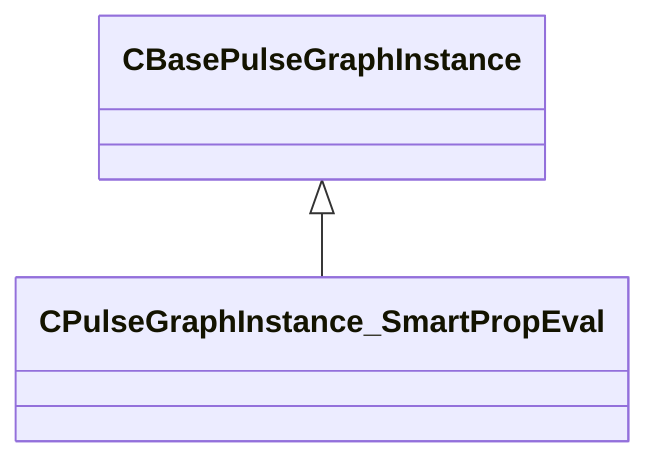

[Schemas](../../schemas.md) / [smartprops](../smartprops.md) / CPulseGraphInstance_SmartPropEval

# CPulseGraphInstance_SmartPropEval

**Kind:** class · **Size:** 288 bytes (`0x120`) · **Align:** 255 · **Module:** smartprops

**Inherits from:** [CBasePulseGraphInstance](../pulse_runtime_lib/CBasePulseGraphInstance.md)

**Relationships:**

