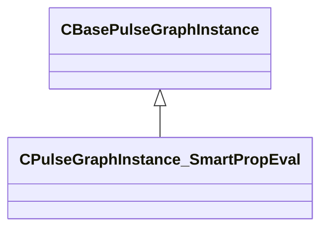

[Schemas](../../schemas.md) / [smartprops](../smartprops.md) / CPulseGraphInstance_SmartPropEval

# CPulseGraphInstance_SmartPropEval

> Source: **Build 25000182** · 2026-08-28 · `windows-x86_64` · schema `0.10.0`

**Kind:** class · **Size:** 288 bytes (`0x120`) · **Align:** n/a (unspecified) · **Module:** smartprops

**Inherits from:** [CBasePulseGraphInstance](../pulse_runtime_lib/CBasePulseGraphInstance.md)

**Relationships:**

## Memory layout

No schema-visible fields (288 bytes of opaque storage).
