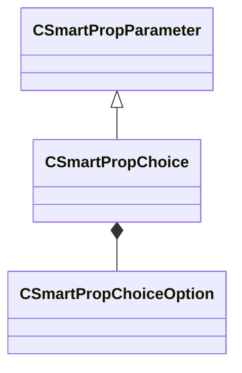

[Schemas](../../schemas.md) / [smartprops](../smartprops.md) / CSmartPropChoice

# CSmartPropChoice

> Source: **Build 25000182** · 2026-08-28 · `windows-x86_64` · schema `0.10.0`

**Kind:** class · **Size:** 56 bytes (`0x38`) · **Align:** 8 · **Module:** smartprops

**Inherits from:** [CSmartPropParameter](../smartprops/CSmartPropParameter.md)

**Metadata:** `MPropertyFriendlyName Choice`, `MVDataAnonymousNode`, `MVDataOutlinerNameExpr m_Name`

**Relationships:**

## Memory layout

4 fields (3 declared here, 1 inherited). Offsets are absolute from the object base.

| Offset | Field | Type | From | Annotations |
|--------|-------|------|------|-------------|
| `0x8` | `m_nElementID` | int32 | [CSmartPropParameter](../smartprops/CSmartPropParameter.md) | `MPropertySuppressField` `MVDataUniqueMonotonicInt _editor/next_element_id` |
| `0x10` | `m_Name` | CUtlString |  | `MPropertyFriendlyName Choice Name` |
| `0x18` | `m_DefaultOption` | CUtlString |  | `MPropertyAttributeChoiceName smartprop_choice_options` |
| `0x20` | `m_Options` | CUtlVector< [CSmartPropChoiceOption](../smartprops/CSmartPropChoiceOption.md) > |  | `MPropertyAutoExpandSelf` |

KV3 class defaults

<pre>{
	&quot;_class&quot;: &quot;CSmartPropChoice&quot;,
	&quot;m_nElementID&quot;: -1,
	&quot;m_Name&quot;: &quot;&quot;,
	&quot;m_DefaultOption&quot;: &quot;&quot;,
	&quot;m_Options&quot;:
	[
	]
}</pre>

