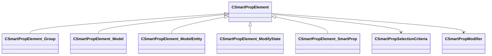

[Schemas](../../schemas.md) / [smartprops](../smartprops.md) / CSmartPropElement

# CSmartPropElement

**Kind:** class · **Size:** 136 bytes (`0x88`) · **Align:** 8 · **Module:** smartprops

**Derived by:** [CSmartPropElement_Group](../smartprops/CSmartPropElement_Group.md), [CSmartPropElement_Model](../smartprops/CSmartPropElement_Model.md), [CSmartPropElement_ModelEntity](../smartprops/CSmartPropElement_ModelEntity.md), [CSmartPropElement_ModifyState](../smartprops/CSmartPropElement_ModifyState.md), [CSmartPropElement_SmartProp](../smartprops/CSmartPropElement_SmartProp.md)

**Metadata:** `MPropertyFriendlyName Smart Prop Element`, `MVDataAnonymousNode`, `MVDataBase`, `MVDataNodeType 1`, `MVDataOutlinerLabelExpr m_sLabel`

**Relationships:**

## Memory layout

5 fields (5 declared here, 0 inherited). Offsets are absolute from the object base.

| Offset | Field | Type | From | Annotations |
|--------|-------|------|------|-------------|
| `0x8` | `m_nElementID` | int32 |  | `MPropertySuppressField` `MVDataUniqueMonotonicInt _editor/next_element_id` |
| `0x10` | `m_bEnabled` | CSmartPropAttributeBool |  | `MPropertyDescription Is this element enabled? If not enabled, this element will not be evaluted and will have no effect on the result.` `MPropertySortPriority 10` `MVDataEnableKey` |
| `0x50` | `m_sLabel` | CUtlString |  | `MPropertyDescription Optional text that will appear in the outliner to help organize Smart Prop elements and communicate their purpose to other users.` `MPropertyFriendlyName Label` |
| `0x58` | `m_SelectionCriteria` | CUtlVector< [CSmartPropSelectionCriteria](../smartprops/CSmartPropSelectionCriteria.md)* > |  | `MPropertyFriendlyName Selection Criteria` `MVDataPromoteField 2` |
| `0x70` | `m_Modifiers` | CUtlVector< [CSmartPropModifier](../smartprops/CSmartPropModifier.md)* > |  | `MPropertyFriendlyName Modifiers` `MVDataPromoteField 2` |

KV3 class defaults

<pre>{
	&quot;_class&quot;: &quot;CSmartPropElement&quot;,
	&quot;m_nElementID&quot;: -1,
	&quot;m_bEnabled&quot;: true,
	&quot;m_sLabel&quot;: &quot;&quot;,
	&quot;m_SelectionCriteria&quot;:
	[
	],
	&quot;m_Modifiers&quot;:
	[
	]
}</pre>

