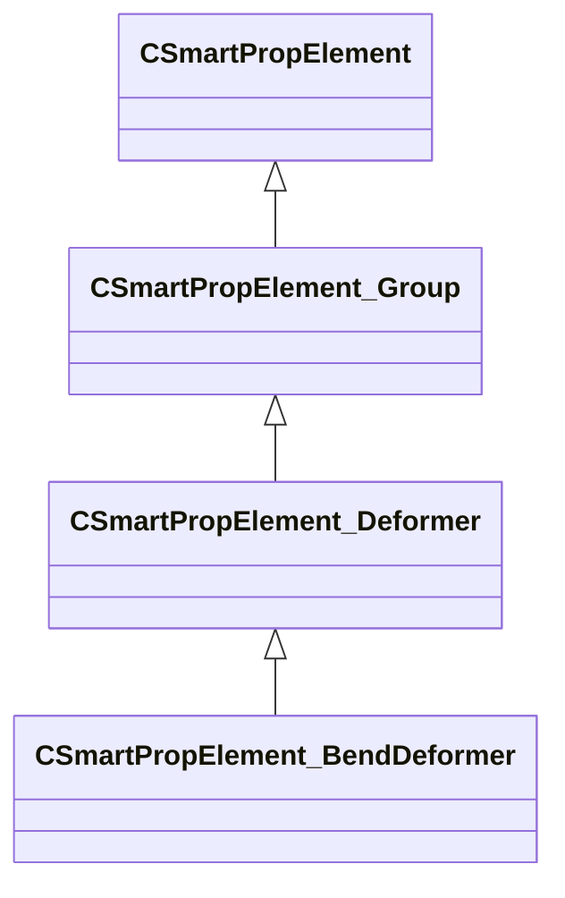

[Schemas](../../schemas.md) / [smartprops](../smartprops.md) / CSmartPropElement_BendDeformer

# CSmartPropElement_BendDeformer

> Source: **Build 25000182** · 2026-08-28 · `windows-x86_64` · schema `0.10.0`

**Kind:** class · **Size:** 608 bytes (`0x260`) · **Align:** 8 · **Module:** smartprops

**Inherits from:** [CSmartPropElement_Deformer](../smartprops/CSmartPropElement_Deformer.md)

**Metadata:** `MPropertyDescription Creates a bend deformer that is applied to child elements. The deformation bends the local space x-axis around the local space z-axis. The Angles property can be used to rotate the local axis to change the direction of deformation.`, `MPropertyFriendlyName Bend Deformer`

**Relationships:**

## Memory layout

13 fields (7 declared here, 6 inherited). Offsets are absolute from the object base.

| Offset | Field | Type | From | Annotations |
|--------|-------|------|------|-------------|
| `0x8` | `m_nElementID` | int32 | [CSmartPropElement](../smartprops/CSmartPropElement.md) | `MPropertySuppressField` `MVDataUniqueMonotonicInt _editor/next_element_id` |
| `0x10` | `m_bEnabled` | CSmartPropAttributeBool | [CSmartPropElement](../smartprops/CSmartPropElement.md) | `MPropertyDescription Is this element enabled? If not enabled, this element will not be evaluted and will have no effect on the result.` `MPropertySortPriority 10` `MVDataEnableKey` |
| `0x50` | `m_sLabel` | CUtlString | [CSmartPropElement](../smartprops/CSmartPropElement.md) | `MPropertyDescription Optional text that will appear in the outliner to help organize Smart Prop elements and communicate their purpose to other users.` `MPropertyFriendlyName Label` |
| `0x58` | `m_SelectionCriteria` | CUtlVector< [CSmartPropSelectionCriteria](../smartprops/CSmartPropSelectionCriteria.md)* > | [CSmartPropElement](../smartprops/CSmartPropElement.md) | `MPropertyFriendlyName Selection Criteria` `MVDataPromoteField 2` |
| `0x70` | `m_Modifiers` | CUtlVector< [CSmartPropModifier](../smartprops/CSmartPropModifier.md)* > | [CSmartPropElement](../smartprops/CSmartPropElement.md) | `MPropertyFriendlyName Modifiers` `MVDataPromoteField 2` |
| `0x88` | `m_Children` | CUtlVector< [CSmartPropElement](../smartprops/CSmartPropElement.md)* > | [CSmartPropElement_Group](../smartprops/CSmartPropElement_Group.md) | `MPropertyDescription List of child elements which will appear if this element appears` `MPropertyFriendlyName Children` `MVDataPromoteField 1` |
| `0xa0` | `m_bDeformationEnabled` | CSmartPropAttributeBool |  | `MPropertyDescription Should the deformation be applied. If disabled the children will still be placed, but will not be deformed. Esentially making the element behave as a group.` `MPropertyFriendlyName Deformation Enabled` |
| `0xe0` | `m_vOrigin` | CSmartPropAttributeVector |  | `MPropertyDescription A local offset to apply to the base volume of the deformer that will not apply to its children.` `MPropertyFriendlyName Origin` |
| `0x120` | `m_vAngles` | CSmartPropAttributeAngles |  | `MPropertyDescription A local rotation to apply to apply the base volume of the deformer that will not apply to its children. This can be used to alter the direction of the deformation.` `MPropertyFriendlyName Angles` |
| `0x160` | `m_vSize` | CSmartPropAttributeVector |  | `MPropertyDescription Size of the base volume to be deformed.` `MPropertyFriendlyName Dimensions` |
| `0x1a0` | `m_flBendAngle` | CSmartPropAttributeFloat |  | `MPropertyDescription Bend amount to apply, specified in degrees. Bend occurs along the local x-axis and bends around the local z-axis` `MPropertyFriendlyName Bend Angle` |
| `0x1e0` | `m_flBendPoint` | CSmartPropAttributeFloat |  | `MPropertyDescription [ 0, 1 ] Value specifying the location along the local x-axis the bend will occur around` `MPropertyFriendlyName Bend Point` |
| `0x220` | `m_flBendRadius` | CSmartPropAttributeFloat |  | `MPropertyDescription Radius of the bend. If 0 the radius will be computed automatically to preserve the length of the inner edge of the x-axis. If a non-zero value is specified then the inner edge will maintain this radius, but its length will change.` `MPropertyFriendlyName Bend Radius` |

KV3 class defaults

<pre>{
	&quot;_class&quot;: &quot;CSmartPropElement_BendDeformer&quot;,
	&quot;m_nElementID&quot;: -1,
	&quot;m_bEnabled&quot;: true,
	&quot;m_sLabel&quot;: &quot;&quot;,
	&quot;m_SelectionCriteria&quot;:
	[
	],
	&quot;m_Modifiers&quot;:
	[
	],
	&quot;m_Children&quot;:
	[
	],
	&quot;m_bDeformationEnabled&quot;: true,
	&quot;m_vOrigin&quot;:
	[
		0.000000,
		0.000000,
		0.000000
	],
	&quot;m_vAngles&quot;:
	[
		0.000000,
		0.000000,
		0.000000
	],
	&quot;m_vSize&quot;:
	[
		0.000000,
		0.000000,
		0.000000
	],
	&quot;m_flBendAngle&quot;: 0.000000,
	&quot;m_flBendPoint&quot;: 0.000000,
	&quot;m_flBendRadius&quot;: 0.000000
}</pre>

