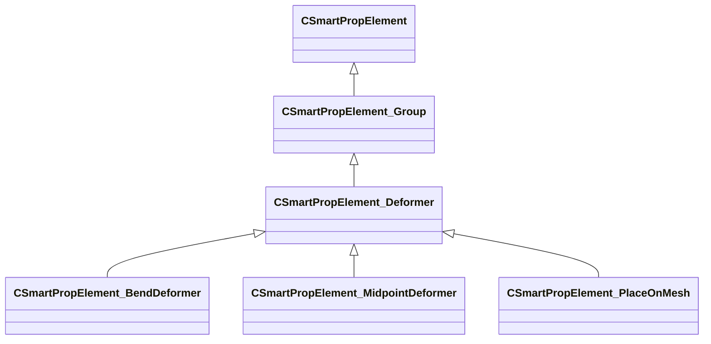

[Schemas](../../schemas.md) / [smartprops](../smartprops.md) / CSmartPropElement_Deformer

# CSmartPropElement_Deformer

**Kind:** class · **Size:** 160 bytes (`0xa0`) · **Align:** 255 · **Module:** smartprops

**Inherits from:** [CSmartPropElement_Group](../smartprops/CSmartPropElement_Group.md)

**Derived by:** [CSmartPropElement_BendDeformer](../smartprops/CSmartPropElement_BendDeformer.md), [CSmartPropElement_MidpointDeformer](../smartprops/CSmartPropElement_MidpointDeformer.md), [CSmartPropElement_PlaceOnMesh](../smartprops/CSmartPropElement_PlaceOnMesh.md)

**Relationships:**

## Memory layout

6 fields (0 declared here, 6 inherited). Offsets are absolute from the object base.

| Offset | Field | Type | From | Annotations |
|--------|-------|------|------|-------------|
| `0x8` | `m_nElementID` | int32 | [CSmartPropElement](../smartprops/CSmartPropElement.md) | `MPropertySuppressField` `MVDataUniqueMonotonicInt _editor/next_element_id` |
| `0x10` | `m_bEnabled` | CSmartPropAttributeBool | [CSmartPropElement](../smartprops/CSmartPropElement.md) | `MPropertyDescription Is this element enabled? If not enabled, this element will not be evaluted and will have no effect on the result.` `MPropertySortPriority 10` `MVDataEnableKey` |
| `0x50` | `m_sLabel` | CUtlString | [CSmartPropElement](../smartprops/CSmartPropElement.md) | `MPropertyDescription Optional text that will appear in the outliner to help organize Smart Prop elements and communicate their purpose to other users.` `MPropertyFriendlyName Label` |
| `0x58` | `m_SelectionCriteria` | CUtlVector< [CSmartPropSelectionCriteria](../smartprops/CSmartPropSelectionCriteria.md)* > | [CSmartPropElement](../smartprops/CSmartPropElement.md) | `MPropertyFriendlyName Selection Criteria` `MVDataPromoteField 2` |
| `0x70` | `m_Modifiers` | CUtlVector< [CSmartPropModifier](../smartprops/CSmartPropModifier.md)* > | [CSmartPropElement](../smartprops/CSmartPropElement.md) | `MPropertyFriendlyName Modifiers` `MVDataPromoteField 2` |
| `0x88` | `m_Children` | CUtlVector< [CSmartPropElement](../smartprops/CSmartPropElement.md)* > | [CSmartPropElement_Group](../smartprops/CSmartPropElement_Group.md) | `MPropertyDescription List of child elements which will appear if this element appears` `MPropertyFriendlyName Children` `MVDataPromoteField 1` |
