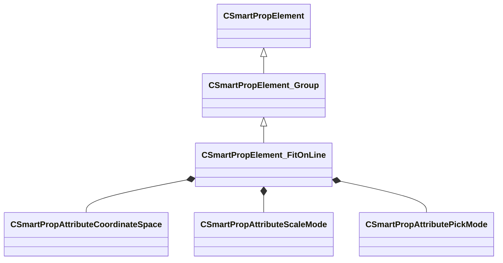

[Schemas](../../schemas.md) / [smartprops](../smartprops.md) / CSmartPropElement_FitOnLine

# CSmartPropElement_FitOnLine

> Source: **Build 25000182** · 2026-08-28 · `windows-x86_64` · schema `0.10.0`

**Kind:** class · **Size:** 736 bytes (`0x2e0`) · **Align:** 8 · **Module:** smartprops

**Inherits from:** [CSmartPropElement_Group](../smartprops/CSmartPropElement_Group.md)

**Metadata:** `MPropertyDescription An element which fits one or more instances of a set of choices on to a line.`, `MPropertyFriendlyName Fit on Line`

**Relationships:**

## Memory layout

15 fields (9 declared here, 6 inherited). Offsets are absolute from the object base.

| Offset | Field | Type | From | Annotations |
|--------|-------|------|------|-------------|
| `0x8` | `m_nElementID` | int32 | [CSmartPropElement](../smartprops/CSmartPropElement.md) | `MPropertySuppressField` `MVDataUniqueMonotonicInt _editor/next_element_id` |
| `0x10` | `m_bEnabled` | CSmartPropAttributeBool | [CSmartPropElement](../smartprops/CSmartPropElement.md) | `MPropertyDescription Is this element enabled? If not enabled, this element will not be evaluted and will have no effect on the result.` `MPropertySortPriority 10` `MVDataEnableKey` |
| `0x50` | `m_sLabel` | CUtlString | [CSmartPropElement](../smartprops/CSmartPropElement.md) | `MPropertyDescription Optional text that will appear in the outliner to help organize Smart Prop elements and communicate their purpose to other users.` `MPropertyFriendlyName Label` |
| `0x58` | `m_SelectionCriteria` | CUtlVector< [CSmartPropSelectionCriteria](../smartprops/CSmartPropSelectionCriteria.md)* > | [CSmartPropElement](../smartprops/CSmartPropElement.md) | `MPropertyFriendlyName Selection Criteria` `MVDataPromoteField 2` |
| `0x70` | `m_Modifiers` | CUtlVector< [CSmartPropModifier](../smartprops/CSmartPropModifier.md)* > | [CSmartPropElement](../smartprops/CSmartPropElement.md) | `MPropertyFriendlyName Modifiers` `MVDataPromoteField 2` |
| `0x88` | `m_Children` | CUtlVector< [CSmartPropElement](../smartprops/CSmartPropElement.md)* > | [CSmartPropElement_Group](../smartprops/CSmartPropElement_Group.md) | `MPropertyDescription List of child elements which will appear if this element appears` `MPropertyFriendlyName Children` `MVDataPromoteField 1` |
| `0xa0` | `m_vStart` | CSmartPropAttributeVector |  | `MPropertyDescription Specifies the start point of the line in the specified coordinate space.` `MPropertyStartGroup +End Points` |
| `0xe0` | `m_vEnd` | CSmartPropAttributeVector |  | `MPropertyDescription Specifies the end point of the line in the specified coordinate space.` |
| `0x120` | `m_PointSpace` | [CSmartPropAttributeCoordinateSpace](../smartprops/CSmartPropAttributeCoordinateSpace.md) |  | `MPropertyDescription Specifies the coordinate space in which the end point values are specified.` `MPropertyFriendlyName End point space` |
| `0x160` | `m_bOrientAlongLine` | CSmartPropAttributeBool |  | `MPropertyDescription Should the child elements be oriented based on the line. If enabled the child elements placed on the line will be oriented such that their +x axis points along the line towards the end point.` `MPropertyStartGroup +Orientation` |
| `0x1a0` | `m_vUpDirection` | CSmartPropAttributeVector |  | `MPropertyDescription Up vector which is used to determine the rotation of each element around the line.` |
| `0x1e0` | `m_UpDirectionSpace` | [CSmartPropAttributeCoordinateSpace](../smartprops/CSmartPropAttributeCoordinateSpace.md) |  | `MPropertyDescription Space in which the up direction is defined.` |
| `0x220` | `m_bPrioritizeUp` | CSmartPropAttributeBool |  | `MPropertyDescription When the up direction is not orthogonal to the line direction normally the up vector will be adjusted to make it orthogonal to the line direction. If prioritize up is true, then the up direction will be maintained and the forward direction will be adjusted.` |
| `0x260` | `m_nScaleMode` | [CSmartPropAttributeScaleMode](../smartprops/CSmartPropAttributeScaleMode.md) |  | `MPropertyDescription Specifies how scale is applied to each of the selected element in order to fit them to the line.` `MPropertyFriendlyName Scale Mode` `MPropertyStartGroup` |
| `0x2a0` | `m_nPickMode` | [CSmartPropAttributePickMode](../smartprops/CSmartPropAttributePickMode.md) |  | `MPropertyDescription Specifies how scale is applied to each of the selected element in order to fit them to the line.` `MPropertyFriendlyName Child Selection Mode` |

KV3 class defaults

<pre>{
	&quot;_class&quot;: &quot;CSmartPropElement_FitOnLine&quot;,
	&quot;m_nElementID&quot;: -1,
	&quot;m_bEnabled&quot;: true,
	&quot;m_sLabel&quot;: &quot;&quot;,
	&quot;m_SelectionCriteria&quot;:
	[
	],
	&quot;m_Modifiers&quot;:
	[
	],
	&quot;m_Children&quot;:
	[
	],
	&quot;m_vStart&quot;:
	[
		0.000000,
		0.000000,
		0.000000
	],
	&quot;m_vEnd&quot;:
	[
		0.000000,
		0.000000,
		0.000000
	],
	&quot;m_PointSpace&quot;: &quot;ELEMENT&quot;,
	&quot;m_bOrientAlongLine&quot;: false,
	&quot;m_vUpDirection&quot;:
	[
		0.000000,
		0.000000,
		1.000000
	],
	&quot;m_UpDirectionSpace&quot;: &quot;ELEMENT&quot;,
	&quot;m_bPrioritizeUp&quot;: false,
	&quot;m_nScaleMode&quot;: &quot;NONE&quot;,
	&quot;m_nPickMode&quot;: &quot;LARGEST_FIRST&quot;
}</pre>

