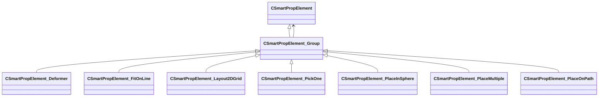

[Schemas](../../schemas.md) / [smartprops](../smartprops.md) / CSmartPropElement_Group

# CSmartPropElement_Group

> Source: **Build 25000182** · 2026-08-28 · `windows-x86_64` · schema `0.10.0`

**Kind:** class · **Size:** 160 bytes (`0xa0`) · **Align:** 8 · **Module:** smartprops

**Inherits from:** [CSmartPropElement](../smartprops/CSmartPropElement.md)

**Derived by:** [CSmartPropElement_Deformer](../smartprops/CSmartPropElement_Deformer.md), [CSmartPropElement_FitOnLine](../smartprops/CSmartPropElement_FitOnLine.md), [CSmartPropElement_Layout2DGrid](../smartprops/CSmartPropElement_Layout2DGrid.md), [CSmartPropElement_PickOne](../smartprops/CSmartPropElement_PickOne.md), [CSmartPropElement_PlaceInSphere](../smartprops/CSmartPropElement_PlaceInSphere.md), [CSmartPropElement_PlaceMultiple](../smartprops/CSmartPropElement_PlaceMultiple.md), [CSmartPropElement_PlaceOnPath](../smartprops/CSmartPropElement_PlaceOnPath.md)

**Metadata:** `MPropertyDescription A group of elements that will all be evaulated.`, `MPropertyFriendlyName Group`

**Relationships:**

## Memory layout

6 fields (1 declared here, 5 inherited). Offsets are absolute from the object base.

| Offset | Field | Type | From | Annotations |
|--------|-------|------|------|-------------|
| `0x8` | `m_nElementID` | int32 | [CSmartPropElement](../smartprops/CSmartPropElement.md) | `MPropertySuppressField` `MVDataUniqueMonotonicInt _editor/next_element_id` |
| `0x10` | `m_bEnabled` | CSmartPropAttributeBool | [CSmartPropElement](../smartprops/CSmartPropElement.md) | `MPropertyDescription Is this element enabled? If not enabled, this element will not be evaluted and will have no effect on the result.` `MPropertySortPriority 10` `MVDataEnableKey` |
| `0x50` | `m_sLabel` | CUtlString | [CSmartPropElement](../smartprops/CSmartPropElement.md) | `MPropertyDescription Optional text that will appear in the outliner to help organize Smart Prop elements and communicate their purpose to other users.` `MPropertyFriendlyName Label` |
| `0x58` | `m_SelectionCriteria` | CUtlVector< [CSmartPropSelectionCriteria](../smartprops/CSmartPropSelectionCriteria.md)* > | [CSmartPropElement](../smartprops/CSmartPropElement.md) | `MPropertyFriendlyName Selection Criteria` `MVDataPromoteField 2` |
| `0x70` | `m_Modifiers` | CUtlVector< [CSmartPropModifier](../smartprops/CSmartPropModifier.md)* > | [CSmartPropElement](../smartprops/CSmartPropElement.md) | `MPropertyFriendlyName Modifiers` `MVDataPromoteField 2` |
| `0x88` | `m_Children` | CUtlVector< [CSmartPropElement](../smartprops/CSmartPropElement.md)* > |  | `MPropertyDescription List of child elements which will appear if this element appears` `MPropertyFriendlyName Children` `MVDataPromoteField 1` |

KV3 class defaults

<pre>{
	&quot;_class&quot;: &quot;CSmartPropElement_Group&quot;,
	&quot;m_nElementID&quot;: -1,
	&quot;m_bEnabled&quot;: true,
	&quot;m_sLabel&quot;: &quot;&quot;,
	&quot;m_SelectionCriteria&quot;:
	[
	],
	&quot;m_Modifiers&quot;:
	[
	],
	&quot;m_Children&quot;:
	[
	]
}</pre>

