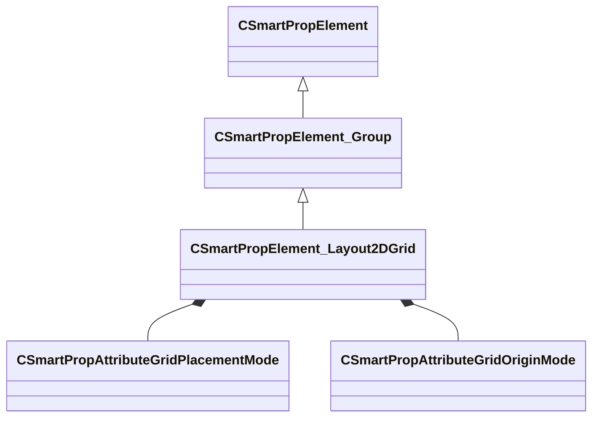

[Schemas](../../schemas.md) / [smartprops](../smartprops.md) / CSmartPropElement_Layout2DGrid

# CSmartPropElement_Layout2DGrid

> Source: **Build 25000182** · 2026-08-28 · `windows-x86_64` · schema `0.10.0`

**Kind:** class · **Size:** 928 bytes (`0x3a0`) · **Align:** 8 · **Module:** smartprops

**Inherits from:** [CSmartPropElement_Group](../smartprops/CSmartPropElement_Group.md)

**Metadata:** `MPropertyDescription Generates set of child instances arranged in a regular grid layout.`, `MPropertyFriendlyName Layout Grid`

**Relationships:**

## Memory layout

18 fields (12 declared here, 6 inherited). Offsets are absolute from the object base.

| Offset | Field | Type | From | Annotations |
|--------|-------|------|------|-------------|
| `0x8` | `m_nElementID` | int32 | [CSmartPropElement](../smartprops/CSmartPropElement.md) | `MPropertySuppressField` `MVDataUniqueMonotonicInt _editor/next_element_id` |
| `0x10` | `m_bEnabled` | CSmartPropAttributeBool | [CSmartPropElement](../smartprops/CSmartPropElement.md) | `MPropertyDescription Is this element enabled? If not enabled, this element will not be evaluted and will have no effect on the result.` `MPropertySortPriority 10` `MVDataEnableKey` |
| `0x50` | `m_sLabel` | CUtlString | [CSmartPropElement](../smartprops/CSmartPropElement.md) | `MPropertyDescription Optional text that will appear in the outliner to help organize Smart Prop elements and communicate their purpose to other users.` `MPropertyFriendlyName Label` |
| `0x58` | `m_SelectionCriteria` | CUtlVector< [CSmartPropSelectionCriteria](../smartprops/CSmartPropSelectionCriteria.md)* > | [CSmartPropElement](../smartprops/CSmartPropElement.md) | `MPropertyFriendlyName Selection Criteria` `MVDataPromoteField 2` |
| `0x70` | `m_Modifiers` | CUtlVector< [CSmartPropModifier](../smartprops/CSmartPropModifier.md)* > | [CSmartPropElement](../smartprops/CSmartPropElement.md) | `MPropertyFriendlyName Modifiers` `MVDataPromoteField 2` |
| `0x88` | `m_Children` | CUtlVector< [CSmartPropElement](../smartprops/CSmartPropElement.md)* > | [CSmartPropElement_Group](../smartprops/CSmartPropElement_Group.md) | `MPropertyDescription List of child elements which will appear if this element appears` `MPropertyFriendlyName Children` `MVDataPromoteField 1` |
| `0xa0` | `m_flWidth` | CSmartPropAttributeFloat |  | `MPropertyAttributeRange biased 0 4096` `MPropertyDescription Overall grid dimension along X axis.` |
| `0xe0` | `m_flLength` | CSmartPropAttributeFloat |  | `MPropertyAttributeRange biased 0 4096` `MPropertyDescription Overall grid dimension along Y axis.` |
| `0x120` | `m_bVerticalLength` | CSmartPropAttributeBool |  | `MPropertyDescription Layout length vertically (Along Z axis instead of Y).` |
| `0x160` | `m_GridArrangement` | [CSmartPropAttributeGridPlacementMode](../smartprops/CSmartPropAttributeGridPlacementMode.md) |  | `MPropertyDescription ARRAY: Grid is a specific number of grid divisions. FILL: The boundary is filled with as many as will fit at the specified cell spacing.` |
| `0x1a0` | `m_GridOriginMode` | [CSmartPropAttributeGridOriginMode](../smartprops/CSmartPropAttributeGridOriginMode.md) |  | `MPropertyDescription Specifies the overall grid origin location. Corner origin grids default to quadrant I, but may be expressed in others using negative values for Width and/or Length.` |
| `0x1e0` | `m_nCountW` | CSmartPropAttributeInt |  | `MPropertyAttributeRange 1 64` `MPropertyDescription Grid segments along width axis.` `MPropertySuppressExpr m_GridArrangement == FILL` |
| `0x220` | `m_nCountL` | CSmartPropAttributeInt |  | `MPropertyAttributeRange 1 64` `MPropertyDescription Grid segments along Length axis.` `MPropertySuppressExpr m_GridArrangement == FILL` |
| `0x260` | `m_flSpacingWidth` | CSmartPropAttributeFloat |  | `MPropertyAttributeRange biased 0 1024` `MPropertyDescription Minimum Width of filled grid cells.` `MPropertySuppressExpr m_GridArrangement == SEGMENT` |
| `0x2a0` | `m_flSpacingLength` | CSmartPropAttributeFloat |  | `MPropertyAttributeRange biased 0 1024` `MPropertyDescription Minimum Length of filled grid cells.` `MPropertySuppressExpr m_GridArrangement == SEGMENT` |
| `0x2e0` | `m_bAlternateShift` | CSmartPropAttributeBool |  | `MPropertyDescription Shifts every other cell row and/or column.` `MPropertySuppressExpr m_GridArrangement == FILL` |
| `0x320` | `m_flAlternateShiftWidth` | CSmartPropAttributeFloat |  | `MPropertyAttributeRange biased 0 1024` `MPropertyDescription Vary cell shift in X.` `MPropertySuppressExpr m_GridArrangement == FILL &#124;&#124; m_bAlternateShift == false` |
| `0x360` | `m_flAlternateShiftLength` | CSmartPropAttributeFloat |  | `MPropertyAttributeRange biased 0 1024` `MPropertyDescription Vary cell shift in Y.` `MPropertySuppressExpr m_GridArrangement == FILL &#124;&#124; m_bAlternateShift == false` |

KV3 class defaults

<pre>{
	&quot;_class&quot;: &quot;CSmartPropElement_Layout2DGrid&quot;,
	&quot;m_nElementID&quot;: -1,
	&quot;m_bEnabled&quot;: true,
	&quot;m_sLabel&quot;: &quot;&quot;,
	&quot;m_SelectionCriteria&quot;:
	[
	],
	&quot;m_Modifiers&quot;:
	[
	],
	&quot;m_Children&quot;:
	[
	],
	&quot;m_flWidth&quot;: 100.000000,
	&quot;m_flLength&quot;: 100.000000,
	&quot;m_bVerticalLength&quot;: false,
	&quot;m_GridArrangement&quot;: &quot;SEGMENT&quot;,
	&quot;m_GridOriginMode&quot;: &quot;CENTER&quot;,
	&quot;m_nCountW&quot;: 5,
	&quot;m_nCountL&quot;: 5,
	&quot;m_flSpacingWidth&quot;: 20.000000,
	&quot;m_flSpacingLength&quot;: 20.000000,
	&quot;m_bAlternateShift&quot;: false,
	&quot;m_flAlternateShiftWidth&quot;: 0.500000,
	&quot;m_flAlternateShiftLength&quot;: 0.000000
}</pre>

