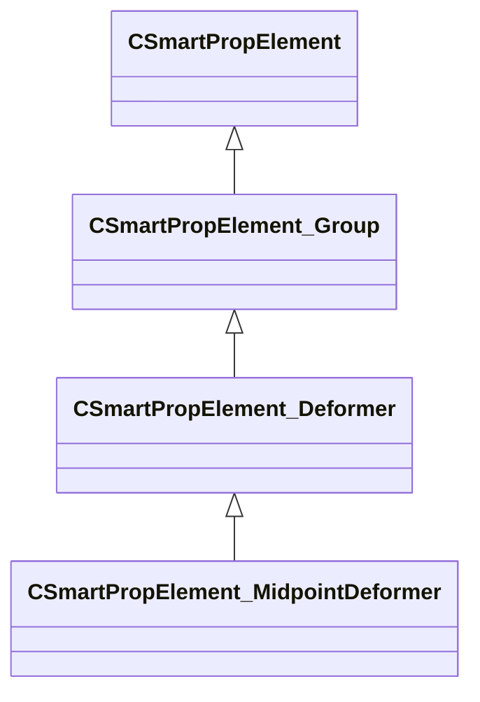

[Schemas](../../schemas.md) / [smartprops](../smartprops.md) / CSmartPropElement_MidpointDeformer

# CSmartPropElement_MidpointDeformer

**Kind:** class · **Size:** 744 bytes (`0x2e8`) · **Align:** 8 · **Module:** smartprops

**Inherits from:** [CSmartPropElement_Deformer](../smartprops/CSmartPropElement_Deformer.md)

**Metadata:** `MPropertyDescription Soft deform the center of a volume defined by two endpoints.`, `MPropertyFriendlyName Midpoint Deformer`

**Relationships:**

## Memory layout

16 fields (10 declared here, 6 inherited). Offsets are absolute from the object base.

| Offset | Field | Type | From | Annotations |
|--------|-------|------|------|-------------|
| `0x8` | `m_nElementID` | int32 | [CSmartPropElement](../smartprops/CSmartPropElement.md) | `MPropertySuppressField` `MVDataUniqueMonotonicInt _editor/next_element_id` |
| `0x10` | `m_bEnabled` | CSmartPropAttributeBool | [CSmartPropElement](../smartprops/CSmartPropElement.md) | `MPropertyDescription Is this element enabled? If not enabled, this element will not be evaluted and will have no effect on the result.` `MPropertySortPriority 10` `MVDataEnableKey` |
| `0x50` | `m_sLabel` | CUtlString | [CSmartPropElement](../smartprops/CSmartPropElement.md) | `MPropertyDescription Optional text that will appear in the outliner to help organize Smart Prop elements and communicate their purpose to other users.` `MPropertyFriendlyName Label` |
| `0x58` | `m_SelectionCriteria` | CUtlVector< [CSmartPropSelectionCriteria](../smartprops/CSmartPropSelectionCriteria.md)* > | [CSmartPropElement](../smartprops/CSmartPropElement.md) | `MPropertyFriendlyName Selection Criteria` `MVDataPromoteField 2` |
| `0x70` | `m_Modifiers` | CUtlVector< [CSmartPropModifier](../smartprops/CSmartPropModifier.md)* > | [CSmartPropElement](../smartprops/CSmartPropElement.md) | `MPropertyFriendlyName Modifiers` `MVDataPromoteField 2` |
| `0x88` | `m_Children` | CUtlVector< [CSmartPropElement](../smartprops/CSmartPropElement.md)* > | [CSmartPropElement_Group](../smartprops/CSmartPropElement_Group.md) | `MPropertyDescription List of child elements which will appear if this element appears` `MPropertyFriendlyName Children` `MVDataPromoteField 1` |
| `0xa0` | `m_bDeformationEnabled` | CSmartPropAttributeBool |  | `MPropertyDescription Should the deformation be applied. If disabled the children will still be placed, but will not be deformed. Esentially making the element behave as a group.` `MPropertyFriendlyName Deformation Enabled` |
| `0xe0` | `m_vStart` | CSmartPropAttributeVector |  | `MPropertyDescription Endpoint of deformation region.` `MPropertyFriendlyName Start Point` |
| `0x120` | `m_vEnd` | CSmartPropAttributeVector |  | `MPropertyDescription Endpoint of deformation region.` `MPropertyFriendlyName End Point` |
| `0x160` | `m_fRadius` | CSmartPropAttributeFloat |  | `MPropertyDescription The distance from the line formed by the endpoints that encapsulated the deformation region.` `MPropertyFriendlyName Effect Size` |
| `0x1a0` | `m_bContinuousSpline` | CSmartPropAttributeBool |  | `MPropertyDescription Enables an alternate interpolation method that doesnt deform endpoint tangents.` `MPropertyFriendlyName Continuous Interpolation` |
| `0x1e0` | `m_vOffset` | CSmartPropAttributeVector |  | `MPropertyDescription Offsets the center of the deformation region.` `MPropertyFriendlyName Midpoint Offset` |
| `0x220` | `m_vAngles` | CSmartPropAttributeAngles |  | `MPropertyDescription Rotate the center of the deformation region.` `MPropertyFriendlyName Midpoint Rotation` |
| `0x260` | `m_vScale` | CSmartPropAttributeVector2D |  | `MPropertyDescription Scale the center of the deformation region.` `MPropertyFriendlyName Midpoint Scale` |
| `0x2a0` | `m_fFalloff` | CSmartPropAttributeFloat |  | `MPropertyDescription Adjust deformation falloff from the center of the region to the endpoints.` `MPropertyFriendlyName Falloff` |
| `0x2e0` | `m_OutputVariable` | CUtlString |  | `MPropertyAttributeEditor SmartPropItemNameEditor( Variable:Vector )` `MPropertyDescription Outputs the absolute position of the midpoint post deformation.` |

KV3 class defaults

<pre>{
	&quot;_class&quot;: &quot;CSmartPropElement_MidpointDeformer&quot;,
	&quot;m_nElementID&quot;: -1,
	&quot;m_bEnabled&quot;: true,
	&quot;m_sLabel&quot;: &quot;&quot;,
	&quot;m_SelectionCriteria&quot;:
	[
	],
	&quot;m_Modifiers&quot;:
	[
	],
	&quot;m_Children&quot;:
	[
	],
	&quot;m_bDeformationEnabled&quot;: true,
	&quot;m_vStart&quot;:
	[
		0.000000,
		0.000000,
		0.000000
	],
	&quot;m_vEnd&quot;:
	[
		0.000000,
		0.000000,
		0.000000
	],
	&quot;m_fRadius&quot;: 64.000000,
	&quot;m_bContinuousSpline&quot;: false,
	&quot;m_vOffset&quot;:
	[
		0.000000,
		0.000000,
		0.000000
	],
	&quot;m_vAngles&quot;:
	[
		0.000000,
		0.000000,
		0.000000
	],
	&quot;m_vScale&quot;:
	[
		1.000000,
		1.000000
	],
	&quot;m_fFalloff&quot;: 1.000000,
	&quot;m_OutputVariable&quot;: &quot;&quot;
}</pre>

