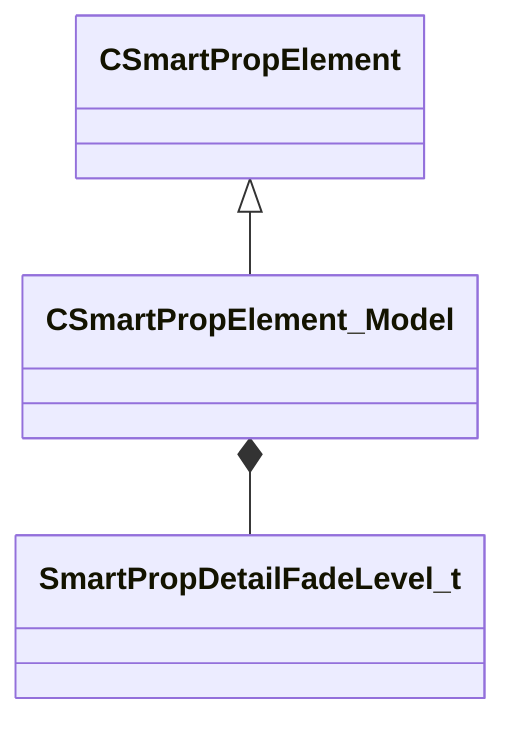

[Schemas](../../schemas.md) / [smartprops](../smartprops.md) / CSmartPropElement_Model

# CSmartPropElement_Model

**Kind:** class · **Size:** 784 bytes (`0x310`) · **Align:** 8 · **Module:** smartprops

**Inherits from:** [CSmartPropElement](../smartprops/CSmartPropElement.md)

**Metadata:** `MPropertyDescription Places a model as the child of an element.`, `MPropertyFriendlyName Model`, `MVDataOutlinerAssetNameExpr`

**Relationships:**

## Memory layout

16 fields (11 declared here, 5 inherited). Offsets are absolute from the object base.

| Offset | Field | Type | From | Annotations |
|--------|-------|------|------|-------------|
| `0x8` | `m_nElementID` | int32 | [CSmartPropElement](../smartprops/CSmartPropElement.md) | `MPropertySuppressField` `MVDataUniqueMonotonicInt _editor/next_element_id` |
| `0x10` | `m_bEnabled` | CSmartPropAttributeBool | [CSmartPropElement](../smartprops/CSmartPropElement.md) | `MPropertyDescription Is this element enabled? If not enabled, this element will not be evaluted and will have no effect on the result.` `MPropertySortPriority 10` `MVDataEnableKey` |
| `0x50` | `m_sLabel` | CUtlString | [CSmartPropElement](../smartprops/CSmartPropElement.md) | `MPropertyDescription Optional text that will appear in the outliner to help organize Smart Prop elements and communicate their purpose to other users.` `MPropertyFriendlyName Label` |
| `0x58` | `m_SelectionCriteria` | CUtlVector< [CSmartPropSelectionCriteria](../smartprops/CSmartPropSelectionCriteria.md)* > | [CSmartPropElement](../smartprops/CSmartPropElement.md) | `MPropertyFriendlyName Selection Criteria` `MVDataPromoteField 2` |
| `0x70` | `m_Modifiers` | CUtlVector< [CSmartPropModifier](../smartprops/CSmartPropModifier.md)* > | [CSmartPropElement](../smartprops/CSmartPropElement.md) | `MPropertyFriendlyName Modifiers` `MVDataPromoteField 2` |
| `0x88` | `m_sModelName` | CSmartPropAttributeModelName |  | `MPropertyDescription Name of the model resource (.vmdl) to place.` `MPropertyProvidesEditContextString ToolEditContext_ID_VMDL` |
| `0xc8` | `m_MaterialGroupName` | CSmartPropAttributeMaterialGroup |  | `MPropertyDescription Specifies the name of the material group (skin) to use when displaying the specified model.` `MPropertyFriendlyName Material Group` |
| `0x108` | `m_bDetailObject` | CSmartPropAttributeBool |  | `MPropertyDescription If enabled the model will be rendered as a detail object, which is faster for placing many small objects and has fade out functionality, but may have different lighting characteristics. Detail object models support only uniform scale and will use the largest component of the scale value.` |
| `0x148` | `m_vModelScale` | CSmartPropAttributeVector |  | `MPropertyDescription Scale factor (may be non-uniform) to be applied directly to the model (in the model's local space).` `MPropertySuppressExpr m_bDetailObject == true` |
| `0x188` | `m_flUniformModelScale` | CSmartPropAttributeFloat |  | `MPropertyDescription Uniform scale to be applied to the model, certain properties like detail object mean only uniform scale may be applied to the model.` `MPropertyFriendlyName Model Scale` `MPropertySuppressExpr m_bDetailObject == false` |
| `0x1c8` | `m_nLodLevel` | CSmartPropAttributeInt |  | `MPropertyAttributeEditor SmartPropAttributeEditor( LODLevel )` `MPropertyDescription Select model LOD level. The default Auto LOD means the lod will be picked based on the size of the model on screen. If a specific level is selected, then that lod level will always be used regardless of the size of the model on screen.` `MPropertySuppressExpr m_bDetailObject == true` |
| `0x208` | `m_SurfacePropertyOverride` | CSmartPropAttributeSurfaceProperty |  | `MPropertyDescription If non-empty, specifies the name of a surface property to use for all physics shapes of the specified model, overriding any surface properties specified within the model.` `MPropertyFriendlyName Override Surface Property` `MPropertySuppressExpr m_bDetailObject == true` |
| `0x248` | `m_nDetailObjectFadeLevel` | [SmartPropDetailFadeLevel_t](../!GlobalTypes/SmartPropDetailFadeLevel_t.md) |  | `MPropertyDescription Controls the size at which a model marked as a detail object will fade out.` `MPropertyFriendlyName Fade Level` `MPropertySuppressExpr m_bDetailObject == false` |
| `0x250` | `m_bCastShadows` | CSmartPropAttributeBool |  | `MPropertyDescription Should the model cast shadows.` `MPropertyFriendlyName Cast Shadows` |
| `0x290` | `m_bRigidDeformation` | CSmartPropAttributeBool |  | `MPropertyDescription If enabled, only the transform of the model will be modified by any active deformer, the vertices of the model will not be changed by the deformer.` `MPropertyFriendlyName Rigid Deformation Only` `MPropertySuppressExpr m_bDetailObject == true` |
| `0x2d0` | `m_bDisableDynamicDeformable` | CSmartPropAttributeBool |  | `MPropertyDescription If checked, this model will not deform in game when the smart prop is placed inside a dynamic deformable entity (such as func_deformable_brush).` `MPropertyFriendlyName Disable Dynamic Deformable` `MPropertySuppressExpr m_bDetailObject == true` |

KV3 class defaults

<pre>{
	&quot;_class&quot;: &quot;CSmartPropElement_Model&quot;,
	&quot;m_nElementID&quot;: -1,
	&quot;m_bEnabled&quot;: true,
	&quot;m_sLabel&quot;: &quot;&quot;,
	&quot;m_SelectionCriteria&quot;:
	[
	],
	&quot;m_Modifiers&quot;:
	[
	],
	&quot;m_sModelName&quot;: &quot;&quot;,
	&quot;m_MaterialGroupName&quot;: &quot;&quot;,
	&quot;m_bDetailObject&quot;: false,
	&quot;m_vModelScale&quot;:
	[
		1.000000,
		1.000000,
		1.000000
	],
	&quot;m_flUniformModelScale&quot;: 1.000000,
	&quot;m_nLodLevel&quot;: -1,
	&quot;m_SurfacePropertyOverride&quot;: &quot;&quot;,
	&quot;m_nDetailObjectFadeLevel&quot;: &quot;NORMAL&quot;,
	&quot;m_bCastShadows&quot;: true,
	&quot;m_bRigidDeformation&quot;: false,
	&quot;m_bDisableDynamicDeformable&quot;: false
}</pre>

