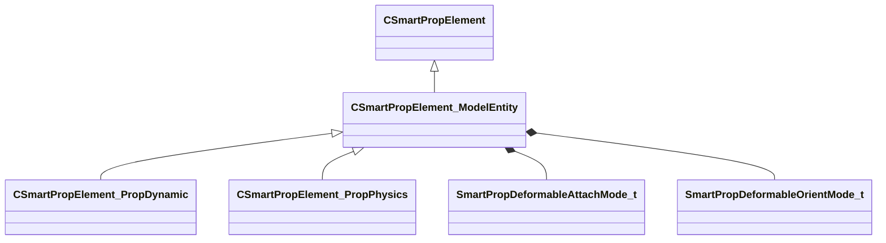

[Schemas](../../schemas.md) / [smartprops](../smartprops.md) / CSmartPropElement_ModelEntity

# CSmartPropElement_ModelEntity

**Kind:** class · **Size:** 400 bytes (`0x190`) · **Align:** 255 · **Module:** smartprops

**Inherits from:** [CSmartPropElement](../smartprops/CSmartPropElement.md)

**Derived by:** [CSmartPropElement_PropDynamic](../smartprops/CSmartPropElement_PropDynamic.md), [CSmartPropElement_PropPhysics](../smartprops/CSmartPropElement_PropPhysics.md)

**Metadata:** `MVDataOutlinerAssetNameExpr`

**Relationships:**

## Memory layout

11 fields (6 declared here, 5 inherited). Offsets are absolute from the object base.

| Offset | Field | Type | From | Annotations |
|--------|-------|------|------|-------------|
| `0x8` | `m_nElementID` | int32 | [CSmartPropElement](../smartprops/CSmartPropElement.md) | `MPropertySuppressField` `MVDataUniqueMonotonicInt _editor/next_element_id` |
| `0x10` | `m_bEnabled` | CSmartPropAttributeBool | [CSmartPropElement](../smartprops/CSmartPropElement.md) | `MPropertyDescription Is this element enabled? If not enabled, this element will not be evaluted and will have no effect on the result.` `MPropertySortPriority 10` `MVDataEnableKey` |
| `0x50` | `m_sLabel` | CUtlString | [CSmartPropElement](../smartprops/CSmartPropElement.md) | `MPropertyDescription Optional text that will appear in the outliner to help organize Smart Prop elements and communicate their purpose to other users.` `MPropertyFriendlyName Label` |
| `0x58` | `m_SelectionCriteria` | CUtlVector< [CSmartPropSelectionCriteria](../smartprops/CSmartPropSelectionCriteria.md)* > | [CSmartPropElement](../smartprops/CSmartPropElement.md) | `MPropertyFriendlyName Selection Criteria` `MVDataPromoteField 2` |
| `0x70` | `m_Modifiers` | CUtlVector< [CSmartPropModifier](../smartprops/CSmartPropModifier.md)* > | [CSmartPropElement](../smartprops/CSmartPropElement.md) | `MPropertyFriendlyName Modifiers` `MVDataPromoteField 2` |
| `0x88` | `m_sModelName` | CSmartPropAttributeModelName |  | `MPropertyDescription Name of the model resource (.vmdl) to place.` `MPropertyProvidesEditContextString ToolEditContext_ID_VMDL` |
| `0xc8` | `m_MaterialGroupName` | CSmartPropAttributeMaterialGroup |  | `MPropertyDescription Specifies the name of the material group (skin) to use when displaying the specified model.` `MPropertyFriendlyName Material Group` |
| `0x108` | `m_bCastShadows` | CSmartPropAttributeBool |  | `MPropertyDescription Should the entity created by this element cast shadows.` `MPropertyFriendlyName Cast Shadows` |
| `0x148` | `m_bForceStatic` | CSmartPropAttributeBool |  | `MPropertyDescription Force this model to be placed as a static model rather then generating an entity.` `MPropertyFriendlyName Force Static` |
| `0x188` | `m_nDeformableAttachmentMode` | [SmartPropDeformableAttachMode_t](../smartprops/SmartPropDeformableAttachMode_t.md) |  | `MPropertyDescription If the smart prop is child of a deformable entity, this setting specifies how the entity generated by this element will be attached to the deformable surface.` `MPropertyFriendlyName Attachment Mode` `MPropertyGroupName Deformable Entity Settings` `MPropertySortPriority -1` `MPropertySuppressExpr m_bForceStatic == true` |
| `0x18c` | `m_nDeformableOrientationMode` | [SmartPropDeformableOrientMode_t](../smartprops/SmartPropDeformableOrientMode_t.md) |  | `MPropertyDescription If the smart prop is child of a deformable entity, this setting specifies how the entity generated by this element will be oriented relative to the deformable surface.` `MPropertyGroupName Deformable Entity Settings` `MPropertySortPriority -1` `MPropertySuppressExpr m_bForceStatic == true` |
