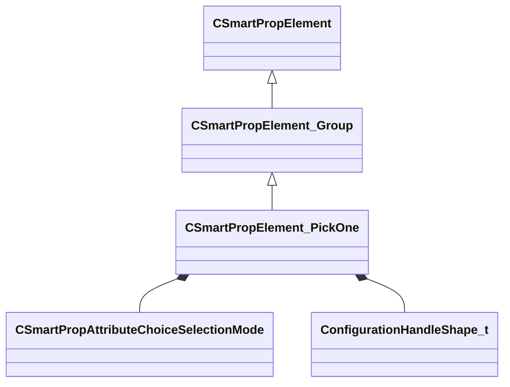

[Schemas](../../schemas.md) / [smartprops](../smartprops.md) / CSmartPropElement_PickOne

# CSmartPropElement_PickOne

> Source: **Build 25000182** · 2026-08-28 · `windows-x86_64` · schema `0.10.0`

**Kind:** class · **Size:** 560 bytes (`0x230`) · **Align:** 8 · **Module:** smartprops

**Inherits from:** [CSmartPropElement_Group](../smartprops/CSmartPropElement_Group.md)

**Metadata:** `MPropertyDescription An element which selects a single choice from its set of child choices.`, `MPropertyFriendlyName Select Single Child`

**Relationships:**

## Memory layout

14 fields (8 declared here, 6 inherited). Offsets are absolute from the object base.

| Offset | Field | Type | From | Annotations |
|--------|-------|------|------|-------------|
| `0x8` | `m_nElementID` | int32 | [CSmartPropElement](../smartprops/CSmartPropElement.md) | `MPropertySuppressField` `MVDataUniqueMonotonicInt _editor/next_element_id` |
| `0x10` | `m_bEnabled` | CSmartPropAttributeBool | [CSmartPropElement](../smartprops/CSmartPropElement.md) | `MPropertyDescription Is this element enabled? If not enabled, this element will not be evaluted and will have no effect on the result.` `MPropertySortPriority 10` `MVDataEnableKey` |
| `0x50` | `m_sLabel` | CUtlString | [CSmartPropElement](../smartprops/CSmartPropElement.md) | `MPropertyDescription Optional text that will appear in the outliner to help organize Smart Prop elements and communicate their purpose to other users.` `MPropertyFriendlyName Label` |
| `0x58` | `m_SelectionCriteria` | CUtlVector< [CSmartPropSelectionCriteria](../smartprops/CSmartPropSelectionCriteria.md)* > | [CSmartPropElement](../smartprops/CSmartPropElement.md) | `MPropertyFriendlyName Selection Criteria` `MVDataPromoteField 2` |
| `0x70` | `m_Modifiers` | CUtlVector< [CSmartPropModifier](../smartprops/CSmartPropModifier.md)* > | [CSmartPropElement](../smartprops/CSmartPropElement.md) | `MPropertyFriendlyName Modifiers` `MVDataPromoteField 2` |
| `0x88` | `m_Children` | CUtlVector< [CSmartPropElement](../smartprops/CSmartPropElement.md)* > | [CSmartPropElement_Group](../smartprops/CSmartPropElement_Group.md) | `MPropertyDescription List of child elements which will appear if this element appears` `MPropertyFriendlyName Children` `MVDataPromoteField 1` |
| `0xa0` | `m_SelectionMode` | [CSmartPropAttributeChoiceSelectionMode](../smartprops/CSmartPropAttributeChoiceSelectionMode.md) |  | `MPropertyDescription Specifies how the initial selection of a choice should be handled.` |
| `0xe0` | `m_SpecificChildIndex` | CSmartPropAttributeInt |  | `MPropertyDescription Specifies the index of the child to pick.` `MPropertyFriendlyName Specific Child` `MPropertySuppressExpr ( m_SelectionMode != SPECIFIC )` |
| `0x120` | `m_OutputChoiceVariableName` | CUtlString |  | `MPropertyAttributeEditor SmartPropItemNameEditor( Variable:Integer )` `MPropertyDescription If a variable name is specified, sets the value of that variable to the index of the selected choice` `MPropertyFriendlyName Choice Output Variable` |
| `0x128` | `m_bConfigurable` | CSmartPropAttributeBool |  | `MPropertyDescription Should a control to select the specific choice be shown when this prop is placed in Hammer.` |
| `0x168` | `m_vHandleOffset` | CSmartPropAttributeVector |  | `MPropertyDescription Specifies an offset in the local space of the element to apply to the configuration handle.` `MPropertyGroupName Handle Settings` `MPropertyReadonlyExpr m_bConfigurable == false` |
| `0x1a8` | `m_HandleColor` | CSmartPropAttributeColor |  | `MPropertyDescription Color to use to display the configuration handle.` `MPropertyGroupName Handle Settings` `MPropertyReadonlyExpr m_bConfigurable == false` |
| `0x1e8` | `m_HandleSize` | CSmartPropAttributeInt |  | `MPropertyDescription Size of the configuration handle.` `MPropertyGroupName Handle Settings` `MPropertyReadonlyExpr m_bConfigurable == false` |
| `0x228` | `m_HandleShape` | [ConfigurationHandleShape_t](../smartprops/ConfigurationHandleShape_t.md) |  | `MPropertyDescription Shape of the configuration handle to display.` `MPropertyGroupName Handle Settings` `MPropertyReadonlyExpr m_bConfigurable == false` |

KV3 class defaults

<pre>{
	&quot;_class&quot;: &quot;CSmartPropElement_PickOne&quot;,
	&quot;m_nElementID&quot;: -1,
	&quot;m_bEnabled&quot;: true,
	&quot;m_sLabel&quot;: &quot;&quot;,
	&quot;m_SelectionCriteria&quot;:
	[
	],
	&quot;m_Modifiers&quot;:
	[
	],
	&quot;m_Children&quot;:
	[
	],
	&quot;m_SelectionMode&quot;: &quot;RANDOM&quot;,
	&quot;m_SpecificChildIndex&quot;: 0,
	&quot;m_OutputChoiceVariableName&quot;: &quot;&quot;,
	&quot;m_bConfigurable&quot;: true,
	&quot;m_vHandleOffset&quot;:
	[
		0.000000,
		0.000000,
		0.000000
	],
	&quot;m_HandleColor&quot;:
	[
		144,
		144,
		144
	],
	&quot;m_HandleSize&quot;: 9,
	&quot;m_HandleShape&quot;: &quot;SQUARE&quot;
}</pre>

