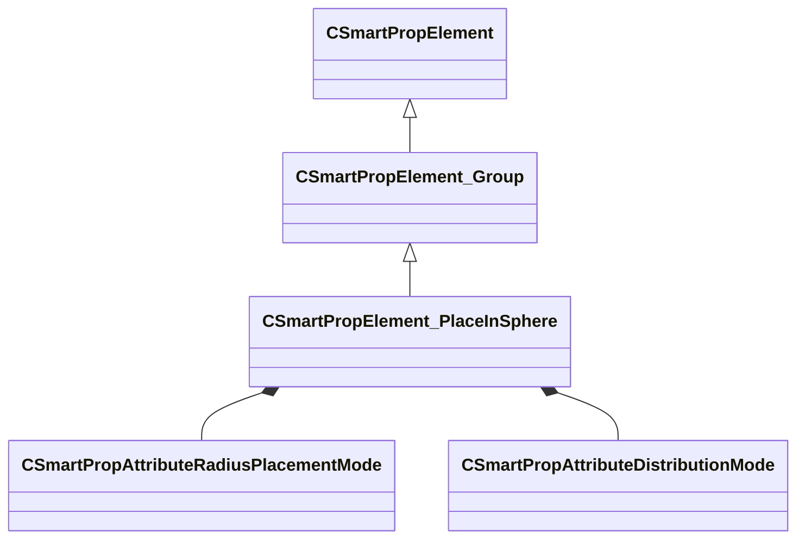

[Schemas](../../schemas.md) / [smartprops](../smartprops.md) / CSmartPropElement_PlaceInSphere

# CSmartPropElement_PlaceInSphere

> Source: **Build 25000182** · 2026-08-28 · `windows-x86_64` · schema `0.10.0`

**Kind:** class · **Size:** 800 bytes (`0x320`) · **Align:** 8 · **Module:** smartprops

**Inherits from:** [CSmartPropElement_Group](../smartprops/CSmartPropElement_Group.md)

**Metadata:** `MPropertyDescription An element which places multiple instances of its child elements within a radius.`, `MPropertyFriendlyName Place In Radius`

**Relationships:**

## Memory layout

16 fields (10 declared here, 6 inherited). Offsets are absolute from the object base.

| Offset | Field | Type | From | Annotations |
|--------|-------|------|------|-------------|
| `0x8` | `m_nElementID` | int32 | [CSmartPropElement](../smartprops/CSmartPropElement.md) | `MPropertySuppressField` `MVDataUniqueMonotonicInt _editor/next_element_id` |
| `0x10` | `m_bEnabled` | CSmartPropAttributeBool | [CSmartPropElement](../smartprops/CSmartPropElement.md) | `MPropertyDescription Is this element enabled? If not enabled, this element will not be evaluted and will have no effect on the result.` `MPropertySortPriority 10` `MVDataEnableKey` |
| `0x50` | `m_sLabel` | CUtlString | [CSmartPropElement](../smartprops/CSmartPropElement.md) | `MPropertyDescription Optional text that will appear in the outliner to help organize Smart Prop elements and communicate their purpose to other users.` `MPropertyFriendlyName Label` |
| `0x58` | `m_SelectionCriteria` | CUtlVector< [CSmartPropSelectionCriteria](../smartprops/CSmartPropSelectionCriteria.md)* > | [CSmartPropElement](../smartprops/CSmartPropElement.md) | `MPropertyFriendlyName Selection Criteria` `MVDataPromoteField 2` |
| `0x70` | `m_Modifiers` | CUtlVector< [CSmartPropModifier](../smartprops/CSmartPropModifier.md)* > | [CSmartPropElement](../smartprops/CSmartPropElement.md) | `MPropertyFriendlyName Modifiers` `MVDataPromoteField 2` |
| `0x88` | `m_Children` | CUtlVector< [CSmartPropElement](../smartprops/CSmartPropElement.md)* > | [CSmartPropElement_Group](../smartprops/CSmartPropElement_Group.md) | `MPropertyDescription List of child elements which will appear if this element appears` `MPropertyFriendlyName Children` `MVDataPromoteField 1` |
| `0xa0` | `m_PlacementMode` | [CSmartPropAttributeRadiusPlacementMode](../smartprops/CSmartPropAttributeRadiusPlacementMode.md) |  | `MPropertyDescription Specifies how the positions are computed based on the radius.` |
| `0xe0` | `m_DistributionMode` | [CSmartPropAttributeDistributionMode](../smartprops/CSmartPropAttributeDistributionMode.md) |  | `MPropertyDescription Specifies the method to be used to distribute.` |
| `0x120` | `m_flRandomness` | CSmartPropAttributeFloat |  | `MPropertyDescription 0 to 1 value indicating the amout of random offset that should be applied to the reguluarly spaced positions` `MPropertySuppressExpr m_DistributionMode == RANDOM` |
| `0x160` | `m_vPlaneUpDirection` | CSmartPropAttributeVector |  | `MPropertyDescription Vector up direction of the plane of the circle. This in the local space of the current element.` `MPropertySuppressExpr m_PlacementMode == SPHERE` |
| `0x1a0` | `m_nCountMin` | CSmartPropAttributeInt |  | `MPropertyDescription Minimum number of instances of this object and its children to be placed.` |
| `0x1e0` | `m_nCountMax` | CSmartPropAttributeInt |  | `MPropertyDescription Maximum number of instances of this object and its children to be placed.` |
| `0x220` | `m_flPositionRadiusInner` | CSmartPropAttributeFloat |  | `MPropertyDescription Inner radius from the placement position where the model can appear.` |
| `0x260` | `m_flPositionRadiusOuter` | CSmartPropAttributeFloat |  | `MPropertyDescription Outer radius from the placement position where the model can appear.` |
| `0x2a0` | `m_bAlignOrientation` | CSmartPropAttributeBool |  | `MPropertyDescription Align the initial orientation of each placed object based on it position on the sphere or circle.` |
| `0x2e0` | `m_vAlignDirection` | CSmartPropAttributeVector |  | `MPropertyDescription Vector in the local space of the child element to be aligned with sphere or circle` `MPropertyReadonlyExpr m_bAlignOrientation == false` |

KV3 class defaults

<pre>{
	&quot;_class&quot;: &quot;CSmartPropElement_PlaceInSphere&quot;,
	&quot;m_nElementID&quot;: -1,
	&quot;m_bEnabled&quot;: true,
	&quot;m_sLabel&quot;: &quot;&quot;,
	&quot;m_SelectionCriteria&quot;:
	[
	],
	&quot;m_Modifiers&quot;:
	[
	],
	&quot;m_Children&quot;:
	[
	],
	&quot;m_PlacementMode&quot;: &quot;SPHERE&quot;,
	&quot;m_DistributionMode&quot;: &quot;RANDOM&quot;,
	&quot;m_flRandomness&quot;: 0.000000,
	&quot;m_vPlaneUpDirection&quot;:
	[
		0.000000,
		0.000000,
		1.000000
	],
	&quot;m_nCountMin&quot;: 1,
	&quot;m_nCountMax&quot;: 1,
	&quot;m_flPositionRadiusInner&quot;: 0.000000,
	&quot;m_flPositionRadiusOuter&quot;: 0.000000,
	&quot;m_bAlignOrientation&quot;: false,
	&quot;m_vAlignDirection&quot;:
	[
		0.000000,
		0.000000,
		1.000000
	]
}</pre>

