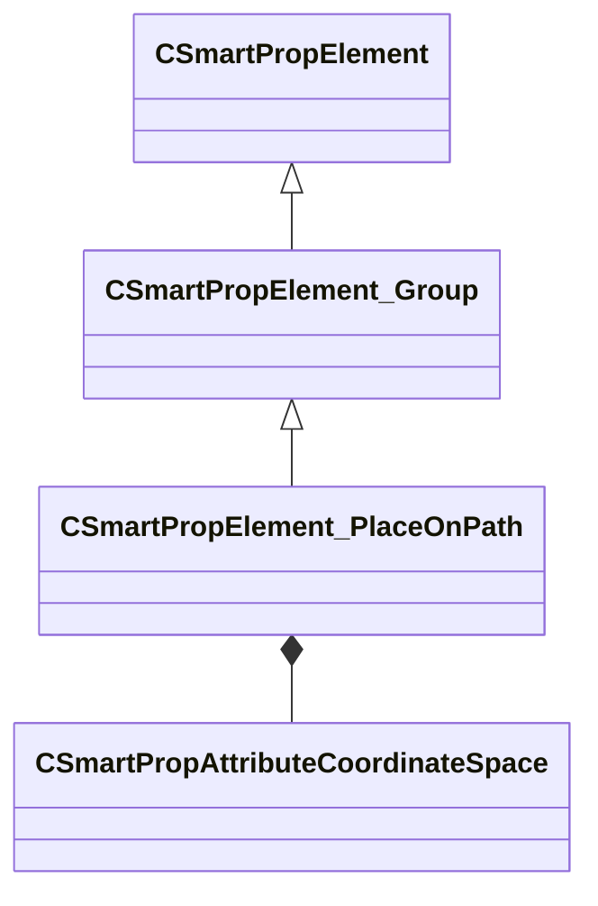

[Schemas](../../schemas.md) / [smartprops](../smartprops.md) / CSmartPropElement_PlaceOnPath

# CSmartPropElement_PlaceOnPath

**Kind:** class · **Size:** 768 bytes (`0x300`) · **Align:** 8 · **Module:** smartprops

**Inherits from:** [CSmartPropElement_Group](../smartprops/CSmartPropElement_Group.md)

**Metadata:** `MPropertyDescription An element which places an instance of its child elements at a specified interval along a path.`, `MPropertyFriendlyName Place on Path`

**Relationships:**

## Memory layout

17 fields (11 declared here, 6 inherited). Offsets are absolute from the object base.

| Offset | Field | Type | From | Annotations |
|--------|-------|------|------|-------------|
| `0x8` | `m_nElementID` | int32 | [CSmartPropElement](../smartprops/CSmartPropElement.md) | `MPropertySuppressField` `MVDataUniqueMonotonicInt _editor/next_element_id` |
| `0x10` | `m_bEnabled` | CSmartPropAttributeBool | [CSmartPropElement](../smartprops/CSmartPropElement.md) | `MPropertyDescription Is this element enabled? If not enabled, this element will not be evaluted and will have no effect on the result.` `MPropertySortPriority 10` `MVDataEnableKey` |
| `0x50` | `m_sLabel` | CUtlString | [CSmartPropElement](../smartprops/CSmartPropElement.md) | `MPropertyDescription Optional text that will appear in the outliner to help organize Smart Prop elements and communicate their purpose to other users.` `MPropertyFriendlyName Label` |
| `0x58` | `m_SelectionCriteria` | CUtlVector< [CSmartPropSelectionCriteria](../smartprops/CSmartPropSelectionCriteria.md)* > | [CSmartPropElement](../smartprops/CSmartPropElement.md) | `MPropertyFriendlyName Selection Criteria` `MVDataPromoteField 2` |
| `0x70` | `m_Modifiers` | CUtlVector< [CSmartPropModifier](../smartprops/CSmartPropModifier.md)* > | [CSmartPropElement](../smartprops/CSmartPropElement.md) | `MPropertyFriendlyName Modifiers` `MVDataPromoteField 2` |
| `0x88` | `m_Children` | CUtlVector< [CSmartPropElement](../smartprops/CSmartPropElement.md)* > | [CSmartPropElement_Group](../smartprops/CSmartPropElement_Group.md) | `MPropertyDescription List of child elements which will appear if this element appears` `MPropertyFriendlyName Children` `MVDataPromoteField 1` |
| `0xa0` | `m_PathName` | CUtlString |  | `MPropertyDescription Name of the path to use. This path name will show up in the property editor when selecting a placement of this smart prop in Hammer, allowing selection of a path object in the map to use.` |
| `0xa8` | `m_flSpacing` | CSmartPropAttributeFloat |  | `MPropertyDescription Spacing between points on the path` |
| `0xe8` | `m_flOffsetAlongPath` | CSmartPropAttributeFloat |  | `MPropertyDescription Offset from the start of the path to place the first point.` |
| `0x128` | `m_vPathOffset` | CSmartPropAttributeVector2D |  | `MPropertyDescription Offset to apply to the path, specifies a horizontal and vertical offset to apply relative to the up direction.` `MPropertyFriendlyName Offset from path` |
| `0x168` | `m_PathSpace` | [CSmartPropAttributeCoordinateSpace](../smartprops/CSmartPropAttributeCoordinateSpace.md) |  | `MPropertyDescription Specifies the space in which the provided input path is to be evalauted.  <b>World Space</b>: The input path will be evaluated in world space, such that child elements will be placed directly on the target path regardless of the transform of the smart prop object.  <b>Object Space</b>: The world space transform of the input path will be ignored and instead the path will be evaluated relative to the transform of the smart prop object.  <b>Element Space</b>: The world space transform of the input path will be ignored and instead the path will be evaluated relative to the transform of the current element within the smart prop. ` `MPropertyFriendlyName Path Evaluation Space` |
| `0x1a8` | `m_bUseFixedUpDirection` | CSmartPropAttributeBool |  | `MPropertyDescription If true, treat the specified up direction as fixed up direction to apply to all elements placed on the path. If false the up direction is just an initial direction.` |
| `0x1e8` | `m_bUseProjectedDistance` | CSmartPropAttributeBool |  | `MPropertyDescription Compute the spacing distance in the 2d plane defined by the up direction. Most useful when using a fixed up direction, if maintaining a distance in the 2d plane is more important than maintaing distance along the path.` |
| `0x228` | `m_vUpDirection` | CSmartPropAttributeVector |  | `MPropertyDescription If not using a fixed up direction, provides an initial up direction which will be used to determine the orientation of first element on the path, after that the elements will incrementally update to follow the path and may not match this direction. If Use Fixed Up direction is specified, then all elements will use this direction to deterime their up direction.` |
| `0x268` | `m_UpDirectionSpace` | [CSmartPropAttributeCoordinateSpace](../smartprops/CSmartPropAttributeCoordinateSpace.md) |  | `MPropertyDescription Space in which the up direction is defined.` |
| `0x2a8` | `m_DefaultPathInWorldSpace` | CSmartPropAttributeBool |  | `MPropertyDescription If enabled, the default path values will be treated as world space values, if disabled they are treated as object space values. Typically it makes sense for literal values to be treated as being in object space, but if the values are being supplied by locators they will typically be in world space.` `MPropertyFriendlyName Default Path In World Space` |
| `0x2e8` | `m_DefaultPath` | CUtlVector< CSmartPropAttributeVector > |  | `MPropertyDescription A set of points defining a path to use when an external path isn't specified. This will be used in the preview and thumbnail for the smart prop. It will also be used when the smart prop is placed in Hammer before a path is selected.` |

KV3 class defaults

<pre>{
	&quot;_class&quot;: &quot;CSmartPropElement_PlaceOnPath&quot;,
	&quot;m_nElementID&quot;: -1,
	&quot;m_bEnabled&quot;: true,
	&quot;m_sLabel&quot;: &quot;&quot;,
	&quot;m_SelectionCriteria&quot;:
	[
	],
	&quot;m_Modifiers&quot;:
	[
	],
	&quot;m_Children&quot;:
	[
	],
	&quot;m_PathName&quot;: &quot;&quot;,
	&quot;m_flSpacing&quot;: 1.000000,
	&quot;m_flOffsetAlongPath&quot;: 0.000000,
	&quot;m_vPathOffset&quot;:
	[
		0.000000,
		0.000000
	],
	&quot;m_PathSpace&quot;: &quot;WORLD&quot;,
	&quot;m_bUseFixedUpDirection&quot;: false,
	&quot;m_bUseProjectedDistance&quot;: false,
	&quot;m_vUpDirection&quot;:
	[
		0.000000,
		0.000000,
		1.000000
	],
	&quot;m_UpDirectionSpace&quot;: &quot;WORLD&quot;,
	&quot;m_DefaultPathInWorldSpace&quot;: false,
	&quot;m_DefaultPath&quot;:
	[
	]
}</pre>

